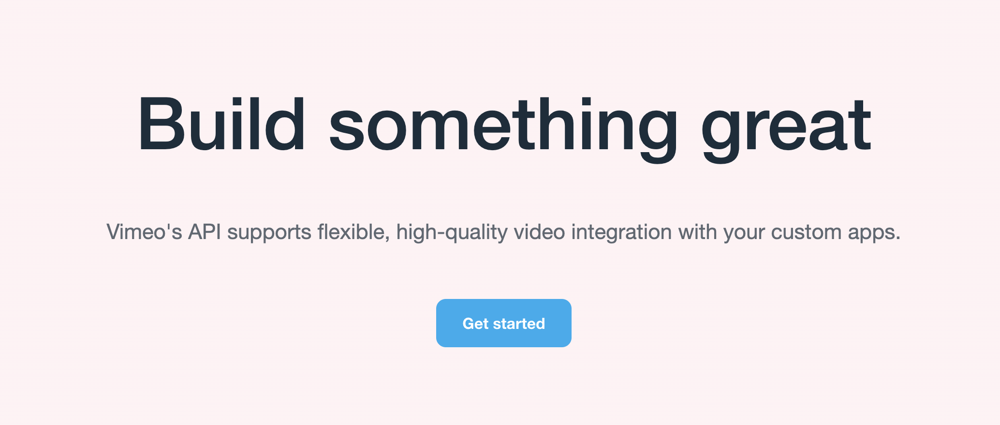

<div align="left">

[](https://developer.vimeo.com)

# Vimeo<a id="vimeo"></a>

Build something great. Vimeo's API supports flexible, high-quality video integration with your custom apps.


</div>

## Table of Contents<a id="table-of-contents"></a>

<!-- toc -->

- [Requirements](#requirements)
- [Installation](#installation)
- [Getting Started](#getting-started)
- [Async](#async)
- [Raw HTTP Response](#raw-http-response)
- [Reference](#reference)
  * [`vimeo.api_information\essentials.endpoints`](#vimeoapi_informationessentialsendpoints)
  * [`vimeo.authentication_extras\authenticate.auth`](#vimeoauthentication_extrasauthenticateauth)
  * [`vimeo.authentication_extras\convert.o_auth1_to_o_auth2`](#vimeoauthentication_extrasconverto_auth1_to_o_auth2)
  * [`vimeo.authentication_extras\essentials.token`](#vimeoauthentication_extrasessentialstoken)
  * [`vimeo.authentication_extras\essentials.token_0`](#vimeoauthentication_extrasessentialstoken_0)
  * [`vimeo.authentication_extras\exchange.o_auth_code_exchange`](#vimeoauthentication_extrasexchangeo_auth_code_exchange)
  * [`vimeo.categories\channels.list_in_category`](#vimeocategorieschannelslist_in_category)
  * [`vimeo.categories\essentials.categories`](#vimeocategoriesessentialscategories)
  * [`vimeo.categories\essentials.category`](#vimeocategoriesessentialscategory)
  * [`vimeo.categories\groups.get_all_groups`](#vimeocategoriesgroupsget_all_groups)
  * [`vimeo.categories\users.check_followed_category`](#vimeocategoriesuserscheck_followed_category)
  * [`vimeo.categories\users.check_followed_category_0`](#vimeocategoriesuserscheck_followed_category_0)
  * [`vimeo.categories\users.follow_category`](#vimeocategoriesusersfollow_category)
  * [`vimeo.categories\users.follow_specific_category`](#vimeocategoriesusersfollow_specific_category)
  * [`vimeo.categories\users.list_followed_categories`](#vimeocategoriesuserslist_followed_categories)
  * [`vimeo.categories\users.list_followed_categories_0`](#vimeocategoriesuserslist_followed_categories_0)
  * [`vimeo.categories\users.stop_following_category`](#vimeocategoriesusersstop_following_category)
  * [`vimeo.categories\users.stop_following_category_0`](#vimeocategoriesusersstop_following_category_0)
  * [`vimeo.categories\videos.get_all_video_categories`](#vimeocategoriesvideosget_all_video_categories)
  * [`vimeo.categories\videos.get_video_in_category`](#vimeocategoriesvideosget_video_in_category)
  * [`vimeo.categories\videos.list_videos_in_category`](#vimeocategoriesvideoslist_videos_in_category)
  * [`vimeo.categories\videos.set_video_categories`](#vimeocategoriesvideosset_video_categories)
  * [`vimeo.channels\categories.add_channel_to_multiple_categories`](#vimeochannelscategoriesadd_channel_to_multiple_categories)
  * [`vimeo.channels\categories.channel`](#vimeochannelscategorieschannel)
  * [`vimeo.channels\categories.get_belonging_categories`](#vimeochannelscategoriesget_belonging_categories)
  * [`vimeo.channels\categories.remove_channel_from_category`](#vimeochannelscategoriesremove_channel_from_category)
  * [`vimeo.channels\essentials.channel`](#vimeochannelsessentialschannel)
  * [`vimeo.channels\essentials.channel_0`](#vimeochannelsessentialschannel_0)
  * [`vimeo.channels\essentials.channel_1`](#vimeochannelsessentialschannel_1)
  * [`vimeo.channels\essentials.channel_2`](#vimeochannelsessentialschannel_2)
  * [`vimeo.channels\essentials.channels`](#vimeochannelsessentialschannels)
  * [`vimeo.channels\essentials.get_user_subscriptions`](#vimeochannelsessentialsget_user_subscriptions)
  * [`vimeo.channels\essentials.get_user_subscriptions_0`](#vimeochannelsessentialsget_user_subscriptions_0)
  * [`vimeo.channels\moderators.add_moderator_to_channel`](#vimeochannelsmoderatorsadd_moderator_to_channel)
  * [`vimeo.channels\moderators.bulk_add_moderators`](#vimeochannelsmoderatorsbulk_add_moderators)
  * [`vimeo.channels\moderators.get_specific_moderator`](#vimeochannelsmoderatorsget_specific_moderator)
  * [`vimeo.channels\moderators.list_by_channel`](#vimeochannelsmoderatorslist_by_channel)
  * [`vimeo.channels\moderators.remove_moderator`](#vimeochannelsmoderatorsremove_moderator)
  * [`vimeo.channels\moderators.remove_multiple_from_channel`](#vimeochannelsmoderatorsremove_multiple_from_channel)
  * [`vimeo.channels\moderators.replace_moderators`](#vimeochannelsmoderatorsreplace_moderators)
  * [`vimeo.channels\private_channel_members.get_accessible_users`](#vimeochannelsprivate_channel_membersget_accessible_users)
  * [`vimeo.channels\private_channel_members.permit_user_access`](#vimeochannelsprivate_channel_memberspermit_user_access)
  * [`vimeo.channels\private_channel_members.permit_user_access_0`](#vimeochannelsprivate_channel_memberspermit_user_access_0)
  * [`vimeo.channels\private_channel_members.restrict_user_access`](#vimeochannelsprivate_channel_membersrestrict_user_access)
  * [`vimeo.channels\subscriptions_and_subscribers.check_if_user_follows_channel`](#vimeochannelssubscriptions_and_subscriberscheck_if_user_follows_channel)
  * [`vimeo.channels\subscriptions_and_subscribers.check_user_follows_channel`](#vimeochannelssubscriptions_and_subscriberscheck_user_follows_channel)
  * [`vimeo.channels\subscriptions_and_subscribers.list_channel_followers`](#vimeochannelssubscriptions_and_subscriberslist_channel_followers)
  * [`vimeo.channels\subscriptions_and_subscribers.subscribe_to_channel`](#vimeochannelssubscriptions_and_subscriberssubscribe_to_channel)
  * [`vimeo.channels\subscriptions_and_subscribers.subscribe_user_to_channel`](#vimeochannelssubscriptions_and_subscriberssubscribe_user_to_channel)
  * [`vimeo.channels\subscriptions_and_subscribers.unsubscribe_user_from_channel`](#vimeochannelssubscriptions_and_subscribersunsubscribe_user_from_channel)
  * [`vimeo.channels\subscriptions_and_subscribers.unsubscribe_user_from_channel_0`](#vimeochannelssubscriptions_and_subscribersunsubscribe_user_from_channel_0)
  * [`vimeo.channels\tags.add_multiple_tags_to_channel`](#vimeochannelstagsadd_multiple_tags_to_channel)
  * [`vimeo.channels\tags.add_tag_to_channel`](#vimeochannelstagsadd_tag_to_channel)
  * [`vimeo.channels\tags.check_if_tag_added_to_channel`](#vimeochannelstagscheck_if_tag_added_to_channel)
  * [`vimeo.channels\tags.get_all_channel_tags`](#vimeochannelstagsget_all_channel_tags)
  * [`vimeo.channels\tags.remove_tag_from_channel`](#vimeochannelstagsremove_tag_from_channel)
  * [`vimeo.channels\videos.add_multiple_to_channel`](#vimeochannelsvideosadd_multiple_to_channel)
  * [`vimeo.channels\videos.add_video_to_channel`](#vimeochannelsvideosadd_video_to_channel)
  * [`vimeo.channels\videos.get_accessible_channels`](#vimeochannelsvideosget_accessible_channels)
  * [`vimeo.channels\videos.get_specific_video_in_channel`](#vimeochannelsvideosget_specific_video_in_channel)
  * [`vimeo.channels\videos.list_in_channel`](#vimeochannelsvideoslist_in_channel)
  * [`vimeo.channels\videos.remove_multiple_from_channel`](#vimeochannelsvideosremove_multiple_from_channel)
  * [`vimeo.channels\videos.remove_specific_video`](#vimeochannelsvideosremove_specific_video)
  * [`vimeo.embed_presets\custom_logos.add_user_logo`](#vimeoembed_presetscustom_logosadd_user_logo)
  * [`vimeo.embed_presets\custom_logos.add_user_logo_0`](#vimeoembed_presetscustom_logosadd_user_logo_0)
  * [`vimeo.embed_presets\custom_logos.delete_user_logo`](#vimeoembed_presetscustom_logosdelete_user_logo)
  * [`vimeo.embed_presets\custom_logos.delete_user_logo_0`](#vimeoembed_presetscustom_logosdelete_user_logo_0)
  * [`vimeo.embed_presets\custom_logos.get_specific_user_logo`](#vimeoembed_presetscustom_logosget_specific_user_logo)
  * [`vimeo.embed_presets\custom_logos.get_specific_user_logo_0`](#vimeoembed_presetscustom_logosget_specific_user_logo_0)
  * [`vimeo.embed_presets\custom_logos.list`](#vimeoembed_presetscustom_logoslist)
  * [`vimeo.embed_presets\custom_logos.list_user_logos`](#vimeoembed_presetscustom_logoslist_user_logos)
  * [`vimeo.embed_presets\essentials.create_embed_preset`](#vimeoembed_presetsessentialscreate_embed_preset)
  * [`vimeo.embed_presets\essentials.create_preset`](#vimeoembed_presetsessentialscreate_preset)
  * [`vimeo.embed_presets\essentials.edit_preset`](#vimeoembed_presetsessentialsedit_preset)
  * [`vimeo.embed_presets\essentials.edit_preset_0`](#vimeoembed_presetsessentialsedit_preset_0)
  * [`vimeo.embed_presets\essentials.get_all_user_created_embed_presets`](#vimeoembed_presetsessentialsget_all_user_created_embed_presets)
  * [`vimeo.embed_presets\essentials.get_specific_embed_preset`](#vimeoembed_presetsessentialsget_specific_embed_preset)
  * [`vimeo.embed_presets\essentials.get_specific_preset`](#vimeoembed_presetsessentialsget_specific_preset)
  * [`vimeo.embed_presets\essentials.get_user_embed_presets`](#vimeoembed_presetsessentialsget_user_embed_presets)
  * [`vimeo.embed_presets\timeline_events.add_thumbnail_to_video`](#vimeoembed_presetstimeline_eventsadd_thumbnail_to_video)
  * [`vimeo.embed_presets\timeline_events.get_single_thumbnail`](#vimeoembed_presetstimeline_eventsget_single_thumbnail)
  * [`vimeo.embed_presets\videos.add_preset_to_video`](#vimeoembed_presetsvideosadd_preset_to_video)
  * [`vimeo.embed_presets\videos.check_if_preset_added_to_video`](#vimeoembed_presetsvideoscheck_if_preset_added_to_video)
  * [`vimeo.embed_presets\videos.get_preset_videos`](#vimeoembed_presetsvideosget_preset_videos)
  * [`vimeo.embed_presets\videos.get_specific_preset_videos`](#vimeoembed_presetsvideosget_specific_preset_videos)
  * [`vimeo.embed_presets\videos.remove_preset_from_video`](#vimeoembed_presetsvideosremove_preset_from_video)
  * [`vimeo.folders\essentials.create_folder`](#vimeofoldersessentialscreate_folder)
  * [`vimeo.folders\essentials.delete_folder`](#vimeofoldersessentialsdelete_folder)
  * [`vimeo.folders\essentials.edit_folder`](#vimeofoldersessentialsedit_folder)
  * [`vimeo.folders\essentials.get_all_user_folders`](#vimeofoldersessentialsget_all_user_folders)
  * [`vimeo.folders\essentials.get_specific_folder`](#vimeofoldersessentialsget_specific_folder)
  * [`vimeo.folders\essentials.get_user_private_to_me_folder`](#vimeofoldersessentialsget_user_private_to_me_folder)
  * [`vimeo.folders\essentials.project`](#vimeofoldersessentialsproject)
  * [`vimeo.folders\essentials.project_0`](#vimeofoldersessentialsproject_0)
  * [`vimeo.folders\essentials.project_1`](#vimeofoldersessentialsproject_1)
  * [`vimeo.folders\essentials.project_2`](#vimeofoldersessentialsproject_2)
  * [`vimeo.folders\essentials.projects`](#vimeofoldersessentialsprojects)
  * [`vimeo.folders\items.get_folder_contents`](#vimeofoldersitemsget_folder_contents)
  * [`vimeo.folders\items.get_folder_items`](#vimeofoldersitemsget_folder_items)
  * [`vimeo.folders\items.remove_from_folder`](#vimeofoldersitemsremove_from_folder)
  * [`vimeo.folders\videos.add_multiple_to_folder`](#vimeofoldersvideosadd_multiple_to_folder)
  * [`vimeo.folders\videos.add_single_folder_video`](#vimeofoldersvideosadd_single_folder_video)
  * [`vimeo.folders\videos.add_to_folder`](#vimeofoldersvideosadd_to_folder)
  * [`vimeo.folders\videos.add_to_folder_videos`](#vimeofoldersvideosadd_to_folder_videos)
  * [`vimeo.folders\videos.get_all_folder_videos`](#vimeofoldersvideosget_all_folder_videos)
  * [`vimeo.folders\videos.get_videos_in_folder`](#vimeofoldersvideosget_videos_in_folder)
  * [`vimeo.folders\videos.remove_from_folder_video`](#vimeofoldersvideosremove_from_folder_video)
  * [`vimeo.folders\videos.remove_multiple_from_folder`](#vimeofoldersvideosremove_multiple_from_folder)
  * [`vimeo.folders\videos.remove_multiple_videos_from_folder`](#vimeofoldersvideosremove_multiple_videos_from_folder)
  * [`vimeo.folders\videos.remove_single_video`](#vimeofoldersvideosremove_single_video)
  * [`vimeo.groups\essentials.group`](#vimeogroupsessentialsgroup)
  * [`vimeo.groups\essentials.group_0`](#vimeogroupsessentialsgroup_0)
  * [`vimeo.groups\essentials.group_1`](#vimeogroupsessentialsgroup_1)
  * [`vimeo.groups\essentials.groups`](#vimeogroupsessentialsgroups)
  * [`vimeo.groups\subscriptions.add_user_to_group`](#vimeogroupssubscriptionsadd_user_to_group)
  * [`vimeo.groups\subscriptions.group`](#vimeogroupssubscriptionsgroup)
  * [`vimeo.groups\subscriptions.group_0`](#vimeogroupssubscriptionsgroup_0)
  * [`vimeo.groups\subscriptions.remove_user_from_group`](#vimeogroupssubscriptionsremove_user_from_group)
  * [`vimeo.groups\users.check_belong_group`](#vimeogroupsuserscheck_belong_group)
  * [`vimeo.groups\users.check_user_joined_group`](#vimeogroupsuserscheck_user_joined_group)
  * [`vimeo.groups\users.get_group_users`](#vimeogroupsusersget_group_users)
  * [`vimeo.groups\users.get_user_groups`](#vimeogroupsusersget_user_groups)
  * [`vimeo.groups\users.get_user_groups_list`](#vimeogroupsusersget_user_groups_list)
  * [`vimeo.groups\videos.add_to_group`](#vimeogroupsvideosadd_to_group)
  * [`vimeo.groups\videos.get_all_group_videos`](#vimeogroupsvideosget_all_group_videos)
  * [`vimeo.groups\videos.get_single_video`](#vimeogroupsvideosget_single_video)
  * [`vimeo.groups\videos.remove_from_group`](#vimeogroupsvideosremove_from_group)
  * [`vimeo.likes\essentials.check_user_liked_video`](#vimeolikesessentialscheck_user_liked_video)
  * [`vimeo.likes\essentials.check_video_liked_by_user`](#vimeolikesessentialscheck_video_liked_by_user)
  * [`vimeo.likes\essentials.get_all_user_likes`](#vimeolikesessentialsget_all_user_likes)
  * [`vimeo.likes\essentials.get_user_liked_videos`](#vimeolikesessentialsget_user_liked_videos)
  * [`vimeo.likes\essentials.get_user_likes`](#vimeolikesessentialsget_user_likes)
  * [`vimeo.likes\essentials.get_users_who_liked_video`](#vimeolikesessentialsget_users_who_liked_video)
  * [`vimeo.likes\essentials.like_video`](#vimeolikesessentialslike_video)
  * [`vimeo.likes\essentials.likes`](#vimeolikesessentialslikes)
  * [`vimeo.likes\essentials.unlike_video`](#vimeolikesessentialsunlike_video)
  * [`vimeo.likes\essentials.video`](#vimeolikesessentialsvideo)
  * [`vimeo.likes\essentials.video_0`](#vimeolikesessentialsvideo_0)
  * [`vimeo.live\embed_privacy.embed_event_on_domains`](#vimeoliveembed_privacyembed_event_on_domains)
  * [`vimeo.live\embed_privacy.embed_event_on_domains_0`](#vimeoliveembed_privacyembed_event_on_domains_0)
  * [`vimeo.live\embed_privacy.embed_event_on_domains_1`](#vimeoliveembed_privacyembed_event_on_domains_1)
  * [`vimeo.live\embed_privacy.get_whitelist_domains`](#vimeoliveembed_privacyget_whitelist_domains)
  * [`vimeo.live\embed_privacy.get_whitelist_domains_0`](#vimeoliveembed_privacyget_whitelist_domains_0)
  * [`vimeo.live\embed_privacy.get_whitelist_domains_1`](#vimeoliveembed_privacyget_whitelist_domains_1)
  * [`vimeo.live\essentials.create_event`](#vimeoliveessentialscreate_event)
  * [`vimeo.live\essentials.create_event_for_user`](#vimeoliveessentialscreate_event_for_user)
  * [`vimeo.live\essentials.create_live_event`](#vimeoliveessentialscreate_live_event)
  * [`vimeo.live\essentials.delete_multiple_events`](#vimeoliveessentialsdelete_multiple_events)
  * [`vimeo.live\essentials.delete_multiple_events_0`](#vimeoliveessentialsdelete_multiple_events_0)
  * [`vimeo.live\essentials.delete_multiple_events_1`](#vimeoliveessentialsdelete_multiple_events_1)
  * [`vimeo.live\essentials.delete_single_event`](#vimeoliveessentialsdelete_single_event)
  * [`vimeo.live\essentials.delete_specific_event`](#vimeoliveessentialsdelete_specific_event)
  * [`vimeo.live\essentials.delete_specific_live_event`](#vimeoliveessentialsdelete_specific_live_event)
  * [`vimeo.live\essentials.get_all_user_live_events`](#vimeoliveessentialsget_all_user_live_events)
  * [`vimeo.live\essentials.get_event_by_id`](#vimeoliveessentialsget_event_by_id)
  * [`vimeo.live\essentials.get_event_by_id_0`](#vimeoliveessentialsget_event_by_id_0)
  * [`vimeo.live\essentials.get_specific_live_event`](#vimeoliveessentialsget_specific_live_event)
  * [`vimeo.live\essentials.get_user_live_events`](#vimeoliveessentialsget_user_live_events)
  * [`vimeo.live\essentials.get_user_live_events_0`](#vimeoliveessentialsget_user_live_events_0)
  * [`vimeo.live\essentials.update_event_belonging_to_authenticated_user`](#vimeoliveessentialsupdate_event_belonging_to_authenticated_user)
  * [`vimeo.live\essentials.update_event_belonging_to_authenticated_user_0`](#vimeoliveessentialsupdate_event_belonging_to_authenticated_user_0)
  * [`vimeo.live\essentials.update_event_belonging_to_authenticated_user_1`](#vimeoliveessentialsupdate_event_belonging_to_authenticated_user_1)
  * [`vimeo.live\event_m3_u8_playback.get_url`](#vimeoliveevent_m3_u8_playbackget_url)
  * [`vimeo.live\event_m3_u8_playback.get_url_for_event_stream`](#vimeoliveevent_m3_u8_playbackget_url_for_event_stream)
  * [`vimeo.live\event_activation.create_rtmp_links`](#vimeoliveevent_activationcreate_rtmp_links)
  * [`vimeo.live\event_activation.create_rtmp_links_0`](#vimeoliveevent_activationcreate_rtmp_links_0)
  * [`vimeo.live\event_activation.create_rtmp_links_1`](#vimeoliveevent_activationcreate_rtmp_links_1)
  * [`vimeo.live\event_automated_closed_captions.edit_preference`](#vimeoliveevent_automated_closed_captionsedit_preference)
  * [`vimeo.live\event_automated_closed_captions.edit_preference_for_event`](#vimeoliveevent_automated_closed_captionsedit_preference_for_event)
  * [`vimeo.live\event_automated_closed_captions.edit_preference_for_event_0`](#vimeoliveevent_automated_closed_captionsedit_preference_for_event_0)
  * [`vimeo.live\event_destinations.create_destination`](#vimeoliveevent_destinationscreate_destination)
  * [`vimeo.live\event_destinations.create_event_destination`](#vimeoliveevent_destinationscreate_event_destination)
  * [`vimeo.live\event_destinations.create_one_time_live_event_destination`](#vimeoliveevent_destinationscreate_one_time_live_event_destination)
  * [`vimeo.live\event_destinations.create_one_time_live_event_destination_0`](#vimeoliveevent_destinationscreate_one_time_live_event_destination_0)
  * [`vimeo.live\event_destinations.create_ott_destination`](#vimeoliveevent_destinationscreate_ott_destination)
  * [`vimeo.live\event_destinations.delete_destination`](#vimeoliveevent_destinationsdelete_destination)
  * [`vimeo.live\event_destinations.delete_ott_destination`](#vimeoliveevent_destinationsdelete_ott_destination)
  * [`vimeo.live\event_destinations.get_all_available_destinations`](#vimeoliveevent_destinationsget_all_available_destinations)
  * [`vimeo.live\event_destinations.get_all_available_destinations_0`](#vimeoliveevent_destinationsget_all_available_destinations_0)
  * [`vimeo.live\event_destinations.get_all_available_destinations_1`](#vimeoliveevent_destinationsget_all_available_destinations_1)
  * [`vimeo.live\event_destinations.get_all_destinations`](#vimeoliveevent_destinationsget_all_destinations)
  * [`vimeo.live\event_destinations.get_all_ott_destinations`](#vimeoliveevent_destinationsget_all_ott_destinations)
  * [`vimeo.live\event_destinations.get_destination`](#vimeoliveevent_destinationsget_destination)
  * [`vimeo.live\event_destinations.list_all_available_destinations`](#vimeoliveevent_destinationslist_all_available_destinations)
  * [`vimeo.live\event_destinations.list_available_destinations`](#vimeoliveevent_destinationslist_available_destinations)
  * [`vimeo.live\event_destinations.update_destination`](#vimeoliveevent_destinationsupdate_destination)
  * [`vimeo.live\event_end.event_termination`](#vimeoliveevent_endevent_termination)
  * [`vimeo.live\event_end.event_termination_alt1`](#vimeoliveevent_endevent_termination_alt1)
  * [`vimeo.live\event_end.event_termination_alt2`](#vimeoliveevent_endevent_termination_alt2)
  * [`vimeo.live\event_low_latency.toggle_option`](#vimeoliveevent_low_latencytoggle_option)
  * [`vimeo.live\event_low_latency.toggle_option_0`](#vimeoliveevent_low_latencytoggle_option_0)
  * [`vimeo.live\event_low_latency.toggle_option_1`](#vimeoliveevent_low_latencytoggle_option_1)
  * [`vimeo.live\event_sessions.get_ingest_status`](#vimeoliveevent_sessionsget_ingest_status)
  * [`vimeo.live\event_thumbnails.add_thumbnail`](#vimeoliveevent_thumbnailsadd_thumbnail)
  * [`vimeo.live\event_thumbnails.create_thumbnail_for_event`](#vimeoliveevent_thumbnailscreate_thumbnail_for_event)
  * [`vimeo.live\event_thumbnails.create_thumbnail_for_event_0`](#vimeoliveevent_thumbnailscreate_thumbnail_for_event_0)
  * [`vimeo.live\event_thumbnails.delete_for_event`](#vimeoliveevent_thumbnailsdelete_for_event)
  * [`vimeo.live\event_thumbnails.delete_thumbnail_for_event`](#vimeoliveevent_thumbnailsdelete_thumbnail_for_event)
  * [`vimeo.live\event_thumbnails.delete_thumbnail_for_event_0`](#vimeoliveevent_thumbnailsdelete_thumbnail_for_event_0)
  * [`vimeo.live\event_thumbnails.edit_event_thumbnail`](#vimeoliveevent_thumbnailsedit_event_thumbnail)
  * [`vimeo.live\event_thumbnails.edit_live_event_thumbnail`](#vimeoliveevent_thumbnailsedit_live_event_thumbnail)
  * [`vimeo.live\event_thumbnails.get_all`](#vimeoliveevent_thumbnailsget_all)
  * [`vimeo.live\event_thumbnails.get_all_thumbnails`](#vimeoliveevent_thumbnailsget_all_thumbnails)
  * [`vimeo.live\event_thumbnails.get_all_thumbs`](#vimeoliveevent_thumbnailsget_all_thumbs)
  * [`vimeo.live\event_thumbnails.get_specific_thumbnail`](#vimeoliveevent_thumbnailsget_specific_thumbnail)
  * [`vimeo.live\event_thumbnails.get_specific_thumbnail_0`](#vimeoliveevent_thumbnailsget_specific_thumbnail_0)
  * [`vimeo.live\event_thumbnails.get_specific_thumbnail_1`](#vimeoliveevent_thumbnailsget_specific_thumbnail_1)
  * [`vimeo.live\event_thumbnails.update_event_thumbnail`](#vimeoliveevent_thumbnailsupdate_event_thumbnail)
  * [`vimeo.live\event_videos.add_multiple`](#vimeoliveevent_videosadd_multiple)
  * [`vimeo.live\event_videos.add_multiple_videos`](#vimeoliveevent_videosadd_multiple_videos)
  * [`vimeo.live\event_videos.get_all`](#vimeoliveevent_videosget_all)
  * [`vimeo.live\event_videos.get_specific_video`](#vimeoliveevent_videosget_specific_video)
  * [`vimeo.live\event_videos.list_all_videos_in_event`](#vimeoliveevent_videoslist_all_videos_in_event)
  * [`vimeo.live\event_videos.list_live_event_videos`](#vimeoliveevent_videoslist_live_event_videos)
  * [`vimeo.live\event_videos.remove_multiple`](#vimeoliveevent_videosremove_multiple)
  * [`vimeo.live\event_videos.remove_multiple_0`](#vimeoliveevent_videosremove_multiple_0)
  * [`vimeo.live\event_videos.remove_multiple_videos`](#vimeoliveevent_videosremove_multiple_videos)
  * [`vimeo.live\event_videos.specific_event_video`](#vimeoliveevent_videosspecific_event_video)
  * [`vimeo.live\event_videos.specific_video`](#vimeoliveevent_videosspecific_video)
  * [`vimeo.live\event_videos.upload_multiple`](#vimeoliveevent_videosupload_multiple)
  * [`vimeo.on_demand\backgrounds.add_background_to_page`](#vimeoon_demandbackgroundsadd_background_to_page)
  * [`vimeo.on_demand\backgrounds.delete_background_from_page`](#vimeoon_demandbackgroundsdelete_background_from_page)
  * [`vimeo.on_demand\backgrounds.edit_background_on_page`](#vimeoon_demandbackgroundsedit_background_on_page)
  * [`vimeo.on_demand\backgrounds.get_all_backgrounds_on_page`](#vimeoon_demandbackgroundsget_all_backgrounds_on_page)
  * [`vimeo.on_demand\backgrounds.get_specific_background`](#vimeoon_demandbackgroundsget_specific_background)
  * [`vimeo.on_demand\essentials.create_page`](#vimeoon_demandessentialscreate_page)
  * [`vimeo.on_demand\essentials.delete_on_demand_page`](#vimeoon_demandessentialsdelete_on_demand_page)
  * [`vimeo.on_demand\essentials.get_all_user_pages`](#vimeoon_demandessentialsget_all_user_pages)
  * [`vimeo.on_demand\essentials.get_all_user_pages_0`](#vimeoon_demandessentialsget_all_user_pages_0)
  * [`vimeo.on_demand\essentials.vod`](#vimeoon_demandessentialsvod)
  * [`vimeo.on_demand\essentials.vod_0`](#vimeoon_demandessentialsvod_0)
  * [`vimeo.on_demand\essentials.vod_1`](#vimeoon_demandessentialsvod_1)
  * [`vimeo.on_demand\genres.add_genre_to_page`](#vimeoon_demandgenresadd_genre_to_page)
  * [`vimeo.on_demand\genres.check_genre_association`](#vimeoon_demandgenrescheck_genre_association)
  * [`vimeo.on_demand\genres.get_all_genres`](#vimeoon_demandgenresget_all_genres)
  * [`vimeo.on_demand\genres.get_all_pages_in_genre`](#vimeoon_demandgenresget_all_pages_in_genre)
  * [`vimeo.on_demand\genres.get_genres`](#vimeoon_demandgenresget_genres)
  * [`vimeo.on_demand\genres.get_specific_page_in_genre`](#vimeoon_demandgenresget_specific_page_in_genre)
  * [`vimeo.on_demand\genres.remove_genre_from_page`](#vimeoon_demandgenresremove_genre_from_page)
  * [`vimeo.on_demand\genres.specific_genre_get`](#vimeoon_demandgenresspecific_genre_get)
  * [`vimeo.on_demand\posters.add_poster_to_page`](#vimeoon_demandpostersadd_poster_to_page)
  * [`vimeo.on_demand\posters.get_on_demand_page_posters`](#vimeoon_demandpostersget_on_demand_page_posters)
  * [`vimeo.on_demand\posters.get_specific_poster`](#vimeoon_demandpostersget_specific_poster)
  * [`vimeo.on_demand\posters.update_poster`](#vimeoon_demandpostersupdate_poster)
  * [`vimeo.on_demand\promotions.add_promotion_to_page`](#vimeoon_demandpromotionsadd_promotion_to_page)
  * [`vimeo.on_demand\promotions.delete_promotion_on_page`](#vimeoon_demandpromotionsdelete_promotion_on_page)
  * [`vimeo.on_demand\promotions.get_all_page_promotions`](#vimeoon_demandpromotionsget_all_page_promotions)
  * [`vimeo.on_demand\promotions.get_all_promotion_codes`](#vimeoon_demandpromotionsget_all_promotion_codes)
  * [`vimeo.on_demand\promotions.specific_promotion_get`](#vimeoon_demandpromotionsspecific_promotion_get)
  * [`vimeo.on_demand\purchases_and_rentals.check_user_purchases_and_rentals`](#vimeoon_demandpurchases_and_rentalscheck_user_purchases_and_rentals)
  * [`vimeo.on_demand\purchases_and_rentals.get_all_user_purchases_and_rentals`](#vimeoon_demandpurchases_and_rentalsget_all_user_purchases_and_rentals)
  * [`vimeo.on_demand\purchases_and_rentals.list_user_purchases_and_rentals`](#vimeoon_demandpurchases_and_rentalslist_user_purchases_and_rentals)
  * [`vimeo.on_demand\regions.add_multiple`](#vimeoon_demandregionsadd_multiple)
  * [`vimeo.on_demand\regions.add_region_to_page`](#vimeoon_demandregionsadd_region_to_page)
  * [`vimeo.on_demand\regions.get_all`](#vimeoon_demandregionsget_all)
  * [`vimeo.on_demand\regions.get_specific_region`](#vimeoon_demandregionsget_specific_region)
  * [`vimeo.on_demand\regions.region`](#vimeoon_demandregionsregion)
  * [`vimeo.on_demand\regions.regions`](#vimeoon_demandregionsregions)
  * [`vimeo.on_demand\regions.remove_multiple`](#vimeoon_demandregionsremove_multiple)
  * [`vimeo.on_demand\regions.remove_specific_region`](#vimeoon_demandregionsremove_specific_region)
  * [`vimeo.on_demand\seasons.get_all_videos_in_season`](#vimeoon_demandseasonsget_all_videos_in_season)
  * [`vimeo.on_demand\seasons.list_all`](#vimeoon_demandseasonslist_all)
  * [`vimeo.on_demand\seasons.specific_get`](#vimeoon_demandseasonsspecific_get)
  * [`vimeo.on_demand\videos.add_video_to_page`](#vimeoon_demandvideosadd_video_to_page)
  * [`vimeo.on_demand\videos.get_all_videos`](#vimeoon_demandvideosget_all_videos)
  * [`vimeo.on_demand\videos.remove_from_page`](#vimeoon_demandvideosremove_from_page)
  * [`vimeo.on_demand\videos.specific_video_get`](#vimeoon_demandvideosspecific_video_get)
  * [`vimeo.payments\essentials.get_payment_method_info`](#vimeopaymentsessentialsget_payment_method_info)
  * [`vimeo.payments\essentials.get_subscription_info`](#vimeopaymentsessentialsget_subscription_info)
  * [`vimeo.payments\essentials.list_payment_methods`](#vimeopaymentsessentialslist_payment_methods)
  * [`vimeo.portfolios\essentials.get_all_user_portfolios`](#vimeoportfoliosessentialsget_all_user_portfolios)
  * [`vimeo.portfolios\essentials.get_user_portfolio`](#vimeoportfoliosessentialsget_user_portfolio)
  * [`vimeo.portfolios\essentials.portfolio`](#vimeoportfoliosessentialsportfolio)
  * [`vimeo.portfolios\essentials.portfolios`](#vimeoportfoliosessentialsportfolios)
  * [`vimeo.portfolios\videos.add_video_to_portfolio`](#vimeoportfoliosvideosadd_video_to_portfolio)
  * [`vimeo.portfolios\videos.get_all_portfolio_videos`](#vimeoportfoliosvideosget_all_portfolio_videos)
  * [`vimeo.portfolios\videos.get_all_portfolio_videos_0`](#vimeoportfoliosvideosget_all_portfolio_videos_0)
  * [`vimeo.portfolios\videos.get_specific_video`](#vimeoportfoliosvideosget_specific_video)
  * [`vimeo.portfolios\videos.get_specific_video_0`](#vimeoportfoliosvideosget_specific_video_0)
  * [`vimeo.portfolios\videos.put_video_to_portfolio`](#vimeoportfoliosvideosput_video_to_portfolio)
  * [`vimeo.portfolios\videos.remove_from_portfolio`](#vimeoportfoliosvideosremove_from_portfolio)
  * [`vimeo.portfolios\videos.remove_from_portfolio_video`](#vimeoportfoliosvideosremove_from_portfolio_video)
  * [`vimeo.showcases\custom_showcase_logos.add_custom_logo`](#vimeoshowcasescustom_showcase_logosadd_custom_logo)
  * [`vimeo.showcases\custom_showcase_logos.delete_custom_logo`](#vimeoshowcasescustom_showcase_logosdelete_custom_logo)
  * [`vimeo.showcases\custom_showcase_logos.get_specific_logo`](#vimeoshowcasescustom_showcase_logosget_specific_logo)
  * [`vimeo.showcases\custom_showcase_logos.list_all_custom_logos`](#vimeoshowcasescustom_showcase_logoslist_all_custom_logos)
  * [`vimeo.showcases\custom_showcase_logos.replace_logo`](#vimeoshowcasescustom_showcase_logosreplace_logo)
  * [`vimeo.showcases\custom_showcase_thumbnails.add_custom_thumbnail`](#vimeoshowcasescustom_showcase_thumbnailsadd_custom_thumbnail)
  * [`vimeo.showcases\custom_showcase_thumbnails.delete_custom_thumbnail`](#vimeoshowcasescustom_showcase_thumbnailsdelete_custom_thumbnail)
  * [`vimeo.showcases\custom_showcase_thumbnails.get_specific_thumbnail`](#vimeoshowcasescustom_showcase_thumbnailsget_specific_thumbnail)
  * [`vimeo.showcases\custom_showcase_thumbnails.list`](#vimeoshowcasescustom_showcase_thumbnailslist)
  * [`vimeo.showcases\custom_showcase_thumbnails.replace_custom_thumbnail`](#vimeoshowcasescustom_showcase_thumbnailsreplace_custom_thumbnail)
  * [`vimeo.showcases\essentials.create_user_showcase`](#vimeoshowcasesessentialscreate_user_showcase)
  * [`vimeo.showcases\essentials.delete_showcase`](#vimeoshowcasesessentialsdelete_showcase)
  * [`vimeo.showcases\essentials.edit_showcase`](#vimeoshowcasesessentialsedit_showcase)
  * [`vimeo.showcases\essentials.get_all_user_showcases`](#vimeoshowcasesessentialsget_all_user_showcases)
  * [`vimeo.showcases\essentials.get_specific_showcase`](#vimeoshowcasesessentialsget_specific_showcase)
  * [`vimeo.showcases\essentials.showcase`](#vimeoshowcasesessentialsshowcase)
  * [`vimeo.showcases\essentials.showcase_0`](#vimeoshowcasesessentialsshowcase_0)
  * [`vimeo.showcases\essentials.showcase_1`](#vimeoshowcasesessentialsshowcase_1)
  * [`vimeo.showcases\essentials.showcase_2`](#vimeoshowcasesessentialsshowcase_2)
  * [`vimeo.showcases\essentials.showcases`](#vimeoshowcasesessentialsshowcases)
  * [`vimeo.showcases\essentials.showcases_0`](#vimeoshowcasesessentialsshowcases_0)
  * [`vimeo.showcases\showcase_videos.add_to_showcase`](#vimeoshowcasesshowcase_videosadd_to_showcase)
  * [`vimeo.showcases\showcase_videos.add_to_showcase_0`](#vimeoshowcasesshowcase_videosadd_to_showcase_0)
  * [`vimeo.showcases\showcase_videos.create_showcase_thumbnail`](#vimeoshowcasesshowcase_videoscreate_showcase_thumbnail)
  * [`vimeo.showcases\showcase_videos.create_showcase_thumbnail_0`](#vimeoshowcasesshowcase_videoscreate_showcase_thumbnail_0)
  * [`vimeo.showcases\showcase_videos.get_showcase_videos`](#vimeoshowcasesshowcase_videosget_showcase_videos)
  * [`vimeo.showcases\showcase_videos.get_specific_video_in_showcase`](#vimeoshowcasesshowcase_videosget_specific_video_in_showcase)
  * [`vimeo.showcases\showcase_videos.get_specific_video_in_showcase_0`](#vimeoshowcasesshowcase_videosget_specific_video_in_showcase_0)
  * [`vimeo.showcases\showcase_videos.list_available_showcases`](#vimeoshowcasesshowcase_videoslist_available_showcases)
  * [`vimeo.showcases\showcase_videos.list_in_showcase`](#vimeoshowcasesshowcase_videoslist_in_showcase)
  * [`vimeo.showcases\showcase_videos.list_in_showcase_0`](#vimeoshowcasesshowcase_videoslist_in_showcase_0)
  * [`vimeo.showcases\showcase_videos.remove_from_showcase`](#vimeoshowcasesshowcase_videosremove_from_showcase)
  * [`vimeo.showcases\showcase_videos.remove_video_from_showcase`](#vimeoshowcasesshowcase_videosremove_video_from_showcase)
  * [`vimeo.showcases\showcase_videos.replace_showcase_videos`](#vimeoshowcasesshowcase_videosreplace_showcase_videos)
  * [`vimeo.showcases\showcase_videos.replace_videos`](#vimeoshowcasesshowcase_videosreplace_videos)
  * [`vimeo.showcases\showcase_videos.set_featured_video`](#vimeoshowcasesshowcase_videosset_featured_video)
  * [`vimeo.showcases\showcase_videos.set_featured_video_0`](#vimeoshowcasesshowcase_videosset_featured_video_0)
  * [`vimeo.subscription_plans\essentials.plan`](#vimeosubscription_plansessentialsplan)
  * [`vimeo.tags\essentials.tag`](#vimeotagsessentialstag)
  * [`vimeo.teams\members.get_membership_information`](#vimeoteamsmembersget_membership_information)
  * [`vimeo.teams\members.get_team_membership_information`](#vimeoteamsmembersget_team_membership_information)
  * [`vimeo.teams\members.get_user_team_role`](#vimeoteamsmembersget_user_team_role)
  * [`vimeo.tutorial\essentials.tutorial`](#vimeotutorialessentialstutorial)
  * [`vimeo.users\analytics.get_metrics`](#vimeousersanalyticsget_metrics)
  * [`vimeo.users\analytics.get_user_metrics`](#vimeousersanalyticsget_user_metrics)
  * [`vimeo.users\essentials.edit_vimeo_account`](#vimeousersessentialsedit_vimeo_account)
  * [`vimeo.users\essentials.get_user`](#vimeousersessentialsget_user)
  * [`vimeo.users\essentials.user`](#vimeousersessentialsuser)
  * [`vimeo.users\essentials.user_0`](#vimeousersessentialsuser_0)
  * [`vimeo.users\feeds.feed`](#vimeousersfeedsfeed)
  * [`vimeo.users\feeds.get_user_feed_videos`](#vimeousersfeedsget_user_feed_videos)
  * [`vimeo.users\followers.check_following_status`](#vimeousersfollowerscheck_following_status)
  * [`vimeo.users\followers.check_following_user`](#vimeousersfollowerscheck_following_user)
  * [`vimeo.users\followers.follow_multiple_users`](#vimeousersfollowersfollow_multiple_users)
  * [`vimeo.users\followers.follow_specific_user`](#vimeousersfollowersfollow_specific_user)
  * [`vimeo.users\followers.followers`](#vimeousersfollowersfollowers)
  * [`vimeo.users\followers.list_all`](#vimeousersfollowerslist_all)
  * [`vimeo.users\followers.list_of_followed_users`](#vimeousersfollowerslist_of_followed_users)
  * [`vimeo.users\followers.list_of_following_users`](#vimeousersfollowerslist_of_following_users)
  * [`vimeo.users\followers.stop_following_user`](#vimeousersfollowersstop_following_user)
  * [`vimeo.users\followers.user`](#vimeousersfollowersuser)
  * [`vimeo.users\followers.user_0`](#vimeousersfollowersuser_0)
  * [`vimeo.users\followers.users`](#vimeousersfollowersusers)
  * [`vimeo.users\pictures.add_portrait_image`](#vimeouserspicturesadd_portrait_image)
  * [`vimeo.users\pictures.edit_portrait_image`](#vimeouserspicturesedit_portrait_image)
  * [`vimeo.users\pictures.get_specific_picture_belonging_to_user`](#vimeouserspicturesget_specific_picture_belonging_to_user)
  * [`vimeo.users\pictures.list`](#vimeouserspictureslist)
  * [`vimeo.users\pictures.picture`](#vimeouserspicturespicture)
  * [`vimeo.users\pictures.picture_0`](#vimeouserspicturespicture_0)
  * [`vimeo.users\pictures.picture_1`](#vimeouserspicturespicture_1)
  * [`vimeo.users\pictures.picture_2`](#vimeouserspicturespicture_2)
  * [`vimeo.users\pictures.pictures`](#vimeouserspicturespictures)
  * [`vimeo.users\pictures.remove_portrait_image`](#vimeouserspicturesremove_portrait_image)
  * [`vimeo.users\search.users`](#vimeouserssearchusers)
  * [`vimeo.users\watch_history.delete_entire_watch_history`](#vimeouserswatch_historydelete_entire_watch_history)
  * [`vimeo.users\watch_history.delete_specific_video`](#vimeouserswatch_historydelete_specific_video)
  * [`vimeo.users\watch_history.get_watched_videos`](#vimeouserswatch_historyget_watched_videos)
  * [`vimeo.videos\animated_thumbnails.create_set`](#vimeovideosanimated_thumbnailscreate_set)
  * [`vimeo.videos\animated_thumbnails.delete_set`](#vimeovideosanimated_thumbnailsdelete_set)
  * [`vimeo.videos\animated_thumbnails.get_all_sets`](#vimeovideosanimated_thumbnailsget_all_sets)
  * [`vimeo.videos\animated_thumbnails.get_status_of_set`](#vimeovideosanimated_thumbnailsget_status_of_set)
  * [`vimeo.videos\animated_thumbnails.specific_set_get`](#vimeovideosanimated_thumbnailsspecific_set_get)
  * [`vimeo.videos\chapters.chapter`](#vimeovideoschapterschapter)
  * [`vimeo.videos\chapters.chapter_0`](#vimeovideoschapterschapter_0)
  * [`vimeo.videos\chapters.chapter_1`](#vimeovideoschapterschapter_1)
  * [`vimeo.videos\chapters.chapter_2`](#vimeovideoschapterschapter_2)
  * [`vimeo.videos\chapters.chapters`](#vimeovideoschapterschapters)
  * [`vimeo.videos\chapters.delete_chapter_thumbnail`](#vimeovideoschaptersdelete_chapter_thumbnail)
  * [`vimeo.videos\chapters.generate_chapter_thumbnail`](#vimeovideoschaptersgenerate_chapter_thumbnail)
  * [`vimeo.videos\chapters.generate_chapter_thumbnail_or_upload_link`](#vimeovideoschaptersgenerate_chapter_thumbnail_or_upload_link)
  * [`vimeo.videos\chapters.get_chapter_thumbnails`](#vimeovideoschaptersget_chapter_thumbnails)
  * [`vimeo.videos\chapters.get_single_chapter_thumbnail`](#vimeovideoschaptersget_single_chapter_thumbnail)
  * [`vimeo.videos\chapters.get_single_chapter_thumbnail_0`](#vimeovideoschaptersget_single_chapter_thumbnail_0)
  * [`vimeo.videos\chapters.set_chapter_thumbnail_active`](#vimeovideoschaptersset_chapter_thumbnail_active)
  * [`vimeo.videos\content_ratings.get_all_content_ratings`](#vimeovideoscontent_ratingsget_all_content_ratings)
  * [`vimeo.videos\creative_commons.get_all_cc_licenses`](#vimeovideoscreative_commonsget_all_cc_licenses)
  * [`vimeo.videos\credits.add_user_credit`](#vimeovideoscreditsadd_user_credit)
  * [`vimeo.videos\credits.add_user_credit_in_video`](#vimeovideoscreditsadd_user_credit_in_video)
  * [`vimeo.videos\credits.delete_user_credit`](#vimeovideoscreditsdelete_user_credit)
  * [`vimeo.videos\credits.edit_user_credit_in_video`](#vimeovideoscreditsedit_user_credit_in_video)
  * [`vimeo.videos\credits.get_all_credited_users_in_video`](#vimeovideoscreditsget_all_credited_users_in_video)
  * [`vimeo.videos\credits.get_all_credited_users_in_video_0`](#vimeovideoscreditsget_all_credited_users_in_video_0)
  * [`vimeo.videos\credits.get_specific_credited_user`](#vimeovideoscreditsget_specific_credited_user)
  * [`vimeo.videos\credits.users`](#vimeovideoscreditsusers)
  * [`vimeo.videos\embed_privacy.add_domain_to_whitelist`](#vimeovideosembed_privacyadd_domain_to_whitelist)
  * [`vimeo.videos\embed_privacy.list_whitelist_domains`](#vimeovideosembed_privacylist_whitelist_domains)
  * [`vimeo.videos\embed_privacy.remove_domain_from_whitelist`](#vimeovideosembed_privacyremove_domain_from_whitelist)
  * [`vimeo.videos\essentials.appearances`](#vimeovideosessentialsappearances)
  * [`vimeo.videos\essentials.check_user_ownership`](#vimeovideosessentialscheck_user_ownership)
  * [`vimeo.videos\essentials.check_user_owns_video`](#vimeovideosessentialscheck_user_owns_video)
  * [`vimeo.videos\essentials.delete_user_videos`](#vimeovideosessentialsdelete_user_videos)
  * [`vimeo.videos\essentials.get_all_user_videos`](#vimeovideosessentialsget_all_user_videos)
  * [`vimeo.videos\essentials.get_user_appearances`](#vimeovideosessentialsget_user_appearances)
  * [`vimeo.videos\essentials.video`](#vimeovideosessentialsvideo)
  * [`vimeo.videos\essentials.video_0`](#vimeovideosessentialsvideo_0)
  * [`vimeo.videos\essentials.video_1`](#vimeovideosessentialsvideo_1)
  * [`vimeo.videos\essentials.videos`](#vimeovideosessentialsvideos)
  * [`vimeo.videos\essentials.videos_0`](#vimeovideosessentialsvideos_0)
  * [`vimeo.videos\essentials.videos_1`](#vimeovideosessentialsvideos_1)
  * [`vimeo.videos\fragments.fragments`](#vimeovideosfragmentsfragments)
  * [`vimeo.videos\fragments.fragments_0`](#vimeovideosfragmentsfragments_0)
  * [`vimeo.videos\fragments.fragments_1`](#vimeovideosfragmentsfragments_1)
  * [`vimeo.videos\languages.languages`](#vimeovideoslanguageslanguages)
  * [`vimeo.videos\live_m3_u8_playback.get_playback_url`](#vimeovideoslive_m3_u8_playbackget_playback_url)
  * [`vimeo.videos\live_m3_u8_playback.get_playback_url_for_event_stream`](#vimeovideoslive_m3_u8_playbackget_playback_url_for_event_stream)
  * [`vimeo.videos\nondestructive_trimming.trim`](#vimeovideosnondestructive_trimmingtrim)
  * [`vimeo.videos\nondestructive_trimming.trim_0`](#vimeovideosnondestructive_trimmingtrim_0)
  * [`vimeo.videos\recommendations.get_related_videos`](#vimeovideosrecommendationsget_related_videos)
  * [`vimeo.videos\showcases.add_to_multiple_showcases`](#vimeovideosshowcasesadd_to_multiple_showcases)
  * [`vimeo.videos\showcases.get_all_cont_showcases`](#vimeovideosshowcasesget_all_cont_showcases)
  * [`vimeo.videos\tags.add_multiple`](#vimeovideostagsadd_multiple)
  * [`vimeo.videos\tags.add_tag_to_video`](#vimeovideostagsadd_tag_to_video)
  * [`vimeo.videos\tags.check_tag_video`](#vimeovideostagscheck_tag_video)
  * [`vimeo.videos\tags.get_all_by_tag`](#vimeovideostagsget_all_by_tag)
  * [`vimeo.videos\tags.get_video_tags`](#vimeovideostagsget_video_tags)
  * [`vimeo.videos\tags.remove_tag`](#vimeovideostagsremove_tag)
  * [`vimeo.videos\text_tracks.add_text_track`](#vimeovideostext_tracksadd_text_track)
  * [`vimeo.videos\text_tracks.add_text_track_to_video`](#vimeovideostext_tracksadd_text_track_to_video)
  * [`vimeo.videos\text_tracks.delete_text_track`](#vimeovideostext_tracksdelete_text_track)
  * [`vimeo.videos\text_tracks.edit_text_track`](#vimeovideostext_tracksedit_text_track)
  * [`vimeo.videos\text_tracks.get_all_tracks`](#vimeovideostext_tracksget_all_tracks)
  * [`vimeo.videos\text_tracks.get_all_video_tracks`](#vimeovideostext_tracksget_all_video_tracks)
  * [`vimeo.videos\text_tracks.get_specific_text_track`](#vimeovideostext_tracksget_specific_text_track)
  * [`vimeo.videos\thumbnails.add_thumbnail_to_video`](#vimeovideosthumbnailsadd_thumbnail_to_video)
  * [`vimeo.videos\thumbnails.add_thumbnail_to_video_0`](#vimeovideosthumbnailsadd_thumbnail_to_video_0)
  * [`vimeo.videos\thumbnails.delete_thumbnail_from_video`](#vimeovideosthumbnailsdelete_thumbnail_from_video)
  * [`vimeo.videos\thumbnails.edit_thumbnail_image`](#vimeovideosthumbnailsedit_thumbnail_image)
  * [`vimeo.videos\thumbnails.get_all_by_video_id`](#vimeovideosthumbnailsget_all_by_video_id)
  * [`vimeo.videos\thumbnails.get_all_by_video_id_0`](#vimeovideosthumbnailsget_all_by_video_id_0)
  * [`vimeo.videos\thumbnails.get_thumbnail_from_video`](#vimeovideosthumbnailsget_thumbnail_from_video)
  * [`vimeo.videos\transcripts.transcript`](#vimeovideostranscriptstranscript)
  * [`vimeo.videos\unlisted_videos.grant_access_to_users`](#vimeovideosunlisted_videosgrant_access_to_users)
  * [`vimeo.videos\unlisted_videos.grant_access_to_users_0`](#vimeovideosunlisted_videosgrant_access_to_users_0)
  * [`vimeo.videos\unlisted_videos.grant_user_access`](#vimeovideosunlisted_videosgrant_user_access)
  * [`vimeo.videos\unlisted_videos.list_accessible_users`](#vimeovideosunlisted_videoslist_accessible_users)
  * [`vimeo.videos\unlisted_videos.list_accessible_users_0`](#vimeovideosunlisted_videoslist_accessible_users_0)
  * [`vimeo.videos\unlisted_videos.restrict_user_access`](#vimeovideosunlisted_videosrestrict_user_access)
  * [`vimeo.videos\uploads.begin_video_upload_process`](#vimeovideosuploadsbegin_video_upload_process)
  * [`vimeo.videos\uploads.complete_streaming_upload`](#vimeovideosuploadscomplete_streaming_upload)
  * [`vimeo.videos\uploads.get_upload_attempt`](#vimeovideosuploadsget_upload_attempt)
  * [`vimeo.videos\uploads.video`](#vimeovideosuploadsvideo)
  * [`vimeo.videos\versions.add_video_version`](#vimeovideosversionsadd_video_version)
  * [`vimeo.videos\versions.delete_video_version`](#vimeovideosversionsdelete_video_version)
  * [`vimeo.videos\versions.edit_video_version`](#vimeovideosversionsedit_video_version)
  * [`vimeo.videos\versions.get_all_video_versions`](#vimeovideosversionsget_all_video_versions)
  * [`vimeo.videos\versions.get_all_video_versions_0`](#vimeovideosversionsget_all_video_versions_0)
  * [`vimeo.videos\versions.get_specific_version`](#vimeovideosversionsget_specific_version)
  * [`vimeo.videos\video_comments.add_new_comment`](#vimeovideosvideo_commentsadd_new_comment)
  * [`vimeo.videos\video_comments.comment`](#vimeovideosvideo_commentscomment)
  * [`vimeo.videos\video_comments.comment_0`](#vimeovideosvideo_commentscomment_0)
  * [`vimeo.videos\video_comments.comment_1`](#vimeovideosvideo_commentscomment_1)
  * [`vimeo.videos\video_comments.comment_2`](#vimeovideosvideo_commentscomment_2)
  * [`vimeo.videos\video_comments.comments`](#vimeovideosvideo_commentscomments)
  * [`vimeo.videos\video_comments.create_reply`](#vimeovideosvideo_commentscreate_reply)
  * [`vimeo.videos\video_comments.get_all_replies`](#vimeovideosvideo_commentsget_all_replies)
  * [`vimeo.videos\video_comments.get_all_replies_0`](#vimeovideosvideo_commentsget_all_replies_0)
  * [`vimeo.watch_later_queue\essentials.add_video_to_queue`](#vimeowatch_later_queueessentialsadd_video_to_queue)
  * [`vimeo.watch_later_queue\essentials.add_video_to_queue_0`](#vimeowatch_later_queueessentialsadd_video_to_queue_0)
  * [`vimeo.watch_later_queue\essentials.check_video_in_queue`](#vimeowatch_later_queueessentialscheck_video_in_queue)
  * [`vimeo.watch_later_queue\essentials.check_video_in_queue_0`](#vimeowatch_later_queueessentialscheck_video_in_queue_0)
  * [`vimeo.watch_later_queue\essentials.get_videos_in_queue`](#vimeowatch_later_queueessentialsget_videos_in_queue)
  * [`vimeo.watch_later_queue\essentials.list_user_queue_videos`](#vimeowatch_later_queueessentialslist_user_queue_videos)
  * [`vimeo.watch_later_queue\essentials.remove_video_from_queue`](#vimeowatch_later_queueessentialsremove_video_from_queue)
  * [`vimeo.watch_later_queue\essentials.remove_video_from_queue_0`](#vimeowatch_later_queueessentialsremove_video_from_queue_0)
  * [`vimeo.webinar\emails.customize_preferences`](#vimeowebinaremailscustomize_preferences)
  * [`vimeo.webinar\emails.customize_preferences_0`](#vimeowebinaremailscustomize_preferences_0)
  * [`vimeo.webinar\emails.get_customization_data`](#vimeowebinaremailsget_customization_data)
  * [`vimeo.webinar\emails.get_customization_data_0`](#vimeowebinaremailsget_customization_data_0)
  * [`vimeo.webinar\essentials.create_webinar`](#vimeowebinaressentialscreate_webinar)
  * [`vimeo.webinar\essentials.get_specific_webinar`](#vimeowebinaressentialsget_specific_webinar)
  * [`vimeo.webinar\essentials.get_specific_webinar_0`](#vimeowebinaressentialsget_specific_webinar_0)
  * [`vimeo.webinar\essentials.update_webinar_belonging_to_authenticated_user`](#vimeowebinaressentialsupdate_webinar_belonging_to_authenticated_user)
  * [`vimeo.webinar\essentials.webinar`](#vimeowebinaressentialswebinar)
  * [`vimeo.webinar\essentials.webinar_0`](#vimeowebinaressentialswebinar_0)
  * [`vimeo.webinar\essentials.webinar_1`](#vimeowebinaressentialswebinar_1)
  * [`vimeo.webinar\registrations.capture_user_registration_list`](#vimeowebinarregistrationscapture_user_registration_list)
  * [`vimeo.webinar\registrations.capture_user_registration_list_0`](#vimeowebinarregistrationscapture_user_registration_list_0)
  * [`vimeo.webinar\registrations.delete_registrant_record`](#vimeowebinarregistrationsdelete_registrant_record)
  * [`vimeo.webinar\registrations.delete_registrant_record_0`](#vimeowebinarregistrationsdelete_registrant_record_0)
  * [`vimeo.webinar\registrations.get_user_registrations_by_webinar_id`](#vimeowebinarregistrationsget_user_registrations_by_webinar_id)
  * [`vimeo.webinar\registrations.get_user_registrations_by_webinar_id_0`](#vimeowebinarregistrationsget_user_registrations_by_webinar_id_0)
  * [`vimeo.webinar\registrations.update_user_registration_data`](#vimeowebinarregistrationsupdate_user_registration_data)
  * [`vimeo.webinar\registrations.update_user_registration_data_0`](#vimeowebinarregistrationsupdate_user_registration_data_0)

<!-- tocstop -->

## Requirements<a id="requirements"></a>

Python >=3.7

## Installation<a id="installation"></a>
<div align="center">
  <a href="https://konfigthis.com/sdk-sign-up?company=Vimeo&language=Python">
    
  </a>
</div>

## Getting Started<a id="getting-started"></a>

```python
from pprint import pprint
from vimeo_python_sdk import Vimeo, ApiException

vimeo = Vimeo(

    client_id = 'YOUR_CLIENT_ID',
    client_secret = 'YOUR_CLIENT_SECRET',,

    client_id = 'YOUR_CLIENT_ID',
    client_secret = 'YOUR_CLIENT_SECRET',
)

try:
    # Get the API specification
    endpoints_response = vimeo.api_information\essentials.endpoints(
        openapi=True,
        version="3.4",
    )
    print(endpoints_response)
except ApiException as e:
    print("Exception when calling APIInformationEssentialsApi.endpoints: %s\n" % e)
    pprint(e.body)
    pprint(e.headers)
    pprint(e.status)
    pprint(e.reason)
    pprint(e.round_trip_time)
```

## Async<a id="async"></a>

`async` support is available by prepending `a` to any method.

```python

import asyncio
from pprint import pprint
from vimeo_python_sdk import Vimeo, ApiException

vimeo = Vimeo(

    client_id = 'YOUR_CLIENT_ID',
    client_secret = 'YOUR_CLIENT_SECRET',,

    client_id = 'YOUR_CLIENT_ID',
    client_secret = 'YOUR_CLIENT_SECRET',
)

async def main():
    try:
        # Get the API specification
        endpoints_response = await vimeo.api_information\essentials.aendpoints(
            openapi=True,
            version="3.4",
        )
        print(endpoints_response)
    except ApiException as e:
        print("Exception when calling APIInformationEssentialsApi.endpoints: %s\n" % e)
        pprint(e.body)
        pprint(e.headers)
        pprint(e.status)
        pprint(e.reason)
        pprint(e.round_trip_time)

asyncio.run(main())
```

## Raw HTTP Response<a id="raw-http-response"></a>

To access raw HTTP response values, use the `.raw` namespace.

```python
from pprint import pprint
from vimeo_python_sdk import Vimeo, ApiException

vimeo = Vimeo(

    client_id = 'YOUR_CLIENT_ID',
    client_secret = 'YOUR_CLIENT_SECRET',,

    client_id = 'YOUR_CLIENT_ID',
    client_secret = 'YOUR_CLIENT_SECRET',
)

try:
    # Get the API specification
    endpoints_response = vimeo.api_information\essentials.raw.endpoints(
        openapi=True,
        version="3.4",
    )
    pprint(endpoints_response.body)
    pprint(endpoints_response.body["methods"])
    pprint(endpoints_response.body["path"])
    pprint(endpoints_response.headers)
    pprint(endpoints_response.status)
    pprint(endpoints_response.round_trip_time)
except ApiException as e:
    print("Exception when calling APIInformationEssentialsApi.endpoints: %s\n" % e)
    pprint(e.body)
    pprint(e.headers)
    pprint(e.status)
    pprint(e.reason)
    pprint(e.round_trip_time)
```


## Reference<a id="reference"></a>
### `vimeo.api_information\essentials.endpoints`<a id="vimeoapi_informationessentialsendpoints"></a>

This method returns the full OpenAPI specification for the Vimeo API.

####  Usage<a id="-usage"></a>

```python
endpoints_response = vimeo.api_information\essentials.endpoints(
    openapi=True,
    version="3.4",
)
```

####  Parameters<a id="-parameters"></a>

##### openapi: `bool`<a id="openapi-bool"></a>

Return an OpenAPI specification.

##### version: `str`<a id="version-str"></a>

Return an OpenAPI specification for the specified API version. This overwrites the **version** field provided in the **Accept** header.

####  Return<a id="-return"></a>

[`Endpoint`](./vimeo_python_sdk/pydantic/endpoint.py)

####  Endpoint<a id="-endpoint"></a>

`/` `get`

[ **Back to Table of Contents**](#table-of-contents)

---

### `vimeo.authentication_extras\authenticate.auth`<a id="vimeoauthentication_extrasauthenticateauth"></a>

This method uses the OAuth protocol to authorize a client. For details on OAuth client authorization, see our [Working with Authentication](/api/authentication) guide or the [OAuth spec](https://tools.ietf.org/html/draft-ietf-oauth-v2-31#section-4.4).

####  Usage<a id="-usage"></a>

```python
auth_response = vimeo.authentication_extras\authenticate.auth(
    grant_type="client_credentials",
    scope="public",
)
```

####  Parameters<a id="-parameters"></a>

##### grant_type: `str`<a id="grant_type-str"></a>

The grant type. The value of this field must be `client_credentials`.

##### scope: `str`<a id="scope-str"></a>

A space-separated list of the authentication scopes to access. The default is `public`.

####  Request Body<a id="-request-body"></a>

[`ClientAuthRequest`](./vimeo_python_sdk/type/client_auth_request.py)
####  Return<a id="-return"></a>

[`Auth`](./vimeo_python_sdk/pydantic/auth.py)

####  Endpoint<a id="-endpoint"></a>

`/oauth/authorize/client` `post`

[ **Back to Table of Contents**](#table-of-contents)

---

### `vimeo.authentication_extras\convert.o_auth1_to_o_auth2`<a id="vimeoauthentication_extrasconverto_auth1_to_o_auth2"></a>

This method exchanges a legacy Advanced API OAuth 1 token for an API v3 OAuth 2 token.

####  Usage<a id="-usage"></a>

```python
o_auth1_to_o_auth2_response = vimeo.authentication_extras\convert.o_auth1_to_o_auth2(
    grant_type="vimeo_oauth1",
    token="58037c0078d5f54e15e638cc0dd882a570b13c50",
    token_secret="NTgwMzdjMDA3OGQ1ZjU0ZTE1ZTYzOGNjMGRkODgyYTU3MGIxM2M1MA==",
)
```

####  Parameters<a id="-parameters"></a>

##### grant_type: `str`<a id="grant_type-str"></a>

The grant type. The value of this field must be `vimeo_oauth1`.

##### token: `str`<a id="token-str"></a>

The OAuth 1 token.

##### token_secret: `str`<a id="token_secret-str"></a>

The OAuth 1 token secret.

####  Request Body<a id="-request-body"></a>

[`AuthenticationExtrasConvertOAuth1ToOAuth2Request`](./vimeo_python_sdk/type/authentication_extras_convert_o_auth1_to_o_auth2_request.py)
####  Return<a id="-return"></a>

[`Auth`](./vimeo_python_sdk/pydantic/auth.py)

####  Endpoint<a id="-endpoint"></a>

`/oauth/authorize/vimeo_oauth1` `post`

[ **Back to Table of Contents**](#table-of-contents)

---

### `vimeo.authentication_extras\essentials.token`<a id="vimeoauthentication_extrasessentialstoken"></a>

This method verifies that an OAuth 2 access token exists.

####  Usage<a id="-usage"></a>

```python
token_response = vimeo.authentication_extras\essentials.token()
```

####  Return<a id="-return"></a>

[`Auth`](./vimeo_python_sdk/pydantic/auth.py)

####  Endpoint<a id="-endpoint"></a>

`/oauth/verify` `get`

[ **Back to Table of Contents**](#table-of-contents)

---

### `vimeo.authentication_extras\essentials.token_0`<a id="vimeoauthentication_extrasessentialstoken_0"></a>

This method revokes the access token that the requesting app is currently using. The token must be of the OAuth 2 type.

####  Usage<a id="-usage"></a>

```python
vimeo.authentication_extras\essentials.token_0()
```

####  Endpoint<a id="-endpoint"></a>

`/tokens` `delete`

[ **Back to Table of Contents**](#table-of-contents)

---

### `vimeo.authentication_extras\exchange.o_auth_code_exchange`<a id="vimeoauthentication_extrasexchangeo_auth_code_exchange"></a>

This method exchanges an OAuth authorization code for an OAuth access token.

####  Usage<a id="-usage"></a>

```python
o_auth_code_exchange_response = vimeo.authentication_extras\exchange.o_auth_code_exchange(
    code="1234abcd",
    grant_type="authorization_code",
    redirect_uri="https://example.com",
)
```

####  Parameters<a id="-parameters"></a>

##### code: `str`<a id="code-str"></a>

The authorization code received from the authorization server.

##### grant_type: `str`<a id="grant_type-str"></a>

The grant type. The value of this field must be `authorization_code`.

##### redirect_uri: `str`<a id="redirect_uri-str"></a>

The redirect URI. The value of this field must match the URI from `/oauth/authorize`.

####  Request Body<a id="-request-body"></a>

[`AuthenticationExtrasExchangeOAuthCodeExchangeRequest`](./vimeo_python_sdk/type/authentication_extras_exchange_o_auth_code_exchange_request.py)
####  Return<a id="-return"></a>

[`Auth`](./vimeo_python_sdk/pydantic/auth.py)

####  Endpoint<a id="-endpoint"></a>

`/oauth/access_token` `post`

[ **Back to Table of Contents**](#table-of-contents)

---

### `vimeo.categories\channels.list_in_category`<a id="vimeocategorieschannelslist_in_category"></a>

This method returns every channel that belongs to the specified category.

####  Usage<a id="-usage"></a>

```python
list_in_category_response = vimeo.categories\channels.list_in_category(
    category="animation",
    direction="asc",
    page=1,
    per_page=10,
    query="Stop motion",
    sort="alphabetical",
)
```

####  Parameters<a id="-parameters"></a>

##### category: `str`<a id="category-str"></a>

The name of the category.

##### direction: `str`<a id="direction-str"></a>

The sort direction of the results.  Option descriptions:  * `asc` - Sort the results in ascending order.  * `desc` - Sort the results in descending order. 

##### page: `Union[int, float]`<a id="page-unionint-float"></a>

The page number of the results to show.

##### per_page: `Union[int, float]`<a id="per_page-unionint-float"></a>

The number of items to show on each page of results, up to a maximum of 100.

##### query: `str`<a id="query-str"></a>

The search query to use to filter the results.

##### sort: `str`<a id="sort-str"></a>

The way to sort the results.  Option descriptions:  * `alphabetical` - Sort the results alphabetically.  * `date` - Sort the results by date.  * `followers` - Sort the results by number of followers.  * `videos` - Sort the results by number of videos. 

####  Return<a id="-return"></a>

[`CategoriesChannelsListInCategoryResponse`](./vimeo_python_sdk/pydantic/categories_channels_list_in_category_response.py)

####  Endpoint<a id="-endpoint"></a>

`/categories/{category}/channels` `get`

[ **Back to Table of Contents**](#table-of-contents)

---

### `vimeo.categories\essentials.categories`<a id="vimeocategoriesessentialscategories"></a>

This method returns every available category.

####  Usage<a id="-usage"></a>

```python
categories_response = vimeo.categories\essentials.categories(
    direction="asc",
    page=1,
    per_page=10,
    sort="last_video_featured_time",
)
```

####  Parameters<a id="-parameters"></a>

##### direction: `str`<a id="direction-str"></a>

The sort direction of the results.  Option descriptions:  * `asc` - Sort the results in ascending order.  * `desc` - Sort the results in descending order. 

##### page: `Union[int, float]`<a id="page-unionint-float"></a>

The page number of the results to show.

##### per_page: `Union[int, float]`<a id="per_page-unionint-float"></a>

The number of items to show on each page of results, up to a maximum of 100.

##### sort: `str`<a id="sort-str"></a>

The way to sort the results.

####  Return<a id="-return"></a>

[`GetCategoriesResponse`](./vimeo_python_sdk/pydantic/get_categories_response.py)

####  Endpoint<a id="-endpoint"></a>

`/categories` `get`

[ **Back to Table of Contents**](#table-of-contents)

---

### `vimeo.categories\essentials.category`<a id="vimeocategoriesessentialscategory"></a>

This method returns the specified category.

####  Usage<a id="-usage"></a>

```python
category_response = vimeo.categories\essentials.category(
    category="animation",
)
```

####  Parameters<a id="-parameters"></a>

##### category: `str`<a id="category-str"></a>

The name of the category.

####  Return<a id="-return"></a>

[`Category`](./vimeo_python_sdk/pydantic/category.py)

####  Endpoint<a id="-endpoint"></a>

`/categories/{category}` `get`

[ **Back to Table of Contents**](#table-of-contents)

---

### `vimeo.categories\groups.get_all_groups`<a id="vimeocategoriesgroupsget_all_groups"></a>

This method returns every group that belongs to the specified category.

####  Usage<a id="-usage"></a>

```python
get_all_groups_response = vimeo.categories\groups.get_all_groups(
    category="animation",
    direction="asc",
    page=1,
    per_page=10,
    query="Stop motion",
    sort="alphabetical",
)
```

####  Parameters<a id="-parameters"></a>

##### category: `str`<a id="category-str"></a>

The name of the category.

##### direction: `str`<a id="direction-str"></a>

The sort direction of the results.  Option descriptions:  * `asc` - Sort the results in ascending order.  * `desc` - Sort the results in descending order. 

##### page: `Union[int, float]`<a id="page-unionint-float"></a>

The page number of the results to show.

##### per_page: `Union[int, float]`<a id="per_page-unionint-float"></a>

The number of items to show on each page of results, up to a maximum of 100.

##### query: `str`<a id="query-str"></a>

The search query to use to filter the results.

##### sort: `str`<a id="sort-str"></a>

The way to sort the results.  Option descriptions:  * `alphabetical` - Sort the results alphabetically.  * `date` - Sort the results by date.  * `members` - Sort the results by number of members.  * `videos` - Sort the results by number of videos. 

####  Return<a id="-return"></a>

[`CategoriesGroupsGetAllGroupsResponse`](./vimeo_python_sdk/pydantic/categories_groups_get_all_groups_response.py)

####  Endpoint<a id="-endpoint"></a>

`/categories/{category}/groups` `get`

[ **Back to Table of Contents**](#table-of-contents)

---

### `vimeo.categories\users.check_followed_category`<a id="vimeocategoriesuserscheck_followed_category"></a>

This method determines whether the authenticated user follows the specified category.

####  Usage<a id="-usage"></a>

```python
vimeo.categories\users.check_followed_category(
    category="animation",
)
```

####  Parameters<a id="-parameters"></a>

##### category: `str`<a id="category-str"></a>

The name of the category.

####  Endpoint<a id="-endpoint"></a>

`/me/categories/{category}` `get`

[ **Back to Table of Contents**](#table-of-contents)

---

### `vimeo.categories\users.check_followed_category_0`<a id="vimeocategoriesuserscheck_followed_category_0"></a>

This method determines whether the authenticated user follows the specified category.

####  Usage<a id="-usage"></a>

```python
vimeo.categories\users.check_followed_category_0(
    category="animation",
    user_id=152184,
)
```

####  Parameters<a id="-parameters"></a>

##### category: `str`<a id="category-str"></a>

The name of the category.

##### user_id: `Union[int, float]`<a id="user_id-unionint-float"></a>

The ID of the user.

####  Endpoint<a id="-endpoint"></a>

`/users/{user_id}/categories/{category}` `get`

[ **Back to Table of Contents**](#table-of-contents)

---

### `vimeo.categories\users.follow_category`<a id="vimeocategoriesusersfollow_category"></a>

This method causes the authenticated user to follow the specified category.

####  Usage<a id="-usage"></a>

```python
vimeo.categories\users.follow_category(
    category=0,
)
```

####  Parameters<a id="-parameters"></a>

##### category: `Union[int, float]`<a id="category-unionint-float"></a>

The name of the category.

####  Endpoint<a id="-endpoint"></a>

`/me/categories/{category}` `put`

[ **Back to Table of Contents**](#table-of-contents)

---

### `vimeo.categories\users.follow_specific_category`<a id="vimeocategoriesusersfollow_specific_category"></a>

This method causes the authenticated user to follow the specified category.

####  Usage<a id="-usage"></a>

```python
vimeo.categories\users.follow_specific_category(
    category=0,
    user_id=152184,
)
```

####  Parameters<a id="-parameters"></a>

##### category: `Union[int, float]`<a id="category-unionint-float"></a>

The name of the category.

##### user_id: `Union[int, float]`<a id="user_id-unionint-float"></a>

The ID of the user.

####  Endpoint<a id="-endpoint"></a>

`/users/{user_id}/categories/{category}` `put`

[ **Back to Table of Contents**](#table-of-contents)

---

### `vimeo.categories\users.list_followed_categories`<a id="vimeocategoriesuserslist_followed_categories"></a>

This method returns every category that the authenticated user follows.

####  Usage<a id="-usage"></a>

```python
list_followed_categories_response = vimeo.categories\users.list_followed_categories(
    direction="asc",
    page=1,
    per_page=10,
    sort="alphabetical",
)
```

####  Parameters<a id="-parameters"></a>

##### direction: `str`<a id="direction-str"></a>

The sort direction of the results.  Option descriptions:  * `asc` - Sort the results in ascending order.  * `desc` - Sort the results in descending order. 

##### page: `Union[int, float]`<a id="page-unionint-float"></a>

The page number of the results to show.

##### per_page: `Union[int, float]`<a id="per_page-unionint-float"></a>

The number of items to show on each page of results, up to a maximum of 100.

##### sort: `str`<a id="sort-str"></a>

The way to sort the results.  Option descriptions:  * `alphabetical` - Sort the results alphabetically.  * `date` - Sort the results by date.  * `name` - Sort the results by name. 

####  Return<a id="-return"></a>

[`CategoriesUsersListFollowedCategoriesResponse`](./vimeo_python_sdk/pydantic/categories_users_list_followed_categories_response.py)

####  Endpoint<a id="-endpoint"></a>

`/me/categories` `get`

[ **Back to Table of Contents**](#table-of-contents)

---

### `vimeo.categories\users.list_followed_categories_0`<a id="vimeocategoriesuserslist_followed_categories_0"></a>

This method returns every category that the authenticated user follows.

####  Usage<a id="-usage"></a>

```python
list_followed_categories_0_response = vimeo.categories\users.list_followed_categories_0(
    user_id=152184,
    direction="asc",
    page=1,
    per_page=10,
    sort="alphabetical",
)
```

####  Parameters<a id="-parameters"></a>

##### user_id: `Union[int, float]`<a id="user_id-unionint-float"></a>

The ID of the user.

##### direction: `str`<a id="direction-str"></a>

The sort direction of the results.  Option descriptions:  * `asc` - Sort the results in ascending order.  * `desc` - Sort the results in descending order. 

##### page: `Union[int, float]`<a id="page-unionint-float"></a>

The page number of the results to show.

##### per_page: `Union[int, float]`<a id="per_page-unionint-float"></a>

The number of items to show on each page of results, up to a maximum of 100.

##### sort: `str`<a id="sort-str"></a>

The way to sort the results.  Option descriptions:  * `alphabetical` - Sort the results alphabetically.  * `date` - Sort the results by date.  * `name` - Sort the results by name. 

####  Return<a id="-return"></a>

[`CategoriesUsersListFollowedCategories200Response`](./vimeo_python_sdk/pydantic/categories_users_list_followed_categories200_response.py)

####  Endpoint<a id="-endpoint"></a>

`/users/{user_id}/categories` `get`

[ **Back to Table of Contents**](#table-of-contents)

---

### `vimeo.categories\users.stop_following_category`<a id="vimeocategoriesusersstop_following_category"></a>

This method causes the authenticated user to stop following the specified category.

####  Usage<a id="-usage"></a>

```python
vimeo.categories\users.stop_following_category(
    category="animation",
)
```

####  Parameters<a id="-parameters"></a>

##### category: `str`<a id="category-str"></a>

The name of the category.

####  Endpoint<a id="-endpoint"></a>

`/me/categories/{category}` `delete`

[ **Back to Table of Contents**](#table-of-contents)

---

### `vimeo.categories\users.stop_following_category_0`<a id="vimeocategoriesusersstop_following_category_0"></a>

This method causes the authenticated user to stop following the specified category.

####  Usage<a id="-usage"></a>

```python
vimeo.categories\users.stop_following_category_0(
    category="animation",
    user_id=152184,
)
```

####  Parameters<a id="-parameters"></a>

##### category: `str`<a id="category-str"></a>

The name of the category.

##### user_id: `Union[int, float]`<a id="user_id-unionint-float"></a>

The ID of the user.

####  Endpoint<a id="-endpoint"></a>

`/users/{user_id}/categories/{category}` `delete`

[ **Back to Table of Contents**](#table-of-contents)

---

### `vimeo.categories\videos.get_all_video_categories`<a id="vimeocategoriesvideosget_all_video_categories"></a>

This method returns every category that contains the specified video.

####  Usage<a id="-usage"></a>

```python
get_all_video_categories_response = vimeo.categories\videos.get_all_video_categories(
    video_id=258684937,
    page=1,
    per_page=10,
)
```

####  Parameters<a id="-parameters"></a>

##### video_id: `Union[int, float]`<a id="video_id-unionint-float"></a>

The ID of the video.

##### page: `Union[int, float]`<a id="page-unionint-float"></a>

The page number of the results to show.

##### per_page: `Union[int, float]`<a id="per_page-unionint-float"></a>

The number of items to show on each page of results, up to a maximum of 100.

####  Return<a id="-return"></a>

[`CategoriesVideosGetAllVideoCategoriesResponse`](./vimeo_python_sdk/pydantic/categories_videos_get_all_video_categories_response.py)

####  Endpoint<a id="-endpoint"></a>

`/videos/{video_id}/categories` `get`

[ **Back to Table of Contents**](#table-of-contents)

---

### `vimeo.categories\videos.get_video_in_category`<a id="vimeocategoriesvideosget_video_in_category"></a>

This method returns a single video in the specified category. You can use this method to determine whether the video belongs to the category.

####  Usage<a id="-usage"></a>

```python
get_video_in_category_response = vimeo.categories\videos.get_video_in_category(
    category="animation",
    video_id=273576296,
)
```

####  Parameters<a id="-parameters"></a>

##### category: `str`<a id="category-str"></a>

The name of the category.

##### video_id: `Union[int, float]`<a id="video_id-unionint-float"></a>

The ID of the video.

####  Return<a id="-return"></a>

[`Video`](./vimeo_python_sdk/pydantic/video.py)

####  Endpoint<a id="-endpoint"></a>

`/categories/{category}/videos/{video_id}` `get`

[ **Back to Table of Contents**](#table-of-contents)

---

### `vimeo.categories\videos.list_videos_in_category`<a id="vimeocategoriesvideoslist_videos_in_category"></a>

This method returns every video that belongs to the specified category.

####  Usage<a id="-usage"></a>

```python
list_videos_in_category_response = vimeo.categories\videos.list_videos_in_category(
    category="animation",
    direction="asc",
    filter="conditional_featured",
    filter_embeddable=True,
    page=1,
    per_page=10,
    query="Stop motion",
    sort="alphabetical",
)
```

####  Parameters<a id="-parameters"></a>

##### category: `str`<a id="category-str"></a>

The name of the category.

##### direction: `str`<a id="direction-str"></a>

The sort direction of the results.  Option descriptions:  * `asc` - Sort the results in ascending order.  * `desc` - Sort the results in descending order. 

##### filter: `str`<a id="filter-str"></a>

The attribute by which to filter the results.  Option descriptions:  * `conditional_featured` - Return featured videos.  * `embeddable` - Return embeddable videos. 

##### filter_embeddable: `bool`<a id="filter_embeddable-bool"></a>

Whether to filter the results by embeddable videos (`true`) or non-embeddable videos (`false`). This parameter is required only when **filter** is `embeddable`.

##### page: `Union[int, float]`<a id="page-unionint-float"></a>

The page number of the results to show.

##### per_page: `Union[int, float]`<a id="per_page-unionint-float"></a>

The number of items to show on each page of results, up to a maximum of 100.

##### query: `str`<a id="query-str"></a>

The search query to use to filter the results.

##### sort: `str`<a id="sort-str"></a>

The way to sort the results.  Option descriptions:  * `alphabetical` - Sort the results alphabetically.  * `comments` - Sort the results by number of comments.  * `date` - Sort the results by date.  * `duration` - Sort the results by duration.  * `featured` - Sort the results by featured status.  * `likes` - Sort the results by number of likes.  * `plays` - Sort the results by number of plays.  * `relevant` - Sort the results by relevance. 

####  Return<a id="-return"></a>

[`CategoriesVideosListVideosInCategoryResponse`](./vimeo_python_sdk/pydantic/categories_videos_list_videos_in_category_response.py)

####  Endpoint<a id="-endpoint"></a>

`/categories/{category}/videos` `get`

[ **Back to Table of Contents**](#table-of-contents)

---

### `vimeo.categories\videos.set_video_categories`<a id="vimeocategoriesvideosset_video_categories"></a>

This method sets multiple categories and subcategories for the specified video. Include the categories as a JSON block in the body of the request using the **category** field, like this: `[{ "category": "Tech" }, { "category": "Music" }]`. The authenticated user must have edit access to the video. For more information on batch requests like this one, see [Using Common Formats and Parameters](https://developer.vimeo.com/api/common-formats#working-with-batch-requests).

####  Usage<a id="-usage"></a>

```python
set_video_categories_response = vimeo.categories\videos.set_video_categories(
    category=[
        "string_example"
    ],
    video_id=258684937,
)
```

####  Parameters<a id="-parameters"></a>

##### category: [`CategoriesVideosSetVideoCategoriesRequestCategory`](./vimeo_python_sdk/type/categories_videos_set_video_categories_request_category.py)<a id="category-categoriesvideossetvideocategoriesrequestcategoryvimeo_python_sdktypecategories_videos_set_video_categories_request_categorypy"></a>

##### video_id: `Union[int, float]`<a id="video_id-unionint-float"></a>

The ID of the video.

####  Request Body<a id="-request-body"></a>

[`CategoriesVideosSetVideoCategoriesRequest`](./vimeo_python_sdk/type/categories_videos_set_video_categories_request.py)
####  Return<a id="-return"></a>

[`Category`](./vimeo_python_sdk/pydantic/category.py)

####  Endpoint<a id="-endpoint"></a>

`/videos/{video_id}/categories` `put`

[ **Back to Table of Contents**](#table-of-contents)

---

### `vimeo.channels\categories.add_channel_to_multiple_categories`<a id="vimeochannelscategoriesadd_channel_to_multiple_categories"></a>

This method adds the specified channel to multiple categories.

####  Usage<a id="-usage"></a>

```python
vimeo.channels\categories.add_channel_to_multiple_categories(
    channels=[
        "string_example"
    ],
    channel_id=927,
)
```

####  Parameters<a id="-parameters"></a>

##### channels: [`ChannelsCategoriesAddChannelToMultipleCategoriesRequestChannels`](./vimeo_python_sdk/type/channels_categories_add_channel_to_multiple_categories_request_channels.py)<a id="channels-channelscategoriesaddchanneltomultiplecategoriesrequestchannelsvimeo_python_sdktypechannels_categories_add_channel_to_multiple_categories_request_channelspy"></a>

##### channel_id: `Union[int, float]`<a id="channel_id-unionint-float"></a>

The ID of the channel.

####  Request Body<a id="-request-body"></a>

[`ChannelsCategoriesAddChannelToMultipleCategoriesRequest`](./vimeo_python_sdk/type/channels_categories_add_channel_to_multiple_categories_request.py)
####  Endpoint<a id="-endpoint"></a>

`/channels/{channel_id}/categories` `put`

[ **Back to Table of Contents**](#table-of-contents)

---

### `vimeo.channels\categories.channel`<a id="vimeochannelscategorieschannel"></a>

This method adds the specified channel to a single category. The authenticated user must be the owner of the channel.

####  Usage<a id="-usage"></a>

```python
vimeo.channels\categories.channel(
    category="animation",
    channel_id=927,
)
```

####  Parameters<a id="-parameters"></a>

##### category: `str`<a id="category-str"></a>

The name of the category.

##### channel_id: `Union[int, float]`<a id="channel_id-unionint-float"></a>

The ID of the channel.

####  Endpoint<a id="-endpoint"></a>

`/channels/{channel_id}/categories/{category}` `put`

[ **Back to Table of Contents**](#table-of-contents)

---

### `vimeo.channels\categories.get_belonging_categories`<a id="vimeochannelscategoriesget_belonging_categories"></a>

This method returns every category to which the specified channel belongs.

####  Usage<a id="-usage"></a>

```python
get_belonging_categories_response = vimeo.channels\categories.get_belonging_categories(
    channel_id=927,
)
```

####  Parameters<a id="-parameters"></a>

##### channel_id: `Union[int, float]`<a id="channel_id-unionint-float"></a>

The ID of the channel.

####  Return<a id="-return"></a>

[`ChannelsCategoriesGetBelongingCategoriesResponse`](./vimeo_python_sdk/pydantic/channels_categories_get_belonging_categories_response.py)

####  Endpoint<a id="-endpoint"></a>

`/channels/{channel_id}/categories` `get`

[ **Back to Table of Contents**](#table-of-contents)

---

### `vimeo.channels\categories.remove_channel_from_category`<a id="vimeochannelscategoriesremove_channel_from_category"></a>

This method removes a channel from the specified category. The authenticated user must be the owner of the channel.

####  Usage<a id="-usage"></a>

```python
vimeo.channels\categories.remove_channel_from_category(
    category="animation",
    channel_id=927,
)
```

####  Parameters<a id="-parameters"></a>

##### category: `str`<a id="category-str"></a>

The name of the category.

##### channel_id: `Union[int, float]`<a id="channel_id-unionint-float"></a>

The ID of the channel.

####  Endpoint<a id="-endpoint"></a>

`/channels/{channel_id}/categories/{category}` `delete`

[ **Back to Table of Contents**](#table-of-contents)

---

### `vimeo.channels\essentials.channel`<a id="vimeochannelsessentialschannel"></a>

This method creates a new channel.

####  Usage<a id="-usage"></a>

```python
channel_response = vimeo.channels\essentials.channel(
    name="Vimeo Staff Picks",
    privacy="anybody",
    description="We really love videos, and these are the videos we really, really love.",
    link="staffpicks",
)
```

####  Parameters<a id="-parameters"></a>

##### name: `str`<a id="name-str"></a>

The name of the channel.

##### privacy: `str`<a id="privacy-str"></a>

The privacy level of the channel.  Option descriptions:  * `anybody` - Anyone can access the channel.  * `moderators` - Only moderators can access the channel.  * `user` - Only moderators and designated users can access the channel. 

##### description: `str`<a id="description-str"></a>

The description of the channel.

##### link: `str`<a id="link-str"></a>

The link to access the channel. You can use a custom name in the URL in place of a numeric channel ID, as in `/channels/{url_custom}`.

####  Request Body<a id="-request-body"></a>

[`CreateChannelRequest`](./vimeo_python_sdk/type/create_channel_request.py)
####  Return<a id="-return"></a>

[`Channel`](./vimeo_python_sdk/pydantic/channel.py)

####  Endpoint<a id="-endpoint"></a>

`/channels` `post`

[ **Back to Table of Contents**](#table-of-contents)

---

### `vimeo.channels\essentials.channel_0`<a id="vimeochannelsessentialschannel_0"></a>

This method returns a single channel.

####  Usage<a id="-usage"></a>

```python
channel_0_response = vimeo.channels\essentials.channel_0(
    channel_id=927,
)
```

####  Parameters<a id="-parameters"></a>

##### channel_id: `Union[int, float]`<a id="channel_id-unionint-float"></a>

The ID of the channel.

####  Return<a id="-return"></a>

[`Channel`](./vimeo_python_sdk/pydantic/channel.py)

####  Endpoint<a id="-endpoint"></a>

`/channels/{channel_id}` `get`

[ **Back to Table of Contents**](#table-of-contents)

---

### `vimeo.channels\essentials.channel_1`<a id="vimeochannelsessentialschannel_1"></a>

This method deletes the specified channel.

####  Usage<a id="-usage"></a>

```python
vimeo.channels\essentials.channel_1(
    channel_id=927,
)
```

####  Parameters<a id="-parameters"></a>

##### channel_id: `Union[int, float]`<a id="channel_id-unionint-float"></a>

The ID of the channel.

####  Endpoint<a id="-endpoint"></a>

`/channels/{channel_id}` `delete`

[ **Back to Table of Contents**](#table-of-contents)

---

### `vimeo.channels\essentials.channel_2`<a id="vimeochannelsessentialschannel_2"></a>

This method edits the specified channel.

####  Usage<a id="-usage"></a>

```python
channel_2_response = vimeo.channels\essentials.channel_2(
    channel_id=927,
    description="We really love videos, and these are the videos we really, really love.",
    link="staffpicks",
    name="Vimeo Staff Picks",
    privacy="anybody",
)
```

####  Parameters<a id="-parameters"></a>

##### channel_id: `Union[int, float]`<a id="channel_id-unionint-float"></a>

The ID of the channel.

##### description: `str`<a id="description-str"></a>

The description of the channel.

##### link: `str`<a id="link-str"></a>

The link to access the channel. You can use a custom name in the URL in place of a numeric channel ID, as in `/channels/{url_custom}`. Submitting `\\\"\\\"` for this field removes the link alias.

##### name: `str`<a id="name-str"></a>

The name of the channel.

##### privacy: `str`<a id="privacy-str"></a>

The privacy level of the channel.  Option descriptions:  * `anybody` - Anyone can access the channel.  * `moderators` - Only moderators can access the channel.  * `users` - Only moderators and designated users can access the channel. 

####  Request Body<a id="-request-body"></a>

[`EditChannelRequest`](./vimeo_python_sdk/type/edit_channel_request.py)
####  Return<a id="-return"></a>

[`Channel`](./vimeo_python_sdk/pydantic/channel.py)

####  Endpoint<a id="-endpoint"></a>

`/channels/{channel_id}` `patch`

[ **Back to Table of Contents**](#table-of-contents)

---

### `vimeo.channels\essentials.channels`<a id="vimeochannelsessentialschannels"></a>

This method returns all available channels.

####  Usage<a id="-usage"></a>

```python
channels_response = vimeo.channels\essentials.channels(
    direction="asc",
    filter="featured",
    page=1,
    per_page=10,
    query="Stop motion",
    sort="alphabetical",
)
```

####  Parameters<a id="-parameters"></a>

##### direction: `str`<a id="direction-str"></a>

The sort direction of the results.  Option descriptions:  * `asc` - Sort the results in ascending order.  * `desc` - Sort the results in descending order. 

##### filter: `str`<a id="filter-str"></a>

The attribute by which to filter the results.  Option descriptions:  * `featured` - Return featured channels. 

##### page: `Union[int, float]`<a id="page-unionint-float"></a>

The page number of the results to show.

##### per_page: `Union[int, float]`<a id="per_page-unionint-float"></a>

The number of items to show on each page of results, up to a maximum of 100.

##### query: `str`<a id="query-str"></a>

The search query to use to filter the results.

##### sort: `str`<a id="sort-str"></a>

The way to sort the results.  Option descriptions:  * `alphabetical` - Sort the results alphabetically.  * `date` - Sort the results by creation date.  * `default` - Sort the results by creation date.  * `followers` - Sort the results by number of followers.  * `relevant` - Sort the results by relevance. This option is available for search queries only.  * `videos` - Sort the results by number of videos. 

####  Return<a id="-return"></a>

[`GetChannelsResponse`](./vimeo_python_sdk/pydantic/get_channels_response.py)

####  Endpoint<a id="-endpoint"></a>

`/channels` `get`

[ **Back to Table of Contents**](#table-of-contents)

---

### `vimeo.channels\essentials.get_user_subscriptions`<a id="vimeochannelsessentialsget_user_subscriptions"></a>

This method returns all the channels to which the specified user subscribes.

####  Usage<a id="-usage"></a>

```python
get_user_subscriptions_response = vimeo.channels\essentials.get_user_subscriptions(
    direction="asc",
    filter="moderated",
    page=1,
    per_page=10,
    query="Stop motion",
    sort="alphabetical",
)
```

####  Parameters<a id="-parameters"></a>

##### direction: `str`<a id="direction-str"></a>

The sort direction of the results.  Option descriptions:  * `asc` - Sort the results in ascending order.  * `desc` - Sort the results in descending order. 

##### filter: `str`<a id="filter-str"></a>

The attribute by which to filter the results.  Option descriptions:  * `moderated` - Return moderated channels. 

##### page: `Union[int, float]`<a id="page-unionint-float"></a>

The page number of the results to show.

##### per_page: `Union[int, float]`<a id="per_page-unionint-float"></a>

The number of items to show on each page of results, up to a maximum of 100.

##### query: `str`<a id="query-str"></a>

The search query to use to filter the results.

##### sort: `str`<a id="sort-str"></a>

The way to sort the results.  Option descriptions:  * `alphabetical` - Sort the results alphabetically.  * `date` - Sort the results by creation date.  * `followers` - Sort the results by number of followers.  * `videos` - Sort the results by number of videos. 

####  Return<a id="-return"></a>

[`ChannelsEssentialsGetUserSubscriptionsResponse`](./vimeo_python_sdk/pydantic/channels_essentials_get_user_subscriptions_response.py)

####  Endpoint<a id="-endpoint"></a>

`/me/channels` `get`

[ **Back to Table of Contents**](#table-of-contents)

---

### `vimeo.channels\essentials.get_user_subscriptions_0`<a id="vimeochannelsessentialsget_user_subscriptions_0"></a>

This method returns all the channels to which the specified user subscribes.

####  Usage<a id="-usage"></a>

```python
get_user_subscriptions_0_response = vimeo.channels\essentials.get_user_subscriptions_0(
    user_id=152184,
    direction="asc",
    filter="moderated",
    page=1,
    per_page=10,
    query="Stop motion",
    sort="alphabetical",
)
```

####  Parameters<a id="-parameters"></a>

##### user_id: `Union[int, float]`<a id="user_id-unionint-float"></a>

The ID of the user.

##### direction: `str`<a id="direction-str"></a>

The sort direction of the results.  Option descriptions:  * `asc` - Sort the results in ascending order.  * `desc` - Sort the results in descending order. 

##### filter: `str`<a id="filter-str"></a>

The attribute by which to filter the results.  Option descriptions:  * `moderated` - Return moderated channels. 

##### page: `Union[int, float]`<a id="page-unionint-float"></a>

The page number of the results to show.

##### per_page: `Union[int, float]`<a id="per_page-unionint-float"></a>

The number of items to show on each page of results, up to a maximum of 100.

##### query: `str`<a id="query-str"></a>

The search query to use to filter the results.

##### sort: `str`<a id="sort-str"></a>

The way to sort the results.  Option descriptions:  * `alphabetical` - Sort the results alphabetically.  * `date` - Sort the results by creation date.  * `followers` - Sort the results by number of followers.  * `videos` - Sort the results by number of videos. 

####  Return<a id="-return"></a>

[`ChannelsEssentialsGetUserSubscriptions200Response`](./vimeo_python_sdk/pydantic/channels_essentials_get_user_subscriptions200_response.py)

####  Endpoint<a id="-endpoint"></a>

`/users/{user_id}/channels` `get`

[ **Back to Table of Contents**](#table-of-contents)

---

### `vimeo.channels\moderators.add_moderator_to_channel`<a id="vimeochannelsmoderatorsadd_moderator_to_channel"></a>

This method adds a single user as a moderator to the specified channel. The authenticated user must be a follower of the requested user to add them as a channel moderator.

####  Usage<a id="-usage"></a>

```python
vimeo.channels\moderators.add_moderator_to_channel(
    channel_id=927,
    user_id=152184,
)
```

####  Parameters<a id="-parameters"></a>

##### channel_id: `Union[int, float]`<a id="channel_id-unionint-float"></a>

The ID of the channel.

##### user_id: `Union[int, float]`<a id="user_id-unionint-float"></a>

The ID of the user.

####  Endpoint<a id="-endpoint"></a>

`/channels/{channel_id}/moderators/{user_id}` `put`

[ **Back to Table of Contents**](#table-of-contents)

---

### `vimeo.channels\moderators.bulk_add_moderators`<a id="vimeochannelsmoderatorsbulk_add_moderators"></a>

This method adds multiple users as moderators to the specified channel. Include the users by their URI as a JSON array in the body of the request using the **user_uri** field, like this: `[{ "user_uri": "/users/1234" }, { "user_uri": "/users/1235" }]`. The authenticated user must be a follower of a requested user to add this person as a moderator. For more information on batch requests like this one, see [Using Common Formats and Parameters](https://developer.vimeo.com/api/common-formats#working-with-batch-requests).

####  Usage<a id="-usage"></a>

```python
vimeo.channels\moderators.bulk_add_moderators(
    channel_id=927,
)
```

####  Parameters<a id="-parameters"></a>

##### channel_id: `Union[int, float]`<a id="channel_id-unionint-float"></a>

The ID of the channel.

####  Endpoint<a id="-endpoint"></a>

`/channels/{channel_id}/moderators` `put`

[ **Back to Table of Contents**](#table-of-contents)

---

### `vimeo.channels\moderators.get_specific_moderator`<a id="vimeochannelsmoderatorsget_specific_moderator"></a>

This method returns a single moderator of the specified channel.

####  Usage<a id="-usage"></a>

```python
get_specific_moderator_response = vimeo.channels\moderators.get_specific_moderator(
    channel_id=927,
    user_id=152184,
)
```

####  Parameters<a id="-parameters"></a>

##### channel_id: `Union[int, float]`<a id="channel_id-unionint-float"></a>

The ID of the channel.

##### user_id: `Union[int, float]`<a id="user_id-unionint-float"></a>

The ID of the user.

####  Return<a id="-return"></a>

[`User`](./vimeo_python_sdk/pydantic/user.py)

####  Endpoint<a id="-endpoint"></a>

`/channels/{channel_id}/moderators/{user_id}` `get`

[ **Back to Table of Contents**](#table-of-contents)

---

### `vimeo.channels\moderators.list_by_channel`<a id="vimeochannelsmoderatorslist_by_channel"></a>

This method returns every moderator of the specified channel.

####  Usage<a id="-usage"></a>

```python
list_by_channel_response = vimeo.channels\moderators.list_by_channel(
    channel_id=927,
    direction="asc",
    page=1,
    per_page=10,
    query="Stop motion",
    sort="alphabetical",
)
```

####  Parameters<a id="-parameters"></a>

##### channel_id: `Union[int, float]`<a id="channel_id-unionint-float"></a>

The ID of the channel.

##### direction: `str`<a id="direction-str"></a>

The sort direction of the results.  Option descriptions:  * `asc` - Sort the results in ascending order.  * `desc` - Sort the results in descending order. 

##### page: `Union[int, float]`<a id="page-unionint-float"></a>

The page number of the results to show.

##### per_page: `Union[int, float]`<a id="per_page-unionint-float"></a>

The number of items to show on each page of results, up to a maximum of 100.

##### query: `str`<a id="query-str"></a>

The search query to use to filter the results.

##### sort: `str`<a id="sort-str"></a>

The way to sort the results.  Option descriptions:  * `alphabetical` - Sort the results alphabetically.  * `date` - Sort the results by date added. 

####  Return<a id="-return"></a>

[`ChannelsModeratorsListByChannelResponse`](./vimeo_python_sdk/pydantic/channels_moderators_list_by_channel_response.py)

####  Endpoint<a id="-endpoint"></a>

`/channels/{channel_id}/moderators` `get`

[ **Back to Table of Contents**](#table-of-contents)

---

### `vimeo.channels\moderators.remove_moderator`<a id="vimeochannelsmoderatorsremove_moderator"></a>

This method removes a single moderator from the specified channel. The authenticated user must be the owner of the channel.

####  Usage<a id="-usage"></a>

```python
vimeo.channels\moderators.remove_moderator(
    channel_id=927,
    user_id=152184,
)
```

####  Parameters<a id="-parameters"></a>

##### channel_id: `Union[int, float]`<a id="channel_id-unionint-float"></a>

The ID of the channel.

##### user_id: `Union[int, float]`<a id="user_id-unionint-float"></a>

The ID of the user.

####  Endpoint<a id="-endpoint"></a>

`/channels/{channel_id}/moderators/{user_id}` `delete`

[ **Back to Table of Contents**](#table-of-contents)

---

### `vimeo.channels\moderators.remove_multiple_from_channel`<a id="vimeochannelsmoderatorsremove_multiple_from_channel"></a>

This method removes multiple moderators from the specified channel. The authenticated user must be the owner of the channel.

####  Usage<a id="-usage"></a>

```python
vimeo.channels\moderators.remove_multiple_from_channel(
    user_uri="/users/152184",
    channel_id=927,
)
```

####  Parameters<a id="-parameters"></a>

##### user_uri: `str`<a id="user_uri-str"></a>

The URI of a user to remove as a moderator.

##### channel_id: `Union[int, float]`<a id="channel_id-unionint-float"></a>

The ID of the channel.

####  Request Body<a id="-request-body"></a>

[`ChannelsModeratorsRemoveMultipleFromChannelRequest`](./vimeo_python_sdk/type/channels_moderators_remove_multiple_from_channel_request.py)
####  Endpoint<a id="-endpoint"></a>

`/channels/{channel_id}/moderators` `delete`

[ **Back to Table of Contents**](#table-of-contents)

---

### `vimeo.channels\moderators.replace_moderators`<a id="vimeochannelsmoderatorsreplace_moderators"></a>

This method replaces the current list of channel moderators with a new list. The authenticated user must be the owner of the channel and a follower of each requested user to add them as a channel moderator.

####  Usage<a id="-usage"></a>

```python
replace_moderators_response = vimeo.channels\moderators.replace_moderators(
    user_uri="/users/152184",
    channel_id=927,
)
```

####  Parameters<a id="-parameters"></a>

##### user_uri: `str`<a id="user_uri-str"></a>

The URI of the user to add as a moderator.

##### channel_id: `Union[int, float]`<a id="channel_id-unionint-float"></a>

The ID of the channel.

####  Request Body<a id="-request-body"></a>

[`ChannelsModeratorsReplaceModeratorsRequest`](./vimeo_python_sdk/type/channels_moderators_replace_moderators_request.py)
####  Return<a id="-return"></a>

[`ChannelsModeratorsReplaceModeratorsResponse`](./vimeo_python_sdk/pydantic/channels_moderators_replace_moderators_response.py)

####  Endpoint<a id="-endpoint"></a>

`/channels/{channel_id}/moderators` `patch`

[ **Back to Table of Contents**](#table-of-contents)

---

### `vimeo.channels\private_channel_members.get_accessible_users`<a id="vimeochannelsprivate_channel_membersget_accessible_users"></a>

This method returns all the users who have access to the specified private channel. The authenticated user must be the owner of the channel.

####  Usage<a id="-usage"></a>

```python
get_accessible_users_response = vimeo.channels\private_channel_members.get_accessible_users(
    channel_id=927,
    direction="asc",
    page=1,
    per_page=10,
)
```

####  Parameters<a id="-parameters"></a>

##### channel_id: `Union[int, float]`<a id="channel_id-unionint-float"></a>

The ID of the channel.

##### direction: `str`<a id="direction-str"></a>

The sort direction of the results.  Option descriptions:  * `asc` - Sort the results in ascending order.  * `desc` - Sort the results in descending order. 

##### page: `Union[int, float]`<a id="page-unionint-float"></a>

The page number of the results to show.

##### per_page: `Union[int, float]`<a id="per_page-unionint-float"></a>

The number of items to show on each page of results, up to a maximum of 100.

####  Return<a id="-return"></a>

[`ChannelsPrivateChannelMembersGetAccessibleUsersResponse`](./vimeo_python_sdk/pydantic/channels_private_channel_members_get_accessible_users_response.py)

####  Endpoint<a id="-endpoint"></a>

`/channels/{channel_id}/privacy/users` `get`

[ **Back to Table of Contents**](#table-of-contents)

---

### `vimeo.channels\private_channel_members.permit_user_access`<a id="vimeochannelsprivate_channel_memberspermit_user_access"></a>

This method gives multiple users access to the specified private channel. The authenticated user must be the owner of the channel.

####  Usage<a id="-usage"></a>

```python
permit_user_access_response = vimeo.channels\private_channel_members.permit_user_access(
    users=[
        "string_example"
    ],
    channel_id=927,
)
```

####  Parameters<a id="-parameters"></a>

##### users: [`ChannelsPrivateChannelMembersPermitUserAccessRequestUsers`](./vimeo_python_sdk/type/channels_private_channel_members_permit_user_access_request_users.py)<a id="users-channelsprivatechannelmemberspermituseraccessrequestusersvimeo_python_sdktypechannels_private_channel_members_permit_user_access_request_userspy"></a>

##### channel_id: `Union[int, float]`<a id="channel_id-unionint-float"></a>

The ID of the channel.

####  Request Body<a id="-request-body"></a>

[`ChannelsPrivateChannelMembersPermitUserAccessRequest`](./vimeo_python_sdk/type/channels_private_channel_members_permit_user_access_request.py)
####  Return<a id="-return"></a>

[`ChannelsPrivateChannelMembersPermitUserAccessResponse`](./vimeo_python_sdk/pydantic/channels_private_channel_members_permit_user_access_response.py)

####  Endpoint<a id="-endpoint"></a>

`/channels/{channel_id}/privacy/users` `put`

[ **Back to Table of Contents**](#table-of-contents)

---

### `vimeo.channels\private_channel_members.permit_user_access_0`<a id="vimeochannelsprivate_channel_memberspermit_user_access_0"></a>

This method gives a single user access to the specified private channel. The authenticated user must be the owner of the channel.

####  Usage<a id="-usage"></a>

```python
vimeo.channels\private_channel_members.permit_user_access_0(
    channel_id=927,
    user_id=152184,
)
```

####  Parameters<a id="-parameters"></a>

##### channel_id: `Union[int, float]`<a id="channel_id-unionint-float"></a>

The ID of the channel.

##### user_id: `Union[int, float]`<a id="user_id-unionint-float"></a>

The ID of the user.

####  Endpoint<a id="-endpoint"></a>

`/channels/{channel_id}/privacy/users/{user_id}` `put`

[ **Back to Table of Contents**](#table-of-contents)

---

### `vimeo.channels\private_channel_members.restrict_user_access`<a id="vimeochannelsprivate_channel_membersrestrict_user_access"></a>

This method prevents a single user from being able to access the specified private channel. The authenticated user must be the owner of the channel.

####  Usage<a id="-usage"></a>

```python
vimeo.channels\private_channel_members.restrict_user_access(
    channel_id=927,
    user_id=152184,
)
```

####  Parameters<a id="-parameters"></a>

##### channel_id: `Union[int, float]`<a id="channel_id-unionint-float"></a>

The ID of the channel.

##### user_id: `Union[int, float]`<a id="user_id-unionint-float"></a>

The ID of the user.

####  Endpoint<a id="-endpoint"></a>

`/channels/{channel_id}/privacy/users/{user_id}` `delete`

[ **Back to Table of Contents**](#table-of-contents)

---

### `vimeo.channels\subscriptions_and_subscribers.check_if_user_follows_channel`<a id="vimeochannelssubscriptions_and_subscriberscheck_if_user_follows_channel"></a>

This method determines whether the specified user is a follower of a particular channel.

####  Usage<a id="-usage"></a>

```python
vimeo.channels\subscriptions_and_subscribers.check_if_user_follows_channel(
    channel_id=927,
)
```

####  Parameters<a id="-parameters"></a>

##### channel_id: `Union[int, float]`<a id="channel_id-unionint-float"></a>

The ID of the channel.

####  Endpoint<a id="-endpoint"></a>

`/me/channels/{channel_id}` `get`

[ **Back to Table of Contents**](#table-of-contents)

---

### `vimeo.channels\subscriptions_and_subscribers.check_user_follows_channel`<a id="vimeochannelssubscriptions_and_subscriberscheck_user_follows_channel"></a>

This method determines whether the specified user is a follower of a particular channel.

####  Usage<a id="-usage"></a>

```python
vimeo.channels\subscriptions_and_subscribers.check_user_follows_channel(
    channel_id=927,
    user_id=152184,
)
```

####  Parameters<a id="-parameters"></a>

##### channel_id: `Union[int, float]`<a id="channel_id-unionint-float"></a>

The ID of the channel.

##### user_id: `Union[int, float]`<a id="user_id-unionint-float"></a>

The ID of the user.

####  Endpoint<a id="-endpoint"></a>

`/users/{user_id}/channels/{channel_id}` `get`

[ **Back to Table of Contents**](#table-of-contents)

---

### `vimeo.channels\subscriptions_and_subscribers.list_channel_followers`<a id="vimeochannelssubscriptions_and_subscriberslist_channel_followers"></a>

This method returns every follower of the specified channel.

####  Usage<a id="-usage"></a>

```python
list_channel_followers_response = vimeo.channels\subscriptions_and_subscribers.list_channel_followers(
    channel_id=927,
    filter="moderators",
    direction="asc",
    page=1,
    per_page=10,
    query="Stop motion",
    sort="alphabetical",
)
```

####  Parameters<a id="-parameters"></a>

##### channel_id: `Union[int, float]`<a id="channel_id-unionint-float"></a>

The ID of the channel.

##### filter: `str`<a id="filter-str"></a>

The attribute by which to filter the results.  Option descriptions:  * `moderators` - Return moderators. 

##### direction: `str`<a id="direction-str"></a>

The sort direction of the results.  Option descriptions:  * `asc` - Sort the results in ascending order.  * `desc` - Sort the results in descending order. 

##### page: `Union[int, float]`<a id="page-unionint-float"></a>

The page number of the results to show.

##### per_page: `Union[int, float]`<a id="per_page-unionint-float"></a>

The number of items to show on each page of results, up to a maximum of 100.

##### query: `str`<a id="query-str"></a>

The search query to use to filter the results.

##### sort: `str`<a id="sort-str"></a>

The way to sort the results.  Option descriptions:  * `alphabetical` - Sort the results alphabetically.  * `date` - Sort the results by follow date. 

####  Return<a id="-return"></a>

[`ChannelsSubscriptionsAndSubscribersListChannelFollowersResponse`](./vimeo_python_sdk/pydantic/channels_subscriptions_and_subscribers_list_channel_followers_response.py)

####  Endpoint<a id="-endpoint"></a>

`/channels/{channel_id}/users` `get`

[ **Back to Table of Contents**](#table-of-contents)

---

### `vimeo.channels\subscriptions_and_subscribers.subscribe_to_channel`<a id="vimeochannelssubscriptions_and_subscriberssubscribe_to_channel"></a>

This method subscribes the authenticated user to the specified channel.

####  Usage<a id="-usage"></a>

```python
vimeo.channels\subscriptions_and_subscribers.subscribe_to_channel(
    channel_id=927,
    user_id=152184,
)
```

####  Parameters<a id="-parameters"></a>

##### channel_id: `Union[int, float]`<a id="channel_id-unionint-float"></a>

The ID of the channel.

##### user_id: `Union[int, float]`<a id="user_id-unionint-float"></a>

The ID of the user.

####  Endpoint<a id="-endpoint"></a>

`/users/{user_id}/channels/{channel_id}` `put`

[ **Back to Table of Contents**](#table-of-contents)

---

### `vimeo.channels\subscriptions_and_subscribers.subscribe_user_to_channel`<a id="vimeochannelssubscriptions_and_subscriberssubscribe_user_to_channel"></a>

This method subscribes the authenticated user to the specified channel.

####  Usage<a id="-usage"></a>

```python
vimeo.channels\subscriptions_and_subscribers.subscribe_user_to_channel(
    channel_id=927,
)
```

####  Parameters<a id="-parameters"></a>

##### channel_id: `Union[int, float]`<a id="channel_id-unionint-float"></a>

The ID of the channel.

####  Endpoint<a id="-endpoint"></a>

`/me/channels/{channel_id}` `put`

[ **Back to Table of Contents**](#table-of-contents)

---

### `vimeo.channels\subscriptions_and_subscribers.unsubscribe_user_from_channel`<a id="vimeochannelssubscriptions_and_subscribersunsubscribe_user_from_channel"></a>

This method unsubscribes the authenticated user from the specified channel.

####  Usage<a id="-usage"></a>

```python
vimeo.channels\subscriptions_and_subscribers.unsubscribe_user_from_channel(
    channel_id=927,
)
```

####  Parameters<a id="-parameters"></a>

##### channel_id: `Union[int, float]`<a id="channel_id-unionint-float"></a>

The ID of the channel.

####  Endpoint<a id="-endpoint"></a>

`/me/channels/{channel_id}` `delete`

[ **Back to Table of Contents**](#table-of-contents)

---

### `vimeo.channels\subscriptions_and_subscribers.unsubscribe_user_from_channel_0`<a id="vimeochannelssubscriptions_and_subscribersunsubscribe_user_from_channel_0"></a>

This method unsubscribes the authenticated user from the specified channel.

####  Usage<a id="-usage"></a>

```python
vimeo.channels\subscriptions_and_subscribers.unsubscribe_user_from_channel_0(
    channel_id=927,
    user_id=152184,
)
```

####  Parameters<a id="-parameters"></a>

##### channel_id: `Union[int, float]`<a id="channel_id-unionint-float"></a>

The ID of the channel.

##### user_id: `Union[int, float]`<a id="user_id-unionint-float"></a>

The ID of the user.

####  Endpoint<a id="-endpoint"></a>

`/users/{user_id}/channels/{channel_id}` `delete`

[ **Back to Table of Contents**](#table-of-contents)

---

### `vimeo.channels\tags.add_multiple_tags_to_channel`<a id="vimeochannelstagsadd_multiple_tags_to_channel"></a>

This method adds multiple tags to the specified channel. Include the tags as a JSON array in the body of the request using the **tag** field, like this: `[{ "tag": "funny" }, { "tag": "concert" }]`. The authenticated user must be the owner of the channel. For more information on batch requests like this one, see [Using Common Formats and Parameters](https://developer.vimeo.com/api/common-formats#working-with-batch-requests).

####  Usage<a id="-usage"></a>

```python
add_multiple_tags_to_channel_response = vimeo.channels\tags.add_multiple_tags_to_channel(
    tag=[
        "string_example"
    ],
    channel_id=927,
)
```

####  Parameters<a id="-parameters"></a>

##### tag: [`ChannelsTagsAddMultipleTagsToChannelRequestTag`](./vimeo_python_sdk/type/channels_tags_add_multiple_tags_to_channel_request_tag.py)<a id="tag-channelstagsaddmultipletagstochannelrequesttagvimeo_python_sdktypechannels_tags_add_multiple_tags_to_channel_request_tagpy"></a>

##### channel_id: `Union[int, float]`<a id="channel_id-unionint-float"></a>

The ID of the channel.

####  Request Body<a id="-request-body"></a>

[`ChannelsTagsAddMultipleTagsToChannelRequest`](./vimeo_python_sdk/type/channels_tags_add_multiple_tags_to_channel_request.py)
####  Return<a id="-return"></a>

[`ChannelsTagsAddMultipleTagsToChannelResponse`](./vimeo_python_sdk/pydantic/channels_tags_add_multiple_tags_to_channel_response.py)

####  Endpoint<a id="-endpoint"></a>

`/channels/{channel_id}/tags` `put`

[ **Back to Table of Contents**](#table-of-contents)

---

### `vimeo.channels\tags.add_tag_to_channel`<a id="vimeochannelstagsadd_tag_to_channel"></a>

This method adds a single tag to the specified channel. The authenticated user must be the owner of the channel.

####  Usage<a id="-usage"></a>

```python
vimeo.channels\tags.add_tag_to_channel(
    channel_id=927,
    word="awesome",
)
```

####  Parameters<a id="-parameters"></a>

##### channel_id: `Union[int, float]`<a id="channel_id-unionint-float"></a>

The ID of the channel.

##### word: `str`<a id="word-str"></a>

The word to use as the tag.

####  Endpoint<a id="-endpoint"></a>

`/channels/{channel_id}/tags/{word}` `put`

[ **Back to Table of Contents**](#table-of-contents)

---

### `vimeo.channels\tags.check_if_tag_added_to_channel`<a id="vimeochannelstagscheck_if_tag_added_to_channel"></a>

This method determines whether a tag has been added to the specified channel.

####  Usage<a id="-usage"></a>

```python
vimeo.channels\tags.check_if_tag_added_to_channel(
    channel_id=927,
    word="awesome",
)
```

####  Parameters<a id="-parameters"></a>

##### channel_id: `Union[int, float]`<a id="channel_id-unionint-float"></a>

The ID of the channel.

##### word: `str`<a id="word-str"></a>

The word to use as the tag.

####  Endpoint<a id="-endpoint"></a>

`/channels/{channel_id}/tags/{word}` `get`

[ **Back to Table of Contents**](#table-of-contents)

---

### `vimeo.channels\tags.get_all_channel_tags`<a id="vimeochannelstagsget_all_channel_tags"></a>

This method returns every tag that has been added to the specified channel.

####  Usage<a id="-usage"></a>

```python
get_all_channel_tags_response = vimeo.channels\tags.get_all_channel_tags(
    channel_id=927,
)
```

####  Parameters<a id="-parameters"></a>

##### channel_id: `Union[int, float]`<a id="channel_id-unionint-float"></a>

The ID of the channel.

####  Return<a id="-return"></a>

[`ChannelsTagsGetAllChannelTagsResponse`](./vimeo_python_sdk/pydantic/channels_tags_get_all_channel_tags_response.py)

####  Endpoint<a id="-endpoint"></a>

`/channels/{channel_id}/tags` `get`

[ **Back to Table of Contents**](#table-of-contents)

---

### `vimeo.channels\tags.remove_tag_from_channel`<a id="vimeochannelstagsremove_tag_from_channel"></a>

This method removes a single tag from the specified channel. The authenticated user must be the owner of the channel.

####  Usage<a id="-usage"></a>

```python
vimeo.channels\tags.remove_tag_from_channel(
    channel_id=927,
    word="awesome",
)
```

####  Parameters<a id="-parameters"></a>

##### channel_id: `Union[int, float]`<a id="channel_id-unionint-float"></a>

The ID of the channel.

##### word: `str`<a id="word-str"></a>

The word to use as the tag.

####  Endpoint<a id="-endpoint"></a>

`/channels/{channel_id}/tags/{word}` `delete`

[ **Back to Table of Contents**](#table-of-contents)

---

### `vimeo.channels\videos.add_multiple_to_channel`<a id="vimeochannelsvideosadd_multiple_to_channel"></a>

This method adds multiple videos to the specified channel. The authenticated user must be a moderator of the channel.

####  Usage<a id="-usage"></a>

```python
vimeo.channels\videos.add_multiple_to_channel(
    video_uri="/videos/258684937",
    channel_id=927,
)
```

####  Parameters<a id="-parameters"></a>

##### video_uri: `str`<a id="video_uri-str"></a>

A member of an array representing the URIs of the videos to add. For each member in the array, use the format `{\\\"video_uri\\\":\\\"x\\\"}` where **x** is a video URI. For more information on batch requests like this, see [Using Common Formats and Parameters](https://developer.vimeo.com/api/common-formats#working-with-batch-requests).

##### channel_id: `Union[int, float]`<a id="channel_id-unionint-float"></a>

The ID of the channel.

####  Request Body<a id="-request-body"></a>

[`ChannelsVideosAddMultipleToChannelRequest`](./vimeo_python_sdk/type/channels_videos_add_multiple_to_channel_request.py)
####  Endpoint<a id="-endpoint"></a>

`/channels/{channel_id}/videos` `put`

[ **Back to Table of Contents**](#table-of-contents)

---

### `vimeo.channels\videos.add_video_to_channel`<a id="vimeochannelsvideosadd_video_to_channel"></a>

This method adds a single video to the specified channel. The authenticated user must be a moderator of the channel.

####  Usage<a id="-usage"></a>

```python
vimeo.channels\videos.add_video_to_channel(
    channel_id=927,
    video_id=258684937,
)
```

####  Parameters<a id="-parameters"></a>

##### channel_id: `Union[int, float]`<a id="channel_id-unionint-float"></a>

The ID of the channel.

##### video_id: `Union[int, float]`<a id="video_id-unionint-float"></a>

The ID of the video.

####  Endpoint<a id="-endpoint"></a>

`/channels/{channel_id}/videos/{video_id}` `put`

[ **Back to Table of Contents**](#table-of-contents)

---

### `vimeo.channels\videos.get_accessible_channels`<a id="vimeochannelsvideosget_accessible_channels"></a>

This method returns every channel to which the authenticated user can add or remove the specified video. The authenticated user must be a moderator of the channel.

####  Usage<a id="-usage"></a>

```python
get_accessible_channels_response = vimeo.channels\videos.get_accessible_channels(
    video_id=258684937,
)
```

####  Parameters<a id="-parameters"></a>

##### video_id: `Union[int, float]`<a id="video_id-unionint-float"></a>

The ID of the video.

####  Return<a id="-return"></a>

[`ChannelsVideosGetAccessibleChannelsResponse`](./vimeo_python_sdk/pydantic/channels_videos_get_accessible_channels_response.py)

####  Endpoint<a id="-endpoint"></a>

`/videos/{video_id}/available_channels` `get`

[ **Back to Table of Contents**](#table-of-contents)

---

### `vimeo.channels\videos.get_specific_video_in_channel`<a id="vimeochannelsvideosget_specific_video_in_channel"></a>

This method returns a single video in the specified channel. You can use it to determine whether the video is in the channel.

####  Usage<a id="-usage"></a>

```python
get_specific_video_in_channel_response = vimeo.channels\videos.get_specific_video_in_channel(
    channel_id=927,
    video_id=258684937,
)
```

####  Parameters<a id="-parameters"></a>

##### channel_id: `Union[int, float]`<a id="channel_id-unionint-float"></a>

The ID of the channel.

##### video_id: `Union[int, float]`<a id="video_id-unionint-float"></a>

The ID of the video.

####  Return<a id="-return"></a>

[`Video`](./vimeo_python_sdk/pydantic/video.py)

####  Endpoint<a id="-endpoint"></a>

`/channels/{channel_id}/videos/{video_id}` `get`

[ **Back to Table of Contents**](#table-of-contents)

---

### `vimeo.channels\videos.list_in_channel`<a id="vimeochannelsvideoslist_in_channel"></a>

This method returns every video in the specified channel.

####  Usage<a id="-usage"></a>

```python
list_in_channel_response = vimeo.channels\videos.list_in_channel(
    channel_id=927,
    containing_uri="/videos/258684937",
    direction="asc",
    filter="embeddable",
    filter_embeddable=True,
    page=1,
    per_page=10,
    query="Stop motion",
    sort="added",
)
```

####  Parameters<a id="-parameters"></a>

##### channel_id: `Union[int, float]`<a id="channel_id-unionint-float"></a>

The ID of the channel.

##### containing_uri: `str`<a id="containing_uri-str"></a>

The page that contains the video URI.

##### direction: `str`<a id="direction-str"></a>

The sort direction of the results.  Option descriptions:  * `asc` - Sort the results in ascending order.  * `desc` - Sort the results in descending order. 

##### filter: `str`<a id="filter-str"></a>

The attribute by which to filter the results.  Option descriptions:  * `embeddable` - Return embeddable videos. 

##### filter_embeddable: `bool`<a id="filter_embeddable-bool"></a>

Whether to filter the results by embeddable videos (`true`) or non-embeddable videos (`false`). This parameter is required only when **filter** is `embeddable`.

##### page: `Union[int, float]`<a id="page-unionint-float"></a>

The page number of the results to show.

##### per_page: `Union[int, float]`<a id="per_page-unionint-float"></a>

The number of items to show on each page of results, up to a maximum of 100.

##### query: `str`<a id="query-str"></a>

The search query to use to filter the results.

##### sort: `str`<a id="sort-str"></a>

The way to sort the results.  Option descriptions:  * `added` - Sort the results by date added.  * `alphabetical` - Sort the results alphabetically.  * `comments` - Sort the results by number of comments.  * `date` - Sort the results by creation date.  * `default` - Use the default sorting method.  * `duration` - Sort the results by duration.  * `likes` - Sort the results by number of likes.  * `manual` - Sort the results as the user has arranged them.  * `modified_time` - Sort the results by last modification.  * `plays` - Sort the results by number of plays. 

####  Return<a id="-return"></a>

[`ChannelsVideosListInChannelResponse`](./vimeo_python_sdk/pydantic/channels_videos_list_in_channel_response.py)

####  Endpoint<a id="-endpoint"></a>

`/channels/{channel_id}/videos` `get`

[ **Back to Table of Contents**](#table-of-contents)

---

### `vimeo.channels\videos.remove_multiple_from_channel`<a id="vimeochannelsvideosremove_multiple_from_channel"></a>

This method removes multiple videos from the specified channel. Include the videos by their URI as a JSON block in the body of the request using the **video_uri** field, like this: `[{ "video_uri": "/videos/1234" }, { "video_uri": "/videos/1235" }]`. The authenticated user must be a moderator of the channel. For more information on batch requests like this one, see [Using Common Formats and Parameters](https://developer.vimeo.com/api/common-formats#working-with-batch-requests).

####  Usage<a id="-usage"></a>

```python
vimeo.channels\videos.remove_multiple_from_channel(
    video_uri="/videos/258684937",
    channel_id=927,
)
```

####  Parameters<a id="-parameters"></a>

##### video_uri: `str`<a id="video_uri-str"></a>

The URI of a video to remove.

##### channel_id: `Union[int, float]`<a id="channel_id-unionint-float"></a>

The ID of the channel.

####  Request Body<a id="-request-body"></a>

[`ChannelsVideosRemoveMultipleFromChannelRequest`](./vimeo_python_sdk/type/channels_videos_remove_multiple_from_channel_request.py)
####  Endpoint<a id="-endpoint"></a>

`/channels/{channel_id}/videos` `delete`

[ **Back to Table of Contents**](#table-of-contents)

---

### `vimeo.channels\videos.remove_specific_video`<a id="vimeochannelsvideosremove_specific_video"></a>

This method removes a single video from the specified channel. The authenticated user must be a moderator of the channel.

####  Usage<a id="-usage"></a>

```python
vimeo.channels\videos.remove_specific_video(
    channel_id=927,
    video_id=258684937,
)
```

####  Parameters<a id="-parameters"></a>

##### channel_id: `Union[int, float]`<a id="channel_id-unionint-float"></a>

The ID of the channel.

##### video_id: `Union[int, float]`<a id="video_id-unionint-float"></a>

The ID of the video.

####  Endpoint<a id="-endpoint"></a>

`/channels/{channel_id}/videos/{video_id}` `delete`

[ **Back to Table of Contents**](#table-of-contents)

---

### `vimeo.embed_presets\custom_logos.add_user_logo`<a id="vimeoembed_presetscustom_logosadd_user_logo"></a>

This method adds a custom logo representing the authenticated user for display in the embedded player. Be sure to use this method in the context of the multi-step upload procedure described in our [Working with Thumbnail Uploads](https://developer.vimeo.com/api/upload/thumbnails#uploading-a-thumbnail) guide. This method represents Step 2 of the procedure.

####  Usage<a id="-usage"></a>

```python
add_user_logo_response = vimeo.embed_presets\custom_logos.add_user_logo()
```

####  Return<a id="-return"></a>

[`Picture`](./vimeo_python_sdk/pydantic/picture.py)

####  Endpoint<a id="-endpoint"></a>

`/me/customlogos` `post`

[ **Back to Table of Contents**](#table-of-contents)

---

### `vimeo.embed_presets\custom_logos.add_user_logo_0`<a id="vimeoembed_presetscustom_logosadd_user_logo_0"></a>

This method adds a custom logo representing the authenticated user for display in the embedded player. Be sure to use this method in the context of the multi-step upload procedure described in our [Working with Thumbnail Uploads](https://developer.vimeo.com/api/upload/thumbnails#uploading-a-thumbnail) guide. This method represents Step 2 of the procedure.

####  Usage<a id="-usage"></a>

```python
add_user_logo_0_response = vimeo.embed_presets\custom_logos.add_user_logo_0(
    user_id=152184,
)
```

####  Parameters<a id="-parameters"></a>

##### user_id: `Union[int, float]`<a id="user_id-unionint-float"></a>

The ID of the user.

####  Return<a id="-return"></a>

[`Picture`](./vimeo_python_sdk/pydantic/picture.py)

####  Endpoint<a id="-endpoint"></a>

`/users/{user_id}/customlogos` `post`

[ **Back to Table of Contents**](#table-of-contents)

---

### `vimeo.embed_presets\custom_logos.delete_user_logo`<a id="vimeoembed_presetscustom_logosdelete_user_logo"></a>

This method deletes the specified custom logo belonging to the authenticated user.

####  Usage<a id="-usage"></a>

```python
vimeo.embed_presets\custom_logos.delete_user_logo(
    logo_id=12345,
)
```

####  Parameters<a id="-parameters"></a>

##### logo_id: `Union[int, float]`<a id="logo_id-unionint-float"></a>

The ID of the custom logo.

####  Endpoint<a id="-endpoint"></a>

`/me/customlogos/{logo_id}` `delete`

[ **Back to Table of Contents**](#table-of-contents)

---

### `vimeo.embed_presets\custom_logos.delete_user_logo_0`<a id="vimeoembed_presetscustom_logosdelete_user_logo_0"></a>

This method deletes the specified custom logo belonging to the authenticated user.

####  Usage<a id="-usage"></a>

```python
vimeo.embed_presets\custom_logos.delete_user_logo_0(
    logo_id=12345,
    user_id=152184,
)
```

####  Parameters<a id="-parameters"></a>

##### logo_id: `Union[int, float]`<a id="logo_id-unionint-float"></a>

The ID of the custom logo.

##### user_id: `Union[int, float]`<a id="user_id-unionint-float"></a>

The ID of the user.

####  Endpoint<a id="-endpoint"></a>

`/users/{user_id}/customlogos/{logo_id}` `delete`

[ **Back to Table of Contents**](#table-of-contents)

---

### `vimeo.embed_presets\custom_logos.get_specific_user_logo`<a id="vimeoembed_presetscustom_logosget_specific_user_logo"></a>

This method returns a single custom logo belonging to the authenticated user.

####  Usage<a id="-usage"></a>

```python
get_specific_user_logo_response = vimeo.embed_presets\custom_logos.get_specific_user_logo(
    logo_id=12345,
)
```

####  Parameters<a id="-parameters"></a>

##### logo_id: `Union[int, float]`<a id="logo_id-unionint-float"></a>

The ID of the custom logo.

####  Return<a id="-return"></a>

[`Picture`](./vimeo_python_sdk/pydantic/picture.py)

####  Endpoint<a id="-endpoint"></a>

`/me/customlogos/{logo_id}` `get`

[ **Back to Table of Contents**](#table-of-contents)

---

### `vimeo.embed_presets\custom_logos.get_specific_user_logo_0`<a id="vimeoembed_presetscustom_logosget_specific_user_logo_0"></a>

This method returns a single custom logo belonging to the authenticated user.

####  Usage<a id="-usage"></a>

```python
get_specific_user_logo_0_response = vimeo.embed_presets\custom_logos.get_specific_user_logo_0(
    logo_id=12345,
    user_id=152184,
)
```

####  Parameters<a id="-parameters"></a>

##### logo_id: `Union[int, float]`<a id="logo_id-unionint-float"></a>

The ID of the custom logo.

##### user_id: `Union[int, float]`<a id="user_id-unionint-float"></a>

The ID of the user.

####  Return<a id="-return"></a>

[`Picture`](./vimeo_python_sdk/pydantic/picture.py)

####  Endpoint<a id="-endpoint"></a>

`/users/{user_id}/customlogos/{logo_id}` `get`

[ **Back to Table of Contents**](#table-of-contents)

---

### `vimeo.embed_presets\custom_logos.list`<a id="vimeoembed_presetscustom_logoslist"></a>

This method returns every custom logo that belongs to the authenticated user or team owner.

####  Usage<a id="-usage"></a>

```python
list_response = vimeo.embed_presets\custom_logos.list()
```

####  Return<a id="-return"></a>

[`EmbedPresetsCustomLogosListResponse`](./vimeo_python_sdk/pydantic/embed_presets_custom_logos_list_response.py)

####  Endpoint<a id="-endpoint"></a>

`/me/customlogos` `get`

[ **Back to Table of Contents**](#table-of-contents)

---

### `vimeo.embed_presets\custom_logos.list_user_logos`<a id="vimeoembed_presetscustom_logoslist_user_logos"></a>

This method returns every custom logo that belongs to the authenticated user or team owner.

####  Usage<a id="-usage"></a>

```python
list_user_logos_response = vimeo.embed_presets\custom_logos.list_user_logos(
    user_id=152184,
)
```

####  Parameters<a id="-parameters"></a>

##### user_id: `Union[int, float]`<a id="user_id-unionint-float"></a>

The ID of the user.

####  Return<a id="-return"></a>

[`EmbedPresetsCustomLogosListUserLogosResponse`](./vimeo_python_sdk/pydantic/embed_presets_custom_logos_list_user_logos_response.py)

####  Endpoint<a id="-endpoint"></a>

`/users/{user_id}/customlogos` `get`

[ **Back to Table of Contents**](#table-of-contents)

---

### `vimeo.embed_presets\essentials.create_embed_preset`<a id="vimeoembed_presetsessentialscreate_embed_preset"></a>

This method creates an embed preset.

####  Usage<a id="-usage"></a>

```python
create_embed_preset_response = vimeo.embed_presets\essentials.create_embed_preset(
    user_id=152184,
    embed={
        "airplay": True,
        "audio_tracks": True,
        "chapters": True,
        "chromecast": True,
        "closed_captions": True,
        "color": "#1ab7ea",
        "playbar": True,
        "quality_selector": True,
        "transcript": True,
        "volume": True,
    },
    name="New preset",
)
```

####  Parameters<a id="-parameters"></a>

##### user_id: `Union[int, float]`<a id="user_id-unionint-float"></a>

The ID of the user.

##### embed: [`EmbedPresetsEssentialsCreateEmbedPresetRequestEmbed`](./vimeo_python_sdk/type/embed_presets_essentials_create_embed_preset_request_embed.py)<a id="embed-embedpresetsessentialscreateembedpresetrequestembedvimeo_python_sdktypeembed_presets_essentials_create_embed_preset_request_embedpy"></a>


##### name: `str`<a id="name-str"></a>

The name of the embed preset.

####  Request Body<a id="-request-body"></a>

[`EmbedPresetsEssentialsCreateEmbedPresetRequest`](./vimeo_python_sdk/type/embed_presets_essentials_create_embed_preset_request.py)
####  Return<a id="-return"></a>

[`Preset`](./vimeo_python_sdk/pydantic/preset.py)

####  Endpoint<a id="-endpoint"></a>

`/users/{user_id}/presets` `post`

[ **Back to Table of Contents**](#table-of-contents)

---

### `vimeo.embed_presets\essentials.create_preset`<a id="vimeoembed_presetsessentialscreate_preset"></a>

This method creates an embed preset.

####  Usage<a id="-usage"></a>

```python
create_preset_response = vimeo.embed_presets\essentials.create_preset(
    embed={
        "airplay": True,
        "audio_tracks": True,
        "chapters": True,
        "chromecast": True,
        "closed_captions": True,
        "color": "#1ab7ea",
        "playbar": True,
        "quality_selector": True,
        "transcript": True,
        "volume": True,
    },
    name="New preset",
)
```

####  Parameters<a id="-parameters"></a>

##### embed: [`EmbedPresetsEssentialsCreatePresetRequestEmbed`](./vimeo_python_sdk/type/embed_presets_essentials_create_preset_request_embed.py)<a id="embed-embedpresetsessentialscreatepresetrequestembedvimeo_python_sdktypeembed_presets_essentials_create_preset_request_embedpy"></a>


##### name: `str`<a id="name-str"></a>

The name of the embed preset.

####  Request Body<a id="-request-body"></a>

[`EmbedPresetsEssentialsCreatePresetRequest`](./vimeo_python_sdk/type/embed_presets_essentials_create_preset_request.py)
####  Return<a id="-return"></a>

[`Preset`](./vimeo_python_sdk/pydantic/preset.py)

####  Endpoint<a id="-endpoint"></a>

`/me/presets` `post`

[ **Back to Table of Contents**](#table-of-contents)

---

### `vimeo.embed_presets\essentials.edit_preset`<a id="vimeoembed_presetsessentialsedit_preset"></a>

This method edits the specified embed preset. The authenticated user must be the owner of the preset.

####  Usage<a id="-usage"></a>

```python
edit_preset_response = vimeo.embed_presets\essentials.edit_preset(
    preset_id=12345,
    outro="nothing",
)
```

####  Parameters<a id="-parameters"></a>

##### preset_id: `Union[int, float]`<a id="preset_id-unionint-float"></a>

The ID of the preset.

##### outro: `str`<a id="outro-str"></a>

What to do with the outro.  Option descriptions:  * `nothing` - Disable the outro. 

####  Request Body<a id="-request-body"></a>

[`EmbedPresetsEssentialsEditPresetRequest`](./vimeo_python_sdk/type/embed_presets_essentials_edit_preset_request.py)
####  Return<a id="-return"></a>

[`Preset`](./vimeo_python_sdk/pydantic/preset.py)

####  Endpoint<a id="-endpoint"></a>

`/me/presets/{preset_id}` `patch`

[ **Back to Table of Contents**](#table-of-contents)

---

### `vimeo.embed_presets\essentials.edit_preset_0`<a id="vimeoembed_presetsessentialsedit_preset_0"></a>

This method edits the specified embed preset. The authenticated user must be the owner of the preset.

####  Usage<a id="-usage"></a>

```python
edit_preset_0_response = vimeo.embed_presets\essentials.edit_preset_0(
    preset_id=12345,
    user_id=152184,
    outro="nothing",
)
```

####  Parameters<a id="-parameters"></a>

##### preset_id: `Union[int, float]`<a id="preset_id-unionint-float"></a>

The ID of the preset.

##### user_id: `Union[int, float]`<a id="user_id-unionint-float"></a>

The ID of the user.

##### outro: `str`<a id="outro-str"></a>

What to do with the outro.  Option descriptions:  * `nothing` - Disable the outro. 

####  Request Body<a id="-request-body"></a>

[`EmbedPresetsEssentialsEditPresetRequest1`](./vimeo_python_sdk/type/embed_presets_essentials_edit_preset_request1.py)
####  Return<a id="-return"></a>

[`Preset`](./vimeo_python_sdk/pydantic/preset.py)

####  Endpoint<a id="-endpoint"></a>

`/users/{user_id}/presets/{preset_id}` `patch`

[ **Back to Table of Contents**](#table-of-contents)

---

### `vimeo.embed_presets\essentials.get_all_user_created_embed_presets`<a id="vimeoembed_presetsessentialsget_all_user_created_embed_presets"></a>

This method returns every embed preset that belongs to the authenticated user.

####  Usage<a id="-usage"></a>

```python
get_all_user_created_embed_presets_response = vimeo.embed_presets\essentials.get_all_user_created_embed_presets(
    page=1,
    per_page=10,
)
```

####  Parameters<a id="-parameters"></a>

##### page: `Union[int, float]`<a id="page-unionint-float"></a>

The page number of the results to show.

##### per_page: `Union[int, float]`<a id="per_page-unionint-float"></a>

The number of items to show on each page of results, up to a maximum of 100.

####  Return<a id="-return"></a>

[`EmbedPresetsEssentialsGetAllUserCreatedEmbedPresetsResponse`](./vimeo_python_sdk/pydantic/embed_presets_essentials_get_all_user_created_embed_presets_response.py)

####  Endpoint<a id="-endpoint"></a>

`/me/presets` `get`

[ **Back to Table of Contents**](#table-of-contents)

---

### `vimeo.embed_presets\essentials.get_specific_embed_preset`<a id="vimeoembed_presetsessentialsget_specific_embed_preset"></a>

This method returns a single embed preset. The authenticated user must be the owner of the preset.

####  Usage<a id="-usage"></a>

```python
get_specific_embed_preset_response = vimeo.embed_presets\essentials.get_specific_embed_preset(
    preset_id=12345,
    user_id=152184,
)
```

####  Parameters<a id="-parameters"></a>

##### preset_id: `Union[int, float]`<a id="preset_id-unionint-float"></a>

The ID of the preset.

##### user_id: `Union[int, float]`<a id="user_id-unionint-float"></a>

The ID of the user.

####  Return<a id="-return"></a>

[`Preset`](./vimeo_python_sdk/pydantic/preset.py)

####  Endpoint<a id="-endpoint"></a>

`/users/{user_id}/presets/{preset_id}` `get`

[ **Back to Table of Contents**](#table-of-contents)

---

### `vimeo.embed_presets\essentials.get_specific_preset`<a id="vimeoembed_presetsessentialsget_specific_preset"></a>

This method returns a single embed preset. The authenticated user must be the owner of the preset.

####  Usage<a id="-usage"></a>

```python
get_specific_preset_response = vimeo.embed_presets\essentials.get_specific_preset(
    preset_id=12345,
)
```

####  Parameters<a id="-parameters"></a>

##### preset_id: `Union[int, float]`<a id="preset_id-unionint-float"></a>

The ID of the preset.

####  Return<a id="-return"></a>

[`Preset`](./vimeo_python_sdk/pydantic/preset.py)

####  Endpoint<a id="-endpoint"></a>

`/me/presets/{preset_id}` `get`

[ **Back to Table of Contents**](#table-of-contents)

---

### `vimeo.embed_presets\essentials.get_user_embed_presets`<a id="vimeoembed_presetsessentialsget_user_embed_presets"></a>

This method returns every embed preset that belongs to the authenticated user.

####  Usage<a id="-usage"></a>

```python
get_user_embed_presets_response = vimeo.embed_presets\essentials.get_user_embed_presets(
    user_id=152184,
    page=1,
    per_page=10,
)
```

####  Parameters<a id="-parameters"></a>

##### user_id: `Union[int, float]`<a id="user_id-unionint-float"></a>

The ID of the user.

##### page: `Union[int, float]`<a id="page-unionint-float"></a>

The page number of the results to show.

##### per_page: `Union[int, float]`<a id="per_page-unionint-float"></a>

The number of items to show on each page of results, up to a maximum of 100.

####  Return<a id="-return"></a>

[`EmbedPresetsEssentialsGetUserEmbedPresetsResponse`](./vimeo_python_sdk/pydantic/embed_presets_essentials_get_user_embed_presets_response.py)

####  Endpoint<a id="-endpoint"></a>

`/users/{user_id}/presets` `get`

[ **Back to Table of Contents**](#table-of-contents)

---

### `vimeo.embed_presets\timeline_events.add_thumbnail_to_video`<a id="vimeoembed_presetstimeline_eventsadd_thumbnail_to_video"></a>

This method adds a timeline event thumbnail to the specified video. The authenticated user must be the owner of the video.

####  Usage<a id="-usage"></a>

```python
add_thumbnail_to_video_response = vimeo.embed_presets\timeline_events.add_thumbnail_to_video(
    video_id=258684937,
)
```

####  Parameters<a id="-parameters"></a>

##### video_id: `Union[int, float]`<a id="video_id-unionint-float"></a>

The ID of the video.

####  Return<a id="-return"></a>

[`Picture`](./vimeo_python_sdk/pydantic/picture.py)

####  Endpoint<a id="-endpoint"></a>

`/videos/{video_id}/timelinethumbnails` `post`

[ **Back to Table of Contents**](#table-of-contents)

---

### `vimeo.embed_presets\timeline_events.get_single_thumbnail`<a id="vimeoembed_presetstimeline_eventsget_single_thumbnail"></a>

This method returns a single timeline event thumbnail that belongs to the specified video.

####  Usage<a id="-usage"></a>

```python
get_single_thumbnail_response = vimeo.embed_presets\timeline_events.get_single_thumbnail(
    thumbnail_id=12345,
    video_id=258684937,
)
```

####  Parameters<a id="-parameters"></a>

##### thumbnail_id: `Union[int, float]`<a id="thumbnail_id-unionint-float"></a>

The ID of the timeline event thumbnail.

##### video_id: `Union[int, float]`<a id="video_id-unionint-float"></a>

The ID of the video.

####  Return<a id="-return"></a>

[`Picture`](./vimeo_python_sdk/pydantic/picture.py)

####  Endpoint<a id="-endpoint"></a>

`/videos/{video_id}/timelinethumbnails/{thumbnail_id}` `get`

[ **Back to Table of Contents**](#table-of-contents)

---

### `vimeo.embed_presets\videos.add_preset_to_video`<a id="vimeoembed_presetsvideosadd_preset_to_video"></a>

This method adds an embed preset to the specified video. The authenticated user must either be the owner of the video or a team user with the contributor or admin role.

####  Usage<a id="-usage"></a>

```python
vimeo.embed_presets\videos.add_preset_to_video(
    preset_id=12345,
    video_id=258684937,
)
```

####  Parameters<a id="-parameters"></a>

##### preset_id: `Union[int, float]`<a id="preset_id-unionint-float"></a>

The ID of the embed preset.

##### video_id: `Union[int, float]`<a id="video_id-unionint-float"></a>

The ID of the video.

####  Endpoint<a id="-endpoint"></a>

`/videos/{video_id}/presets/{preset_id}` `put`

[ **Back to Table of Contents**](#table-of-contents)

---

### `vimeo.embed_presets\videos.check_if_preset_added_to_video`<a id="vimeoembed_presetsvideoscheck_if_preset_added_to_video"></a>

This method determines whether a video has the specified embed preset.

####  Usage<a id="-usage"></a>

```python
vimeo.embed_presets\videos.check_if_preset_added_to_video(
    preset_id=12345,
    video_id=258684937,
)
```

####  Parameters<a id="-parameters"></a>

##### preset_id: `Union[int, float]`<a id="preset_id-unionint-float"></a>

The ID of the embed preset.

##### video_id: `Union[int, float]`<a id="video_id-unionint-float"></a>

The ID of the video.

####  Endpoint<a id="-endpoint"></a>

`/videos/{video_id}/presets/{preset_id}` `get`

[ **Back to Table of Contents**](#table-of-contents)

---

### `vimeo.embed_presets\videos.get_preset_videos`<a id="vimeoembed_presetsvideosget_preset_videos"></a>

This method returns every video to which the specified embed preset has been added. The authenticated user must be the owner of videos.

####  Usage<a id="-usage"></a>

```python
get_preset_videos_response = vimeo.embed_presets\videos.get_preset_videos(
    preset_id=12345,
    user_id=152184,
    page=1,
    per_page=10,
)
```

####  Parameters<a id="-parameters"></a>

##### preset_id: `Union[int, float]`<a id="preset_id-unionint-float"></a>

The ID of the embed preset.

##### user_id: `Union[int, float]`<a id="user_id-unionint-float"></a>

The ID of the user.

##### page: `Union[int, float]`<a id="page-unionint-float"></a>

The page number of the results to show.

##### per_page: `Union[int, float]`<a id="per_page-unionint-float"></a>

The number of items to show on each page of results, up to a maximum of 100.

####  Return<a id="-return"></a>

[`EmbedPresetsVideosGetPresetVideosResponse`](./vimeo_python_sdk/pydantic/embed_presets_videos_get_preset_videos_response.py)

####  Endpoint<a id="-endpoint"></a>

`/users/{user_id}/presets/{preset_id}/videos` `get`

[ **Back to Table of Contents**](#table-of-contents)

---

### `vimeo.embed_presets\videos.get_specific_preset_videos`<a id="vimeoembed_presetsvideosget_specific_preset_videos"></a>

This method returns every video to which the specified embed preset has been added. The authenticated user must be the owner of videos.

####  Usage<a id="-usage"></a>

```python
get_specific_preset_videos_response = vimeo.embed_presets\videos.get_specific_preset_videos(
    preset_id=12345,
    page=1,
    per_page=10,
)
```

####  Parameters<a id="-parameters"></a>

##### preset_id: `Union[int, float]`<a id="preset_id-unionint-float"></a>

The ID of the embed preset.

##### page: `Union[int, float]`<a id="page-unionint-float"></a>

The page number of the results to show.

##### per_page: `Union[int, float]`<a id="per_page-unionint-float"></a>

The number of items to show on each page of results, up to a maximum of 100.

####  Return<a id="-return"></a>

[`EmbedPresetsVideosGetSpecificPresetVideosResponse`](./vimeo_python_sdk/pydantic/embed_presets_videos_get_specific_preset_videos_response.py)

####  Endpoint<a id="-endpoint"></a>

`/me/presets/{preset_id}/videos` `get`

[ **Back to Table of Contents**](#table-of-contents)

---

### `vimeo.embed_presets\videos.remove_preset_from_video`<a id="vimeoembed_presetsvideosremove_preset_from_video"></a>

This method removes the specified embed preset from a video. The authenticated user must either be the owner of the video or a team user with the contributor or admin role.

####  Usage<a id="-usage"></a>

```python
vimeo.embed_presets\videos.remove_preset_from_video(
    preset_id=12345,
    video_id=258684937,
)
```

####  Parameters<a id="-parameters"></a>

##### preset_id: `Union[int, float]`<a id="preset_id-unionint-float"></a>

The ID of the embed preset.

##### video_id: `Union[int, float]`<a id="video_id-unionint-float"></a>

The ID of the video.

####  Endpoint<a id="-endpoint"></a>

`/videos/{video_id}/presets/{preset_id}` `delete`

[ **Back to Table of Contents**](#table-of-contents)

---

### `vimeo.folders\essentials.create_folder`<a id="vimeofoldersessentialscreate_folder"></a>

This method creates a new folder for the authenticated user. By default, this method creates a top-level folder. To create a subfolder  that is, to place the new folder inside an existing folder  specify the parent folder by URI with the **parent_folder_uri** parameter in the body of the request.

####  Usage<a id="-usage"></a>

```python
create_folder_response = vimeo.folders\essentials.create_folder(
    name="Rough cuts",
    parent_folder_uri="/users/12345/projects/6789",
)
```

####  Parameters<a id="-parameters"></a>

##### name: `str`<a id="name-str"></a>

The name of the folder.

##### parent_folder_uri: `str`<a id="parent_folder_uri-str"></a>

The URI of the parent folder.

####  Request Body<a id="-request-body"></a>

[`FoldersEssentialsCreateFolderRequest`](./vimeo_python_sdk/type/folders_essentials_create_folder_request.py)
####  Return<a id="-return"></a>

[`Project`](./vimeo_python_sdk/pydantic/project.py)

####  Endpoint<a id="-endpoint"></a>

`/me/projects` `post`

[ **Back to Table of Contents**](#table-of-contents)

---

### `vimeo.folders\essentials.delete_folder`<a id="vimeofoldersessentialsdelete_folder"></a>

This method deletes the specified folder and optionally also the videos that it contains. The authenticated user must be the owner of the folder.

####  Usage<a id="-usage"></a>

```python
vimeo.folders\essentials.delete_folder(
    project_id=12345,
    should_delete_clips=True,
)
```

####  Parameters<a id="-parameters"></a>

##### project_id: `Union[int, float]`<a id="project_id-unionint-float"></a>

The ID of the folder.

##### should_delete_clips: `bool`<a id="should_delete_clips-bool"></a>

Whether to delete all the videos in the folder along with the folder itself.

####  Endpoint<a id="-endpoint"></a>

`/me/projects/{project_id}` `delete`

[ **Back to Table of Contents**](#table-of-contents)

---

### `vimeo.folders\essentials.edit_folder`<a id="vimeofoldersessentialsedit_folder"></a>

This method edits the specified folder. The authenticated user must be the owner of the folder.

####  Usage<a id="-usage"></a>

```python
edit_folder_response = vimeo.folders\essentials.edit_folder(
    name="Rough cuts",
    project_id=12345,
)
```

####  Parameters<a id="-parameters"></a>

##### name: `str`<a id="name-str"></a>

The name of the folder.

##### project_id: `Union[int, float]`<a id="project_id-unionint-float"></a>

The ID of the folder.

####  Request Body<a id="-request-body"></a>

[`FoldersEssentialsEditFolderRequest`](./vimeo_python_sdk/type/folders_essentials_edit_folder_request.py)
####  Return<a id="-return"></a>

[`Project`](./vimeo_python_sdk/pydantic/project.py)

####  Endpoint<a id="-endpoint"></a>

`/me/projects/{project_id}` `patch`

[ **Back to Table of Contents**](#table-of-contents)

---

### `vimeo.folders\essentials.get_all_user_folders`<a id="vimeofoldersessentialsget_all_user_folders"></a>

This method returns all the folders belonging to the authenticated user.

####  Usage<a id="-usage"></a>

```python
get_all_user_folders_response = vimeo.folders\essentials.get_all_user_folders(
    direction="asc",
    page=1,
    per_page=10,
    query="Stop motion",
    sort="date",
)
```

####  Parameters<a id="-parameters"></a>

##### direction: `str`<a id="direction-str"></a>

The sort direction of the results.  Option descriptions:  * `asc` - Sort the results in ascending order.  * `desc` - Sort the results in descending order. 

##### page: `Union[int, float]`<a id="page-unionint-float"></a>

The page number of the results to show.

##### per_page: `Union[int, float]`<a id="per_page-unionint-float"></a>

The number of items to show on each page of results, up to a maximum of 100.

##### query: `str`<a id="query-str"></a>

The search query to use to filter the results.

##### sort: `str`<a id="sort-str"></a>

The way to sort the results.  Option descriptions:  * `date` - Sort the results by date.  * `default` - Use the default sort order.  * `modified_time` - Sort the results by last modification.  * `name` - Sort the results by name.  * `pinned_on` - Sort the results by pinned timestamp. 

####  Return<a id="-return"></a>

[`FoldersEssentialsGetAllUserFoldersResponse`](./vimeo_python_sdk/pydantic/folders_essentials_get_all_user_folders_response.py)

####  Endpoint<a id="-endpoint"></a>

`/me/projects` `get`

[ **Back to Table of Contents**](#table-of-contents)

---

### `vimeo.folders\essentials.get_specific_folder`<a id="vimeofoldersessentialsget_specific_folder"></a>

This method returns a single folder belonging to the authenticated user.

####  Usage<a id="-usage"></a>

```python
get_specific_folder_response = vimeo.folders\essentials.get_specific_folder(
    project_id=12345,
)
```

####  Parameters<a id="-parameters"></a>

##### project_id: `Union[int, float]`<a id="project_id-unionint-float"></a>

The ID of the folder.

####  Return<a id="-return"></a>

[`Project`](./vimeo_python_sdk/pydantic/project.py)

####  Endpoint<a id="-endpoint"></a>

`/me/projects/{project_id}` `get`

[ **Back to Table of Contents**](#table-of-contents)

---

### `vimeo.folders\essentials.get_user_private_to_me_folder`<a id="vimeofoldersessentialsget_user_private_to_me_folder"></a>

This method returns the specified private-to-me folder.

####  Usage<a id="-usage"></a>

```python
get_user_private_to_me_folder_response = vimeo.folders\essentials.get_user_private_to_me_folder(
    owner_id=152184,
)
```

####  Parameters<a id="-parameters"></a>

##### owner_id: `Union[int, float]`<a id="owner_id-unionint-float"></a>

The ID of the owner.

####  Return<a id="-return"></a>

[`Project`](./vimeo_python_sdk/pydantic/project.py)

####  Endpoint<a id="-endpoint"></a>

`/users/{owner_id}/folders/private_to_me` `get`

[ **Back to Table of Contents**](#table-of-contents)

---

### `vimeo.folders\essentials.project`<a id="vimeofoldersessentialsproject"></a>

This method creates a new folder for the authenticated user. By default, this method creates a top-level folder. To create a subfolder  that is, to place the new folder inside an existing folder  specify the parent folder by URI with the **parent_folder_uri** parameter in the body of the request.

####  Usage<a id="-usage"></a>

```python
project_response = vimeo.folders\essentials.project(
    name="Rough cuts",
    user_id=152184,
    parent_folder_uri="/users/12345/projects/6789",
)
```

####  Parameters<a id="-parameters"></a>

##### name: `str`<a id="name-str"></a>

The name of the folder.

##### user_id: `Union[int, float]`<a id="user_id-unionint-float"></a>

The ID of the user.

##### parent_folder_uri: `str`<a id="parent_folder_uri-str"></a>

The URI of the parent folder.

####  Request Body<a id="-request-body"></a>

[`CreateProjectRequest`](./vimeo_python_sdk/type/create_project_request.py)
####  Return<a id="-return"></a>

[`Project`](./vimeo_python_sdk/pydantic/project.py)

####  Endpoint<a id="-endpoint"></a>

`/users/{user_id}/projects` `post`

[ **Back to Table of Contents**](#table-of-contents)

---

### `vimeo.folders\essentials.project_0`<a id="vimeofoldersessentialsproject_0"></a>

This method returns a single folder belonging to the authenticated user.

####  Usage<a id="-usage"></a>

```python
project_0_response = vimeo.folders\essentials.project_0(
    project_id=12345,
    user_id=152184,
)
```

####  Parameters<a id="-parameters"></a>

##### project_id: `Union[int, float]`<a id="project_id-unionint-float"></a>

The ID of the folder.

##### user_id: `Union[int, float]`<a id="user_id-unionint-float"></a>

The ID of the user.

####  Return<a id="-return"></a>

[`Project`](./vimeo_python_sdk/pydantic/project.py)

####  Endpoint<a id="-endpoint"></a>

`/users/{user_id}/projects/{project_id}` `get`

[ **Back to Table of Contents**](#table-of-contents)

---

### `vimeo.folders\essentials.project_1`<a id="vimeofoldersessentialsproject_1"></a>

This method deletes the specified folder and optionally also the videos that it contains. The authenticated user must be the owner of the folder.

####  Usage<a id="-usage"></a>

```python
vimeo.folders\essentials.project_1(
    project_id=12345,
    user_id=152184,
    should_delete_clips=True,
)
```

####  Parameters<a id="-parameters"></a>

##### project_id: `Union[int, float]`<a id="project_id-unionint-float"></a>

The ID of the folder.

##### user_id: `Union[int, float]`<a id="user_id-unionint-float"></a>

The ID of the user.

##### should_delete_clips: `bool`<a id="should_delete_clips-bool"></a>

Whether to delete all the videos in the folder along with the folder itself.

####  Endpoint<a id="-endpoint"></a>

`/users/{user_id}/projects/{project_id}` `delete`

[ **Back to Table of Contents**](#table-of-contents)

---

### `vimeo.folders\essentials.project_2`<a id="vimeofoldersessentialsproject_2"></a>

This method edits the specified folder. The authenticated user must be the owner of the folder.

####  Usage<a id="-usage"></a>

```python
project_2_response = vimeo.folders\essentials.project_2(
    name="Rough cuts",
    project_id=12345,
    user_id=152184,
)
```

####  Parameters<a id="-parameters"></a>

##### name: `str`<a id="name-str"></a>

The name of the folder.

##### project_id: `Union[int, float]`<a id="project_id-unionint-float"></a>

The ID of the folder.

##### user_id: `Union[int, float]`<a id="user_id-unionint-float"></a>

The ID of the user.

####  Request Body<a id="-request-body"></a>

[`EditProjectRequest`](./vimeo_python_sdk/type/edit_project_request.py)
####  Return<a id="-return"></a>

[`Project`](./vimeo_python_sdk/pydantic/project.py)

####  Endpoint<a id="-endpoint"></a>

`/users/{user_id}/projects/{project_id}` `patch`

[ **Back to Table of Contents**](#table-of-contents)

---

### `vimeo.folders\essentials.projects`<a id="vimeofoldersessentialsprojects"></a>

This method returns all the folders belonging to the authenticated user.

####  Usage<a id="-usage"></a>

```python
projects_response = vimeo.folders\essentials.projects(
    user_id=152184,
    direction="asc",
    page=1,
    per_page=10,
    query="Stop motion",
    sort="date",
)
```

####  Parameters<a id="-parameters"></a>

##### user_id: `Union[int, float]`<a id="user_id-unionint-float"></a>

The ID of the user.

##### direction: `str`<a id="direction-str"></a>

The sort direction of the results.  Option descriptions:  * `asc` - Sort the results in ascending order.  * `desc` - Sort the results in descending order. 

##### page: `Union[int, float]`<a id="page-unionint-float"></a>

The page number of the results to show.

##### per_page: `Union[int, float]`<a id="per_page-unionint-float"></a>

The number of items to show on each page of results, up to a maximum of 100.

##### query: `str`<a id="query-str"></a>

The search query to use to filter the results.

##### sort: `str`<a id="sort-str"></a>

The way to sort the results.  Option descriptions:  * `date` - Sort the results by date.  * `default` - Use the default sort order.  * `modified_time` - Sort the results by last modification.  * `name` - Sort the results by name.  * `pinned_on` - Sort the results by pinned timestamp. 

####  Return<a id="-return"></a>

[`GetProjectsResponse`](./vimeo_python_sdk/pydantic/get_projects_response.py)

####  Endpoint<a id="-endpoint"></a>

`/users/{user_id}/projects` `get`

[ **Back to Table of Contents**](#table-of-contents)

---

### `vimeo.folders\items.get_folder_contents`<a id="vimeofoldersitemsget_folder_contents"></a>

This method returns every item that belongs to the specified folder.

####  Usage<a id="-usage"></a>

```python
vimeo.folders\items.get_folder_contents(
    project_id=12345,
    user_id=152184,
    direction="asc",
    filter="folder",
    page=1,
    per_page=10,
    sort="alphabetical",
)
```

####  Parameters<a id="-parameters"></a>

##### project_id: `Union[int, float]`<a id="project_id-unionint-float"></a>

The ID of the folder.

##### user_id: `Union[int, float]`<a id="user_id-unionint-float"></a>

The ID of the user.

##### direction: `str`<a id="direction-str"></a>

The sort direction of the results.  Option descriptions:  * `asc` - Sort the results in ascending order.  * `desc` - Sort the results in descending order. 

##### filter: `str`<a id="filter-str"></a>

The attribute by which to filter the results.  Option descriptions:  * `folder` - Filter the results by folder.  * `live_event` - Filter the results by event.  * `video` - Filter the results by video. 

##### page: `Union[int, float]`<a id="page-unionint-float"></a>

The page number of the results to show.

##### per_page: `Union[int, float]`<a id="per_page-unionint-float"></a>

The number of items to show on each page of results, up to a maximum of 100.

##### sort: `str`<a id="sort-str"></a>

The way to sort the results.  Option descriptions:  * `alphabetical` - Sort the results alphabetically.  * `date` - Sort the results by date.  * `default` - Use the default sort order.  * `duration` - Sort the results by duration. Items without a duration, namely events and folders, are grouped by type in ascending alphabetical order, with events first.  * `last_user_action_event_date` - Sort the results by the date of the last user action. 

####  Endpoint<a id="-endpoint"></a>

`/users/{user_id}/projects/{project_id}/items` `get`

[ **Back to Table of Contents**](#table-of-contents)

---

### `vimeo.folders\items.get_folder_items`<a id="vimeofoldersitemsget_folder_items"></a>

This method returns every item that belongs to the specified folder.

####  Usage<a id="-usage"></a>

```python
vimeo.folders\items.get_folder_items(
    project_id=12345,
    direction="asc",
    filter="folder",
    page=1,
    per_page=10,
    sort="alphabetical",
)
```

####  Parameters<a id="-parameters"></a>

##### project_id: `Union[int, float]`<a id="project_id-unionint-float"></a>

The ID of the folder.

##### direction: `str`<a id="direction-str"></a>

The sort direction of the results.  Option descriptions:  * `asc` - Sort the results in ascending order.  * `desc` - Sort the results in descending order. 

##### filter: `str`<a id="filter-str"></a>

The attribute by which to filter the results.  Option descriptions:  * `folder` - Filter the results by folder.  * `live_event` - Filter the results by event.  * `video` - Filter the results by video. 

##### page: `Union[int, float]`<a id="page-unionint-float"></a>

The page number of the results to show.

##### per_page: `Union[int, float]`<a id="per_page-unionint-float"></a>

The number of items to show on each page of results, up to a maximum of 100.

##### sort: `str`<a id="sort-str"></a>

The way to sort the results.  Option descriptions:  * `alphabetical` - Sort the results alphabetically.  * `date` - Sort the results by date.  * `default` - Use the default sort order.  * `duration` - Sort the results by duration. Items without a duration, namely events and folders, are grouped by type in ascending alphabetical order, with events first.  * `last_user_action_event_date` - Sort the results by the date of the last user action. 

####  Endpoint<a id="-endpoint"></a>

`/me/projects/{project_id}/items` `get`

[ **Back to Table of Contents**](#table-of-contents)

---

### `vimeo.folders\items.remove_from_folder`<a id="vimeofoldersitemsremove_from_folder"></a>

This method removes all items from the specified folder.

####  Usage<a id="-usage"></a>

```python
vimeo.folders\items.remove_from_folder(
    project_id=12345,
    uris="/videos/258684937,/live_events/273576296",
    should_delete_items=False,
)
```

####  Parameters<a id="-parameters"></a>

##### project_id: `Union[int, float]`<a id="project_id-unionint-float"></a>

The ID of the folder.

##### uris: `str`<a id="uris-str"></a>

A comma-separated list of video or event URIs to remove.

##### should_delete_items: `bool`<a id="should_delete_items-bool"></a>

Whether to delete the items when removing them from the folder.

####  Endpoint<a id="-endpoint"></a>

`/me/projects/{project_id}/items` `delete`

[ **Back to Table of Contents**](#table-of-contents)

---

### `vimeo.folders\videos.add_multiple_to_folder`<a id="vimeofoldersvideosadd_multiple_to_folder"></a>

This method adds multiple videos to the specified folder. The authenticated user must be the owner of the folder.

####  Usage<a id="-usage"></a>

```python
vimeo.folders\videos.add_multiple_to_folder(
    project_id=12345,
    uris="/videos/258684937,/videos/273576296",
)
```

####  Parameters<a id="-parameters"></a>

##### project_id: `Union[int, float]`<a id="project_id-unionint-float"></a>

The ID of the folder.

##### uris: `str`<a id="uris-str"></a>

A comma-separated list of video URIs to add.

####  Endpoint<a id="-endpoint"></a>

`/me/projects/{project_id}/videos` `put`

[ **Back to Table of Contents**](#table-of-contents)

---

### `vimeo.folders\videos.add_single_folder_video`<a id="vimeofoldersvideosadd_single_folder_video"></a>

This method adds a single video to the specified folder. The authenticated user must be the owner of the folder.

####  Usage<a id="-usage"></a>

```python
vimeo.folders\videos.add_single_folder_video(
    project_id=12345,
    user_id=152184,
    video_id=258684937,
)
```

####  Parameters<a id="-parameters"></a>

##### project_id: `Union[int, float]`<a id="project_id-unionint-float"></a>

The ID of the folder.

##### user_id: `Union[int, float]`<a id="user_id-unionint-float"></a>

The ID of the user.

##### video_id: `Union[int, float]`<a id="video_id-unionint-float"></a>

The ID of the video.

####  Endpoint<a id="-endpoint"></a>

`/users/{user_id}/projects/{project_id}/videos/{video_id}` `put`

[ **Back to Table of Contents**](#table-of-contents)

---

### `vimeo.folders\videos.add_to_folder`<a id="vimeofoldersvideosadd_to_folder"></a>

This method adds a single video to the specified folder. The authenticated user must be the owner of the folder.

####  Usage<a id="-usage"></a>

```python
vimeo.folders\videos.add_to_folder(
    project_id=12345,
    video_id=258684937,
)
```

####  Parameters<a id="-parameters"></a>

##### project_id: `Union[int, float]`<a id="project_id-unionint-float"></a>

The ID of the folder.

##### video_id: `Union[int, float]`<a id="video_id-unionint-float"></a>

The ID of the video.

####  Endpoint<a id="-endpoint"></a>

`/me/projects/{project_id}/videos/{video_id}` `put`

[ **Back to Table of Contents**](#table-of-contents)

---

### `vimeo.folders\videos.add_to_folder_videos`<a id="vimeofoldersvideosadd_to_folder_videos"></a>

This method adds multiple videos to the specified folder. The authenticated user must be the owner of the folder.

####  Usage<a id="-usage"></a>

```python
vimeo.folders\videos.add_to_folder_videos(
    project_id=12345,
    user_id=152184,
    uris="/videos/258684937,/videos/273576296",
)
```

####  Parameters<a id="-parameters"></a>

##### project_id: `Union[int, float]`<a id="project_id-unionint-float"></a>

The ID of the folder.

##### user_id: `Union[int, float]`<a id="user_id-unionint-float"></a>

The ID of the user.

##### uris: `str`<a id="uris-str"></a>

A comma-separated list of video URIs to add.

####  Endpoint<a id="-endpoint"></a>

`/users/{user_id}/projects/{project_id}/videos` `put`

[ **Back to Table of Contents**](#table-of-contents)

---

### `vimeo.folders\videos.get_all_folder_videos`<a id="vimeofoldersvideosget_all_folder_videos"></a>

This method returns all the videos that belong to the specified folder.

####  Usage<a id="-usage"></a>

```python
get_all_folder_videos_response = vimeo.folders\videos.get_all_folder_videos(
    project_id=12345,
    user_id=152184,
    direction="asc",
    filter_tag="abc,xyz",
    filter_tag_all_of="abc,xyz",
    filter_tag_exclude="abc,xyz",
    include_subfolders=False,
    page=1,
    per_page=10,
    query="Stop motion",
    query_fields="title,description",
    sort="alphabetical",
)
```

####  Parameters<a id="-parameters"></a>

##### project_id: `Union[int, float]`<a id="project_id-unionint-float"></a>

The ID of the folder.

##### user_id: `Union[int, float]`<a id="user_id-unionint-float"></a>

The ID of the user.

##### direction: `str`<a id="direction-str"></a>

The sort direction of the results.  Option descriptions:  * `asc` - Sort the results in ascending order.  * `desc` - Sort the results in descending order. 

##### filter_tag: `str`<a id="filter_tag-str"></a>

A comma-separated list of tags to filter on. All results must include at least one of these tags. The use of this parameter triggers a search.

##### filter_tag_all_of: `str`<a id="filter_tag_all_of-str"></a>

A comma-separated list of tags to filter on. All results must include all of these tags. The use of this parameter triggers a search.

##### filter_tag_exclude: `str`<a id="filter_tag_exclude-str"></a>

A comma-separated list of tags to exclude. The use of this parameter triggers a search.

##### include_subfolders: `bool`<a id="include_subfolders-bool"></a>

Whether to include subfolders.

##### page: `Union[int, float]`<a id="page-unionint-float"></a>

The page number of the results to show.

##### per_page: `Union[int, float]`<a id="per_page-unionint-float"></a>

The number of items to show on each page of results, up to a maximum of 100.

##### query: `str`<a id="query-str"></a>

The search query to use to filter the results.

##### query_fields: `str`<a id="query_fields-str"></a>

A comma-separated list of fields to query over. The default value is `title,description,chapters,tags`.

##### sort: `str`<a id="sort-str"></a>

The way to sort the results.  Option descriptions:  * `alphabetical` - Sort the results alphabetically.  * `date` - Sort the results by date.  * `default` - Use the default sort order.  * `duration` - Sort the results by duration.  * `last_user_action_event_date` - Sort the results by the date of the last user action. 

####  Return<a id="-return"></a>

[`FoldersVideosGetAllFolderVideosResponse`](./vimeo_python_sdk/pydantic/folders_videos_get_all_folder_videos_response.py)

####  Endpoint<a id="-endpoint"></a>

`/users/{user_id}/projects/{project_id}/videos` `get`

[ **Back to Table of Contents**](#table-of-contents)

---

### `vimeo.folders\videos.get_videos_in_folder`<a id="vimeofoldersvideosget_videos_in_folder"></a>

This method returns all the videos that belong to the specified folder.

####  Usage<a id="-usage"></a>

```python
get_videos_in_folder_response = vimeo.folders\videos.get_videos_in_folder(
    project_id=12345,
    direction="asc",
    filter_tag="abc,xyz",
    filter_tag_all_of="abc,xyz",
    filter_tag_exclude="abc,xyz",
    include_subfolders=False,
    page=1,
    per_page=10,
    query="Stop motion",
    query_fields="title,description",
    sort="alphabetical",
)
```

####  Parameters<a id="-parameters"></a>

##### project_id: `Union[int, float]`<a id="project_id-unionint-float"></a>

The ID of the folder.

##### direction: `str`<a id="direction-str"></a>

The sort direction of the results.  Option descriptions:  * `asc` - Sort the results in ascending order.  * `desc` - Sort the results in descending order. 

##### filter_tag: `str`<a id="filter_tag-str"></a>

A comma-separated list of tags to filter on. All results must include at least one of these tags. The use of this parameter triggers a search.

##### filter_tag_all_of: `str`<a id="filter_tag_all_of-str"></a>

A comma-separated list of tags to filter on. All results must include all of these tags. The use of this parameter triggers a search.

##### filter_tag_exclude: `str`<a id="filter_tag_exclude-str"></a>

A comma-separated list of tags to exclude. The use of this parameter triggers a search.

##### include_subfolders: `bool`<a id="include_subfolders-bool"></a>

Whether to include subfolders.

##### page: `Union[int, float]`<a id="page-unionint-float"></a>

The page number of the results to show.

##### per_page: `Union[int, float]`<a id="per_page-unionint-float"></a>

The number of items to show on each page of results, up to a maximum of 100.

##### query: `str`<a id="query-str"></a>

The search query to use to filter the results.

##### query_fields: `str`<a id="query_fields-str"></a>

A comma-separated list of fields to query over. The default value is `title,description,chapters,tags`.

##### sort: `str`<a id="sort-str"></a>

The way to sort the results.  Option descriptions:  * `alphabetical` - Sort the results alphabetically.  * `date` - Sort the results by date.  * `default` - Use the default sort order.  * `duration` - Sort the results by duration.  * `last_user_action_event_date` - Sort the results by the date of the last user action. 

####  Return<a id="-return"></a>

[`FoldersVideosGetVideosInFolderResponse`](./vimeo_python_sdk/pydantic/folders_videos_get_videos_in_folder_response.py)

####  Endpoint<a id="-endpoint"></a>

`/me/projects/{project_id}/videos` `get`

[ **Back to Table of Contents**](#table-of-contents)

---

### `vimeo.folders\videos.remove_from_folder_video`<a id="vimeofoldersvideosremove_from_folder_video"></a>

This method removes a single video from the specified folder. Please note that this doesn't delete the video itself.

####  Usage<a id="-usage"></a>

```python
vimeo.folders\videos.remove_from_folder_video(
    project_id=12345,
    user_id=152184,
    video_id=258684937,
)
```

####  Parameters<a id="-parameters"></a>

##### project_id: `Union[int, float]`<a id="project_id-unionint-float"></a>

The ID of the folder.

##### user_id: `Union[int, float]`<a id="user_id-unionint-float"></a>

The ID of the user.

##### video_id: `Union[int, float]`<a id="video_id-unionint-float"></a>

The ID of the video.

####  Endpoint<a id="-endpoint"></a>

`/users/{user_id}/projects/{project_id}/videos/{video_id}` `delete`

[ **Back to Table of Contents**](#table-of-contents)

---

### `vimeo.folders\videos.remove_multiple_from_folder`<a id="vimeofoldersvideosremove_multiple_from_folder"></a>

This method removes multiple videos from the specified folder. The authenticated user must be the owner of the folder.

####  Usage<a id="-usage"></a>

```python
vimeo.folders\videos.remove_multiple_from_folder(
    project_id=12345,
    uris="/videos/258684937,/videos/273576296",
    should_delete_clips=False,
)
```

####  Parameters<a id="-parameters"></a>

##### project_id: `Union[int, float]`<a id="project_id-unionint-float"></a>

The ID of the folder.

##### uris: `str`<a id="uris-str"></a>

A comma-separated list of the video URIs to remove.

##### should_delete_clips: `bool`<a id="should_delete_clips-bool"></a>

Whether to delete the videos when removing them from the folder.

####  Endpoint<a id="-endpoint"></a>

`/me/projects/{project_id}/videos` `delete`

[ **Back to Table of Contents**](#table-of-contents)

---

### `vimeo.folders\videos.remove_multiple_videos_from_folder`<a id="vimeofoldersvideosremove_multiple_videos_from_folder"></a>

This method removes multiple videos from the specified folder. The authenticated user must be the owner of the folder.

####  Usage<a id="-usage"></a>

```python
vimeo.folders\videos.remove_multiple_videos_from_folder(
    project_id=12345,
    user_id=152184,
    uris="/videos/258684937,/videos/273576296",
    should_delete_clips=False,
)
```

####  Parameters<a id="-parameters"></a>

##### project_id: `Union[int, float]`<a id="project_id-unionint-float"></a>

The ID of the folder.

##### user_id: `Union[int, float]`<a id="user_id-unionint-float"></a>

The ID of the user.

##### uris: `str`<a id="uris-str"></a>

A comma-separated list of the video URIs to remove.

##### should_delete_clips: `bool`<a id="should_delete_clips-bool"></a>

Whether to delete the videos when removing them from the folder.

####  Endpoint<a id="-endpoint"></a>

`/users/{user_id}/projects/{project_id}/videos` `delete`

[ **Back to Table of Contents**](#table-of-contents)

---

### `vimeo.folders\videos.remove_single_video`<a id="vimeofoldersvideosremove_single_video"></a>

This method removes a single video from the specified folder. Please note that this doesn't delete the video itself.

####  Usage<a id="-usage"></a>

```python
vimeo.folders\videos.remove_single_video(
    project_id=12345,
    video_id=258684937,
)
```

####  Parameters<a id="-parameters"></a>

##### project_id: `Union[int, float]`<a id="project_id-unionint-float"></a>

The ID of the folder.

##### video_id: `Union[int, float]`<a id="video_id-unionint-float"></a>

The ID of the video.

####  Endpoint<a id="-endpoint"></a>

`/me/projects/{project_id}/videos/{video_id}` `delete`

[ **Back to Table of Contents**](#table-of-contents)

---

### `vimeo.groups\essentials.group`<a id="vimeogroupsessentialsgroup"></a>

This method creates a new group.

####  Usage<a id="-usage"></a>

```python
group_response = vimeo.groups\essentials.group(
    name="Vimeo Weekend Challenge",
    description="Want to participate in our weekly challenges? Join the group to receive messages and new challenges!",
)
```

####  Parameters<a id="-parameters"></a>

##### name: `str`<a id="name-str"></a>

The name of the group.

##### description: `str`<a id="description-str"></a>

The description of the group.

####  Request Body<a id="-request-body"></a>

[`CreateGroupRequest`](./vimeo_python_sdk/type/create_group_request.py)
####  Return<a id="-return"></a>

[`Group`](./vimeo_python_sdk/pydantic/group.py)

####  Endpoint<a id="-endpoint"></a>

`/groups` `post`

[ **Back to Table of Contents**](#table-of-contents)

---

### `vimeo.groups\essentials.group_0`<a id="vimeogroupsessentialsgroup_0"></a>

This method returns the specified group.

####  Usage<a id="-usage"></a>

```python
group_0_response = vimeo.groups\essentials.group_0(
    group_id=1108,
)
```

####  Parameters<a id="-parameters"></a>

##### group_id: `Union[int, float]`<a id="group_id-unionint-float"></a>

The ID of the group.

####  Return<a id="-return"></a>

[`Group`](./vimeo_python_sdk/pydantic/group.py)

####  Endpoint<a id="-endpoint"></a>

`/groups/{group_id}` `get`

[ **Back to Table of Contents**](#table-of-contents)

---

### `vimeo.groups\essentials.group_1`<a id="vimeogroupsessentialsgroup_1"></a>

This method deletes the specified group. The authenticated user must be the owner of the group.

####  Usage<a id="-usage"></a>

```python
vimeo.groups\essentials.group_1(
    group_id=1108,
)
```

####  Parameters<a id="-parameters"></a>

##### group_id: `Union[int, float]`<a id="group_id-unionint-float"></a>

The ID of the group.

####  Endpoint<a id="-endpoint"></a>

`/groups/{group_id}` `delete`

[ **Back to Table of Contents**](#table-of-contents)

---

### `vimeo.groups\essentials.groups`<a id="vimeogroupsessentialsgroups"></a>

This method returns every available group.

####  Usage<a id="-usage"></a>

```python
groups_response = vimeo.groups\essentials.groups(
    direction="asc",
    filter="featured",
    page=1,
    per_page=10,
    query="Stop motion",
    sort="alphabetical",
)
```

####  Parameters<a id="-parameters"></a>

##### direction: `str`<a id="direction-str"></a>

The sort direction of the results.  Option descriptions:  * `asc` - Sort the results in ascending order.  * `desc` - Sort the results in descending order. 

##### filter: `str`<a id="filter-str"></a>

The attribute by which to filter the results.  Option descriptions:  * `featured` - Return featured groups. 

##### page: `Union[int, float]`<a id="page-unionint-float"></a>

The page number of the results to show.

##### per_page: `Union[int, float]`<a id="per_page-unionint-float"></a>

The number of items to show on each page of results, up to a maximum of 100.

##### query: `str`<a id="query-str"></a>

The search query to use to filter the results.

##### sort: `str`<a id="sort-str"></a>

The way to sort the results.  Option descriptions:  * `alphabetical` - Sort the results alphabetically.  * `date` - Sort the results by creation date.  * `followers` - Sort the results by number of followers.  * `relevant` - Sort the results by relevance. This option is available for search queries only.  * `videos` - Sort the results by number of videos. 

####  Return<a id="-return"></a>

[`GetGroupsResponse`](./vimeo_python_sdk/pydantic/get_groups_response.py)

####  Endpoint<a id="-endpoint"></a>

`/groups` `get`

[ **Back to Table of Contents**](#table-of-contents)

---

### `vimeo.groups\subscriptions.add_user_to_group`<a id="vimeogroupssubscriptionsadd_user_to_group"></a>

This method adds the authenticated user to the specified group.

####  Usage<a id="-usage"></a>

```python
vimeo.groups\subscriptions.add_user_to_group(
    group_id=1108,
)
```

####  Parameters<a id="-parameters"></a>

##### group_id: `Union[int, float]`<a id="group_id-unionint-float"></a>

The ID of the group.

####  Endpoint<a id="-endpoint"></a>

`/me/groups/{group_id}` `put`

[ **Back to Table of Contents**](#table-of-contents)

---

### `vimeo.groups\subscriptions.group`<a id="vimeogroupssubscriptionsgroup"></a>

This method adds the authenticated user to the specified group.

####  Usage<a id="-usage"></a>

```python
vimeo.groups\subscriptions.group(
    group_id=1108,
    user_id=152184,
)
```

####  Parameters<a id="-parameters"></a>

##### group_id: `Union[int, float]`<a id="group_id-unionint-float"></a>

The ID of the group.

##### user_id: `Union[int, float]`<a id="user_id-unionint-float"></a>

The ID of the user.

####  Endpoint<a id="-endpoint"></a>

`/users/{user_id}/groups/{group_id}` `put`

[ **Back to Table of Contents**](#table-of-contents)

---

### `vimeo.groups\subscriptions.group_0`<a id="vimeogroupssubscriptionsgroup_0"></a>

This method removes the authenticated user from the specified group. The authenticated user can't be the owner of the group; assign a new owner through a PATCH request first.

####  Usage<a id="-usage"></a>

```python
vimeo.groups\subscriptions.group_0(
    group_id=1108,
    user_id=152184,
)
```

####  Parameters<a id="-parameters"></a>

##### group_id: `Union[int, float]`<a id="group_id-unionint-float"></a>

The ID of the group.

##### user_id: `Union[int, float]`<a id="user_id-unionint-float"></a>

The ID of the user.

####  Endpoint<a id="-endpoint"></a>

`/users/{user_id}/groups/{group_id}` `delete`

[ **Back to Table of Contents**](#table-of-contents)

---

### `vimeo.groups\subscriptions.remove_user_from_group`<a id="vimeogroupssubscriptionsremove_user_from_group"></a>

This method removes the authenticated user from the specified group. The authenticated user can't be the owner of the group; assign a new owner through a PATCH request first.

####  Usage<a id="-usage"></a>

```python
vimeo.groups\subscriptions.remove_user_from_group(
    group_id=1108,
)
```

####  Parameters<a id="-parameters"></a>

##### group_id: `Union[int, float]`<a id="group_id-unionint-float"></a>

The ID of the group.

####  Endpoint<a id="-endpoint"></a>

`/me/groups/{group_id}` `delete`

[ **Back to Table of Contents**](#table-of-contents)

---

### `vimeo.groups\users.check_belong_group`<a id="vimeogroupsuserscheck_belong_group"></a>

This method determines whether the authenticated user belongs to the specified group.

####  Usage<a id="-usage"></a>

```python
vimeo.groups\users.check_belong_group(
    group_id=1108,
    user_id=152184,
)
```

####  Parameters<a id="-parameters"></a>

##### group_id: `Union[int, float]`<a id="group_id-unionint-float"></a>

The ID of the group.

##### user_id: `Union[int, float]`<a id="user_id-unionint-float"></a>

The ID of the user.

####  Endpoint<a id="-endpoint"></a>

`/users/{user_id}/groups/{group_id}` `get`

[ **Back to Table of Contents**](#table-of-contents)

---

### `vimeo.groups\users.check_user_joined_group`<a id="vimeogroupsuserscheck_user_joined_group"></a>

This method determines whether the authenticated user belongs to the specified group.

####  Usage<a id="-usage"></a>

```python
vimeo.groups\users.check_user_joined_group(
    group_id=1108,
)
```

####  Parameters<a id="-parameters"></a>

##### group_id: `Union[int, float]`<a id="group_id-unionint-float"></a>

The ID of the group.

####  Endpoint<a id="-endpoint"></a>

`/me/groups/{group_id}` `get`

[ **Back to Table of Contents**](#table-of-contents)

---

### `vimeo.groups\users.get_group_users`<a id="vimeogroupsusersget_group_users"></a>

This method returns every user who belongs to the specified group.

####  Usage<a id="-usage"></a>

```python
get_group_users_response = vimeo.groups\users.get_group_users(
    group_id=1108,
    direction="asc",
    filter="moderators",
    page=1,
    per_page=10,
    query="Stop motion",
    sort="alphabetical",
)
```

####  Parameters<a id="-parameters"></a>

##### group_id: `Union[int, float]`<a id="group_id-unionint-float"></a>

The ID of the group.

##### direction: `str`<a id="direction-str"></a>

The sort direction of the results.  Option descriptions:  * `asc` - Sort the results in ascending order.  * `desc` - Sort the results in descending order. 

##### filter: `str`<a id="filter-str"></a>

The attribute by which to filter the results.  Option descriptions:  * `moderators` - Return group moderators. 

##### page: `Union[int, float]`<a id="page-unionint-float"></a>

The page number of the results to show.

##### per_page: `Union[int, float]`<a id="per_page-unionint-float"></a>

The number of items to show on each page of results, up to a maximum of 100.

##### query: `str`<a id="query-str"></a>

The search query to use to filter the results.

##### sort: `str`<a id="sort-str"></a>

The way to sort the results.  Option descriptions:  * `alphabetical` - Sort the results alphabetically.  * `date` - Sort the results by creation date. 

####  Return<a id="-return"></a>

[`GroupsUsersGetGroupUsersResponse`](./vimeo_python_sdk/pydantic/groups_users_get_group_users_response.py)

####  Endpoint<a id="-endpoint"></a>

`/groups/{group_id}/users` `get`

[ **Back to Table of Contents**](#table-of-contents)

---

### `vimeo.groups\users.get_user_groups`<a id="vimeogroupsusersget_user_groups"></a>

This method returns every group to which the authenticated user belongs.

####  Usage<a id="-usage"></a>

```python
get_user_groups_response = vimeo.groups\users.get_user_groups(
    direction="asc",
    filter="moderated",
    page=1,
    per_page=10,
    query="Stop motion",
    sort="alphabetical",
)
```

####  Parameters<a id="-parameters"></a>

##### direction: `str`<a id="direction-str"></a>

The sort direction of the results.  Option descriptions:  * `asc` - Sort the results in ascending order.  * `desc` - Sort the results in descending order. 

##### filter: `str`<a id="filter-str"></a>

The attribute by which to filter the results.  Option descriptions:  * `moderated` - Return moderated groups. 

##### page: `Union[int, float]`<a id="page-unionint-float"></a>

The page number of the results to show.

##### per_page: `Union[int, float]`<a id="per_page-unionint-float"></a>

The number of items to show on each page of results, up to a maximum of 100.

##### query: `str`<a id="query-str"></a>

The search query to use to filter the results.

##### sort: `str`<a id="sort-str"></a>

The way to sort the results.  Option descriptions:  * `alphabetical` - Sort the results alphabetically.  * `date` - Sort the results by creation date.  * `members` - Sort the results by number of members.  * `videos` - Sort the results by number of videos. 

####  Return<a id="-return"></a>

[`GroupsUsersGetUserGroupsResponse`](./vimeo_python_sdk/pydantic/groups_users_get_user_groups_response.py)

####  Endpoint<a id="-endpoint"></a>

`/me/groups` `get`

[ **Back to Table of Contents**](#table-of-contents)

---

### `vimeo.groups\users.get_user_groups_list`<a id="vimeogroupsusersget_user_groups_list"></a>

This method returns every group to which the authenticated user belongs.

####  Usage<a id="-usage"></a>

```python
get_user_groups_list_response = vimeo.groups\users.get_user_groups_list(
    user_id=152184,
    direction="asc",
    filter="moderated",
    page=1,
    per_page=10,
    query="Stop motion",
    sort="alphabetical",
)
```

####  Parameters<a id="-parameters"></a>

##### user_id: `Union[int, float]`<a id="user_id-unionint-float"></a>

The ID of the user.

##### direction: `str`<a id="direction-str"></a>

The sort direction of the results.  Option descriptions:  * `asc` - Sort the results in ascending order.  * `desc` - Sort the results in descending order. 

##### filter: `str`<a id="filter-str"></a>

The attribute by which to filter the results.  Option descriptions:  * `moderated` - Return moderated groups. 

##### page: `Union[int, float]`<a id="page-unionint-float"></a>

The page number of the results to show.

##### per_page: `Union[int, float]`<a id="per_page-unionint-float"></a>

The number of items to show on each page of results, up to a maximum of 100.

##### query: `str`<a id="query-str"></a>

The search query to use to filter the results.

##### sort: `str`<a id="sort-str"></a>

The way to sort the results.  Option descriptions:  * `alphabetical` - Sort the results alphabetically.  * `date` - Sort the results by creation date.  * `members` - Sort the results by number of members.  * `videos` - Sort the results by number of videos. 

####  Return<a id="-return"></a>

[`GroupsUsersGetUserGroupsListResponse`](./vimeo_python_sdk/pydantic/groups_users_get_user_groups_list_response.py)

####  Endpoint<a id="-endpoint"></a>

`/users/{user_id}/groups` `get`

[ **Back to Table of Contents**](#table-of-contents)

---

### `vimeo.groups\videos.add_to_group`<a id="vimeogroupsvideosadd_to_group"></a>

This method adds a video to the specified group. The authenticated user must be the owner of the group.

####  Usage<a id="-usage"></a>

```python
add_to_group_response = vimeo.groups\videos.add_to_group(
    group_id=1108,
    video_id=258684937,
)
```

####  Parameters<a id="-parameters"></a>

##### group_id: `Union[int, float]`<a id="group_id-unionint-float"></a>

The ID of the group.

##### video_id: `Union[int, float]`<a id="video_id-unionint-float"></a>

The ID of the video.

####  Return<a id="-return"></a>

[`Video`](./vimeo_python_sdk/pydantic/video.py)

####  Endpoint<a id="-endpoint"></a>

`/groups/{group_id}/videos/{video_id}` `put`

[ **Back to Table of Contents**](#table-of-contents)

---

### `vimeo.groups\videos.get_all_group_videos`<a id="vimeogroupsvideosget_all_group_videos"></a>

This method returns every video from the specified group.

####  Usage<a id="-usage"></a>

```python
get_all_group_videos_response = vimeo.groups\videos.get_all_group_videos(
    group_id=1108,
    direction="asc",
    filter="embeddable",
    filter_embeddable=True,
    page=1,
    per_page=10,
    query="Stop motion",
    sort="alphabetical",
)
```

####  Parameters<a id="-parameters"></a>

##### group_id: `Union[int, float]`<a id="group_id-unionint-float"></a>

The ID of the group.

##### direction: `str`<a id="direction-str"></a>

The sort direction of the results.  Option descriptions:  * `asc` - Sort the results in ascending order.  * `desc` - Sort the results in descending order. 

##### filter: `str`<a id="filter-str"></a>

The attribute by which to filter the results.  Option descriptions:  * `embeddable` - Return embeddable videos. 

##### filter_embeddable: `bool`<a id="filter_embeddable-bool"></a>

Whether to filter the results by embeddable videos (`true`) or non-embeddable videos (`false`). This parameter is required only when **filter** is `embeddable`.

##### page: `Union[int, float]`<a id="page-unionint-float"></a>

The page number of the results to show.

##### per_page: `Union[int, float]`<a id="per_page-unionint-float"></a>

The number of items to show on each page of results, up to a maximum of 100.

##### query: `str`<a id="query-str"></a>

The search query to use to filter the results.

##### sort: `str`<a id="sort-str"></a>

The way to sort the results.  Option descriptions:  * `alphabetical` - Sort the results alphabetically.  * `comments` - Sort the results by number of comments.  * `date` - Sort the results by creation date.  * `duration` - Sort the results by duration.  * `likes` - Sort the results by number of likes.  * `plays` - Sort the results by number of plays. 

####  Return<a id="-return"></a>

[`GroupsVideosGetAllGroupVideosResponse`](./vimeo_python_sdk/pydantic/groups_videos_get_all_group_videos_response.py)

####  Endpoint<a id="-endpoint"></a>

`/groups/{group_id}/videos` `get`

[ **Back to Table of Contents**](#table-of-contents)

---

### `vimeo.groups\videos.get_single_video`<a id="vimeogroupsvideosget_single_video"></a>

This method returns a single video from the specified group. You can use this method to determine whether the video belongs to the group.

####  Usage<a id="-usage"></a>

```python
get_single_video_response = vimeo.groups\videos.get_single_video(
    group_id=1108,
    video_id=258684937,
)
```

####  Parameters<a id="-parameters"></a>

##### group_id: `Union[int, float]`<a id="group_id-unionint-float"></a>

The ID of the group.

##### video_id: `Union[int, float]`<a id="video_id-unionint-float"></a>

The ID of the video.

####  Return<a id="-return"></a>

[`Video`](./vimeo_python_sdk/pydantic/video.py)

####  Endpoint<a id="-endpoint"></a>

`/groups/{group_id}/videos/{video_id}` `get`

[ **Back to Table of Contents**](#table-of-contents)

---

### `vimeo.groups\videos.remove_from_group`<a id="vimeogroupsvideosremove_from_group"></a>

This method removes a video from the specified group. The authenticated user must be the owner of the group.

####  Usage<a id="-usage"></a>

```python
vimeo.groups\videos.remove_from_group(
    group_id=1108,
    video_id=258684937,
)
```

####  Parameters<a id="-parameters"></a>

##### group_id: `Union[int, float]`<a id="group_id-unionint-float"></a>

The ID of the group.

##### video_id: `Union[int, float]`<a id="video_id-unionint-float"></a>

The ID of the video.

####  Endpoint<a id="-endpoint"></a>

`/groups/{group_id}/videos/{video_id}` `delete`

[ **Back to Table of Contents**](#table-of-contents)

---

### `vimeo.likes\essentials.check_user_liked_video`<a id="vimeolikesessentialscheck_user_liked_video"></a>

This method checks if the authenticated user has liked the specified video.

####  Usage<a id="-usage"></a>

```python
vimeo.likes\essentials.check_user_liked_video(
    video_id=258684937,
)
```

####  Parameters<a id="-parameters"></a>

##### video_id: `Union[int, float]`<a id="video_id-unionint-float"></a>

The ID of the video.

####  Endpoint<a id="-endpoint"></a>

`/me/likes/{video_id}` `get`

[ **Back to Table of Contents**](#table-of-contents)

---

### `vimeo.likes\essentials.check_video_liked_by_user`<a id="vimeolikesessentialscheck_video_liked_by_user"></a>

This method checks if the authenticated user has liked the specified video.

####  Usage<a id="-usage"></a>

```python
vimeo.likes\essentials.check_video_liked_by_user(
    user_id=152184,
    video_id=258684937,
)
```

####  Parameters<a id="-parameters"></a>

##### user_id: `Union[int, float]`<a id="user_id-unionint-float"></a>

The ID of the user.

##### video_id: `Union[int, float]`<a id="video_id-unionint-float"></a>

The ID of the video.

####  Endpoint<a id="-endpoint"></a>

`/users/{user_id}/likes/{video_id}` `get`

[ **Back to Table of Contents**](#table-of-contents)

---

### `vimeo.likes\essentials.get_all_user_likes`<a id="vimeolikesessentialsget_all_user_likes"></a>

This method returns every user who has liked the specified video on an On Demand page.

####  Usage<a id="-usage"></a>

```python
get_all_user_likes_response = vimeo.likes\essentials.get_all_user_likes(
    ondemand_id=61326,
    direction="asc",
    filter="extra",
    page=1,
    per_page=10,
    sort="alphabetical",
)
```

####  Parameters<a id="-parameters"></a>

##### ondemand_id: `Union[int, float]`<a id="ondemand_id-unionint-float"></a>

The ID of the On Demand page.

##### direction: `str`<a id="direction-str"></a>

The sort direction of the results.  Option descriptions:  * `asc` - Sort the results in ascending order.  * `desc` - Sort the results in descending order. 

##### filter: `str`<a id="filter-str"></a>

The attribute by which to filter the results.  Option descriptions:  * `extra` - Consider extra content only.  * `main` - Consider main content only.  * `trailer` - Consider trailer content only. 

##### page: `Union[int, float]`<a id="page-unionint-float"></a>

The page number of the results to show.

##### per_page: `Union[int, float]`<a id="per_page-unionint-float"></a>

The number of items to show on each page of results, up to a maximum of 100.

##### sort: `str`<a id="sort-str"></a>

The way to sort the results.  Option descriptions:  * `alphabetical` - Sort the results alphabetically.  * `date` - Sort the results by join date. 

####  Return<a id="-return"></a>

[`LikesEssentialsGetAllUserLikesResponse`](./vimeo_python_sdk/pydantic/likes_essentials_get_all_user_likes_response.py)

####  Endpoint<a id="-endpoint"></a>

`/ondemand/pages/{ondemand_id}/likes` `get`

[ **Back to Table of Contents**](#table-of-contents)

---

### `vimeo.likes\essentials.get_user_liked_videos`<a id="vimeolikesessentialsget_user_liked_videos"></a>

This method returns every video that the authenticated user has liked.

####  Usage<a id="-usage"></a>

```python
get_user_liked_videos_response = vimeo.likes\essentials.get_user_liked_videos(
    filter="embeddable",
    filter_embeddable=True,
    page=1,
    per_page=10,
    query="Stop motion",
    sort="alphabetical",
)
```

####  Parameters<a id="-parameters"></a>

##### filter: `str`<a id="filter-str"></a>

The attribute by which to filter the results.  Option descriptions:  * `embeddable` - Return embeddable videos. 

##### filter_embeddable: `bool`<a id="filter_embeddable-bool"></a>

Whether to filter the results by embeddable videos (`true`) or non-embeddable videos (`false`). This parameter is required only when **filter** is `embeddable`.

##### page: `Union[int, float]`<a id="page-unionint-float"></a>

The page number of the results to show.

##### per_page: `Union[int, float]`<a id="per_page-unionint-float"></a>

The number of items to show on each page of results, up to a maximum of 100.

##### query: `str`<a id="query-str"></a>

The search query to use to filter the results.

##### sort: `str`<a id="sort-str"></a>

The way to sort the results.  Option descriptions:  * `alphabetical` - Sort the results alphabetically.  * `comments` - Sort the results by number of comments.  * `date` - Sort the results by creation date.  * `duration` - Sort the results by duration.  * `likes` - Sort the results by number of likes.  * `plays` - Sort the results by number of plays. 

####  Return<a id="-return"></a>

[`LikesEssentialsGetUserLikedVideosResponse`](./vimeo_python_sdk/pydantic/likes_essentials_get_user_liked_videos_response.py)

####  Endpoint<a id="-endpoint"></a>

`/me/likes` `get`

[ **Back to Table of Contents**](#table-of-contents)

---

### `vimeo.likes\essentials.get_user_likes`<a id="vimeolikesessentialsget_user_likes"></a>

This method returns every user who has liked the specified video.

####  Usage<a id="-usage"></a>

```python
get_user_likes_response = vimeo.likes\essentials.get_user_likes(
    video_id=258684937,
    direction="asc",
    page=1,
    per_page=10,
    sort="alphabetical",
)
```

####  Parameters<a id="-parameters"></a>

##### video_id: `Union[int, float]`<a id="video_id-unionint-float"></a>

The ID of the video.

##### direction: `str`<a id="direction-str"></a>

The sort direction of the results.  Option descriptions:  * `asc` - Sort the results in ascending order.  * `desc` - Sort the results in descending order. 

##### page: `Union[int, float]`<a id="page-unionint-float"></a>

The page number of the results to show.

##### per_page: `Union[int, float]`<a id="per_page-unionint-float"></a>

The number of items to show on each page of results, up to a maximum of 100.

##### sort: `str`<a id="sort-str"></a>

The way to sort the results.  Option descriptions:  * `alphabetical` - Sort the results alphabetically.  * `date` - Sort the results by join date. 

####  Return<a id="-return"></a>

[`LikesEssentialsGetUserLikesResponse`](./vimeo_python_sdk/pydantic/likes_essentials_get_user_likes_response.py)

####  Endpoint<a id="-endpoint"></a>

`/videos/{video_id}/likes` `get`

[ **Back to Table of Contents**](#table-of-contents)

---

### `vimeo.likes\essentials.get_users_who_liked_video`<a id="vimeolikesessentialsget_users_who_liked_video"></a>

This method returns every user who has liked the specified video.

####  Usage<a id="-usage"></a>

```python
get_users_who_liked_video_response = vimeo.likes\essentials.get_users_who_liked_video(
    channel_id=927,
    video_id=258684937,
    direction="asc",
    page=1,
    per_page=10,
    sort="alphabetical",
)
```

####  Parameters<a id="-parameters"></a>

##### channel_id: `Union[int, float]`<a id="channel_id-unionint-float"></a>

The ID of the channel.

##### video_id: `Union[int, float]`<a id="video_id-unionint-float"></a>

The ID of the video.

##### direction: `str`<a id="direction-str"></a>

The sort direction of the results.  Option descriptions:  * `asc` - Sort the results in ascending order.  * `desc` - Sort the results in descending order. 

##### page: `Union[int, float]`<a id="page-unionint-float"></a>

The page number of the results to show.

##### per_page: `Union[int, float]`<a id="per_page-unionint-float"></a>

The number of items to show on each page of results, up to a maximum of 100.

##### sort: `str`<a id="sort-str"></a>

The way to sort the results.  Option descriptions:  * `alphabetical` - Sort the results alphabetically.  * `date` - Sort the results by join date. 

####  Return<a id="-return"></a>

[`LikesEssentialsGetUsersWhoLikedVideoResponse`](./vimeo_python_sdk/pydantic/likes_essentials_get_users_who_liked_video_response.py)

####  Endpoint<a id="-endpoint"></a>

`/channels/{channel_id}/videos/{video_id}/likes` `get`

[ **Back to Table of Contents**](#table-of-contents)

---

### `vimeo.likes\essentials.like_video`<a id="vimeolikesessentialslike_video"></a>

This method causes the authenticated user to like the specified video. The user can't like their own video.

####  Usage<a id="-usage"></a>

```python
vimeo.likes\essentials.like_video(
    video_id=258684937,
)
```

####  Parameters<a id="-parameters"></a>

##### video_id: `Union[int, float]`<a id="video_id-unionint-float"></a>

The ID of the video.

####  Endpoint<a id="-endpoint"></a>

`/me/likes/{video_id}` `put`

[ **Back to Table of Contents**](#table-of-contents)

---

### `vimeo.likes\essentials.likes`<a id="vimeolikesessentialslikes"></a>

This method returns every video that the authenticated user has liked.

####  Usage<a id="-usage"></a>

```python
likes_response = vimeo.likes\essentials.likes(
    user_id=152184,
    filter="embeddable",
    filter_embeddable=True,
    page=1,
    per_page=10,
    query="Stop motion",
    sort="alphabetical",
)
```

####  Parameters<a id="-parameters"></a>

##### user_id: `Union[int, float]`<a id="user_id-unionint-float"></a>

The ID of the user.

##### filter: `str`<a id="filter-str"></a>

The attribute by which to filter the results.  Option descriptions:  * `embeddable` - Return embeddable videos. 

##### filter_embeddable: `bool`<a id="filter_embeddable-bool"></a>

Whether to filter the results by embeddable videos (`true`) or non-embeddable videos (`false`). This parameter is required only when **filter** is `embeddable`.

##### page: `Union[int, float]`<a id="page-unionint-float"></a>

The page number of the results to show.

##### per_page: `Union[int, float]`<a id="per_page-unionint-float"></a>

The number of items to show on each page of results, up to a maximum of 100.

##### query: `str`<a id="query-str"></a>

The search query to use to filter the results.

##### sort: `str`<a id="sort-str"></a>

The way to sort the results.  Option descriptions:  * `alphabetical` - Sort the results alphabetically.  * `comments` - Sort the results by number of comments.  * `date` - Sort the results by creation date.  * `duration` - Sort the results by duration.  * `likes` - Sort the results by number of likes.  * `plays` - Sort the results by number of plays. 

####  Return<a id="-return"></a>

[`GetLikesResponse`](./vimeo_python_sdk/pydantic/get_likes_response.py)

####  Endpoint<a id="-endpoint"></a>

`/users/{user_id}/likes` `get`

[ **Back to Table of Contents**](#table-of-contents)

---

### `vimeo.likes\essentials.unlike_video`<a id="vimeolikesessentialsunlike_video"></a>

This method causes the authenticated user to unlike the specified video.

####  Usage<a id="-usage"></a>

```python
vimeo.likes\essentials.unlike_video(
    video_id=258684937,
)
```

####  Parameters<a id="-parameters"></a>

##### video_id: `Union[int, float]`<a id="video_id-unionint-float"></a>

The ID of the video.

####  Endpoint<a id="-endpoint"></a>

`/me/likes/{video_id}` `delete`

[ **Back to Table of Contents**](#table-of-contents)

---

### `vimeo.likes\essentials.video`<a id="vimeolikesessentialsvideo"></a>

This method causes the authenticated user to like the specified video. The user can't like their own video.

####  Usage<a id="-usage"></a>

```python
vimeo.likes\essentials.video(
    user_id=152184,
    video_id=258684937,
)
```

####  Parameters<a id="-parameters"></a>

##### user_id: `Union[int, float]`<a id="user_id-unionint-float"></a>

The ID of the user.

##### video_id: `Union[int, float]`<a id="video_id-unionint-float"></a>

The ID of the video.

####  Endpoint<a id="-endpoint"></a>

`/users/{user_id}/likes/{video_id}` `put`

[ **Back to Table of Contents**](#table-of-contents)

---

### `vimeo.likes\essentials.video_0`<a id="vimeolikesessentialsvideo_0"></a>

This method causes the authenticated user to unlike the specified video.

####  Usage<a id="-usage"></a>

```python
vimeo.likes\essentials.video_0(
    user_id=152184,
    video_id=258684937,
)
```

####  Parameters<a id="-parameters"></a>

##### user_id: `Union[int, float]`<a id="user_id-unionint-float"></a>

The ID of the user.

##### video_id: `Union[int, float]`<a id="video_id-unionint-float"></a>

The ID of the video.

####  Endpoint<a id="-endpoint"></a>

`/users/{user_id}/likes/{video_id}` `delete`

[ **Back to Table of Contents**](#table-of-contents)

---

### `vimeo.live\embed_privacy.embed_event_on_domains`<a id="vimeoliveembed_privacyembed_event_on_domains"></a>

This method embeds an event on the specified domains. The embed privacy setting must be `whitelist`.

####  Usage<a id="-usage"></a>

```python
vimeo.live\embed_privacy.embed_event_on_domains(
    live_event_id=12345,
    allowed_domains=[
        "string_example"
    ],
)
```

####  Parameters<a id="-parameters"></a>

##### live_event_id: `Union[int, float]`<a id="live_event_id-unionint-float"></a>

The ID of the event.

##### allowed_domains: [`LiveEmbedPrivacyEmbedEventOnDomainsRequestAllowedDomains`](./vimeo_python_sdk/type/live_embed_privacy_embed_event_on_domains_request_allowed_domains.py)<a id="allowed_domains-liveembedprivacyembedeventondomainsrequestalloweddomainsvimeo_python_sdktypelive_embed_privacy_embed_event_on_domains_request_allowed_domainspy"></a>

####  Request Body<a id="-request-body"></a>

[`LiveEmbedPrivacyEmbedEventOnDomainsRequest`](./vimeo_python_sdk/type/live_embed_privacy_embed_event_on_domains_request.py)
####  Endpoint<a id="-endpoint"></a>

`/live_events/{live_event_id}/privacy/domains` `put`

[ **Back to Table of Contents**](#table-of-contents)

---

### `vimeo.live\embed_privacy.embed_event_on_domains_0`<a id="vimeoliveembed_privacyembed_event_on_domains_0"></a>

This method embeds an event on the specified domains. The embed privacy setting must be `whitelist`.

####  Usage<a id="-usage"></a>

```python
vimeo.live\embed_privacy.embed_event_on_domains_0(
    live_event_id=12345,
    allowed_domains=[
        "string_example"
    ],
)
```

####  Parameters<a id="-parameters"></a>

##### live_event_id: `Union[int, float]`<a id="live_event_id-unionint-float"></a>

The ID of the event.

##### allowed_domains: [`LiveEmbedPrivacyEmbedEventOnDomainsRequest1AllowedDomains`](./vimeo_python_sdk/type/live_embed_privacy_embed_event_on_domains_request1_allowed_domains.py)<a id="allowed_domains-liveembedprivacyembedeventondomainsrequest1alloweddomainsvimeo_python_sdktypelive_embed_privacy_embed_event_on_domains_request1_allowed_domainspy"></a>

####  Request Body<a id="-request-body"></a>

[`LiveEmbedPrivacyEmbedEventOnDomainsRequest1`](./vimeo_python_sdk/type/live_embed_privacy_embed_event_on_domains_request1.py)
####  Endpoint<a id="-endpoint"></a>

`/me/live_events/{live_event_id}/privacy/domains` `put`

[ **Back to Table of Contents**](#table-of-contents)

---

### `vimeo.live\embed_privacy.embed_event_on_domains_1`<a id="vimeoliveembed_privacyembed_event_on_domains_1"></a>

This method embeds an event on the specified domains. The embed privacy setting must be `whitelist`.

####  Usage<a id="-usage"></a>

```python
vimeo.live\embed_privacy.embed_event_on_domains_1(
    live_event_id=12345,
    user_id=152184,
    allowed_domains=[
        "string_example"
    ],
)
```

####  Parameters<a id="-parameters"></a>

##### live_event_id: `Union[int, float]`<a id="live_event_id-unionint-float"></a>

The ID of the event.

##### user_id: `Union[int, float]`<a id="user_id-unionint-float"></a>

The ID of the user.

##### allowed_domains: [`LiveEmbedPrivacyEmbedEventOnDomainsRequest2AllowedDomains`](./vimeo_python_sdk/type/live_embed_privacy_embed_event_on_domains_request2_allowed_domains.py)<a id="allowed_domains-liveembedprivacyembedeventondomainsrequest2alloweddomainsvimeo_python_sdktypelive_embed_privacy_embed_event_on_domains_request2_allowed_domainspy"></a>

####  Request Body<a id="-request-body"></a>

[`LiveEmbedPrivacyEmbedEventOnDomainsRequest2`](./vimeo_python_sdk/type/live_embed_privacy_embed_event_on_domains_request2.py)
####  Endpoint<a id="-endpoint"></a>

`/users/{user_id}/live_events/{live_event_id}/privacy/domains` `put`

[ **Back to Table of Contents**](#table-of-contents)

---

### `vimeo.live\embed_privacy.get_whitelist_domains`<a id="vimeoliveembed_privacyget_whitelist_domains"></a>

This method returns every whitelisted domain for an event. The embed privacy setting must be `whitelist`.

####  Usage<a id="-usage"></a>

```python
get_whitelist_domains_response = vimeo.live\embed_privacy.get_whitelist_domains(
    live_event_id=12345,
)
```

####  Parameters<a id="-parameters"></a>

##### live_event_id: `Union[int, float]`<a id="live_event_id-unionint-float"></a>

The ID of the event.

####  Return<a id="-return"></a>

[`LiveEmbedPrivacyGetWhitelistDomainsResponse`](./vimeo_python_sdk/pydantic/live_embed_privacy_get_whitelist_domains_response.py)

####  Endpoint<a id="-endpoint"></a>

`/live_events/{live_event_id}/privacy/domains` `get`

[ **Back to Table of Contents**](#table-of-contents)

---

### `vimeo.live\embed_privacy.get_whitelist_domains_0`<a id="vimeoliveembed_privacyget_whitelist_domains_0"></a>

This method returns every whitelisted domain for an event. The embed privacy setting must be `whitelist`.

####  Usage<a id="-usage"></a>

```python
get_whitelist_domains_0_response = vimeo.live\embed_privacy.get_whitelist_domains_0(
    live_event_id=12345,
)
```

####  Parameters<a id="-parameters"></a>

##### live_event_id: `Union[int, float]`<a id="live_event_id-unionint-float"></a>

The ID of the event.

####  Return<a id="-return"></a>

[`LiveEmbedPrivacyGetWhitelistDomains200Response`](./vimeo_python_sdk/pydantic/live_embed_privacy_get_whitelist_domains200_response.py)

####  Endpoint<a id="-endpoint"></a>

`/me/live_events/{live_event_id}/privacy/domains` `get`

[ **Back to Table of Contents**](#table-of-contents)

---

### `vimeo.live\embed_privacy.get_whitelist_domains_1`<a id="vimeoliveembed_privacyget_whitelist_domains_1"></a>

This method returns every whitelisted domain for an event. The embed privacy setting must be `whitelist`.

####  Usage<a id="-usage"></a>

```python
get_whitelist_domains_1_response = vimeo.live\embed_privacy.get_whitelist_domains_1(
    live_event_id=12345,
    user_id=152184,
)
```

####  Parameters<a id="-parameters"></a>

##### live_event_id: `Union[int, float]`<a id="live_event_id-unionint-float"></a>

The ID of the event.

##### user_id: `Union[int, float]`<a id="user_id-unionint-float"></a>

The ID of the user.

####  Return<a id="-return"></a>

[`LiveEmbedPrivacyGetWhitelistDomains200Response`](./vimeo_python_sdk/pydantic/live_embed_privacy_get_whitelist_domains200_response.py)

####  Endpoint<a id="-endpoint"></a>

`/users/{user_id}/live_events/{live_event_id}/privacy/domains` `get`

[ **Back to Table of Contents**](#table-of-contents)

---

### `vimeo.live\essentials.create_event`<a id="vimeoliveessentialscreate_event"></a>

This method creates a new event for the authenticated user.

####  Usage<a id="-usage"></a>

```python
create_event_response = vimeo.live\essentials.create_event(
    title="Live Content",
    allow_share_link=True,
    auto_cc_enabled=True,
    auto_cc_keywords="commonly-used words,phrases,technical terms",
    auto_cc_lang="en-US",
    automatically_title_stream=True,
    chat_enabled=True,
    content_rating=[
        "string_example"
    ],
    dvr=True,
    embed={
        "autoplay": True,
        "color": "#00adef",
        "loop": True,
        "playlist": True,
        "schedule": True,
        "show_latest_archived_clip": True,
        "use_color": True,
    },
    folder_uri="/users/67890/folder/12345",
    interaction_tools_settings={
        "is_anonymous_questions_disabled": True,
        "is_qna_moderated": True,
    },
    low_latency=True,
    playlist_sort="added_first",
    rtmp_preview=True,
    schedule={
        "daily_time": "14:00:00Z",
        "type": "weekly",
    },
    scheduled_playback=False,
    stream_description="In this episode, we interview a surprise guest",
    stream_embed={
        "embed": "public",
    },
    stream_password="hunter1",
    stream_privacy={
        "view": "anybody",
    },
    stream_title="Special Feature",
    time_zone="America/New_York",
)
```

####  Parameters<a id="-parameters"></a>

##### title: `str`<a id="title-str"></a>

The title of the event. If **automatically_title_stream** is `true`, this value is the base title for videos created by streaming to this event.

##### allow_share_link: `bool`<a id="allow_share_link-bool"></a>

Whether the share link is usable.

##### auto_cc_enabled: `bool`<a id="auto_cc_enabled-bool"></a>

Whether automated closed captions are enabled for the event.

##### auto_cc_keywords: `str`<a id="auto_cc_keywords-str"></a>

A comma-separated list of keywords that improve the quality of the automated closed captions.

##### auto_cc_lang: `str`<a id="auto_cc_lang-str"></a>

The language in which the automated closed captions appear.  Option descriptions:  * `de-DE` - The language is German.  * `en-US` - The language is English.  * `es-ES` - The language is Spanish.  * `fr-FR` - The language is French.  * `pt-BR` - The language is Portuguese. 

##### automatically_title_stream: `bool`<a id="automatically_title_stream-bool"></a>

Whether the title for the next video in the event is generated based on the time of the stream and the **title** field of the event.

##### chat_enabled: `bool`<a id="chat_enabled-bool"></a>

Whether to display the live chat client on the Vimeo event page.

##### content_rating: [`LiveEssentialsCreateEventRequestContentRating`](./vimeo_python_sdk/type/live_essentials_create_event_request_content_rating.py)<a id="content_rating-liveessentialscreateeventrequestcontentratingvimeo_python_sdktypelive_essentials_create_event_request_content_ratingpy"></a>

##### dvr: `bool`<a id="dvr-bool"></a>

Whether the DVR feature is enabled.

##### embed: [`LiveEssentialsCreateEventRequestEmbed`](./vimeo_python_sdk/type/live_essentials_create_event_request_embed.py)<a id="embed-liveessentialscreateeventrequestembedvimeo_python_sdktypelive_essentials_create_event_request_embedpy"></a>


##### folder_uri: `str`<a id="folder_uri-str"></a>

The URI of the event's folder.

##### interaction_tools_settings: [`LiveEssentialsCreateEventRequestInteractionToolsSettings`](./vimeo_python_sdk/type/live_essentials_create_event_request_interaction_tools_settings.py)<a id="interaction_tools_settings-liveessentialscreateeventrequestinteractiontoolssettingsvimeo_python_sdktypelive_essentials_create_event_request_interaction_tools_settingspy"></a>


##### low_latency: `bool`<a id="low_latency-bool"></a>

Whether the event has low-latency streaming enabled.

##### playlist_sort: `str`<a id="playlist_sort-str"></a>

The order in which the videos of the event appear within the event's playlist.  Option descriptions:  * `added_first` - The most recently added videos appear first.  * `added_last` - The most recently added videos appear last.  * `alphabetical` - The videos appear in alphabetical order.  * `arranged` - The videos appear in the order in which the user has arranged them.  * `comments` - The videos appear in order of number of comments.  * `duration` - The videos appear in order of duration.  * `likes` - The videos appear in order of number of likes.  * `newest` - The newest videos appear first.  * `oldest` - The oldest videos appear first.  * `plays` - The videos appear in order of number of plays. 

##### rtmp_preview: `bool`<a id="rtmp_preview-bool"></a>

Whether the event has RTMP preview enabled.

##### schedule: [`LiveEssentialsCreateEventRequestSchedule`](./vimeo_python_sdk/type/live_essentials_create_event_request_schedule.py)<a id="schedule-liveessentialscreateeventrequestschedulevimeo_python_sdktypelive_essentials_create_event_request_schedulepy"></a>


##### scheduled_playback: `bool`<a id="scheduled_playback-bool"></a>

Whether the scheduled playback feature is enabled.

##### stream_description: `str`<a id="stream_description-str"></a>

The description of the next video to be streamed to the event.

##### stream_embed: [`LiveEssentialsCreateEventRequestStreamEmbed`](./vimeo_python_sdk/type/live_essentials_create_event_request_stream_embed.py)<a id="stream_embed-liveessentialscreateeventrequeststreamembedvimeo_python_sdktypelive_essentials_create_event_request_stream_embedpy"></a>


##### stream_password: `str`<a id="stream_password-str"></a>

The password when **stream_privacy.view** is `password`. Anyone with the password can view the videos generated by streaming to the event.

##### stream_privacy: [`LiveEssentialsCreateEventRequestStreamPrivacy`](./vimeo_python_sdk/type/live_essentials_create_event_request_stream_privacy.py)<a id="stream_privacy-liveessentialscreateeventrequeststreamprivacyvimeo_python_sdktypelive_essentials_create_event_request_stream_privacypy"></a>


##### stream_title: `str`<a id="stream_title-str"></a>

The title of the next video to be streamed to the event. This parameter is required when **automatically_title_stream** is `false`.

##### time_zone: `str`<a id="time_zone-str"></a>

The time zone used in resolving the timestamps that are included in automatically generated video titles.

####  Request Body<a id="-request-body"></a>

[`LiveEssentialsCreateEventRequest`](./vimeo_python_sdk/type/live_essentials_create_event_request.py)
####  Return<a id="-return"></a>

[`LiveEventRecurring`](./vimeo_python_sdk/pydantic/live_event_recurring.py)

####  Endpoint<a id="-endpoint"></a>

`/live_events` `post`

[ **Back to Table of Contents**](#table-of-contents)

---

### `vimeo.live\essentials.create_event_for_user`<a id="vimeoliveessentialscreate_event_for_user"></a>

This method creates a new event for the authenticated user.

####  Usage<a id="-usage"></a>

```python
create_event_for_user_response = vimeo.live\essentials.create_event_for_user(
    title="Live Content",
    user_id=152184,
    allow_share_link=True,
    auto_cc_enabled=True,
    auto_cc_keywords="commonly-used words,phrases,technical terms",
    auto_cc_lang="en-US",
    automatically_title_stream=True,
    chat_enabled=True,
    content_rating=[
        "string_example"
    ],
    dvr=True,
    embed={
        "autoplay": True,
        "color": "#00adef",
        "loop": True,
        "playlist": True,
        "schedule": True,
        "show_latest_archived_clip": True,
        "use_color": True,
    },
    folder_uri="/users/67890/folder/12345",
    interaction_tools_settings={
        "is_anonymous_questions_disabled": True,
        "is_qna_moderated": True,
    },
    low_latency=True,
    playlist_sort="added_first",
    rtmp_preview=True,
    schedule={
        "daily_time": "14:00:00Z",
        "type": "weekly",
    },
    scheduled_playback=False,
    stream_description="In this episode, we interview a surprise guest",
    stream_embed={
        "embed": "public",
    },
    stream_password="hunter1",
    stream_privacy={
        "view": "anybody",
    },
    stream_title="Special Feature",
    time_zone="America/New_York",
)
```

####  Parameters<a id="-parameters"></a>

##### title: `str`<a id="title-str"></a>

The title of the event. If **automatically_title_stream** is `true`, this value is the base title for videos created by streaming to this event.

##### user_id: `Union[int, float]`<a id="user_id-unionint-float"></a>

The ID of the user.

##### allow_share_link: `bool`<a id="allow_share_link-bool"></a>

Whether the share link is usable.

##### auto_cc_enabled: `bool`<a id="auto_cc_enabled-bool"></a>

Whether automated closed captions are enabled for the event.

##### auto_cc_keywords: `str`<a id="auto_cc_keywords-str"></a>

A comma-separated list of keywords that improve the quality of the automated closed captions.

##### auto_cc_lang: `str`<a id="auto_cc_lang-str"></a>

The language in which the automated closed captions appear.  Option descriptions:  * `de-DE` - The language is German.  * `en-US` - The language is English.  * `es-ES` - The language is Spanish.  * `fr-FR` - The language is French.  * `pt-BR` - The language is Portuguese. 

##### automatically_title_stream: `bool`<a id="automatically_title_stream-bool"></a>

Whether the title for the next video in the event is generated based on the time of the stream and the **title** field of the event.

##### chat_enabled: `bool`<a id="chat_enabled-bool"></a>

Whether to display the live chat client on the Vimeo event page.

##### content_rating: [`LiveEssentialsCreateEventForUserRequestContentRating`](./vimeo_python_sdk/type/live_essentials_create_event_for_user_request_content_rating.py)<a id="content_rating-liveessentialscreateeventforuserrequestcontentratingvimeo_python_sdktypelive_essentials_create_event_for_user_request_content_ratingpy"></a>

##### dvr: `bool`<a id="dvr-bool"></a>

Whether the DVR feature is enabled.

##### embed: [`LiveEssentialsCreateEventForUserRequestEmbed`](./vimeo_python_sdk/type/live_essentials_create_event_for_user_request_embed.py)<a id="embed-liveessentialscreateeventforuserrequestembedvimeo_python_sdktypelive_essentials_create_event_for_user_request_embedpy"></a>


##### folder_uri: `str`<a id="folder_uri-str"></a>

The URI of the event's folder.

##### interaction_tools_settings: [`LiveEssentialsCreateEventForUserRequestInteractionToolsSettings`](./vimeo_python_sdk/type/live_essentials_create_event_for_user_request_interaction_tools_settings.py)<a id="interaction_tools_settings-liveessentialscreateeventforuserrequestinteractiontoolssettingsvimeo_python_sdktypelive_essentials_create_event_for_user_request_interaction_tools_settingspy"></a>


##### low_latency: `bool`<a id="low_latency-bool"></a>

Whether the event has low-latency streaming enabled.

##### playlist_sort: `str`<a id="playlist_sort-str"></a>

The order in which the videos of the event appear within the event's playlist.  Option descriptions:  * `added_first` - The most recently added videos appear first.  * `added_last` - The most recently added videos appear last.  * `alphabetical` - The videos appear in alphabetical order.  * `arranged` - The videos appear in the order in which the user has arranged them.  * `comments` - The videos appear in order of number of comments.  * `duration` - The videos appear in order of duration.  * `likes` - The videos appear in order of number of likes.  * `newest` - The newest videos appear first.  * `oldest` - The oldest videos appear first.  * `plays` - The videos appear in order of number of plays. 

##### rtmp_preview: `bool`<a id="rtmp_preview-bool"></a>

Whether the event has RTMP preview enabled.

##### schedule: [`LiveEssentialsCreateEventForUserRequestSchedule`](./vimeo_python_sdk/type/live_essentials_create_event_for_user_request_schedule.py)<a id="schedule-liveessentialscreateeventforuserrequestschedulevimeo_python_sdktypelive_essentials_create_event_for_user_request_schedulepy"></a>


##### scheduled_playback: `bool`<a id="scheduled_playback-bool"></a>

Whether the scheduled playback feature is enabled.

##### stream_description: `str`<a id="stream_description-str"></a>

The description of the next video to be streamed to the event.

##### stream_embed: [`LiveEssentialsCreateEventForUserRequestStreamEmbed`](./vimeo_python_sdk/type/live_essentials_create_event_for_user_request_stream_embed.py)<a id="stream_embed-liveessentialscreateeventforuserrequeststreamembedvimeo_python_sdktypelive_essentials_create_event_for_user_request_stream_embedpy"></a>


##### stream_password: `str`<a id="stream_password-str"></a>

The password when **stream_privacy.view** is `password`. Anyone with the password can view the videos generated by streaming to the event.

##### stream_privacy: [`LiveEssentialsCreateEventForUserRequestStreamPrivacy`](./vimeo_python_sdk/type/live_essentials_create_event_for_user_request_stream_privacy.py)<a id="stream_privacy-liveessentialscreateeventforuserrequeststreamprivacyvimeo_python_sdktypelive_essentials_create_event_for_user_request_stream_privacypy"></a>


##### stream_title: `str`<a id="stream_title-str"></a>

The title of the next video to be streamed to the event. This parameter is required when **automatically_title_stream** is `false`.

##### time_zone: `str`<a id="time_zone-str"></a>

The time zone used in resolving the timestamps that are included in automatically generated video titles.

####  Request Body<a id="-request-body"></a>

[`LiveEssentialsCreateEventForUserRequest`](./vimeo_python_sdk/type/live_essentials_create_event_for_user_request.py)
####  Return<a id="-return"></a>

[`LiveEventRecurring`](./vimeo_python_sdk/pydantic/live_event_recurring.py)

####  Endpoint<a id="-endpoint"></a>

`/users/{user_id}/live_events` `post`

[ **Back to Table of Contents**](#table-of-contents)

---

### `vimeo.live\essentials.create_live_event`<a id="vimeoliveessentialscreate_live_event"></a>

This method creates a new event for the authenticated user.

####  Usage<a id="-usage"></a>

```python
create_live_event_response = vimeo.live\essentials.create_live_event(
    title="Live Content",
    allow_share_link=True,
    auto_cc_enabled=True,
    auto_cc_keywords="commonly-used words,phrases,technical terms",
    auto_cc_lang="en-US",
    automatically_title_stream=True,
    chat_enabled=True,
    content_rating=[
        "string_example"
    ],
    dvr=True,
    embed={
        "autoplay": True,
        "color": "#00adef",
        "loop": True,
        "playlist": True,
        "schedule": True,
        "show_latest_archived_clip": True,
        "use_color": True,
    },
    folder_uri="/users/67890/folder/12345",
    interaction_tools_settings={
        "is_anonymous_questions_disabled": True,
        "is_qna_moderated": True,
    },
    low_latency=True,
    playlist_sort="added_first",
    rtmp_preview=True,
    schedule={
        "daily_time": "14:00:00Z",
        "type": "weekly",
    },
    scheduled_playback=False,
    stream_description="In this episode, we interview a surprise guest",
    stream_embed={
        "embed": "public",
    },
    stream_password="hunter1",
    stream_privacy={
        "view": "anybody",
    },
    stream_title="Special Feature",
    time_zone="America/New_York",
)
```

####  Parameters<a id="-parameters"></a>

##### title: `str`<a id="title-str"></a>

The title of the event. If **automatically_title_stream** is `true`, this value is the base title for videos created by streaming to this event.

##### allow_share_link: `bool`<a id="allow_share_link-bool"></a>

Whether the share link is usable.

##### auto_cc_enabled: `bool`<a id="auto_cc_enabled-bool"></a>

Whether automated closed captions are enabled for the event.

##### auto_cc_keywords: `str`<a id="auto_cc_keywords-str"></a>

A comma-separated list of keywords that improve the quality of the automated closed captions.

##### auto_cc_lang: `str`<a id="auto_cc_lang-str"></a>

The language in which the automated closed captions appear.  Option descriptions:  * `de-DE` - The language is German.  * `en-US` - The language is English.  * `es-ES` - The language is Spanish.  * `fr-FR` - The language is French.  * `pt-BR` - The language is Portuguese. 

##### automatically_title_stream: `bool`<a id="automatically_title_stream-bool"></a>

Whether the title for the next video in the event is generated based on the time of the stream and the **title** field of the event.

##### chat_enabled: `bool`<a id="chat_enabled-bool"></a>

Whether to display the live chat client on the Vimeo event page.

##### content_rating: [`LiveEssentialsCreateLiveEventRequestContentRating`](./vimeo_python_sdk/type/live_essentials_create_live_event_request_content_rating.py)<a id="content_rating-liveessentialscreateliveeventrequestcontentratingvimeo_python_sdktypelive_essentials_create_live_event_request_content_ratingpy"></a>

##### dvr: `bool`<a id="dvr-bool"></a>

Whether the DVR feature is enabled.

##### embed: [`LiveEssentialsCreateLiveEventRequestEmbed`](./vimeo_python_sdk/type/live_essentials_create_live_event_request_embed.py)<a id="embed-liveessentialscreateliveeventrequestembedvimeo_python_sdktypelive_essentials_create_live_event_request_embedpy"></a>


##### folder_uri: `str`<a id="folder_uri-str"></a>

The URI of the event's folder.

##### interaction_tools_settings: [`LiveEssentialsCreateLiveEventRequestInteractionToolsSettings`](./vimeo_python_sdk/type/live_essentials_create_live_event_request_interaction_tools_settings.py)<a id="interaction_tools_settings-liveessentialscreateliveeventrequestinteractiontoolssettingsvimeo_python_sdktypelive_essentials_create_live_event_request_interaction_tools_settingspy"></a>


##### low_latency: `bool`<a id="low_latency-bool"></a>

Whether the event has low-latency streaming enabled.

##### playlist_sort: `str`<a id="playlist_sort-str"></a>

The order in which the videos of the event appear within the event's playlist.  Option descriptions:  * `added_first` - The most recently added videos appear first.  * `added_last` - The most recently added videos appear last.  * `alphabetical` - The videos appear in alphabetical order.  * `arranged` - The videos appear in the order in which the user has arranged them.  * `comments` - The videos appear in order of number of comments.  * `duration` - The videos appear in order of duration.  * `likes` - The videos appear in order of number of likes.  * `newest` - The newest videos appear first.  * `oldest` - The oldest videos appear first.  * `plays` - The videos appear in order of number of plays. 

##### rtmp_preview: `bool`<a id="rtmp_preview-bool"></a>

Whether the event has RTMP preview enabled.

##### schedule: [`LiveEssentialsCreateLiveEventRequestSchedule`](./vimeo_python_sdk/type/live_essentials_create_live_event_request_schedule.py)<a id="schedule-liveessentialscreateliveeventrequestschedulevimeo_python_sdktypelive_essentials_create_live_event_request_schedulepy"></a>


##### scheduled_playback: `bool`<a id="scheduled_playback-bool"></a>

Whether the scheduled playback feature is enabled.

##### stream_description: `str`<a id="stream_description-str"></a>

The description of the next video to be streamed to the event.

##### stream_embed: [`LiveEssentialsCreateLiveEventRequestStreamEmbed`](./vimeo_python_sdk/type/live_essentials_create_live_event_request_stream_embed.py)<a id="stream_embed-liveessentialscreateliveeventrequeststreamembedvimeo_python_sdktypelive_essentials_create_live_event_request_stream_embedpy"></a>


##### stream_password: `str`<a id="stream_password-str"></a>

The password when **stream_privacy.view** is `password`. Anyone with the password can view the videos generated by streaming to the event.

##### stream_privacy: [`LiveEssentialsCreateLiveEventRequestStreamPrivacy`](./vimeo_python_sdk/type/live_essentials_create_live_event_request_stream_privacy.py)<a id="stream_privacy-liveessentialscreateliveeventrequeststreamprivacyvimeo_python_sdktypelive_essentials_create_live_event_request_stream_privacypy"></a>


##### stream_title: `str`<a id="stream_title-str"></a>

The title of the next video to be streamed to the event. This parameter is required when **automatically_title_stream** is `false`.

##### time_zone: `str`<a id="time_zone-str"></a>

The time zone used in resolving the timestamps that are included in automatically generated video titles.

####  Request Body<a id="-request-body"></a>

[`LiveEssentialsCreateLiveEventRequest`](./vimeo_python_sdk/type/live_essentials_create_live_event_request.py)
####  Return<a id="-return"></a>

[`LiveEventRecurring`](./vimeo_python_sdk/pydantic/live_event_recurring.py)

####  Endpoint<a id="-endpoint"></a>

`/me/live_events` `post`

[ **Back to Table of Contents**](#table-of-contents)

---

### `vimeo.live\essentials.delete_multiple_events`<a id="vimeoliveessentialsdelete_multiple_events"></a>

This method deletes multiple events belonging to the authenticated user.

####  Usage<a id="-usage"></a>

```python
vimeo.live\essentials.delete_multiple_events(
    password="hunter1",
)
```

####  Parameters<a id="-parameters"></a>

##### password: `str`<a id="password-str"></a>

The users password.

####  Request Body<a id="-request-body"></a>

[`LiveEssentialsDeleteMultipleEventsRequest`](./vimeo_python_sdk/type/live_essentials_delete_multiple_events_request.py)
####  Endpoint<a id="-endpoint"></a>

`/live_events` `delete`

[ **Back to Table of Contents**](#table-of-contents)

---

### `vimeo.live\essentials.delete_multiple_events_0`<a id="vimeoliveessentialsdelete_multiple_events_0"></a>

This method deletes multiple events belonging to the authenticated user.

####  Usage<a id="-usage"></a>

```python
vimeo.live\essentials.delete_multiple_events_0(
    password="hunter1",
)
```

####  Parameters<a id="-parameters"></a>

##### password: `str`<a id="password-str"></a>

The users password.

####  Request Body<a id="-request-body"></a>

[`LiveEssentialsDeleteMultipleEventsRequest1`](./vimeo_python_sdk/type/live_essentials_delete_multiple_events_request1.py)
####  Endpoint<a id="-endpoint"></a>

`/me/live_events` `delete`

[ **Back to Table of Contents**](#table-of-contents)

---

### `vimeo.live\essentials.delete_multiple_events_1`<a id="vimeoliveessentialsdelete_multiple_events_1"></a>

This method deletes multiple events belonging to the authenticated user.

####  Usage<a id="-usage"></a>

```python
vimeo.live\essentials.delete_multiple_events_1(
    password="hunter1",
    user_id=152184,
)
```

####  Parameters<a id="-parameters"></a>

##### password: `str`<a id="password-str"></a>

The users password.

##### user_id: `Union[int, float]`<a id="user_id-unionint-float"></a>

The ID of the user.

####  Request Body<a id="-request-body"></a>

[`LiveEssentialsDeleteMultipleEventsRequest2`](./vimeo_python_sdk/type/live_essentials_delete_multiple_events_request2.py)
####  Endpoint<a id="-endpoint"></a>

`/users/{user_id}/live_events` `delete`

[ **Back to Table of Contents**](#table-of-contents)

---

### `vimeo.live\essentials.delete_single_event`<a id="vimeoliveessentialsdelete_single_event"></a>

This method deletes a single event belonging to the authenticated user.

####  Usage<a id="-usage"></a>

```python
vimeo.live\essentials.delete_single_event(
    live_event_id=3.14,
)
```

####  Parameters<a id="-parameters"></a>

##### live_event_id: `Union[int, float]`<a id="live_event_id-unionint-float"></a>

The ID of the event.

####  Endpoint<a id="-endpoint"></a>

`/me/live_events/{live_event_id}` `delete`

[ **Back to Table of Contents**](#table-of-contents)

---

### `vimeo.live\essentials.delete_specific_event`<a id="vimeoliveessentialsdelete_specific_event"></a>

This method deletes a single event belonging to the authenticated user.

####  Usage<a id="-usage"></a>

```python
vimeo.live\essentials.delete_specific_event(
    live_event_id=3.14,
    user_id=3.14,
)
```

####  Parameters<a id="-parameters"></a>

##### live_event_id: `Union[int, float]`<a id="live_event_id-unionint-float"></a>

The ID of the event.

##### user_id: `Union[int, float]`<a id="user_id-unionint-float"></a>

The ID of the user.

####  Endpoint<a id="-endpoint"></a>

`/users/{user_id}/live_events/{live_event_id}` `delete`

[ **Back to Table of Contents**](#table-of-contents)

---

### `vimeo.live\essentials.delete_specific_live_event`<a id="vimeoliveessentialsdelete_specific_live_event"></a>

This method deletes a single event belonging to the authenticated user.

####  Usage<a id="-usage"></a>

```python
vimeo.live\essentials.delete_specific_live_event(
    live_event_id=3.14,
)
```

####  Parameters<a id="-parameters"></a>

##### live_event_id: `Union[int, float]`<a id="live_event_id-unionint-float"></a>

The ID of the event.

####  Endpoint<a id="-endpoint"></a>

`/live_events/{live_event_id}` `delete`

[ **Back to Table of Contents**](#table-of-contents)

---

### `vimeo.live\essentials.get_all_user_live_events`<a id="vimeoliveessentialsget_all_user_live_events"></a>

The method returns every event belonging to the authenticated user.

####  Usage<a id="-usage"></a>

```python
get_all_user_live_events_response = vimeo.live\essentials.get_all_user_live_events(
    direction="asc",
    filter="not_in_folder",
    page=1,
    per_page=10,
    query="Stop motion",
    sort="alphabetical",
    type="recurring",
)
```

####  Parameters<a id="-parameters"></a>

##### direction: `str`<a id="direction-str"></a>

The sort direction of the results.  Option descriptions:  * `asc` - Sort the results in ascending order.  * `desc` - Sort the results in descending order. 

##### filter: `str`<a id="filter-str"></a>

The attribute by which to filter the results.  Option descriptions:  * `not_in_folder` - Show only events that aren't in a folder.  * `not_in_showcase` - Show only events that aren't in a showcase.  * `not_in_webinar` - Show only events that aren't in a webinar. 

##### page: `Union[int, float]`<a id="page-unionint-float"></a>

The page number of the results to show.

##### per_page: `Union[int, float]`<a id="per_page-unionint-float"></a>

The number of items to show on each page of results, up to a maximum of 100.

##### query: `str`<a id="query-str"></a>

The search query to use to filter the results.

##### sort: `str`<a id="sort-str"></a>

The way to sort the results.  Option descriptions:  * `alphabetical` - Sort the results alphabetically.  * `date` - Sort the results by creation date. 

##### type: `str`<a id="type-str"></a>

The type of event to return.  Option descriptions:  * `all` - Return all events.  * `one_time` - Return one-time events only.  * `recurring` - Return recurring events only. 

####  Return<a id="-return"></a>

[`LiveEssentialsGetAllUserLiveEventsResponse`](./vimeo_python_sdk/pydantic/live_essentials_get_all_user_live_events_response.py)

####  Endpoint<a id="-endpoint"></a>

`/me/live_events` `get`

[ **Back to Table of Contents**](#table-of-contents)

---

### `vimeo.live\essentials.get_event_by_id`<a id="vimeoliveessentialsget_event_by_id"></a>

This method returns a single event belonging to the authenticated user.

####  Usage<a id="-usage"></a>

```python
get_event_by_id_response = vimeo.live\essentials.get_event_by_id(
    live_event_id=12345,
    password="string_example",
)
```

####  Parameters<a id="-parameters"></a>

##### live_event_id: `Union[int, float]`<a id="live_event_id-unionint-float"></a>

The ID of the event.

##### password: `str`<a id="password-str"></a>

The password of the event when the privacy is set to `password`.

####  Return<a id="-return"></a>

[`LiveEventRecurring`](./vimeo_python_sdk/pydantic/live_event_recurring.py)

####  Endpoint<a id="-endpoint"></a>

`/live_events/{live_event_id}` `get`

[ **Back to Table of Contents**](#table-of-contents)

---

### `vimeo.live\essentials.get_event_by_id_0`<a id="vimeoliveessentialsget_event_by_id_0"></a>

This method returns a single event belonging to the authenticated user.

####  Usage<a id="-usage"></a>

```python
get_event_by_id_0_response = vimeo.live\essentials.get_event_by_id_0(
    live_event_id=12345,
    user_id=152184,
    password="string_example",
)
```

####  Parameters<a id="-parameters"></a>

##### live_event_id: `Union[int, float]`<a id="live_event_id-unionint-float"></a>

The ID of the event.

##### user_id: `Union[int, float]`<a id="user_id-unionint-float"></a>

The ID of the user.

##### password: `str`<a id="password-str"></a>

The password of the event when the privacy is set to `password`.

####  Return<a id="-return"></a>

[`LiveEventRecurring`](./vimeo_python_sdk/pydantic/live_event_recurring.py)

####  Endpoint<a id="-endpoint"></a>

`/users/{user_id}/live_events/{live_event_id}` `get`

[ **Back to Table of Contents**](#table-of-contents)

---

### `vimeo.live\essentials.get_specific_live_event`<a id="vimeoliveessentialsget_specific_live_event"></a>

This method returns a single event belonging to the authenticated user.

####  Usage<a id="-usage"></a>

```python
get_specific_live_event_response = vimeo.live\essentials.get_specific_live_event(
    live_event_id=12345,
    password="string_example",
)
```

####  Parameters<a id="-parameters"></a>

##### live_event_id: `Union[int, float]`<a id="live_event_id-unionint-float"></a>

The ID of the event.

##### password: `str`<a id="password-str"></a>

The password of the event when the privacy is set to `password`.

####  Return<a id="-return"></a>

[`LiveEventRecurring`](./vimeo_python_sdk/pydantic/live_event_recurring.py)

####  Endpoint<a id="-endpoint"></a>

`/me/live_events/{live_event_id}` `get`

[ **Back to Table of Contents**](#table-of-contents)

---

### `vimeo.live\essentials.get_user_live_events`<a id="vimeoliveessentialsget_user_live_events"></a>

The method returns every event belonging to the authenticated user.

####  Usage<a id="-usage"></a>

```python
get_user_live_events_response = vimeo.live\essentials.get_user_live_events(
    direction="asc",
    filter="not_in_folder",
    page=1,
    per_page=10,
    query="Stop motion",
    sort="alphabetical",
    type="recurring",
)
```

####  Parameters<a id="-parameters"></a>

##### direction: `str`<a id="direction-str"></a>

The sort direction of the results.  Option descriptions:  * `asc` - Sort the results in ascending order.  * `desc` - Sort the results in descending order. 

##### filter: `str`<a id="filter-str"></a>

The attribute by which to filter the results.  Option descriptions:  * `not_in_folder` - Show only events that aren't in a folder.  * `not_in_showcase` - Show only events that aren't in a showcase.  * `not_in_webinar` - Show only events that aren't in a webinar. 

##### page: `Union[int, float]`<a id="page-unionint-float"></a>

The page number of the results to show.

##### per_page: `Union[int, float]`<a id="per_page-unionint-float"></a>

The number of items to show on each page of results, up to a maximum of 100.

##### query: `str`<a id="query-str"></a>

The search query to use to filter the results.

##### sort: `str`<a id="sort-str"></a>

The way to sort the results.  Option descriptions:  * `alphabetical` - Sort the results alphabetically.  * `date` - Sort the results by creation date. 

##### type: `str`<a id="type-str"></a>

The type of event to return.  Option descriptions:  * `all` - Return all events.  * `one_time` - Return one-time events only.  * `recurring` - Return recurring events only. 

####  Return<a id="-return"></a>

[`LiveEssentialsGetUserLiveEventsResponse`](./vimeo_python_sdk/pydantic/live_essentials_get_user_live_events_response.py)

####  Endpoint<a id="-endpoint"></a>

`/live_events` `get`

[ **Back to Table of Contents**](#table-of-contents)

---

### `vimeo.live\essentials.get_user_live_events_0`<a id="vimeoliveessentialsget_user_live_events_0"></a>

The method returns every event belonging to the authenticated user.

####  Usage<a id="-usage"></a>

```python
get_user_live_events_0_response = vimeo.live\essentials.get_user_live_events_0(
    user_id=152184,
    direction="asc",
    filter="not_in_folder",
    page=1,
    per_page=10,
    query="Stop motion",
    sort="alphabetical",
    type="recurring",
)
```

####  Parameters<a id="-parameters"></a>

##### user_id: `Union[int, float]`<a id="user_id-unionint-float"></a>

The ID of the user.

##### direction: `str`<a id="direction-str"></a>

The sort direction of the results.  Option descriptions:  * `asc` - Sort the results in ascending order.  * `desc` - Sort the results in descending order. 

##### filter: `str`<a id="filter-str"></a>

The attribute by which to filter the results.  Option descriptions:  * `not_in_folder` - Show only events that aren't in a folder.  * `not_in_showcase` - Show only events that aren't in a showcase.  * `not_in_webinar` - Show only events that aren't in a webinar. 

##### page: `Union[int, float]`<a id="page-unionint-float"></a>

The page number of the results to show.

##### per_page: `Union[int, float]`<a id="per_page-unionint-float"></a>

The number of items to show on each page of results, up to a maximum of 100.

##### query: `str`<a id="query-str"></a>

The search query to use to filter the results.

##### sort: `str`<a id="sort-str"></a>

The way to sort the results.  Option descriptions:  * `alphabetical` - Sort the results alphabetically.  * `date` - Sort the results by creation date. 

##### type: `str`<a id="type-str"></a>

The type of event to return.  Option descriptions:  * `all` - Return all events.  * `one_time` - Return one-time events only.  * `recurring` - Return recurring events only. 

####  Return<a id="-return"></a>

[`LiveEssentialsGetUserLiveEvents200Response`](./vimeo_python_sdk/pydantic/live_essentials_get_user_live_events200_response.py)

####  Endpoint<a id="-endpoint"></a>

`/users/{user_id}/live_events` `get`

[ **Back to Table of Contents**](#table-of-contents)

---

### `vimeo.live\essentials.update_event_belonging_to_authenticated_user`<a id="vimeoliveessentialsupdate_event_belonging_to_authenticated_user"></a>

This method updates an event belonging to the authenticated user.

####  Usage<a id="-usage"></a>

```python
update_event_belonging_to_authenticated_user_response = vimeo.live\essentials.update_event_belonging_to_authenticated_user(
    live_event_id=12345,
    title="Live Content",
    auto_cc_enabled=False,
    auto_cc_keywords="string_example",
    auto_cc_language="en-US",
    automatically_title_stream=True,
    chat_enabled=True,
    content_rating=[
        "string_example"
    ],
    dvr=True,
    embed={
        "autoplay": True,
        "color": "#00adef",
        "loop": True,
        "playlist": True,
        "schedule": True,
        "use_color": True,
    },
    interaction_tools_settings={
        "is_anonymous_questions_disabled": True,
        "is_qna_moderated": True,
    },
    playlist_sort="added_first",
    schedule={
        "daily_time": "14:00:00Z",
        "type": "weekly",
    },
    scheduled_playback=False,
    stream_description="In this episode, we interview a surprise guest",
    stream_embed={
        "embed": "public",
    },
    stream_mode="live",
    stream_password="hunter1",
    stream_privacy={
        "view": "anybody",
    },
    stream_title="Special Feature",
    time_zone="America/New_York",
)
```

####  Parameters<a id="-parameters"></a>

##### live_event_id: `Union[int, float]`<a id="live_event_id-unionint-float"></a>

The ID of the event.

##### title: `str`<a id="title-str"></a>

The title of the event. If **automatically_title_stream** is `true`, this value is the base title for videos created by streaming to this event.

##### auto_cc_enabled: `bool`<a id="auto_cc_enabled-bool"></a>

Whether automated closed captions are enabled for the event.

##### auto_cc_keywords: `str`<a id="auto_cc_keywords-str"></a>

A comma-separated list of keywords for enhancing the speech detection of automated closed captions.

##### auto_cc_language: `str`<a id="auto_cc_language-str"></a>

The language of the automated closed captions.  Option descriptions:  * `de-DE` - The language is German.  * `en-US` - The language is English.  * `es-ES` - The language is Spanish.  * `fr-FR` - The language is French.  * `pt-BR` - The language is Portuguese. 

##### automatically_title_stream: `bool`<a id="automatically_title_stream-bool"></a>

Whether the title for the next video in the event is generated based on the time of the stream and the **title** field of the event.

##### chat_enabled: `bool`<a id="chat_enabled-bool"></a>

Whether to display the live chat client on the Vimeo event page.

##### content_rating: [`LiveEssentialsUpdateEventBelongingToAuthenticatedUserRequestContentRating`](./vimeo_python_sdk/type/live_essentials_update_event_belonging_to_authenticated_user_request_content_rating.py)<a id="content_rating-liveessentialsupdateeventbelongingtoauthenticateduserrequestcontentratingvimeo_python_sdktypelive_essentials_update_event_belonging_to_authenticated_user_request_content_ratingpy"></a>

##### dvr: `bool`<a id="dvr-bool"></a>

Whether the DVR feature is enabled.

##### embed: [`LiveEssentialsUpdateEventBelongingToAuthenticatedUserRequestEmbed`](./vimeo_python_sdk/type/live_essentials_update_event_belonging_to_authenticated_user_request_embed.py)<a id="embed-liveessentialsupdateeventbelongingtoauthenticateduserrequestembedvimeo_python_sdktypelive_essentials_update_event_belonging_to_authenticated_user_request_embedpy"></a>


##### interaction_tools_settings: [`LiveEssentialsUpdateEventBelongingToAuthenticatedUserRequestInteractionToolsSettings`](./vimeo_python_sdk/type/live_essentials_update_event_belonging_to_authenticated_user_request_interaction_tools_settings.py)<a id="interaction_tools_settings-liveessentialsupdateeventbelongingtoauthenticateduserrequestinteractiontoolssettingsvimeo_python_sdktypelive_essentials_update_event_belonging_to_authenticated_user_request_interaction_tools_settingspy"></a>


##### playlist_sort: `str`<a id="playlist_sort-str"></a>

The order in which the videos of the event appear within the event's playlist.  Option descriptions:  * `added_first` - The most recently added videos appear first.  * `added_last` - The most recently added videos appear last.  * `alphabetical` - The videos appear in alphabetical order.  * `arranged` - The videos appear in the order in which the user has arranged them.  * `comments` - The videos appear in order of number of comments.  * `duration` - The videos appear in order of duration.  * `likes` - The videos appear in order of number of likes.  * `newest` - The newest videos appear first.  * `oldest` - The oldest videos appear first.  * `plays` - The videos appear in order of number of plays. 

##### schedule: [`LiveEssentialsUpdateEventBelongingToAuthenticatedUserRequestSchedule`](./vimeo_python_sdk/type/live_essentials_update_event_belonging_to_authenticated_user_request_schedule.py)<a id="schedule-liveessentialsupdateeventbelongingtoauthenticateduserrequestschedulevimeo_python_sdktypelive_essentials_update_event_belonging_to_authenticated_user_request_schedulepy"></a>


##### scheduled_playback: `bool`<a id="scheduled_playback-bool"></a>

Whether the scheduled playback feature is enabled.

##### stream_description: `str`<a id="stream_description-str"></a>

The description of the next video to be streamed to the event.

##### stream_embed: [`LiveEssentialsUpdateEventBelongingToAuthenticatedUserRequestStreamEmbed`](./vimeo_python_sdk/type/live_essentials_update_event_belonging_to_authenticated_user_request_stream_embed.py)<a id="stream_embed-liveessentialsupdateeventbelongingtoauthenticateduserrequeststreamembedvimeo_python_sdktypelive_essentials_update_event_belonging_to_authenticated_user_request_stream_embedpy"></a>


##### stream_mode: `str`<a id="stream_mode-str"></a>

The stream mode of the event.  Option descriptions:  * `live` - The stream is live playback.  * `record` - The stream is in record mode.  * `simulive` - The stream is scheduled media playback. 

##### stream_password: `str`<a id="stream_password-str"></a>

The password when **stream_privacy.view** is `password`. Anyone with the password can view the videos generated by streaming to the event.

##### stream_privacy: [`LiveEssentialsUpdateEventBelongingToAuthenticatedUserRequestStreamPrivacy`](./vimeo_python_sdk/type/live_essentials_update_event_belonging_to_authenticated_user_request_stream_privacy.py)<a id="stream_privacy-liveessentialsupdateeventbelongingtoauthenticateduserrequeststreamprivacyvimeo_python_sdktypelive_essentials_update_event_belonging_to_authenticated_user_request_stream_privacypy"></a>


##### stream_title: `str`<a id="stream_title-str"></a>

The title of the next video to be streamed to the event. This parameter is required when **automatically_title_stream** is `false`.

##### time_zone: `str`<a id="time_zone-str"></a>

The time zone used in resolving the timestamps that are included in automatically generated video titles.

####  Request Body<a id="-request-body"></a>

[`LiveEssentialsUpdateEventBelongingToAuthenticatedUserRequest`](./vimeo_python_sdk/type/live_essentials_update_event_belonging_to_authenticated_user_request.py)
####  Return<a id="-return"></a>

[`LiveEventRecurring`](./vimeo_python_sdk/pydantic/live_event_recurring.py)

####  Endpoint<a id="-endpoint"></a>

`/live_events/{live_event_id}` `patch`

[ **Back to Table of Contents**](#table-of-contents)

---

### `vimeo.live\essentials.update_event_belonging_to_authenticated_user_0`<a id="vimeoliveessentialsupdate_event_belonging_to_authenticated_user_0"></a>

This method updates an event belonging to the authenticated user.

####  Usage<a id="-usage"></a>

```python
update_event_belonging_to_authenticated_user_0_response = vimeo.live\essentials.update_event_belonging_to_authenticated_user_0(
    live_event_id=12345,
    title="Live Content",
    auto_cc_enabled=False,
    auto_cc_keywords="string_example",
    auto_cc_language="en-US",
    automatically_title_stream=True,
    chat_enabled=True,
    content_rating=[
        "string_example"
    ],
    dvr=True,
    embed={
        "autoplay": True,
        "color": "#00adef",
        "loop": True,
        "playlist": True,
        "schedule": True,
        "use_color": True,
    },
    interaction_tools_settings={
        "is_anonymous_questions_disabled": True,
        "is_qna_moderated": True,
    },
    playlist_sort="added_first",
    schedule={
        "daily_time": "14:00:00Z",
        "type": "weekly",
    },
    scheduled_playback=False,
    stream_description="In this episode, we interview a surprise guest",
    stream_embed={
        "embed": "public",
    },
    stream_mode="live",
    stream_password="hunter1",
    stream_privacy={
        "view": "anybody",
    },
    stream_title="Special Feature",
    time_zone="America/New_York",
)
```

####  Parameters<a id="-parameters"></a>

##### live_event_id: `Union[int, float]`<a id="live_event_id-unionint-float"></a>

The ID of the event.

##### title: `str`<a id="title-str"></a>

The title of the event. If **automatically_title_stream** is `true`, this value is the base title for videos created by streaming to this event.

##### auto_cc_enabled: `bool`<a id="auto_cc_enabled-bool"></a>

Whether automated closed captions are enabled for the event.

##### auto_cc_keywords: `str`<a id="auto_cc_keywords-str"></a>

A comma-separated list of keywords for enhancing the speech detection of automated closed captions.

##### auto_cc_language: `str`<a id="auto_cc_language-str"></a>

The language of the automated closed captions.  Option descriptions:  * `de-DE` - The language is German.  * `en-US` - The language is English.  * `es-ES` - The language is Spanish.  * `fr-FR` - The language is French.  * `pt-BR` - The language is Portuguese. 

##### automatically_title_stream: `bool`<a id="automatically_title_stream-bool"></a>

Whether the title for the next video in the event is generated based on the time of the stream and the **title** field of the event.

##### chat_enabled: `bool`<a id="chat_enabled-bool"></a>

Whether to display the live chat client on the Vimeo event page.

##### content_rating: [`LiveEssentialsUpdateEventBelongingToAuthenticatedUserRequest1ContentRating`](./vimeo_python_sdk/type/live_essentials_update_event_belonging_to_authenticated_user_request1_content_rating.py)<a id="content_rating-liveessentialsupdateeventbelongingtoauthenticateduserrequest1contentratingvimeo_python_sdktypelive_essentials_update_event_belonging_to_authenticated_user_request1_content_ratingpy"></a>

##### dvr: `bool`<a id="dvr-bool"></a>

Whether the DVR feature is enabled.

##### embed: [`LiveEssentialsUpdateEventBelongingToAuthenticatedUserRequest1Embed`](./vimeo_python_sdk/type/live_essentials_update_event_belonging_to_authenticated_user_request1_embed.py)<a id="embed-liveessentialsupdateeventbelongingtoauthenticateduserrequest1embedvimeo_python_sdktypelive_essentials_update_event_belonging_to_authenticated_user_request1_embedpy"></a>


##### interaction_tools_settings: [`LiveEssentialsUpdateEventBelongingToAuthenticatedUserRequest1InteractionToolsSettings`](./vimeo_python_sdk/type/live_essentials_update_event_belonging_to_authenticated_user_request1_interaction_tools_settings.py)<a id="interaction_tools_settings-liveessentialsupdateeventbelongingtoauthenticateduserrequest1interactiontoolssettingsvimeo_python_sdktypelive_essentials_update_event_belonging_to_authenticated_user_request1_interaction_tools_settingspy"></a>


##### playlist_sort: `str`<a id="playlist_sort-str"></a>

The order in which the videos of the event appear within the event's playlist.  Option descriptions:  * `added_first` - The most recently added videos appear first.  * `added_last` - The most recently added videos appear last.  * `alphabetical` - The videos appear in alphabetical order.  * `arranged` - The videos appear in the order in which the user has arranged them.  * `comments` - The videos appear in order of number of comments.  * `duration` - The videos appear in order of duration.  * `likes` - The videos appear in order of number of likes.  * `newest` - The newest videos appear first.  * `oldest` - The oldest videos appear first.  * `plays` - The videos appear in order of number of plays. 

##### schedule: [`LiveEssentialsUpdateEventBelongingToAuthenticatedUserRequest1Schedule`](./vimeo_python_sdk/type/live_essentials_update_event_belonging_to_authenticated_user_request1_schedule.py)<a id="schedule-liveessentialsupdateeventbelongingtoauthenticateduserrequest1schedulevimeo_python_sdktypelive_essentials_update_event_belonging_to_authenticated_user_request1_schedulepy"></a>


##### scheduled_playback: `bool`<a id="scheduled_playback-bool"></a>

Whether the scheduled playback feature is enabled.

##### stream_description: `str`<a id="stream_description-str"></a>

The description of the next video to be streamed to the event.

##### stream_embed: [`LiveEssentialsUpdateEventBelongingToAuthenticatedUserRequest1StreamEmbed`](./vimeo_python_sdk/type/live_essentials_update_event_belonging_to_authenticated_user_request1_stream_embed.py)<a id="stream_embed-liveessentialsupdateeventbelongingtoauthenticateduserrequest1streamembedvimeo_python_sdktypelive_essentials_update_event_belonging_to_authenticated_user_request1_stream_embedpy"></a>


##### stream_mode: `str`<a id="stream_mode-str"></a>

The stream mode of the event.  Option descriptions:  * `live` - The stream is live playback.  * `record` - The stream is in record mode.  * `simulive` - The stream is scheduled media playback. 

##### stream_password: `str`<a id="stream_password-str"></a>

The password when **stream_privacy.view** is `password`. Anyone with the password can view the videos generated by streaming to the event.

##### stream_privacy: [`LiveEssentialsUpdateEventBelongingToAuthenticatedUserRequest1StreamPrivacy`](./vimeo_python_sdk/type/live_essentials_update_event_belonging_to_authenticated_user_request1_stream_privacy.py)<a id="stream_privacy-liveessentialsupdateeventbelongingtoauthenticateduserrequest1streamprivacyvimeo_python_sdktypelive_essentials_update_event_belonging_to_authenticated_user_request1_stream_privacypy"></a>


##### stream_title: `str`<a id="stream_title-str"></a>

The title of the next video to be streamed to the event. This parameter is required when **automatically_title_stream** is `false`.

##### time_zone: `str`<a id="time_zone-str"></a>

The time zone used in resolving the timestamps that are included in automatically generated video titles.

####  Request Body<a id="-request-body"></a>

[`LiveEssentialsUpdateEventBelongingToAuthenticatedUserRequest1`](./vimeo_python_sdk/type/live_essentials_update_event_belonging_to_authenticated_user_request1.py)
####  Return<a id="-return"></a>

[`LiveEventRecurring`](./vimeo_python_sdk/pydantic/live_event_recurring.py)

####  Endpoint<a id="-endpoint"></a>

`/me/live_events/{live_event_id}` `patch`

[ **Back to Table of Contents**](#table-of-contents)

---

### `vimeo.live\essentials.update_event_belonging_to_authenticated_user_1`<a id="vimeoliveessentialsupdate_event_belonging_to_authenticated_user_1"></a>

This method updates an event belonging to the authenticated user.

####  Usage<a id="-usage"></a>

```python
update_event_belonging_to_authenticated_user_1_response = vimeo.live\essentials.update_event_belonging_to_authenticated_user_1(
    live_event_id=12345,
    user_id=152184,
    title="Live Content",
    auto_cc_enabled=False,
    auto_cc_keywords="string_example",
    auto_cc_language="en-US",
    automatically_title_stream=True,
    chat_enabled=True,
    content_rating=[
        "string_example"
    ],
    dvr=True,
    embed={
        "autoplay": True,
        "color": "#00adef",
        "loop": True,
        "playlist": True,
        "schedule": True,
        "use_color": True,
    },
    interaction_tools_settings={
        "is_anonymous_questions_disabled": True,
        "is_qna_moderated": True,
    },
    playlist_sort="added_first",
    schedule={
        "daily_time": "14:00:00Z",
        "type": "weekly",
    },
    scheduled_playback=False,
    stream_description="In this episode, we interview a surprise guest",
    stream_embed={
        "embed": "public",
    },
    stream_mode="live",
    stream_password="hunter1",
    stream_privacy={
        "view": "anybody",
    },
    stream_title="Special Feature",
    time_zone="America/New_York",
)
```

####  Parameters<a id="-parameters"></a>

##### live_event_id: `Union[int, float]`<a id="live_event_id-unionint-float"></a>

The ID of the event.

##### user_id: `Union[int, float]`<a id="user_id-unionint-float"></a>

The ID of the user.

##### title: `str`<a id="title-str"></a>

The title of the event. If **automatically_title_stream** is `true`, this value is the base title for videos created by streaming to this event.

##### auto_cc_enabled: `bool`<a id="auto_cc_enabled-bool"></a>

Whether automated closed captions are enabled for the event.

##### auto_cc_keywords: `str`<a id="auto_cc_keywords-str"></a>

A comma-separated list of keywords for enhancing the speech detection of automated closed captions.

##### auto_cc_language: `str`<a id="auto_cc_language-str"></a>

The language of the automated closed captions.  Option descriptions:  * `de-DE` - The language is German.  * `en-US` - The language is English.  * `es-ES` - The language is Spanish.  * `fr-FR` - The language is French.  * `pt-BR` - The language is Portuguese. 

##### automatically_title_stream: `bool`<a id="automatically_title_stream-bool"></a>

Whether the title for the next video in the event is generated based on the time of the stream and the **title** field of the event.

##### chat_enabled: `bool`<a id="chat_enabled-bool"></a>

Whether to display the live chat client on the Vimeo event page.

##### content_rating: [`LiveEssentialsUpdateEventBelongingToAuthenticatedUserRequest2ContentRating`](./vimeo_python_sdk/type/live_essentials_update_event_belonging_to_authenticated_user_request2_content_rating.py)<a id="content_rating-liveessentialsupdateeventbelongingtoauthenticateduserrequest2contentratingvimeo_python_sdktypelive_essentials_update_event_belonging_to_authenticated_user_request2_content_ratingpy"></a>

##### dvr: `bool`<a id="dvr-bool"></a>

Whether the DVR feature is enabled.

##### embed: [`LiveEssentialsUpdateEventBelongingToAuthenticatedUserRequest2Embed`](./vimeo_python_sdk/type/live_essentials_update_event_belonging_to_authenticated_user_request2_embed.py)<a id="embed-liveessentialsupdateeventbelongingtoauthenticateduserrequest2embedvimeo_python_sdktypelive_essentials_update_event_belonging_to_authenticated_user_request2_embedpy"></a>


##### interaction_tools_settings: [`LiveEssentialsUpdateEventBelongingToAuthenticatedUserRequest2InteractionToolsSettings`](./vimeo_python_sdk/type/live_essentials_update_event_belonging_to_authenticated_user_request2_interaction_tools_settings.py)<a id="interaction_tools_settings-liveessentialsupdateeventbelongingtoauthenticateduserrequest2interactiontoolssettingsvimeo_python_sdktypelive_essentials_update_event_belonging_to_authenticated_user_request2_interaction_tools_settingspy"></a>


##### playlist_sort: `str`<a id="playlist_sort-str"></a>

The order in which the videos of the event appear within the event's playlist.  Option descriptions:  * `added_first` - The most recently added videos appear first.  * `added_last` - The most recently added videos appear last.  * `alphabetical` - The videos appear in alphabetical order.  * `arranged` - The videos appear in the order in which the user has arranged them.  * `comments` - The videos appear in order of number of comments.  * `duration` - The videos appear in order of duration.  * `likes` - The videos appear in order of number of likes.  * `newest` - The newest videos appear first.  * `oldest` - The oldest videos appear first.  * `plays` - The videos appear in order of number of plays. 

##### schedule: [`LiveEssentialsUpdateEventBelongingToAuthenticatedUserRequest2Schedule`](./vimeo_python_sdk/type/live_essentials_update_event_belonging_to_authenticated_user_request2_schedule.py)<a id="schedule-liveessentialsupdateeventbelongingtoauthenticateduserrequest2schedulevimeo_python_sdktypelive_essentials_update_event_belonging_to_authenticated_user_request2_schedulepy"></a>


##### scheduled_playback: `bool`<a id="scheduled_playback-bool"></a>

Whether the scheduled playback feature is enabled.

##### stream_description: `str`<a id="stream_description-str"></a>

The description of the next video to be streamed to the event.

##### stream_embed: [`LiveEssentialsUpdateEventBelongingToAuthenticatedUserRequest2StreamEmbed`](./vimeo_python_sdk/type/live_essentials_update_event_belonging_to_authenticated_user_request2_stream_embed.py)<a id="stream_embed-liveessentialsupdateeventbelongingtoauthenticateduserrequest2streamembedvimeo_python_sdktypelive_essentials_update_event_belonging_to_authenticated_user_request2_stream_embedpy"></a>


##### stream_mode: `str`<a id="stream_mode-str"></a>

The stream mode of the event.  Option descriptions:  * `live` - The stream is live playback.  * `record` - The stream is in record mode.  * `simulive` - The stream is scheduled media playback. 

##### stream_password: `str`<a id="stream_password-str"></a>

The password when **stream_privacy.view** is `password`. Anyone with the password can view the videos generated by streaming to the event.

##### stream_privacy: [`LiveEssentialsUpdateEventBelongingToAuthenticatedUserRequest2StreamPrivacy`](./vimeo_python_sdk/type/live_essentials_update_event_belonging_to_authenticated_user_request2_stream_privacy.py)<a id="stream_privacy-liveessentialsupdateeventbelongingtoauthenticateduserrequest2streamprivacyvimeo_python_sdktypelive_essentials_update_event_belonging_to_authenticated_user_request2_stream_privacypy"></a>


##### stream_title: `str`<a id="stream_title-str"></a>

The title of the next video to be streamed to the event. This parameter is required when **automatically_title_stream** is `false`.

##### time_zone: `str`<a id="time_zone-str"></a>

The time zone used in resolving the timestamps that are included in automatically generated video titles.

####  Request Body<a id="-request-body"></a>

[`LiveEssentialsUpdateEventBelongingToAuthenticatedUserRequest2`](./vimeo_python_sdk/type/live_essentials_update_event_belonging_to_authenticated_user_request2.py)
####  Return<a id="-return"></a>

[`LiveEventRecurring`](./vimeo_python_sdk/pydantic/live_event_recurring.py)

####  Endpoint<a id="-endpoint"></a>

`/users/{user_id}/live_events/{live_event_id}` `patch`

[ **Back to Table of Contents**](#table-of-contents)

---

### `vimeo.live\event_m3_u8_playback.get_url`<a id="vimeoliveevent_m3_u8_playbackget_url"></a>

This method returns an M3U8 playback URL for the specified event stream. You should use this endpoint only in conjunction with our recommended procedure for playing events via HLS. For more information, see our [HLS guide](https://developer.vimeo.com/api/live/playback).

####  Usage<a id="-usage"></a>

```python
vimeo.live\event_m3_u8_playback.get_url(
    live_event_id=12345,
    max_fps_fhd=30,
)
```

####  Parameters<a id="-parameters"></a>

##### live_event_id: `Union[int, float]`<a id="live_event_id-unionint-float"></a>

The ID of the event.

##### max_fps_fhd: `Union[int, float]`<a id="max_fps_fhd-unionint-float"></a>

The requested maximum frames per second.

####  Endpoint<a id="-endpoint"></a>

`/me/live_events/{live_event_id}/m3u8_playback` `get`

[ **Back to Table of Contents**](#table-of-contents)

---

### `vimeo.live\event_m3_u8_playback.get_url_for_event_stream`<a id="vimeoliveevent_m3_u8_playbackget_url_for_event_stream"></a>

This method returns an M3U8 playback URL for the specified event stream. You should use this endpoint only in conjunction with our recommended procedure for playing events via HLS. For more information, see our [HLS guide](https://developer.vimeo.com/api/live/playback).

####  Usage<a id="-usage"></a>

```python
vimeo.live\event_m3_u8_playback.get_url_for_event_stream(
    live_event_id=12345,
    user_id=152184,
    max_fps_fhd=30,
)
```

####  Parameters<a id="-parameters"></a>

##### live_event_id: `Union[int, float]`<a id="live_event_id-unionint-float"></a>

The ID of the event.

##### user_id: `Union[int, float]`<a id="user_id-unionint-float"></a>

The ID of the user.

##### max_fps_fhd: `Union[int, float]`<a id="max_fps_fhd-unionint-float"></a>

The requested maximum frames per second.

####  Endpoint<a id="-endpoint"></a>

`/users/{user_id}/live_events/{live_event_id}/m3u8_playback` `get`

[ **Back to Table of Contents**](#table-of-contents)

---

### `vimeo.live\event_activation.create_rtmp_links`<a id="vimeoliveevent_activationcreate_rtmp_links"></a>

This method creates the necessary RTMP links for the specified event. Begin streaming to these links to trigger the event on Vimeo. The authenticated user must be the owner of the event.

####  Usage<a id="-usage"></a>

```python
create_rtmp_links_response = vimeo.live\event_activation.create_rtmp_links(
    live_event_id=12345,
    cloud_composing_streaming=True,
    streaming_start_requested=True,
)
```

####  Parameters<a id="-parameters"></a>

##### live_event_id: `Union[int, float]`<a id="live_event_id-unionint-float"></a>

The ID of the event.

##### cloud_composing_streaming: `bool`<a id="cloud_composing_streaming-bool"></a>

Whether the stream activates from the cloud composer. _This field is deprecated._

##### streaming_start_requested: `bool`<a id="streaming_start_requested-bool"></a>

Whether the stream activates from the cloud composer.

####  Request Body<a id="-request-body"></a>

[`LiveEventActivationCreateRtmpLinksRequest`](./vimeo_python_sdk/type/live_event_activation_create_rtmp_links_request.py)
####  Return<a id="-return"></a>

[`Video`](./vimeo_python_sdk/pydantic/video.py)

####  Endpoint<a id="-endpoint"></a>

`/live_events/{live_event_id}/activate` `post`

[ **Back to Table of Contents**](#table-of-contents)

---

### `vimeo.live\event_activation.create_rtmp_links_0`<a id="vimeoliveevent_activationcreate_rtmp_links_0"></a>

This method creates the necessary RTMP links for the specified event. Begin streaming to these links to trigger the event on Vimeo. The authenticated user must be the owner of the event.

####  Usage<a id="-usage"></a>

```python
create_rtmp_links_0_response = vimeo.live\event_activation.create_rtmp_links_0(
    live_event_id=12345,
    cloud_composing_streaming=True,
    streaming_start_requested=True,
)
```

####  Parameters<a id="-parameters"></a>

##### live_event_id: `Union[int, float]`<a id="live_event_id-unionint-float"></a>

The ID of the event.

##### cloud_composing_streaming: `bool`<a id="cloud_composing_streaming-bool"></a>

Whether the stream activates from the cloud composer. _This field is deprecated._

##### streaming_start_requested: `bool`<a id="streaming_start_requested-bool"></a>

Whether the stream activates from the cloud composer.

####  Request Body<a id="-request-body"></a>

[`LiveEventActivationCreateRtmpLinksRequest1`](./vimeo_python_sdk/type/live_event_activation_create_rtmp_links_request1.py)
####  Return<a id="-return"></a>

[`Video`](./vimeo_python_sdk/pydantic/video.py)

####  Endpoint<a id="-endpoint"></a>

`/me/live_events/{live_event_id}/activate` `post`

[ **Back to Table of Contents**](#table-of-contents)

---

### `vimeo.live\event_activation.create_rtmp_links_1`<a id="vimeoliveevent_activationcreate_rtmp_links_1"></a>

This method creates the necessary RTMP links for the specified event. Begin streaming to these links to trigger the event on Vimeo. The authenticated user must be the owner of the event.

####  Usage<a id="-usage"></a>

```python
create_rtmp_links_1_response = vimeo.live\event_activation.create_rtmp_links_1(
    live_event_id=12345,
    user_id=152184,
    cloud_composing_streaming=True,
    streaming_start_requested=True,
)
```

####  Parameters<a id="-parameters"></a>

##### live_event_id: `Union[int, float]`<a id="live_event_id-unionint-float"></a>

The ID of the event.

##### user_id: `Union[int, float]`<a id="user_id-unionint-float"></a>

The ID of the user.

##### cloud_composing_streaming: `bool`<a id="cloud_composing_streaming-bool"></a>

Whether the stream activates from the cloud composer. _This field is deprecated._

##### streaming_start_requested: `bool`<a id="streaming_start_requested-bool"></a>

Whether the stream activates from the cloud composer.

####  Request Body<a id="-request-body"></a>

[`LiveEventActivationCreateRtmpLinksRequest2`](./vimeo_python_sdk/type/live_event_activation_create_rtmp_links_request2.py)
####  Return<a id="-return"></a>

[`Video`](./vimeo_python_sdk/pydantic/video.py)

####  Endpoint<a id="-endpoint"></a>

`/users/{user_id}/live_events/{live_event_id}/activate` `post`

[ **Back to Table of Contents**](#table-of-contents)

---

### `vimeo.live\event_automated_closed_captions.edit_preference`<a id="vimeoliveevent_automated_closed_captionsedit_preference"></a>

This method edits the automated closed captions preference for the specified event.

####  Usage<a id="-usage"></a>

```python
edit_preference_response = vimeo.live\event_automated_closed_captions.edit_preference(
    auto_cc_enabled=True,
    live_event_id=12345,
    auto_cc_keywords="commonly-used words,phrases,technical terms",
    auto_cc_lang="en-US",
)
```

####  Parameters<a id="-parameters"></a>

##### auto_cc_enabled: `bool`<a id="auto_cc_enabled-bool"></a>

Whether automated closed captions are enabled for the event.

##### live_event_id: `Union[int, float]`<a id="live_event_id-unionint-float"></a>

The ID of the event.

##### auto_cc_keywords: `str`<a id="auto_cc_keywords-str"></a>

A comma-separated list of keywords that improve the quality of the automated closed captions.

##### auto_cc_lang: `str`<a id="auto_cc_lang-str"></a>

The language in which the automated closed captions appear.  Option descriptions:  * `de-DE` - The language is German.  * `en-US` - The language is English.  * `es-ES` - The language is Spanish.  * `fr-FR` - The language is French.  * `pt-BR` - The language is Portuguese. 

####  Request Body<a id="-request-body"></a>

[`LiveEventAutomatedClosedCaptionsEditPreferenceRequest`](./vimeo_python_sdk/type/live_event_automated_closed_captions_edit_preference_request.py)
####  Return<a id="-return"></a>

[`LiveEventAutomatedClosedCaptions`](./vimeo_python_sdk/pydantic/live_event_automated_closed_captions.py)

####  Endpoint<a id="-endpoint"></a>

`/live_events/{live_event_id}/auto_cc` `patch`

[ **Back to Table of Contents**](#table-of-contents)

---

### `vimeo.live\event_automated_closed_captions.edit_preference_for_event`<a id="vimeoliveevent_automated_closed_captionsedit_preference_for_event"></a>

This method edits the automated closed captions preference for the specified event.

####  Usage<a id="-usage"></a>

```python
edit_preference_for_event_response = vimeo.live\event_automated_closed_captions.edit_preference_for_event(
    auto_cc_enabled=True,
    live_event_id=12345,
    auto_cc_keywords="commonly-used words,phrases,technical terms",
    auto_cc_lang="en-US",
)
```

####  Parameters<a id="-parameters"></a>

##### auto_cc_enabled: `bool`<a id="auto_cc_enabled-bool"></a>

Whether automated closed captions are enabled for the event.

##### live_event_id: `Union[int, float]`<a id="live_event_id-unionint-float"></a>

The ID of the event.

##### auto_cc_keywords: `str`<a id="auto_cc_keywords-str"></a>

A comma-separated list of keywords that improve the quality of the automated closed captions.

##### auto_cc_lang: `str`<a id="auto_cc_lang-str"></a>

The language in which the automated closed captions appear.  Option descriptions:  * `de-DE` - The language is German.  * `en-US` - The language is English.  * `es-ES` - The language is Spanish.  * `fr-FR` - The language is French.  * `pt-BR` - The language is Portuguese. 

####  Request Body<a id="-request-body"></a>

[`LiveEventAutomatedClosedCaptionsEditPreferenceForEventRequest`](./vimeo_python_sdk/type/live_event_automated_closed_captions_edit_preference_for_event_request.py)
####  Return<a id="-return"></a>

[`LiveEventAutomatedClosedCaptions`](./vimeo_python_sdk/pydantic/live_event_automated_closed_captions.py)

####  Endpoint<a id="-endpoint"></a>

`/me/live_events/{live_event_id}/auto_cc` `patch`

[ **Back to Table of Contents**](#table-of-contents)

---

### `vimeo.live\event_automated_closed_captions.edit_preference_for_event_0`<a id="vimeoliveevent_automated_closed_captionsedit_preference_for_event_0"></a>

This method edits the automated closed captions preference for the specified event.

####  Usage<a id="-usage"></a>

```python
edit_preference_for_event_0_response = vimeo.live\event_automated_closed_captions.edit_preference_for_event_0(
    auto_cc_enabled=True,
    live_event_id=12345,
    user_id=152184,
    auto_cc_keywords="commonly-used words,phrases,technical terms",
    auto_cc_lang="en-US",
)
```

####  Parameters<a id="-parameters"></a>

##### auto_cc_enabled: `bool`<a id="auto_cc_enabled-bool"></a>

Whether automated closed captions are enabled for the event.

##### live_event_id: `Union[int, float]`<a id="live_event_id-unionint-float"></a>

The ID of the event.

##### user_id: `Union[int, float]`<a id="user_id-unionint-float"></a>

The ID of the user.

##### auto_cc_keywords: `str`<a id="auto_cc_keywords-str"></a>

A comma-separated list of keywords that improve the quality of the automated closed captions.

##### auto_cc_lang: `str`<a id="auto_cc_lang-str"></a>

The language in which the automated closed captions appear.  Option descriptions:  * `de-DE` - The language is German.  * `en-US` - The language is English.  * `es-ES` - The language is Spanish.  * `fr-FR` - The language is French.  * `pt-BR` - The language is Portuguese. 

####  Request Body<a id="-request-body"></a>

[`LiveEventAutomatedClosedCaptionsEditPreferenceForEventRequest1`](./vimeo_python_sdk/type/live_event_automated_closed_captions_edit_preference_for_event_request1.py)
####  Return<a id="-return"></a>

[`LiveEventAutomatedClosedCaptions`](./vimeo_python_sdk/pydantic/live_event_automated_closed_captions.py)

####  Endpoint<a id="-endpoint"></a>

`/users/{user_id}/live_events/{live_event_id}/auto_cc` `patch`

[ **Back to Table of Contents**](#table-of-contents)

---

### `vimeo.live\event_destinations.create_destination`<a id="vimeoliveevent_destinationscreate_destination"></a>

This method creates a destination for the specified event. The authenticated user must be the owner of the event.

####  Usage<a id="-usage"></a>

```python
create_destination_response = vimeo.live\event_destinations.create_destination(
    display_name="My channel",
    service_name="youtube",
    type="channel",
    live_event_id=12345,
    is_enabled=True,
    privacy="public",
    provider_destination_id="bda55c6b3ba4",
    provider_video_id="6817807391346708000",
    scheduled_at=1625754461,
    stream_key="da056692-ba63-4749-a6eb-a476a22b3acd",
    stream_url="rtmp://mycooldomain.com/live",
)
```

####  Parameters<a id="-parameters"></a>

##### display_name: `str`<a id="display_name-str"></a>

The title to display for the simulcast.

##### service_name: `str`<a id="service_name-str"></a>

The service to simulcast to.  Option descriptions:  * `custom_rtmp` - Simulcast to a custom service.  * `facebook` - Simulcast to Facebook Live.  * `linkedin` - Simulcast to LinkedIn Live.  * `youtube` - Simulcast to YouTube Live. 

##### type: `str`<a id="type-str"></a>

The type of the simulcast destination.  Option descriptions:  * `channel` - The destination is a YouTube channel.  * `custom` - The destination is custom.  * `organization` - The destination is a LinkedIn organization.  * `page` - The destination is a Facebook page.  * `profile` - The destination is a Facebook or LinkedIn profile. 

##### live_event_id: `Union[int, float]`<a id="live_event_id-unionint-float"></a>

The ID of the event.

##### is_enabled: `bool`<a id="is_enabled-bool"></a>

Whether the destination is enabled for simulcasting.

##### privacy: `str`<a id="privacy-str"></a>

The privacy setting of the destination. Be sure to choose a value that corresponds to your service.  Option descriptions:  * `CONNECTIONS` - The privacy setting is `CONNECTIONS` for LinkedIn.  * `PUBLIC` - The privacy setting is `PUBLIC` for LinkedIn.  * `all_friends` - The privacy setting is `all_friends` for Facebook.  * `everyone` - The privacy setting is `everyone` for Facebook.  * `private` - The privacy setting is `private` for YouTube.  * `public` - The privacy setting is `public` for YouTube.  * `self` - The privacy setting is `self` for Facebook.  * `unlisted` - The privacy setting is `unlisted` for YouTube. 

##### provider_destination_id: `str`<a id="provider_destination_id-str"></a>

The ID of the destination on the specified service, such as the YouTube channel ID or the Facebook page ID.

##### provider_video_id: `Optional[str]`<a id="provider_video_id-optionalstr"></a>

The ID of the scheduled video.

##### scheduled_at: `Union[int, float]`<a id="scheduled_at-unionint-float"></a>

The time in Unix timestamp format when live streaming is scheduled to start.

##### stream_key: `str`<a id="stream_key-str"></a>

The RTMP stream key.

##### stream_url: `str`<a id="stream_url-str"></a>

The RTMP URL for receiving the video stream.

####  Request Body<a id="-request-body"></a>

[`LiveEventDestinationsCreateDestinationRequest`](./vimeo_python_sdk/type/live_event_destinations_create_destination_request.py)
####  Return<a id="-return"></a>

[`LiveEventDestination`](./vimeo_python_sdk/pydantic/live_event_destination.py)

####  Endpoint<a id="-endpoint"></a>

`/me/live_events/{live_event_id}/destinations` `post`

[ **Back to Table of Contents**](#table-of-contents)

---

### `vimeo.live\event_destinations.create_event_destination`<a id="vimeoliveevent_destinationscreate_event_destination"></a>

This method creates a destination for the specified event. The authenticated user must be the owner of the event.

####  Usage<a id="-usage"></a>

```python
create_event_destination_response = vimeo.live\event_destinations.create_event_destination(
    display_name="My channel",
    service_name="youtube",
    type="channel",
    live_event_id=12345,
    user_id=152184,
    is_enabled=True,
    privacy="public",
    provider_destination_id="bda55c6b3ba4",
    provider_video_id="6817807391346708000",
    scheduled_at=1625754461,
    stream_key="da056692-ba63-4749-a6eb-a476a22b3acd",
    stream_url="rtmp://mycooldomain.com/live",
)
```

####  Parameters<a id="-parameters"></a>

##### display_name: `str`<a id="display_name-str"></a>

The title to display for the simulcast.

##### service_name: `str`<a id="service_name-str"></a>

The service to simulcast to.  Option descriptions:  * `custom_rtmp` - Simulcast to a custom service.  * `facebook` - Simulcast to Facebook Live.  * `linkedin` - Simulcast to LinkedIn Live.  * `youtube` - Simulcast to YouTube Live. 

##### type: `str`<a id="type-str"></a>

The type of the simulcast destination.  Option descriptions:  * `channel` - The destination is a YouTube channel.  * `custom` - The destination is custom.  * `organization` - The destination is a LinkedIn organization.  * `page` - The destination is a Facebook page.  * `profile` - The destination is a Facebook or LinkedIn profile. 

##### live_event_id: `Union[int, float]`<a id="live_event_id-unionint-float"></a>

The ID of the event.

##### user_id: `Union[int, float]`<a id="user_id-unionint-float"></a>

The ID of the user.

##### is_enabled: `bool`<a id="is_enabled-bool"></a>

Whether the destination is enabled for simulcasting.

##### privacy: `str`<a id="privacy-str"></a>

The privacy setting of the destination. Be sure to choose a value that corresponds to your service.  Option descriptions:  * `CONNECTIONS` - The privacy setting is `CONNECTIONS` for LinkedIn.  * `PUBLIC` - The privacy setting is `PUBLIC` for LinkedIn.  * `all_friends` - The privacy setting is `all_friends` for Facebook.  * `everyone` - The privacy setting is `everyone` for Facebook.  * `private` - The privacy setting is `private` for YouTube.  * `public` - The privacy setting is `public` for YouTube.  * `self` - The privacy setting is `self` for Facebook.  * `unlisted` - The privacy setting is `unlisted` for YouTube. 

##### provider_destination_id: `str`<a id="provider_destination_id-str"></a>

The ID of the destination on the specified service, such as the YouTube channel ID or the Facebook page ID.

##### provider_video_id: `Optional[str]`<a id="provider_video_id-optionalstr"></a>

The ID of the scheduled video.

##### scheduled_at: `Union[int, float]`<a id="scheduled_at-unionint-float"></a>

The time in Unix timestamp format when live streaming is scheduled to start.

##### stream_key: `str`<a id="stream_key-str"></a>

The RTMP stream key.

##### stream_url: `str`<a id="stream_url-str"></a>

The RTMP URL for receiving the video stream.

####  Request Body<a id="-request-body"></a>

[`LiveEventDestinationsCreateEventDestinationRequest`](./vimeo_python_sdk/type/live_event_destinations_create_event_destination_request.py)
####  Return<a id="-return"></a>

[`LiveEventDestination`](./vimeo_python_sdk/pydantic/live_event_destination.py)

####  Endpoint<a id="-endpoint"></a>

`/users/{user_id}/live_events/{live_event_id}/destinations` `post`

[ **Back to Table of Contents**](#table-of-contents)

---

### `vimeo.live\event_destinations.create_one_time_live_event_destination`<a id="vimeoliveevent_destinationscreate_one_time_live_event_destination"></a>

This method creates a destination for the specified event. The authenticated user must be the owner of the event.

####  Usage<a id="-usage"></a>

```python
vimeo.live\event_destinations.create_one_time_live_event_destination(
    display_name="My channel",
    service_name="youtube",
    type="channel",
    video_id=12345,
    is_enabled=True,
    privacy="public",
    provider_destination_id="bda55c6b3ba4",
    provider_video_id="6817807391346708000",
    scheduled_at=1625754461,
    stream_key="da056692-ba63-4749-a6eb-a476a22b3acd",
    stream_url="rtmp://mycooldomain.com/live",
)
```

####  Parameters<a id="-parameters"></a>

##### display_name: `str`<a id="display_name-str"></a>

The title to display for the simulcast.

##### service_name: `str`<a id="service_name-str"></a>

The service to simulcast to.  Option descriptions:  * `custom_rtmp` - Simulcast to a custom service.  * `facebook` - Simulcast to Facebook Live.  * `linkedin` - Simulcast to LinkedIn Live.  * `youtube` - Simulcast to YouTube Live. 

##### type: `str`<a id="type-str"></a>

The type of the simulcast destination.  Option descriptions:  * `channel` - The destination is a YouTube channel.  * `custom` - The destination is custom.  * `organization` - The destination is a LinkedIn organization.  * `page` - The destination is a Facebook page.  * `profile` - The destination is a Facebook or LinkedIn profile. 

##### video_id: `Union[int, float]`<a id="video_id-unionint-float"></a>

The ID of the video.

##### is_enabled: `bool`<a id="is_enabled-bool"></a>

Whether the destination is enabled for simulcasting.

##### privacy: `str`<a id="privacy-str"></a>

The privacy setting of the destination. Be sure to choose a value that corresponds to your service.  Option descriptions:  * `CONNECTIONS` - The privacy setting is `CONNECTIONS` for LinkedIn.  * `PUBLIC` - The privacy setting is `PUBLIC` for LinkedIn.  * `all_friends` - The privacy setting is `all_friends` for Facebook.  * `everyone` - The privacy setting is `everyone` for Facebook.  * `private` - The privacy setting is `private` for YouTube.  * `public` - The privacy setting is `public` for YouTube.  * `self` - The privacy setting is `self` for Facebook.  * `unlisted` - The privacy setting is `unlisted` for YouTube. 

##### provider_destination_id: `str`<a id="provider_destination_id-str"></a>

The ID of the destination on the specified service, such as the YouTube channel ID or the Facebook page ID.

##### provider_video_id: `Optional[str]`<a id="provider_video_id-optionalstr"></a>

The ID of the scheduled video.

##### scheduled_at: `Union[int, float]`<a id="scheduled_at-unionint-float"></a>

The time in Unix timestamp format when live streaming is scheduled to start.

##### stream_key: `str`<a id="stream_key-str"></a>

The RTMP stream key.

##### stream_url: `str`<a id="stream_url-str"></a>

The RTMP URL for receiving the video stream.

####  Request Body<a id="-request-body"></a>

[`LiveEventDestinationsCreateOneTimeLiveEventDestinationRequest`](./vimeo_python_sdk/type/live_event_destinations_create_one_time_live_event_destination_request.py)
####  Endpoint<a id="-endpoint"></a>

`/me/videos/{video_id}/destinations` `post`

[ **Back to Table of Contents**](#table-of-contents)

---

### `vimeo.live\event_destinations.create_one_time_live_event_destination_0`<a id="vimeoliveevent_destinationscreate_one_time_live_event_destination_0"></a>

This method creates a destination for the specified event. The authenticated user must be the owner of the event.

####  Usage<a id="-usage"></a>

```python
vimeo.live\event_destinations.create_one_time_live_event_destination_0(
    display_name="My channel",
    service_name="youtube",
    type="channel",
    user_id=152184,
    video_id=12345,
    is_enabled=True,
    privacy="public",
    provider_destination_id="bda55c6b3ba4",
    provider_video_id="6817807391346708000",
    scheduled_at=1625754461,
    stream_key="da056692-ba63-4749-a6eb-a476a22b3acd",
    stream_url="rtmp://mycooldomain.com/live",
)
```

####  Parameters<a id="-parameters"></a>

##### display_name: `str`<a id="display_name-str"></a>

The title to display for the simulcast.

##### service_name: `str`<a id="service_name-str"></a>

The service to simulcast to.  Option descriptions:  * `custom_rtmp` - Simulcast to a custom service.  * `facebook` - Simulcast to Facebook Live.  * `linkedin` - Simulcast to LinkedIn Live.  * `youtube` - Simulcast to YouTube Live. 

##### type: `str`<a id="type-str"></a>

The type of the simulcast destination.  Option descriptions:  * `channel` - The destination is a YouTube channel.  * `custom` - The destination is custom.  * `organization` - The destination is a LinkedIn organization.  * `page` - The destination is a Facebook page.  * `profile` - The destination is a Facebook or LinkedIn profile. 

##### user_id: `Union[int, float]`<a id="user_id-unionint-float"></a>

The ID of the user.

##### video_id: `Union[int, float]`<a id="video_id-unionint-float"></a>

The ID of the video.

##### is_enabled: `bool`<a id="is_enabled-bool"></a>

Whether the destination is enabled for simulcasting.

##### privacy: `str`<a id="privacy-str"></a>

The privacy setting of the destination. Be sure to choose a value that corresponds to your service.  Option descriptions:  * `CONNECTIONS` - The privacy setting is `CONNECTIONS` for LinkedIn.  * `PUBLIC` - The privacy setting is `PUBLIC` for LinkedIn.  * `all_friends` - The privacy setting is `all_friends` for Facebook.  * `everyone` - The privacy setting is `everyone` for Facebook.  * `private` - The privacy setting is `private` for YouTube.  * `public` - The privacy setting is `public` for YouTube.  * `self` - The privacy setting is `self` for Facebook.  * `unlisted` - The privacy setting is `unlisted` for YouTube. 

##### provider_destination_id: `str`<a id="provider_destination_id-str"></a>

The ID of the destination on the specified service, such as the YouTube channel ID or the Facebook page ID.

##### provider_video_id: `Optional[str]`<a id="provider_video_id-optionalstr"></a>

The ID of the scheduled video.

##### scheduled_at: `Union[int, float]`<a id="scheduled_at-unionint-float"></a>

The time in Unix timestamp format when live streaming is scheduled to start.

##### stream_key: `str`<a id="stream_key-str"></a>

The RTMP stream key.

##### stream_url: `str`<a id="stream_url-str"></a>

The RTMP URL for receiving the video stream.

####  Request Body<a id="-request-body"></a>

[`LiveEventDestinationsCreateOneTimeLiveEventDestinationRequest1`](./vimeo_python_sdk/type/live_event_destinations_create_one_time_live_event_destination_request1.py)
####  Endpoint<a id="-endpoint"></a>

`/users/{user_id}/videos/{video_id}/destinations` `post`

[ **Back to Table of Contents**](#table-of-contents)

---

### `vimeo.live\event_destinations.create_ott_destination`<a id="vimeoliveevent_destinationscreate_ott_destination"></a>

This method creates an OTT channel as the destination of the specified event. The authenticated user must be the owner of the event.

####  Usage<a id="-usage"></a>

```python
create_ott_destination_response = vimeo.live\event_destinations.create_ott_destination(
    live_event_id=12345,
    user_id=152184,
)
```

####  Parameters<a id="-parameters"></a>

##### live_event_id: `Union[int, float]`<a id="live_event_id-unionint-float"></a>

The ID of the event.

##### user_id: `Union[int, float]`<a id="user_id-unionint-float"></a>

The ID of the user.

####  Return<a id="-return"></a>

[`OttDestination`](./vimeo_python_sdk/pydantic/ott_destination.py)

####  Endpoint<a id="-endpoint"></a>

`/users/{user_id}/live_events/{live_event_id}/ott_destinations` `post`

[ **Back to Table of Contents**](#table-of-contents)

---

### `vimeo.live\event_destinations.delete_destination`<a id="vimeoliveevent_destinationsdelete_destination"></a>

This method deletes the specified event destination belonging to the authenticated user.

####  Usage<a id="-usage"></a>

```python
vimeo.live\event_destinations.delete_destination(
    destination_id=152184,
)
```

####  Parameters<a id="-parameters"></a>

##### destination_id: `Union[int, float]`<a id="destination_id-unionint-float"></a>

The ID of the event destination.

####  Endpoint<a id="-endpoint"></a>

`/destination/{destination_id}` `delete`

[ **Back to Table of Contents**](#table-of-contents)

---

### `vimeo.live\event_destinations.delete_ott_destination`<a id="vimeoliveevent_destinationsdelete_ott_destination"></a>

This method deletes an OTT channel as the destination of the specified event. The authenticated user must be the owner of the event.

####  Usage<a id="-usage"></a>

```python
vimeo.live\event_destinations.delete_ott_destination(
    live_event_id=12345,
    user_id=152184,
)
```

####  Parameters<a id="-parameters"></a>

##### live_event_id: `Union[int, float]`<a id="live_event_id-unionint-float"></a>

The ID of the event.

##### user_id: `Union[int, float]`<a id="user_id-unionint-float"></a>

The ID of the user.

####  Endpoint<a id="-endpoint"></a>

`/users/{user_id}/live_events/{live_event_id}/ott_destination/{destination_id}` `delete`

[ **Back to Table of Contents**](#table-of-contents)

---

### `vimeo.live\event_destinations.get_all_available_destinations`<a id="vimeoliveevent_destinationsget_all_available_destinations"></a>

This method returns every available event destination for the authenticated user to stream to.

####  Usage<a id="-usage"></a>

```python
vimeo.live\event_destinations.get_all_available_destinations()
```

####  Endpoint<a id="-endpoint"></a>

`/me/destinations` `get`

[ **Back to Table of Contents**](#table-of-contents)

---

### `vimeo.live\event_destinations.get_all_available_destinations_0`<a id="vimeoliveevent_destinationsget_all_available_destinations_0"></a>

This method returns every destination of the specified event. The authenticated user must be the owner of the event.

####  Usage<a id="-usage"></a>

```python
get_all_available_destinations_0_response = vimeo.live\event_destinations.get_all_available_destinations_0(
    live_event_id=12345,
    user_id=152184,
)
```

####  Parameters<a id="-parameters"></a>

##### live_event_id: `Union[int, float]`<a id="live_event_id-unionint-float"></a>

The ID of the event.

##### user_id: `Union[int, float]`<a id="user_id-unionint-float"></a>

The ID of the user.

####  Return<a id="-return"></a>

[`LiveEventDestinationsGetAllAvailableDestinationsResponse`](./vimeo_python_sdk/pydantic/live_event_destinations_get_all_available_destinations_response.py)

####  Endpoint<a id="-endpoint"></a>

`/users/{user_id}/live_events/{live_event_id}/destinations` `get`

[ **Back to Table of Contents**](#table-of-contents)

---

### `vimeo.live\event_destinations.get_all_available_destinations_1`<a id="vimeoliveevent_destinationsget_all_available_destinations_1"></a>

This method returns every destination of the specified event. The authenticated user must be the owner of the event.

####  Usage<a id="-usage"></a>

```python
get_all_available_destinations_1_response = vimeo.live\event_destinations.get_all_available_destinations_1(
    user_id=152184,
    video_id=12345,
)
```

####  Parameters<a id="-parameters"></a>

##### user_id: `Union[int, float]`<a id="user_id-unionint-float"></a>

The ID of the user.

##### video_id: `Union[int, float]`<a id="video_id-unionint-float"></a>

The ID of the video.

####  Return<a id="-return"></a>

[`LiveEventDestinationsGetAllAvailableDestinations200Response`](./vimeo_python_sdk/pydantic/live_event_destinations_get_all_available_destinations200_response.py)

####  Endpoint<a id="-endpoint"></a>

`/users/{user_id}/videos/{video_id}/destinations` `get`

[ **Back to Table of Contents**](#table-of-contents)

---

### `vimeo.live\event_destinations.get_all_destinations`<a id="vimeoliveevent_destinationsget_all_destinations"></a>

This method returns every destination of the specified event. The authenticated user must be the owner of the event.

####  Usage<a id="-usage"></a>

```python
get_all_destinations_response = vimeo.live\event_destinations.get_all_destinations(
    video_id=12345,
)
```

####  Parameters<a id="-parameters"></a>

##### video_id: `Union[int, float]`<a id="video_id-unionint-float"></a>

The ID of the video.

####  Return<a id="-return"></a>

[`LiveEventDestinationsGetAllDestinationsResponse`](./vimeo_python_sdk/pydantic/live_event_destinations_get_all_destinations_response.py)

####  Endpoint<a id="-endpoint"></a>

`/me/videos/{video_id}/destinations` `get`

[ **Back to Table of Contents**](#table-of-contents)

---

### `vimeo.live\event_destinations.get_all_ott_destinations`<a id="vimeoliveevent_destinationsget_all_ott_destinations"></a>

This method returns every OTT destination of the specified event. The authenticated user must be the owner of the event.

####  Usage<a id="-usage"></a>

```python
get_all_ott_destinations_response = vimeo.live\event_destinations.get_all_ott_destinations(
    live_event_id=12345,
    user_id=152184,
)
```

####  Parameters<a id="-parameters"></a>

##### live_event_id: `Union[int, float]`<a id="live_event_id-unionint-float"></a>

The ID of the event.

##### user_id: `Union[int, float]`<a id="user_id-unionint-float"></a>

The ID of the user.

####  Return<a id="-return"></a>

[`LiveEventDestinationsGetAllOttDestinationsResponse`](./vimeo_python_sdk/pydantic/live_event_destinations_get_all_ott_destinations_response.py)

####  Endpoint<a id="-endpoint"></a>

`/users/{user_id}/live_events/{live_event_id}/ott_destinations` `get`

[ **Back to Table of Contents**](#table-of-contents)

---

### `vimeo.live\event_destinations.get_destination`<a id="vimeoliveevent_destinationsget_destination"></a>

This method returns the specified event destination belonging to the authenticated user.

####  Usage<a id="-usage"></a>

```python
get_destination_response = vimeo.live\event_destinations.get_destination(
    destination_id=152184,
)
```

####  Parameters<a id="-parameters"></a>

##### destination_id: `Union[int, float]`<a id="destination_id-unionint-float"></a>

The ID of the event destination.

####  Return<a id="-return"></a>

[`LiveEventDestination`](./vimeo_python_sdk/pydantic/live_event_destination.py)

####  Endpoint<a id="-endpoint"></a>

`/destination/{destination_id}` `get`

[ **Back to Table of Contents**](#table-of-contents)

---

### `vimeo.live\event_destinations.list_all_available_destinations`<a id="vimeoliveevent_destinationslist_all_available_destinations"></a>

This method returns every destination of the specified event. The authenticated user must be the owner of the event.

####  Usage<a id="-usage"></a>

```python
list_all_available_destinations_response = vimeo.live\event_destinations.list_all_available_destinations(
    live_event_id=12345,
)
```

####  Parameters<a id="-parameters"></a>

##### live_event_id: `Union[int, float]`<a id="live_event_id-unionint-float"></a>

The ID of the event.

####  Return<a id="-return"></a>

[`LiveEventDestinationsListAllAvailableDestinationsResponse`](./vimeo_python_sdk/pydantic/live_event_destinations_list_all_available_destinations_response.py)

####  Endpoint<a id="-endpoint"></a>

`/me/live_events/{live_event_id}/destinations` `get`

[ **Back to Table of Contents**](#table-of-contents)

---

### `vimeo.live\event_destinations.list_available_destinations`<a id="vimeoliveevent_destinationslist_available_destinations"></a>

This method returns every available event destination for the authenticated user to stream to.

####  Usage<a id="-usage"></a>

```python
vimeo.live\event_destinations.list_available_destinations(
    user_id=152184,
)
```

####  Parameters<a id="-parameters"></a>

##### user_id: `Union[int, float]`<a id="user_id-unionint-float"></a>

The ID of the user.

####  Endpoint<a id="-endpoint"></a>

`/users/{user_id}/destinations` `get`

[ **Back to Table of Contents**](#table-of-contents)

---

### `vimeo.live\event_destinations.update_destination`<a id="vimeoliveevent_destinationsupdate_destination"></a>

This method updates the specified event destination belonging to the authenticated user.

####  Usage<a id="-usage"></a>

```python
update_destination_response = vimeo.live\event_destinations.update_destination(
    destination_id=152184,
    display_name="My channel",
    is_enabled=True,
    privacy="public",
    provider_destination_id="bda55c6b3ba4",
    service_name="youtube",
    stream_key="da056692-ba63-4749-a6eb-a476a22b3acd",
    stream_url="rtmp://mycooldomain.com/live",
    type="channel",
)
```

####  Parameters<a id="-parameters"></a>

##### destination_id: `Union[int, float]`<a id="destination_id-unionint-float"></a>

The ID of the event destination.

##### display_name: `str`<a id="display_name-str"></a>

The title to display for the simulcast.

##### is_enabled: `bool`<a id="is_enabled-bool"></a>

Whether the destination is enabled for simulcasting.

##### privacy: `str`<a id="privacy-str"></a>

The privacy setting of the destination. Be sure to choose a value that corresponds to your service.  Option descriptions:  * `CONNECTIONS` - The privacy setting is `CONNECTIONS` for LinkedIn.  * `PUBLIC` - The privacy setting is `PUBLIC` for LinkedIn.  * `all_friends` - The privacy setting is `all_friends` for Facebook.  * `everyone` - The privacy setting is `everyone` for Facebook.  * `private` - The privacy setting is `private` for YouTube.  * `public` - The privacy setting is `public` for YouTube.  * `self` - The privacy setting is `self` for Facebook.  * `unlisted` - The privacy setting is `unlisted` for YouTube. 

##### provider_destination_id: `str`<a id="provider_destination_id-str"></a>

The ID of the destination on the specified service, such as the YouTube channel ID or the Facebook page ID.

##### service_name: `str`<a id="service_name-str"></a>

The service to simulcast to.  Option descriptions:  * `custom_rtmp` - Simulcast to a custom service.  * `facebook` - Simulcast to Facebook Live.  * `linkedin` - Simulcast to LinkedIn Live.  * `youtube` - Simulcast to YouTube Live. 

##### stream_key: `str`<a id="stream_key-str"></a>

The RTMP stream key.

##### stream_url: `str`<a id="stream_url-str"></a>

The RTMP URL for receiving the video stream.

##### type: `str`<a id="type-str"></a>

The type of the simulcast destination.  Option descriptions:  * `channel` - The destination is a YouTube channel.  * `custom` - The destination is custom.  * `organization` - The destination is a LinkedIn organization.  * `page` - The destination is a Facebook page.  * `profile` - The destination is a Facebook or LinkedIn profile. 

####  Request Body<a id="-request-body"></a>

[`LiveEventDestinationsUpdateDestinationRequest`](./vimeo_python_sdk/type/live_event_destinations_update_destination_request.py)
####  Return<a id="-return"></a>

[`LiveEventDestination`](./vimeo_python_sdk/pydantic/live_event_destination.py)

####  Endpoint<a id="-endpoint"></a>

`/destination/{destination_id}` `patch`

[ **Back to Table of Contents**](#table-of-contents)

---

### `vimeo.live\event_end.event_termination`<a id="vimeoliveevent_endevent_termination"></a>

This method ends the specified event. The authenticated user must be the owner of the event.

####  Usage<a id="-usage"></a>

```python
event_termination_response = vimeo.live\event_end.event_termination(
    live_event_id=12345,
    clip_id=12345,
)
```

####  Parameters<a id="-parameters"></a>

##### live_event_id: `Union[int, float]`<a id="live_event_id-unionint-float"></a>

The ID of the event.

##### clip_id: `Union[int, float]`<a id="clip_id-unionint-float"></a>

The ID of the streamable video.

####  Return<a id="-return"></a>

[`Video`](./vimeo_python_sdk/pydantic/video.py)

####  Endpoint<a id="-endpoint"></a>

`/live_events/{live_event_id}/end` `post`

[ **Back to Table of Contents**](#table-of-contents)

---

### `vimeo.live\event_end.event_termination_alt1`<a id="vimeoliveevent_endevent_termination_alt1"></a>

This method ends the specified event. The authenticated user must be the owner of the event.

####  Usage<a id="-usage"></a>

```python
event_termination_alt1_response = vimeo.live\event_end.event_termination_alt1(
    live_event_id=12345,
    clip_id=12345,
)
```

####  Parameters<a id="-parameters"></a>

##### live_event_id: `Union[int, float]`<a id="live_event_id-unionint-float"></a>

The ID of the event.

##### clip_id: `Union[int, float]`<a id="clip_id-unionint-float"></a>

The ID of the streamable video.

####  Return<a id="-return"></a>

[`Video`](./vimeo_python_sdk/pydantic/video.py)

####  Endpoint<a id="-endpoint"></a>

`/me/live_events/{live_event_id}/end` `post`

[ **Back to Table of Contents**](#table-of-contents)

---

### `vimeo.live\event_end.event_termination_alt2`<a id="vimeoliveevent_endevent_termination_alt2"></a>

This method ends the specified event. The authenticated user must be the owner of the event.

####  Usage<a id="-usage"></a>

```python
event_termination_alt2_response = vimeo.live\event_end.event_termination_alt2(
    live_event_id=12345,
    clip_id=12345,
)
```

####  Parameters<a id="-parameters"></a>

##### live_event_id: `Union[int, float]`<a id="live_event_id-unionint-float"></a>

The ID of the event.

##### clip_id: `Union[int, float]`<a id="clip_id-unionint-float"></a>

The ID of the streamable video.

####  Return<a id="-return"></a>

[`Video`](./vimeo_python_sdk/pydantic/video.py)

####  Endpoint<a id="-endpoint"></a>

`/users/{user_id}/live_events/{live_event_id}/end` `post`

[ **Back to Table of Contents**](#table-of-contents)

---

### `vimeo.live\event_low_latency.toggle_option`<a id="vimeoliveevent_low_latencytoggle_option"></a>

This method toggles the low-latency option of the specified event.

####  Usage<a id="-usage"></a>

```python
toggle_option_response = vimeo.live\event_low_latency.toggle_option(
    live_event_id=12345,
    low_latency=True,
)
```

####  Parameters<a id="-parameters"></a>

##### live_event_id: `Union[int, float]`<a id="live_event_id-unionint-float"></a>

The ID of the event.

##### low_latency: `bool`<a id="low_latency-bool"></a>

Whether the event is low latency.

####  Request Body<a id="-request-body"></a>

[`LiveEventLowLatencyToggleOptionRequest`](./vimeo_python_sdk/type/live_event_low_latency_toggle_option_request.py)
####  Return<a id="-return"></a>

[`RecurringLiveEventLowLatency`](./vimeo_python_sdk/pydantic/recurring_live_event_low_latency.py)

####  Endpoint<a id="-endpoint"></a>

`/live_events/{live_event_id}/low_latency` `patch`

[ **Back to Table of Contents**](#table-of-contents)

---

### `vimeo.live\event_low_latency.toggle_option_0`<a id="vimeoliveevent_low_latencytoggle_option_0"></a>

This method toggles the low-latency option of the specified event.

####  Usage<a id="-usage"></a>

```python
toggle_option_0_response = vimeo.live\event_low_latency.toggle_option_0(
    live_event_id=12345,
    low_latency=True,
)
```

####  Parameters<a id="-parameters"></a>

##### live_event_id: `Union[int, float]`<a id="live_event_id-unionint-float"></a>

The ID of the event.

##### low_latency: `bool`<a id="low_latency-bool"></a>

Whether the event is low latency.

####  Request Body<a id="-request-body"></a>

[`LiveEventLowLatencyToggleOptionRequest1`](./vimeo_python_sdk/type/live_event_low_latency_toggle_option_request1.py)
####  Return<a id="-return"></a>

[`RecurringLiveEventLowLatency`](./vimeo_python_sdk/pydantic/recurring_live_event_low_latency.py)

####  Endpoint<a id="-endpoint"></a>

`/me/live_events/{live_event_id}/low_latency` `patch`

[ **Back to Table of Contents**](#table-of-contents)

---

### `vimeo.live\event_low_latency.toggle_option_1`<a id="vimeoliveevent_low_latencytoggle_option_1"></a>

This method toggles the low-latency option of the specified event.

####  Usage<a id="-usage"></a>

```python
toggle_option_1_response = vimeo.live\event_low_latency.toggle_option_1(
    live_event_id=12345,
    user_id=152184,
    low_latency=True,
)
```

####  Parameters<a id="-parameters"></a>

##### live_event_id: `Union[int, float]`<a id="live_event_id-unionint-float"></a>

The ID of the event.

##### user_id: `Union[int, float]`<a id="user_id-unionint-float"></a>

The ID of the user.

##### low_latency: `bool`<a id="low_latency-bool"></a>

Whether the event is low latency.

####  Request Body<a id="-request-body"></a>

[`LiveEventLowLatencyToggleOptionRequest2`](./vimeo_python_sdk/type/live_event_low_latency_toggle_option_request2.py)
####  Return<a id="-return"></a>

[`RecurringLiveEventLowLatency`](./vimeo_python_sdk/pydantic/recurring_live_event_low_latency.py)

####  Endpoint<a id="-endpoint"></a>

`/users/{user_id}/live_events/{live_event_id}/low_latency` `patch`

[ **Back to Table of Contents**](#table-of-contents)

---

### `vimeo.live\event_sessions.get_ingest_status`<a id="vimeoliveevent_sessionsget_ingest_status"></a>

This method returns the ingest status of the specified event.

####  Usage<a id="-usage"></a>

```python
get_ingest_status_response = vimeo.live\event_sessions.get_ingest_status(
    video_id=258684937,
)
```

####  Parameters<a id="-parameters"></a>

##### video_id: `Union[int, float]`<a id="video_id-unionint-float"></a>

The ID of the event.

####  Return<a id="-return"></a>

[`LiveEventSessionStatus`](./vimeo_python_sdk/pydantic/live_event_session_status.py)

####  Endpoint<a id="-endpoint"></a>

`/videos/{video_id}/sessions/status` `get`

[ **Back to Table of Contents**](#table-of-contents)

---

### `vimeo.live\event_thumbnails.add_thumbnail`<a id="vimeoliveevent_thumbnailsadd_thumbnail"></a>

This method creates a thumbnail image for the specified event.

####  Usage<a id="-usage"></a>

```python
add_thumbnail_response = vimeo.live\event_thumbnails.add_thumbnail(
    live_event_id=12345,
    active=True,
)
```

####  Parameters<a id="-parameters"></a>

##### live_event_id: `Union[int, float]`<a id="live_event_id-unionint-float"></a>

The ID of the event.

##### active: `bool`<a id="active-bool"></a>

Whether the thumbnail is the event's active thumbnail.

####  Request Body<a id="-request-body"></a>

[`LiveEventThumbnailsAddThumbnailRequest`](./vimeo_python_sdk/type/live_event_thumbnails_add_thumbnail_request.py)
####  Return<a id="-return"></a>

[`Picture`](./vimeo_python_sdk/pydantic/picture.py)

####  Endpoint<a id="-endpoint"></a>

`/me/live_events/{live_event_id}/pictures` `post`

[ **Back to Table of Contents**](#table-of-contents)

---

### `vimeo.live\event_thumbnails.create_thumbnail_for_event`<a id="vimeoliveevent_thumbnailscreate_thumbnail_for_event"></a>

This method creates a thumbnail image for the specified event.

####  Usage<a id="-usage"></a>

```python
create_thumbnail_for_event_response = vimeo.live\event_thumbnails.create_thumbnail_for_event(
    live_event_id=12345,
    active=True,
)
```

####  Parameters<a id="-parameters"></a>

##### live_event_id: `Union[int, float]`<a id="live_event_id-unionint-float"></a>

The ID of the event.

##### active: `bool`<a id="active-bool"></a>

Whether the thumbnail is the event's active thumbnail.

####  Request Body<a id="-request-body"></a>

[`LiveEventThumbnailsCreateThumbnailForEventRequest`](./vimeo_python_sdk/type/live_event_thumbnails_create_thumbnail_for_event_request.py)
####  Return<a id="-return"></a>

[`Picture`](./vimeo_python_sdk/pydantic/picture.py)

####  Endpoint<a id="-endpoint"></a>

`/live_events/{live_event_id}/pictures` `post`

[ **Back to Table of Contents**](#table-of-contents)

---

### `vimeo.live\event_thumbnails.create_thumbnail_for_event_0`<a id="vimeoliveevent_thumbnailscreate_thumbnail_for_event_0"></a>

This method creates a thumbnail image for the specified event.

####  Usage<a id="-usage"></a>

```python
create_thumbnail_for_event_0_response = vimeo.live\event_thumbnails.create_thumbnail_for_event_0(
    live_event_id=12345,
    user_id=152184,
    active=True,
)
```

####  Parameters<a id="-parameters"></a>

##### live_event_id: `Union[int, float]`<a id="live_event_id-unionint-float"></a>

The ID of the event.

##### user_id: `Union[int, float]`<a id="user_id-unionint-float"></a>

The ID of the user.

##### active: `bool`<a id="active-bool"></a>

Whether the thumbnail is the event's active thumbnail.

####  Request Body<a id="-request-body"></a>

[`LiveEventThumbnailsCreateThumbnailForEventRequest1`](./vimeo_python_sdk/type/live_event_thumbnails_create_thumbnail_for_event_request1.py)
####  Return<a id="-return"></a>

[`Picture`](./vimeo_python_sdk/pydantic/picture.py)

####  Endpoint<a id="-endpoint"></a>

`/users/{user_id}/live_events/{live_event_id}/pictures` `post`

[ **Back to Table of Contents**](#table-of-contents)

---

### `vimeo.live\event_thumbnails.delete_for_event`<a id="vimeoliveevent_thumbnailsdelete_for_event"></a>

This method deletes a thumbnail image for the specified event.

####  Usage<a id="-usage"></a>

```python
vimeo.live\event_thumbnails.delete_for_event(
    live_event_id=12345,
    thumbnail_id=12345,
)
```

####  Parameters<a id="-parameters"></a>

##### live_event_id: `Union[int, float]`<a id="live_event_id-unionint-float"></a>

The ID of the event.

##### thumbnail_id: `Union[int, float]`<a id="thumbnail_id-unionint-float"></a>

The ID of the thumbnail.

####  Endpoint<a id="-endpoint"></a>

`/me/live_events/{live_event_id}/pictures/{thumbnail_id}` `delete`

[ **Back to Table of Contents**](#table-of-contents)

---

### `vimeo.live\event_thumbnails.delete_thumbnail_for_event`<a id="vimeoliveevent_thumbnailsdelete_thumbnail_for_event"></a>

This method deletes a thumbnail image for the specified event.

####  Usage<a id="-usage"></a>

```python
vimeo.live\event_thumbnails.delete_thumbnail_for_event(
    live_event_id=12345,
    thumbnail_id=12345,
)
```

####  Parameters<a id="-parameters"></a>

##### live_event_id: `Union[int, float]`<a id="live_event_id-unionint-float"></a>

The ID of the event.

##### thumbnail_id: `Union[int, float]`<a id="thumbnail_id-unionint-float"></a>

The ID of the thumbnail.

####  Endpoint<a id="-endpoint"></a>

`/live_events/{live_event_id}/pictures/{thumbnail_id}` `delete`

[ **Back to Table of Contents**](#table-of-contents)

---

### `vimeo.live\event_thumbnails.delete_thumbnail_for_event_0`<a id="vimeoliveevent_thumbnailsdelete_thumbnail_for_event_0"></a>

This method deletes a thumbnail image for the specified event.

####  Usage<a id="-usage"></a>

```python
vimeo.live\event_thumbnails.delete_thumbnail_for_event_0(
    live_event_id=12345,
    thumbnail_id=12345,
    user_id=152184,
)
```

####  Parameters<a id="-parameters"></a>

##### live_event_id: `Union[int, float]`<a id="live_event_id-unionint-float"></a>

The ID of the event.

##### thumbnail_id: `Union[int, float]`<a id="thumbnail_id-unionint-float"></a>

The ID of the thumbnail.

##### user_id: `Union[int, float]`<a id="user_id-unionint-float"></a>

The ID of the user.

####  Endpoint<a id="-endpoint"></a>

`/users/{user_id}/live_events/{live_event_id}/pictures/{thumbnail_id}` `delete`

[ **Back to Table of Contents**](#table-of-contents)

---

### `vimeo.live\event_thumbnails.edit_event_thumbnail`<a id="vimeoliveevent_thumbnailsedit_event_thumbnail"></a>

This method edits a thumbnail image for the specified event.

####  Usage<a id="-usage"></a>

```python
edit_event_thumbnail_response = vimeo.live\event_thumbnails.edit_event_thumbnail(
    live_event_id=12345,
    thumbnail_id=12345,
    user_id=152184,
    active=True,
)
```

####  Parameters<a id="-parameters"></a>

##### live_event_id: `Union[int, float]`<a id="live_event_id-unionint-float"></a>

The ID of the event.

##### thumbnail_id: `Union[int, float]`<a id="thumbnail_id-unionint-float"></a>

The ID of the thumbnail.

##### user_id: `Union[int, float]`<a id="user_id-unionint-float"></a>

The ID of the user.

##### active: `bool`<a id="active-bool"></a>

Whether the thumbnail is the event's active thumbnail.

####  Request Body<a id="-request-body"></a>

[`LiveEventThumbnailsEditEventThumbnailRequest`](./vimeo_python_sdk/type/live_event_thumbnails_edit_event_thumbnail_request.py)
####  Return<a id="-return"></a>

[`Picture`](./vimeo_python_sdk/pydantic/picture.py)

####  Endpoint<a id="-endpoint"></a>

`/users/{user_id}/live_events/{live_event_id}/pictures/{thumbnail_id}` `patch`

[ **Back to Table of Contents**](#table-of-contents)

---

### `vimeo.live\event_thumbnails.edit_live_event_thumbnail`<a id="vimeoliveevent_thumbnailsedit_live_event_thumbnail"></a>

This method edits a thumbnail image for the specified event.

####  Usage<a id="-usage"></a>

```python
edit_live_event_thumbnail_response = vimeo.live\event_thumbnails.edit_live_event_thumbnail(
    live_event_id=12345,
    thumbnail_id=12345,
    active=True,
)
```

####  Parameters<a id="-parameters"></a>

##### live_event_id: `Union[int, float]`<a id="live_event_id-unionint-float"></a>

The ID of the event.

##### thumbnail_id: `Union[int, float]`<a id="thumbnail_id-unionint-float"></a>

The ID of the thumbnail.

##### active: `bool`<a id="active-bool"></a>

Whether the thumbnail is the event's active thumbnail.

####  Request Body<a id="-request-body"></a>

[`LiveEventThumbnailsEditLiveEventThumbnailRequest`](./vimeo_python_sdk/type/live_event_thumbnails_edit_live_event_thumbnail_request.py)
####  Return<a id="-return"></a>

[`Picture`](./vimeo_python_sdk/pydantic/picture.py)

####  Endpoint<a id="-endpoint"></a>

`/live_events/{live_event_id}/pictures/{thumbnail_id}` `patch`

[ **Back to Table of Contents**](#table-of-contents)

---

### `vimeo.live\event_thumbnails.get_all`<a id="vimeoliveevent_thumbnailsget_all"></a>

This method returns every thumbnail image of the specified event.

####  Usage<a id="-usage"></a>

```python
get_all_response = vimeo.live\event_thumbnails.get_all(
    live_event_id=12345,
)
```

####  Parameters<a id="-parameters"></a>

##### live_event_id: `Union[int, float]`<a id="live_event_id-unionint-float"></a>

The ID of the event.

####  Return<a id="-return"></a>

[`LiveEventThumbnailsGetAllResponse`](./vimeo_python_sdk/pydantic/live_event_thumbnails_get_all_response.py)

####  Endpoint<a id="-endpoint"></a>

`/me/live_events/{live_event_id}/pictures` `get`

[ **Back to Table of Contents**](#table-of-contents)

---

### `vimeo.live\event_thumbnails.get_all_thumbnails`<a id="vimeoliveevent_thumbnailsget_all_thumbnails"></a>

This method returns every thumbnail image of the specified event.

####  Usage<a id="-usage"></a>

```python
get_all_thumbnails_response = vimeo.live\event_thumbnails.get_all_thumbnails(
    live_event_id=12345,
)
```

####  Parameters<a id="-parameters"></a>

##### live_event_id: `Union[int, float]`<a id="live_event_id-unionint-float"></a>

The ID of the event.

####  Return<a id="-return"></a>

[`LiveEventThumbnailsGetAllThumbnailsResponse`](./vimeo_python_sdk/pydantic/live_event_thumbnails_get_all_thumbnails_response.py)

####  Endpoint<a id="-endpoint"></a>

`/live_events/{live_event_id}/pictures` `get`

[ **Back to Table of Contents**](#table-of-contents)

---

### `vimeo.live\event_thumbnails.get_all_thumbs`<a id="vimeoliveevent_thumbnailsget_all_thumbs"></a>

This method returns every thumbnail image of the specified event.

####  Usage<a id="-usage"></a>

```python
get_all_thumbs_response = vimeo.live\event_thumbnails.get_all_thumbs(
    live_event_id=12345,
    user_id=152184,
)
```

####  Parameters<a id="-parameters"></a>

##### live_event_id: `Union[int, float]`<a id="live_event_id-unionint-float"></a>

The ID of the event.

##### user_id: `Union[int, float]`<a id="user_id-unionint-float"></a>

The ID of the user.

####  Return<a id="-return"></a>

[`LiveEventThumbnailsGetAllThumbsResponse`](./vimeo_python_sdk/pydantic/live_event_thumbnails_get_all_thumbs_response.py)

####  Endpoint<a id="-endpoint"></a>

`/users/{user_id}/live_events/{live_event_id}/pictures` `get`

[ **Back to Table of Contents**](#table-of-contents)

---

### `vimeo.live\event_thumbnails.get_specific_thumbnail`<a id="vimeoliveevent_thumbnailsget_specific_thumbnail"></a>

This method returns a single thumbnail image of the specified event.

####  Usage<a id="-usage"></a>

```python
get_specific_thumbnail_response = vimeo.live\event_thumbnails.get_specific_thumbnail(
    live_event_id=12345,
    thumbnail_id=12345,
)
```

####  Parameters<a id="-parameters"></a>

##### live_event_id: `Union[int, float]`<a id="live_event_id-unionint-float"></a>

The ID of the event.

##### thumbnail_id: `Union[int, float]`<a id="thumbnail_id-unionint-float"></a>

The ID of the thumbnail.

####  Return<a id="-return"></a>

[`Picture`](./vimeo_python_sdk/pydantic/picture.py)

####  Endpoint<a id="-endpoint"></a>

`/live_events/{live_event_id}/pictures/{thumbnail_id}` `get`

[ **Back to Table of Contents**](#table-of-contents)

---

### `vimeo.live\event_thumbnails.get_specific_thumbnail_0`<a id="vimeoliveevent_thumbnailsget_specific_thumbnail_0"></a>

This method returns a single thumbnail image of the specified event.

####  Usage<a id="-usage"></a>

```python
get_specific_thumbnail_0_response = vimeo.live\event_thumbnails.get_specific_thumbnail_0(
    live_event_id=12345,
    thumbnail_id=12345,
)
```

####  Parameters<a id="-parameters"></a>

##### live_event_id: `Union[int, float]`<a id="live_event_id-unionint-float"></a>

The ID of the event.

##### thumbnail_id: `Union[int, float]`<a id="thumbnail_id-unionint-float"></a>

The ID of the thumbnail.

####  Return<a id="-return"></a>

[`Picture`](./vimeo_python_sdk/pydantic/picture.py)

####  Endpoint<a id="-endpoint"></a>

`/me/live_events/{live_event_id}/pictures/{thumbnail_id}` `get`

[ **Back to Table of Contents**](#table-of-contents)

---

### `vimeo.live\event_thumbnails.get_specific_thumbnail_1`<a id="vimeoliveevent_thumbnailsget_specific_thumbnail_1"></a>

This method returns a single thumbnail image of the specified event.

####  Usage<a id="-usage"></a>

```python
get_specific_thumbnail_1_response = vimeo.live\event_thumbnails.get_specific_thumbnail_1(
    live_event_id=12345,
    thumbnail_id=12345,
    user_id=152184,
)
```

####  Parameters<a id="-parameters"></a>

##### live_event_id: `Union[int, float]`<a id="live_event_id-unionint-float"></a>

The ID of the event.

##### thumbnail_id: `Union[int, float]`<a id="thumbnail_id-unionint-float"></a>

The ID of the thumbnail.

##### user_id: `Union[int, float]`<a id="user_id-unionint-float"></a>

The ID of the user.

####  Return<a id="-return"></a>

[`Picture`](./vimeo_python_sdk/pydantic/picture.py)

####  Endpoint<a id="-endpoint"></a>

`/users/{user_id}/live_events/{live_event_id}/pictures/{thumbnail_id}` `get`

[ **Back to Table of Contents**](#table-of-contents)

---

### `vimeo.live\event_thumbnails.update_event_thumbnail`<a id="vimeoliveevent_thumbnailsupdate_event_thumbnail"></a>

This method edits a thumbnail image for the specified event.

####  Usage<a id="-usage"></a>

```python
update_event_thumbnail_response = vimeo.live\event_thumbnails.update_event_thumbnail(
    live_event_id=12345,
    thumbnail_id=12345,
    active=True,
)
```

####  Parameters<a id="-parameters"></a>

##### live_event_id: `Union[int, float]`<a id="live_event_id-unionint-float"></a>

The ID of the event.

##### thumbnail_id: `Union[int, float]`<a id="thumbnail_id-unionint-float"></a>

The ID of the thumbnail.

##### active: `bool`<a id="active-bool"></a>

Whether the thumbnail is the event's active thumbnail.

####  Request Body<a id="-request-body"></a>

[`LiveEventThumbnailsUpdateEventThumbnailRequest`](./vimeo_python_sdk/type/live_event_thumbnails_update_event_thumbnail_request.py)
####  Return<a id="-return"></a>

[`Picture`](./vimeo_python_sdk/pydantic/picture.py)

####  Endpoint<a id="-endpoint"></a>

`/me/live_events/{live_event_id}/pictures/{thumbnail_id}` `patch`

[ **Back to Table of Contents**](#table-of-contents)

---

### `vimeo.live\event_videos.add_multiple`<a id="vimeoliveevent_videosadd_multiple"></a>

This method adds multiple videos to the specified event.

####  Usage<a id="-usage"></a>

```python
vimeo.live\event_videos.add_multiple(
    live_event_id=12345,
    videos=[
        {
        }
    ],
)
```

####  Parameters<a id="-parameters"></a>

##### live_event_id: `Union[int, float]`<a id="live_event_id-unionint-float"></a>

The ID of the event.

##### videos: [`LiveEventVideosAddMultipleRequestVideos`](./vimeo_python_sdk/type/live_event_videos_add_multiple_request_videos.py)<a id="videos-liveeventvideosaddmultiplerequestvideosvimeo_python_sdktypelive_event_videos_add_multiple_request_videospy"></a>

####  Request Body<a id="-request-body"></a>

[`LiveEventVideosAddMultipleRequest`](./vimeo_python_sdk/type/live_event_videos_add_multiple_request.py)
####  Endpoint<a id="-endpoint"></a>

`/live_events/{live_event_id}/videos` `post`

[ **Back to Table of Contents**](#table-of-contents)

---

### `vimeo.live\event_videos.add_multiple_videos`<a id="vimeoliveevent_videosadd_multiple_videos"></a>

This method adds multiple videos to the specified event.

####  Usage<a id="-usage"></a>

```python
vimeo.live\event_videos.add_multiple_videos(
    live_event_id=12345,
    user_id=152184,
    videos=[
        {
        }
    ],
)
```

####  Parameters<a id="-parameters"></a>

##### live_event_id: `Union[int, float]`<a id="live_event_id-unionint-float"></a>

The ID of the event.

##### user_id: `Union[int, float]`<a id="user_id-unionint-float"></a>

The ID of the user.

##### videos: [`LiveEventVideosAddMultipleVideosRequestVideos`](./vimeo_python_sdk/type/live_event_videos_add_multiple_videos_request_videos.py)<a id="videos-liveeventvideosaddmultiplevideosrequestvideosvimeo_python_sdktypelive_event_videos_add_multiple_videos_request_videospy"></a>

####  Request Body<a id="-request-body"></a>

[`LiveEventVideosAddMultipleVideosRequest`](./vimeo_python_sdk/type/live_event_videos_add_multiple_videos_request.py)
####  Endpoint<a id="-endpoint"></a>

`/users/{user_id}/live_events/{live_event_id}/videos` `post`

[ **Back to Table of Contents**](#table-of-contents)

---

### `vimeo.live\event_videos.get_all`<a id="vimeoliveevent_videosget_all"></a>

This method returns every video in the specified event.

####  Usage<a id="-usage"></a>

```python
get_all_response = vimeo.live\event_videos.get_all(
    live_event_id=12345,
    containing_uri="/videos/258684937",
    direction="asc",
    filter="embeddable",
    filter_embeddable=True,
    page=1,
    per_page=10,
    query="Stop motion",
    sort="added",
)
```

####  Parameters<a id="-parameters"></a>

##### live_event_id: `Union[int, float]`<a id="live_event_id-unionint-float"></a>

The ID of the event.

##### containing_uri: `str`<a id="containing_uri-str"></a>

The page that contains the video URI.

##### direction: `str`<a id="direction-str"></a>

The sort direction of the results.  Option descriptions:  * `asc` - Sort the results in ascending order.  * `desc` - Sort the results in descending order. 

##### filter: `str`<a id="filter-str"></a>

The attribute by which to filter the results.  Option descriptions:  * `embeddable` - Return embeddable events. 

##### filter_embeddable: `bool`<a id="filter_embeddable-bool"></a>

Whether to filter the results by embeddable videos (`true`) or non-embeddable videos (`false`). This parameter is required only when **filter** is `embeddable`.

##### page: `Union[int, float]`<a id="page-unionint-float"></a>

The page number of the results to show.

##### per_page: `Union[int, float]`<a id="per_page-unionint-float"></a>

The number of items to show on each page of results, up to a maximum of 100.

##### query: `str`<a id="query-str"></a>

The search query to use to filter the results.

##### sort: `str`<a id="sort-str"></a>

The way to sort the results.  Option descriptions:  * `added` - Sort the results by most recently added videos.  * `alphabetical` - Sort the results alphabetically.  * `arranged` - Sort the results in the order that the user has arranged the videos.  * `comments` - Sort the results by number of comments.  * `date` - Sort the results by creation date.  * `duration` - Sort the results by duration.  * `likes` - Sort the results by number of likes.  * `plays` - Sort the results by number of plays. 

####  Return<a id="-return"></a>

[`LiveEventVideosGetAllResponse`](./vimeo_python_sdk/pydantic/live_event_videos_get_all_response.py)

####  Endpoint<a id="-endpoint"></a>

`/me/live_events/{live_event_id}/videos` `get`

[ **Back to Table of Contents**](#table-of-contents)

---

### `vimeo.live\event_videos.get_specific_video`<a id="vimeoliveevent_videosget_specific_video"></a>

This method returns a single video in the specified event.

####  Usage<a id="-usage"></a>

```python
get_specific_video_response = vimeo.live\event_videos.get_specific_video(
    live_event_id=12345,
    user_id=152184,
    video_id=258684937,
)
```

####  Parameters<a id="-parameters"></a>

##### live_event_id: `Union[int, float]`<a id="live_event_id-unionint-float"></a>

The ID of the event.

##### user_id: `Union[int, float]`<a id="user_id-unionint-float"></a>

The ID of the user.

##### video_id: `Union[int, float]`<a id="video_id-unionint-float"></a>

The ID of the video.

####  Return<a id="-return"></a>

[`Video`](./vimeo_python_sdk/pydantic/video.py)

####  Endpoint<a id="-endpoint"></a>

`/users/{user_id}/live_events/{live_event_id}/videos/{video_id}` `get`

[ **Back to Table of Contents**](#table-of-contents)

---

### `vimeo.live\event_videos.list_all_videos_in_event`<a id="vimeoliveevent_videoslist_all_videos_in_event"></a>

This method returns every video in the specified event.

####  Usage<a id="-usage"></a>

```python
list_all_videos_in_event_response = vimeo.live\event_videos.list_all_videos_in_event(
    live_event_id=12345,
    user_id=152184,
    containing_uri="/videos/258684937",
    direction="asc",
    filter="embeddable",
    filter_embeddable=True,
    page=1,
    per_page=10,
    query="Stop motion",
    sort="added",
)
```

####  Parameters<a id="-parameters"></a>

##### live_event_id: `Union[int, float]`<a id="live_event_id-unionint-float"></a>

The ID of the event.

##### user_id: `Union[int, float]`<a id="user_id-unionint-float"></a>

The ID of the user.

##### containing_uri: `str`<a id="containing_uri-str"></a>

The page that contains the video URI.

##### direction: `str`<a id="direction-str"></a>

The sort direction of the results.  Option descriptions:  * `asc` - Sort the results in ascending order.  * `desc` - Sort the results in descending order. 

##### filter: `str`<a id="filter-str"></a>

The attribute by which to filter the results.  Option descriptions:  * `embeddable` - Return embeddable events. 

##### filter_embeddable: `bool`<a id="filter_embeddable-bool"></a>

Whether to filter the results by embeddable videos (`true`) or non-embeddable videos (`false`). This parameter is required only when **filter** is `embeddable`.

##### page: `Union[int, float]`<a id="page-unionint-float"></a>

The page number of the results to show.

##### per_page: `Union[int, float]`<a id="per_page-unionint-float"></a>

The number of items to show on each page of results, up to a maximum of 100.

##### query: `str`<a id="query-str"></a>

The search query to use to filter the results.

##### sort: `str`<a id="sort-str"></a>

The way to sort the results.  Option descriptions:  * `added` - Sort the results by most recently added videos.  * `alphabetical` - Sort the results alphabetically.  * `arranged` - Sort the results in the order that the user has arranged the videos.  * `comments` - Sort the results by number of comments.  * `date` - Sort the results by creation date.  * `duration` - Sort the results by duration.  * `likes` - Sort the results by number of likes.  * `plays` - Sort the results by number of plays. 

####  Return<a id="-return"></a>

[`LiveEventVideosListAllVideosInEventResponse`](./vimeo_python_sdk/pydantic/live_event_videos_list_all_videos_in_event_response.py)

####  Endpoint<a id="-endpoint"></a>

`/users/{user_id}/live_events/{live_event_id}/videos` `get`

[ **Back to Table of Contents**](#table-of-contents)

---

### `vimeo.live\event_videos.list_live_event_videos`<a id="vimeoliveevent_videoslist_live_event_videos"></a>

This method returns every video in the specified event.

####  Usage<a id="-usage"></a>

```python
list_live_event_videos_response = vimeo.live\event_videos.list_live_event_videos(
    live_event_id=12345,
    containing_uri="/videos/258684937",
    direction="asc",
    filter="embeddable",
    filter_embeddable=True,
    page=1,
    per_page=10,
    query="Stop motion",
    sort="added",
)
```

####  Parameters<a id="-parameters"></a>

##### live_event_id: `Union[int, float]`<a id="live_event_id-unionint-float"></a>

The ID of the event.

##### containing_uri: `str`<a id="containing_uri-str"></a>

The page that contains the video URI.

##### direction: `str`<a id="direction-str"></a>

The sort direction of the results.  Option descriptions:  * `asc` - Sort the results in ascending order.  * `desc` - Sort the results in descending order. 

##### filter: `str`<a id="filter-str"></a>

The attribute by which to filter the results.  Option descriptions:  * `embeddable` - Return embeddable events. 

##### filter_embeddable: `bool`<a id="filter_embeddable-bool"></a>

Whether to filter the results by embeddable videos (`true`) or non-embeddable videos (`false`). This parameter is required only when **filter** is `embeddable`.

##### page: `Union[int, float]`<a id="page-unionint-float"></a>

The page number of the results to show.

##### per_page: `Union[int, float]`<a id="per_page-unionint-float"></a>

The number of items to show on each page of results, up to a maximum of 100.

##### query: `str`<a id="query-str"></a>

The search query to use to filter the results.

##### sort: `str`<a id="sort-str"></a>

The way to sort the results.  Option descriptions:  * `added` - Sort the results by most recently added videos.  * `alphabetical` - Sort the results alphabetically.  * `arranged` - Sort the results in the order that the user has arranged the videos.  * `comments` - Sort the results by number of comments.  * `date` - Sort the results by creation date.  * `duration` - Sort the results by duration.  * `likes` - Sort the results by number of likes.  * `plays` - Sort the results by number of plays. 

####  Return<a id="-return"></a>

[`LiveEventVideosListLiveEventVideosResponse`](./vimeo_python_sdk/pydantic/live_event_videos_list_live_event_videos_response.py)

####  Endpoint<a id="-endpoint"></a>

`/live_events/{live_event_id}/videos` `get`

[ **Back to Table of Contents**](#table-of-contents)

---

### `vimeo.live\event_videos.remove_multiple`<a id="vimeoliveevent_videosremove_multiple"></a>

This method removes multiple videos from the specified event.

####  Usage<a id="-usage"></a>

```python
vimeo.live\event_videos.remove_multiple(
    live_event_id=12345,
    videos=[
        {
        }
    ],
)
```

####  Parameters<a id="-parameters"></a>

##### live_event_id: `Union[int, float]`<a id="live_event_id-unionint-float"></a>

The ID of the event.

##### videos: [`LiveEventVideosRemoveMultipleRequestVideos`](./vimeo_python_sdk/type/live_event_videos_remove_multiple_request_videos.py)<a id="videos-liveeventvideosremovemultiplerequestvideosvimeo_python_sdktypelive_event_videos_remove_multiple_request_videospy"></a>

####  Request Body<a id="-request-body"></a>

[`LiveEventVideosRemoveMultipleRequest`](./vimeo_python_sdk/type/live_event_videos_remove_multiple_request.py)
####  Endpoint<a id="-endpoint"></a>

`/me/live_events/{live_event_id}/videos` `delete`

[ **Back to Table of Contents**](#table-of-contents)

---

### `vimeo.live\event_videos.remove_multiple_0`<a id="vimeoliveevent_videosremove_multiple_0"></a>

This method removes multiple videos from the specified event.

####  Usage<a id="-usage"></a>

```python
vimeo.live\event_videos.remove_multiple_0(
    live_event_id=12345,
    user_id=152184,
    videos=[
        {
        }
    ],
)
```

####  Parameters<a id="-parameters"></a>

##### live_event_id: `Union[int, float]`<a id="live_event_id-unionint-float"></a>

The ID of the event.

##### user_id: `Union[int, float]`<a id="user_id-unionint-float"></a>

The ID of the user.

##### videos: [`LiveEventVideosRemoveMultipleRequest1Videos`](./vimeo_python_sdk/type/live_event_videos_remove_multiple_request1_videos.py)<a id="videos-liveeventvideosremovemultiplerequest1videosvimeo_python_sdktypelive_event_videos_remove_multiple_request1_videospy"></a>

####  Request Body<a id="-request-body"></a>

[`LiveEventVideosRemoveMultipleRequest1`](./vimeo_python_sdk/type/live_event_videos_remove_multiple_request1.py)
####  Endpoint<a id="-endpoint"></a>

`/users/{user_id}/live_events/{live_event_id}/videos` `delete`

[ **Back to Table of Contents**](#table-of-contents)

---

### `vimeo.live\event_videos.remove_multiple_videos`<a id="vimeoliveevent_videosremove_multiple_videos"></a>

This method removes multiple videos from the specified event.

####  Usage<a id="-usage"></a>

```python
vimeo.live\event_videos.remove_multiple_videos(
    live_event_id=12345,
    videos=[
        {
        }
    ],
)
```

####  Parameters<a id="-parameters"></a>

##### live_event_id: `Union[int, float]`<a id="live_event_id-unionint-float"></a>

The ID of the event.

##### videos: [`LiveEventVideosRemoveMultipleVideosRequestVideos`](./vimeo_python_sdk/type/live_event_videos_remove_multiple_videos_request_videos.py)<a id="videos-liveeventvideosremovemultiplevideosrequestvideosvimeo_python_sdktypelive_event_videos_remove_multiple_videos_request_videospy"></a>

####  Request Body<a id="-request-body"></a>

[`LiveEventVideosRemoveMultipleVideosRequest`](./vimeo_python_sdk/type/live_event_videos_remove_multiple_videos_request.py)
####  Endpoint<a id="-endpoint"></a>

`/live_events/{live_event_id}/videos` `delete`

[ **Back to Table of Contents**](#table-of-contents)

---

### `vimeo.live\event_videos.specific_event_video`<a id="vimeoliveevent_videosspecific_event_video"></a>

This method returns a single video in the specified event.

####  Usage<a id="-usage"></a>

```python
specific_event_video_response = vimeo.live\event_videos.specific_event_video(
    live_event_id=12345,
    video_id=258684937,
)
```

####  Parameters<a id="-parameters"></a>

##### live_event_id: `Union[int, float]`<a id="live_event_id-unionint-float"></a>

The ID of the event.

##### video_id: `Union[int, float]`<a id="video_id-unionint-float"></a>

The ID of the video.

####  Return<a id="-return"></a>

[`Video`](./vimeo_python_sdk/pydantic/video.py)

####  Endpoint<a id="-endpoint"></a>

`/live_events/{live_event_id}/videos/{video_id}` `get`

[ **Back to Table of Contents**](#table-of-contents)

---

### `vimeo.live\event_videos.specific_video`<a id="vimeoliveevent_videosspecific_video"></a>

This method returns a single video in the specified event.

####  Usage<a id="-usage"></a>

```python
specific_video_response = vimeo.live\event_videos.specific_video(
    live_event_id=12345,
    video_id=258684937,
)
```

####  Parameters<a id="-parameters"></a>

##### live_event_id: `Union[int, float]`<a id="live_event_id-unionint-float"></a>

The ID of the event.

##### video_id: `Union[int, float]`<a id="video_id-unionint-float"></a>

The ID of the video.

####  Return<a id="-return"></a>

[`Video`](./vimeo_python_sdk/pydantic/video.py)

####  Endpoint<a id="-endpoint"></a>

`/me/live_events/{live_event_id}/videos/{video_id}` `get`

[ **Back to Table of Contents**](#table-of-contents)

---

### `vimeo.live\event_videos.upload_multiple`<a id="vimeoliveevent_videosupload_multiple"></a>

This method adds multiple videos to the specified event.

####  Usage<a id="-usage"></a>

```python
vimeo.live\event_videos.upload_multiple(
    live_event_id=12345,
    videos=[
        {
        }
    ],
)
```

####  Parameters<a id="-parameters"></a>

##### live_event_id: `Union[int, float]`<a id="live_event_id-unionint-float"></a>

The ID of the event.

##### videos: [`LiveEventVideosUploadMultipleRequestVideos`](./vimeo_python_sdk/type/live_event_videos_upload_multiple_request_videos.py)<a id="videos-liveeventvideosuploadmultiplerequestvideosvimeo_python_sdktypelive_event_videos_upload_multiple_request_videospy"></a>

####  Request Body<a id="-request-body"></a>

[`LiveEventVideosUploadMultipleRequest`](./vimeo_python_sdk/type/live_event_videos_upload_multiple_request.py)
####  Endpoint<a id="-endpoint"></a>

`/me/live_events/{live_event_id}/videos` `post`

[ **Back to Table of Contents**](#table-of-contents)

---

### `vimeo.on_demand\backgrounds.add_background_to_page`<a id="vimeoon_demandbackgroundsadd_background_to_page"></a>

This method adds a background image to the specified On Demand page. The authenticated user must be the owner of the page.

####  Usage<a id="-usage"></a>

```python
add_background_to_page_response = vimeo.on_demand\backgrounds.add_background_to_page(
    ondemand_id=61326,
)
```

####  Parameters<a id="-parameters"></a>

##### ondemand_id: `Union[int, float]`<a id="ondemand_id-unionint-float"></a>

The ID of the On Demand page.

####  Return<a id="-return"></a>

[`Picture`](./vimeo_python_sdk/pydantic/picture.py)

####  Endpoint<a id="-endpoint"></a>

`/ondemand/pages/{ondemand_id}/backgrounds` `post`

[ **Back to Table of Contents**](#table-of-contents)

---

### `vimeo.on_demand\backgrounds.delete_background_from_page`<a id="vimeoon_demandbackgroundsdelete_background_from_page"></a>

This method deletes the specified background image on an On Demand page. The authenticated user must be the owner of the page.

####  Usage<a id="-usage"></a>

```python
vimeo.on_demand\backgrounds.delete_background_from_page(
    background_id=12345,
    ondemand_id=61326,
)
```

####  Parameters<a id="-parameters"></a>

##### background_id: `Union[int, float]`<a id="background_id-unionint-float"></a>

The ID of the background image.

##### ondemand_id: `Union[int, float]`<a id="ondemand_id-unionint-float"></a>

The ID of the On Demand page.

####  Endpoint<a id="-endpoint"></a>

`/ondemand/pages/{ondemand_id}/backgrounds/{background_id}` `delete`

[ **Back to Table of Contents**](#table-of-contents)

---

### `vimeo.on_demand\backgrounds.edit_background_on_page`<a id="vimeoon_demandbackgroundsedit_background_on_page"></a>

This method edits the specified background image on an On Demand page. The authenticated user must be the owner of the page.

####  Usage<a id="-usage"></a>

```python
edit_background_on_page_response = vimeo.on_demand\backgrounds.edit_background_on_page(
    background_id=12345,
    ondemand_id=61326,
    active=True,
)
```

####  Parameters<a id="-parameters"></a>

##### background_id: `Union[int, float]`<a id="background_id-unionint-float"></a>

The ID of the background image.

##### ondemand_id: `Union[int, float]`<a id="ondemand_id-unionint-float"></a>

The ID of the On Demand page.

##### active: `bool`<a id="active-bool"></a>

Whether this background image is the one that appears on the On Demand page.

####  Request Body<a id="-request-body"></a>

[`OnDemandBackgroundsEditBackgroundOnPageRequest`](./vimeo_python_sdk/type/on_demand_backgrounds_edit_background_on_page_request.py)
####  Return<a id="-return"></a>

[`Picture`](./vimeo_python_sdk/pydantic/picture.py)

####  Endpoint<a id="-endpoint"></a>

`/ondemand/pages/{ondemand_id}/backgrounds/{background_id}` `patch`

[ **Back to Table of Contents**](#table-of-contents)

---

### `vimeo.on_demand\backgrounds.get_all_backgrounds_on_page`<a id="vimeoon_demandbackgroundsget_all_backgrounds_on_page"></a>

This method returns every background image on the specified On Demand page. The authenticated user must be the owner of the page.

####  Usage<a id="-usage"></a>

```python
get_all_backgrounds_on_page_response = vimeo.on_demand\backgrounds.get_all_backgrounds_on_page(
    ondemand_id=61326,
    page=1,
    per_page=10,
)
```

####  Parameters<a id="-parameters"></a>

##### ondemand_id: `Union[int, float]`<a id="ondemand_id-unionint-float"></a>

The ID of the On Demand page.

##### page: `Union[int, float]`<a id="page-unionint-float"></a>

The page number of the results to show.

##### per_page: `Union[int, float]`<a id="per_page-unionint-float"></a>

The number of items to show on each page of results, up to a maximum of 100.

####  Return<a id="-return"></a>

[`OnDemandBackgroundsGetAllBackgroundsOnPageResponse`](./vimeo_python_sdk/pydantic/on_demand_backgrounds_get_all_backgrounds_on_page_response.py)

####  Endpoint<a id="-endpoint"></a>

`/ondemand/pages/{ondemand_id}/backgrounds` `get`

[ **Back to Table of Contents**](#table-of-contents)

---

### `vimeo.on_demand\backgrounds.get_specific_background`<a id="vimeoon_demandbackgroundsget_specific_background"></a>

This method returns a single background image on the specified On Demand page. The authenticated user must be the owner of the page.

####  Usage<a id="-usage"></a>

```python
get_specific_background_response = vimeo.on_demand\backgrounds.get_specific_background(
    background_id=12345,
    ondemand_id=61326,
)
```

####  Parameters<a id="-parameters"></a>

##### background_id: `Union[int, float]`<a id="background_id-unionint-float"></a>

The ID of the background image.

##### ondemand_id: `Union[int, float]`<a id="ondemand_id-unionint-float"></a>

The ID of the On Demand page.

####  Return<a id="-return"></a>

[`Picture`](./vimeo_python_sdk/pydantic/picture.py)

####  Endpoint<a id="-endpoint"></a>

`/ondemand/pages/{ondemand_id}/backgrounds/{background_id}` `get`

[ **Back to Table of Contents**](#table-of-contents)

---

### `vimeo.on_demand\essentials.create_page`<a id="vimeoon_demandessentialscreate_page"></a>

This method creates a new On Demand page for the specified user. To publish the page, use the [edit](https://developer.vimeo.com/api/reference/on-demand#edit_vod) method.

####  Usage<a id="-usage"></a>

```python
create_page_response = vimeo.on_demand\essentials.create_page(
    description="DARBY FOREVER follows the fantasies of Darby, a shopgirl at \"Bobbins & Notions\".",
    content_rating="drugs",
    name="Darby Forever",
    type="film",
    accepted_currencies="AUD",
    buy={
        "active": True,
        "download": True,
    },
    domain_link="https://example.com",
    episodes={
    },
    link="darbyforever",
    rent={
        "active": True,
        "period": "1 week",
    },
    subscription={
    },
)
```

####  Parameters<a id="-parameters"></a>

##### description: `str`<a id="description-str"></a>

The description of the On Demand page.

##### content_rating: `str`<a id="content_rating-str"></a>

The content rating of the video, given either as a comma-separated list or as a JSON array, depending on the request format.  Option descriptions:  * `drugs` - The video contains drug or alcohol use.  * `language` - The video contains profanity or sexually suggestive content.  * `nudity` - The video contains nudity.  * `safe` - The video is suitable for all audiences.  * `unrated` - The video hasn't been rated.  * `violence` - The video contains violent or graphic content. 

##### name: `str`<a id="name-str"></a>

The name of the On Demand page.

##### type: `str`<a id="type-str"></a>

The type of the On Demand page.  Option descriptions:  * `film` - The On Demand page is a film.  * `series` - The On Demand page is a series. 

##### accepted_currencies: `str`<a id="accepted_currencies-str"></a>

An array of accepted currencies.  Option descriptions:  * `AUD` - The currency is in Australian dollars.  * `CAD` - The currency is in Canadian dollars.  * `CHF` - The currency is in Swiss francs.  * `DKK` - The currency is in Danish krone.  * `EUR` - The currency is in euros.  * `GBP` - The currency is in British pounds.  * `JPY` - The currency is in Japanese yen.  * `KRW` - The currency is in South Korean won.  * `NOK` - The currency is in Norwegian krone.  * `PLN` - The currency is in Polish zloty.  * `SEK` - The currency is in Swedish krona.  * `USD` - The currency is in United States dollars. 

##### buy: [`OnDemandEssentialsCreatePageRequestBuy`](./vimeo_python_sdk/type/on_demand_essentials_create_page_request_buy.py)<a id="buy-ondemandessentialscreatepagerequestbuyvimeo_python_sdktypeon_demand_essentials_create_page_request_buypy"></a>


##### domain_link: `str`<a id="domain_link-str"></a>

The custom domain of the On Demand page.

##### episodes: [`OnDemandEssentialsCreatePageRequestEpisodes`](./vimeo_python_sdk/type/on_demand_essentials_create_page_request_episodes.py)<a id="episodes-ondemandessentialscreatepagerequestepisodesvimeo_python_sdktypeon_demand_essentials_create_page_request_episodespy"></a>


##### link: `str`<a id="link-str"></a>

The custom string to use in the Vimeo URL of the On Demand page.

##### rent: [`OnDemandEssentialsCreatePageRequestRent`](./vimeo_python_sdk/type/on_demand_essentials_create_page_request_rent.py)<a id="rent-ondemandessentialscreatepagerequestrentvimeo_python_sdktypeon_demand_essentials_create_page_request_rentpy"></a>


##### subscription: [`OnDemandEssentialsCreatePageRequestSubscription`](./vimeo_python_sdk/type/on_demand_essentials_create_page_request_subscription.py)<a id="subscription-ondemandessentialscreatepagerequestsubscriptionvimeo_python_sdktypeon_demand_essentials_create_page_request_subscriptionpy"></a>


####  Request Body<a id="-request-body"></a>

[`OnDemandEssentialsCreatePageRequest`](./vimeo_python_sdk/type/on_demand_essentials_create_page_request.py)
####  Return<a id="-return"></a>

[`OnDemandPage`](./vimeo_python_sdk/pydantic/on_demand_page.py)

####  Endpoint<a id="-endpoint"></a>

`/me/ondemand/pages` `post`

[ **Back to Table of Contents**](#table-of-contents)

---

### `vimeo.on_demand\essentials.delete_on_demand_page`<a id="vimeoon_demandessentialsdelete_on_demand_page"></a>

This method deletes the specified On Demand page.

####  Usage<a id="-usage"></a>

```python
vimeo.on_demand\essentials.delete_on_demand_page(
    ondemand_id=61326,
)
```

####  Parameters<a id="-parameters"></a>

##### ondemand_id: `Union[int, float]`<a id="ondemand_id-unionint-float"></a>

The ID of the On Demand page.

####  Endpoint<a id="-endpoint"></a>

`/ondemand/pages/{ondemand_id}` `delete`

[ **Back to Table of Contents**](#table-of-contents)

---

### `vimeo.on_demand\essentials.get_all_user_pages`<a id="vimeoon_demandessentialsget_all_user_pages"></a>

This method returns every On Demand page belonging to the authenticated user.

####  Usage<a id="-usage"></a>

```python
get_all_user_pages_response = vimeo.on_demand\essentials.get_all_user_pages(
    direction="asc",
    filter="film",
    page=1,
    per_page=10,
    sort="added",
)
```

####  Parameters<a id="-parameters"></a>

##### direction: `str`<a id="direction-str"></a>

The sort direction of the results.  Option descriptions:  * `asc` - Sort the results in ascending order.  * `desc` - Sort the results in descending order. 

##### filter: `str`<a id="filter-str"></a>

The type of the page to return.  Option descriptions:  * `film` - The page type is a film.  * `series` - The page type is a series. 

##### page: `Union[int, float]`<a id="page-unionint-float"></a>

The page number of the results to show.

##### per_page: `Union[int, float]`<a id="per_page-unionint-float"></a>

The number of items to show on each page of results, up to a maximum of 100.

##### sort: `str`<a id="sort-str"></a>

The way to sort the results.  Option descriptions:  * `added` - Sort the results by most recently added page.  * `alphabetical` - Sort the results alphabetically.  * `date` - Sort the results by date.  * `modified_time` - Sort the results by time of page modification.  * `name` - Sort the results by page name.  * `publish.time` - Sort the results by time of page publishing.  * `rating` - Sort the results by content rating. 

####  Return<a id="-return"></a>

[`OnDemandEssentialsGetAllUserPagesResponse`](./vimeo_python_sdk/pydantic/on_demand_essentials_get_all_user_pages_response.py)

####  Endpoint<a id="-endpoint"></a>

`/me/ondemand/pages` `get`

[ **Back to Table of Contents**](#table-of-contents)

---

### `vimeo.on_demand\essentials.get_all_user_pages_0`<a id="vimeoon_demandessentialsget_all_user_pages_0"></a>

This method returns every On Demand page belonging to the authenticated user.

####  Usage<a id="-usage"></a>

```python
get_all_user_pages_0_response = vimeo.on_demand\essentials.get_all_user_pages_0(
    user_id=152184,
    direction="asc",
    filter="film",
    page=1,
    per_page=10,
    sort="added",
)
```

####  Parameters<a id="-parameters"></a>

##### user_id: `Union[int, float]`<a id="user_id-unionint-float"></a>

The ID of the user.

##### direction: `str`<a id="direction-str"></a>

The sort direction of the results.  Option descriptions:  * `asc` - Sort the results in ascending order.  * `desc` - Sort the results in descending order. 

##### filter: `str`<a id="filter-str"></a>

The type of the page to return.  Option descriptions:  * `film` - The page type is a film.  * `series` - The page type is a series. 

##### page: `Union[int, float]`<a id="page-unionint-float"></a>

The page number of the results to show.

##### per_page: `Union[int, float]`<a id="per_page-unionint-float"></a>

The number of items to show on each page of results, up to a maximum of 100.

##### sort: `str`<a id="sort-str"></a>

The way to sort the results.  Option descriptions:  * `added` - Sort the results by most recently added page.  * `alphabetical` - Sort the results alphabetically.  * `date` - Sort the results by date.  * `modified_time` - Sort the results by time of page modification.  * `name` - Sort the results by page name.  * `publish.time` - Sort the results by time of page publishing.  * `rating` - Sort the results by content rating. 

####  Return<a id="-return"></a>

[`OnDemandEssentialsGetAllUserPages200Response`](./vimeo_python_sdk/pydantic/on_demand_essentials_get_all_user_pages200_response.py)

####  Endpoint<a id="-endpoint"></a>

`/users/{user_id}/ondemand/pages` `get`

[ **Back to Table of Contents**](#table-of-contents)

---

### `vimeo.on_demand\essentials.vod`<a id="vimeoon_demandessentialsvod"></a>

This method returns the specified On Demand page.

####  Usage<a id="-usage"></a>

```python
vod_response = vimeo.on_demand\essentials.vod(
    ondemand_id=61326,
)
```

####  Parameters<a id="-parameters"></a>

##### ondemand_id: `Union[int, float]`<a id="ondemand_id-unionint-float"></a>

The ID of the On Demand page.

####  Return<a id="-return"></a>

[`OnDemandPage`](./vimeo_python_sdk/pydantic/on_demand_page.py)

####  Endpoint<a id="-endpoint"></a>

`/ondemand/pages/{ondemand_id}` `get`

[ **Back to Table of Contents**](#table-of-contents)

---

### `vimeo.on_demand\essentials.vod_0`<a id="vimeoon_demandessentialsvod_0"></a>

This method edits the specified On Demand page. Use this method to enable preorders on the page or to publish the page.

####  Usage<a id="-usage"></a>

```python
vod_0_response = vimeo.on_demand\essentials.vod_0(
    ondemand_id=61326,
    link="darbyforever",
    preorder={
        "active": True,
        "publish_time": "2017-05-16T15:05:43+00:00",
    },
    publish={
        "active": True,
    },
    publish_when_ready=True,
)
```

####  Parameters<a id="-parameters"></a>

##### ondemand_id: `Union[int, float]`<a id="ondemand_id-unionint-float"></a>

The ID of the On Demand page.

##### link: `str`<a id="link-str"></a>

The custom string to use in the Vimeo URL of the On Demand page.

##### preorder: [`EditVodRequestPreorder`](./vimeo_python_sdk/type/edit_vod_request_preorder.py)<a id="preorder-editvodrequestpreordervimeo_python_sdktypeedit_vod_request_preorderpy"></a>


##### publish: [`EditVodRequestPublish`](./vimeo_python_sdk/type/edit_vod_request_publish.py)<a id="publish-editvodrequestpublishvimeo_python_sdktypeedit_vod_request_publishpy"></a>


##### publish_when_ready: `bool`<a id="publish_when_ready-bool"></a>

Whether to publish the On Demand page automatically after all videos have finished transcoding.

####  Request Body<a id="-request-body"></a>

[`EditVodRequest`](./vimeo_python_sdk/type/edit_vod_request.py)
####  Return<a id="-return"></a>

[`OnDemandPage`](./vimeo_python_sdk/pydantic/on_demand_page.py)

####  Endpoint<a id="-endpoint"></a>

`/ondemand/pages/{ondemand_id}` `patch`

[ **Back to Table of Contents**](#table-of-contents)

---

### `vimeo.on_demand\essentials.vod_1`<a id="vimeoon_demandessentialsvod_1"></a>

This method creates a new On Demand page for the specified user. To publish the page, use the [edit](https://developer.vimeo.com/api/reference/on-demand#edit_vod) method.

####  Usage<a id="-usage"></a>

```python
vod_1_response = vimeo.on_demand\essentials.vod_1(
    description="DARBY FOREVER follows the fantasies of Darby, a shopgirl at \"Bobbins & Notions\".",
    content_rating="drugs",
    name="Darby Forever",
    type="film",
    user_id=152184,
    accepted_currencies="AUD",
    buy={
        "active": True,
        "download": True,
    },
    domain_link="https://example.com",
    episodes={
    },
    link="darbyforever",
    rent={
        "active": True,
        "period": "1 week",
    },
    subscription={
    },
)
```

####  Parameters<a id="-parameters"></a>

##### description: `str`<a id="description-str"></a>

The description of the On Demand page.

##### content_rating: `str`<a id="content_rating-str"></a>

The content rating of the video, given either as a comma-separated list or as a JSON array, depending on the request format.  Option descriptions:  * `drugs` - The video contains drug or alcohol use.  * `language` - The video contains profanity or sexually suggestive content.  * `nudity` - The video contains nudity.  * `safe` - The video is suitable for all audiences.  * `unrated` - The video hasn't been rated.  * `violence` - The video contains violent or graphic content. 

##### name: `str`<a id="name-str"></a>

The name of the On Demand page.

##### type: `str`<a id="type-str"></a>

The type of the On Demand page.  Option descriptions:  * `film` - The On Demand page is a film.  * `series` - The On Demand page is a series. 

##### user_id: `Union[int, float]`<a id="user_id-unionint-float"></a>

The ID of the user.

##### accepted_currencies: `str`<a id="accepted_currencies-str"></a>

An array of accepted currencies.  Option descriptions:  * `AUD` - The currency is in Australian dollars.  * `CAD` - The currency is in Canadian dollars.  * `CHF` - The currency is in Swiss francs.  * `DKK` - The currency is in Danish krone.  * `EUR` - The currency is in euros.  * `GBP` - The currency is in British pounds.  * `JPY` - The currency is in Japanese yen.  * `KRW` - The currency is in South Korean won.  * `NOK` - The currency is in Norwegian krone.  * `PLN` - The currency is in Polish zloty.  * `SEK` - The currency is in Swedish krona.  * `USD` - The currency is in United States dollars. 

##### buy: [`CreateVodRequestBuy`](./vimeo_python_sdk/type/create_vod_request_buy.py)<a id="buy-createvodrequestbuyvimeo_python_sdktypecreate_vod_request_buypy"></a>


##### domain_link: `str`<a id="domain_link-str"></a>

The custom domain of the On Demand page.

##### episodes: [`CreateVodRequestEpisodes`](./vimeo_python_sdk/type/create_vod_request_episodes.py)<a id="episodes-createvodrequestepisodesvimeo_python_sdktypecreate_vod_request_episodespy"></a>


##### link: `str`<a id="link-str"></a>

The custom string to use in the Vimeo URL of the On Demand page.

##### rent: [`CreateVodRequestRent`](./vimeo_python_sdk/type/create_vod_request_rent.py)<a id="rent-createvodrequestrentvimeo_python_sdktypecreate_vod_request_rentpy"></a>


##### subscription: [`CreateVodRequestSubscription`](./vimeo_python_sdk/type/create_vod_request_subscription.py)<a id="subscription-createvodrequestsubscriptionvimeo_python_sdktypecreate_vod_request_subscriptionpy"></a>


####  Request Body<a id="-request-body"></a>

[`CreateVodRequest`](./vimeo_python_sdk/type/create_vod_request.py)
####  Return<a id="-return"></a>

[`OnDemandPage`](./vimeo_python_sdk/pydantic/on_demand_page.py)

####  Endpoint<a id="-endpoint"></a>

`/users/{user_id}/ondemand/pages` `post`

[ **Back to Table of Contents**](#table-of-contents)

---

### `vimeo.on_demand\genres.add_genre_to_page`<a id="vimeoon_demandgenresadd_genre_to_page"></a>

This method adds the specified genre designation to an On Demand page. A page can be associated with a maximum of two genres. The authenticated user must be the owner of the page.

####  Usage<a id="-usage"></a>

```python
add_genre_to_page_response = vimeo.on_demand\genres.add_genre_to_page(
    genre_id="animation",
    ondemand_id=61326,
)
```

####  Parameters<a id="-parameters"></a>

##### genre_id: `str`<a id="genre_id-str"></a>

The ID of the genre.

##### ondemand_id: `Union[int, float]`<a id="ondemand_id-unionint-float"></a>

The ID of the On Demand page.

####  Return<a id="-return"></a>

[`OnDemandGenre`](./vimeo_python_sdk/pydantic/on_demand_genre.py)

####  Endpoint<a id="-endpoint"></a>

`/ondemand/pages/{ondemand_id}/genres/{genre_id}` `put`

[ **Back to Table of Contents**](#table-of-contents)

---

### `vimeo.on_demand\genres.check_genre_association`<a id="vimeoon_demandgenrescheck_genre_association"></a>

This method determines whether an On Demand page is associated with the specified genre.

####  Usage<a id="-usage"></a>

```python
check_genre_association_response = vimeo.on_demand\genres.check_genre_association(
    genre_id="animation",
    ondemand_id=61326,
)
```

####  Parameters<a id="-parameters"></a>

##### genre_id: `str`<a id="genre_id-str"></a>

The ID of the genre.

##### ondemand_id: `Union[int, float]`<a id="ondemand_id-unionint-float"></a>

The ID of the On Demand page.

####  Return<a id="-return"></a>

[`OnDemandGenre`](./vimeo_python_sdk/pydantic/on_demand_genre.py)

####  Endpoint<a id="-endpoint"></a>

`/ondemand/pages/{ondemand_id}/genres/{genre_id}` `get`

[ **Back to Table of Contents**](#table-of-contents)

---

### `vimeo.on_demand\genres.get_all_genres`<a id="vimeoon_demandgenresget_all_genres"></a>

This method returns every existing On Demand genre.

####  Usage<a id="-usage"></a>

```python
get_all_genres_response = vimeo.on_demand\genres.get_all_genres()
```

####  Return<a id="-return"></a>

[`OnDemandGenresGetAllGenresResponse`](./vimeo_python_sdk/pydantic/on_demand_genres_get_all_genres_response.py)

####  Endpoint<a id="-endpoint"></a>

`/ondemand/genres` `get`

[ **Back to Table of Contents**](#table-of-contents)

---

### `vimeo.on_demand\genres.get_all_pages_in_genre`<a id="vimeoon_demandgenresget_all_pages_in_genre"></a>

This method returns every On Demand page that belongs to the specified genre.

####  Usage<a id="-usage"></a>

```python
get_all_pages_in_genre_response = vimeo.on_demand\genres.get_all_pages_in_genre(
    genre_id="animation",
    direction="asc",
    filter="country",
    page=1,
    per_page=10,
    query="Stop motion",
    sort="alphabetical",
)
```

####  Parameters<a id="-parameters"></a>

##### genre_id: `str`<a id="genre_id-str"></a>

The ID of the genre.

##### direction: `str`<a id="direction-str"></a>

The sort direction of the results.  Option descriptions:  * `asc` - Sort the results in ascending order.  * `desc` - Sort the results in descending order. 

##### filter: `str`<a id="filter-str"></a>

The attribute by which to filter the results.  Option descriptions:  * `country` - Sort the results by country.  * `my_region` - Sort the results by user's region. 

##### page: `Union[int, float]`<a id="page-unionint-float"></a>

The page number of the results to show.

##### per_page: `Union[int, float]`<a id="per_page-unionint-float"></a>

The number of items to show on each page of results, up to a maximum of 100.

##### query: `str`<a id="query-str"></a>

The search query to use to filter the results.

##### sort: `str`<a id="sort-str"></a>

The way to sort the results.  Option descriptions:  * `alphabetical` - Sort the results alphabetically.  * `date` - Sort the results by date.  * `name` - Sort the results by name.  * `publish.time` - Sort the results by time of publishing.  * `videos` - Sort the results by video. 

####  Return<a id="-return"></a>

[`OnDemandGenresGetAllPagesInGenreResponse`](./vimeo_python_sdk/pydantic/on_demand_genres_get_all_pages_in_genre_response.py)

####  Endpoint<a id="-endpoint"></a>

`/ondemand/genres/{genre_id}/pages` `get`

[ **Back to Table of Contents**](#table-of-contents)

---

### `vimeo.on_demand\genres.get_genres`<a id="vimeoon_demandgenresget_genres"></a>

This method returns every genre associated with the specified On Demand page.

####  Usage<a id="-usage"></a>

```python
get_genres_response = vimeo.on_demand\genres.get_genres(
    ondemand_id=61326,
)
```

####  Parameters<a id="-parameters"></a>

##### ondemand_id: `Union[int, float]`<a id="ondemand_id-unionint-float"></a>

The ID of the On Demand page.

####  Return<a id="-return"></a>

[`OnDemandGenresGetGenresResponse`](./vimeo_python_sdk/pydantic/on_demand_genres_get_genres_response.py)

####  Endpoint<a id="-endpoint"></a>

`/ondemand/pages/{ondemand_id}/genres` `get`

[ **Back to Table of Contents**](#table-of-contents)

---

### `vimeo.on_demand\genres.get_specific_page_in_genre`<a id="vimeoon_demandgenresget_specific_page_in_genre"></a>

This method returns a single On Demand page that belongs to the specified genre.

####  Usage<a id="-usage"></a>

```python
get_specific_page_in_genre_response = vimeo.on_demand\genres.get_specific_page_in_genre(
    genre_id="animation",
    ondemand_id=61326,
)
```

####  Parameters<a id="-parameters"></a>

##### genre_id: `str`<a id="genre_id-str"></a>

The ID of the genre.

##### ondemand_id: `Union[int, float]`<a id="ondemand_id-unionint-float"></a>

The ID of the On Demand page.

####  Return<a id="-return"></a>

[`OnDemandPage`](./vimeo_python_sdk/pydantic/on_demand_page.py)

####  Endpoint<a id="-endpoint"></a>

`/ondemand/genres/{genre_id}/pages/{ondemand_id}` `get`

[ **Back to Table of Contents**](#table-of-contents)

---

### `vimeo.on_demand\genres.remove_genre_from_page`<a id="vimeoon_demandgenresremove_genre_from_page"></a>

This method removes a genre association from the specified On Demand page. The authenticated user must be the owner of the page.

####  Usage<a id="-usage"></a>

```python
vimeo.on_demand\genres.remove_genre_from_page(
    genre_id="animation",
    ondemand_id=61326,
)
```

####  Parameters<a id="-parameters"></a>

##### genre_id: `str`<a id="genre_id-str"></a>

The ID of the genre.

##### ondemand_id: `Union[int, float]`<a id="ondemand_id-unionint-float"></a>

The ID of the On Demand page.

####  Endpoint<a id="-endpoint"></a>

`/ondemand/pages/{ondemand_id}/genres/{genre_id}` `delete`

[ **Back to Table of Contents**](#table-of-contents)

---

### `vimeo.on_demand\genres.specific_genre_get`<a id="vimeoon_demandgenresspecific_genre_get"></a>

This method returns a single On Demand genre.

####  Usage<a id="-usage"></a>

```python
specific_genre_get_response = vimeo.on_demand\genres.specific_genre_get(
    genre_id="animation",
)
```

####  Parameters<a id="-parameters"></a>

##### genre_id: `str`<a id="genre_id-str"></a>

The ID of the genre.

####  Return<a id="-return"></a>

[`OnDemandGenre`](./vimeo_python_sdk/pydantic/on_demand_genre.py)

####  Endpoint<a id="-endpoint"></a>

`/ondemand/genres/{genre_id}` `get`

[ **Back to Table of Contents**](#table-of-contents)

---

### `vimeo.on_demand\posters.add_poster_to_page`<a id="vimeoon_demandpostersadd_poster_to_page"></a>

This method adds a poster image to the specified On Demand page. The authenticated user must be the owner of the page.

####  Usage<a id="-usage"></a>

```python
add_poster_to_page_response = vimeo.on_demand\posters.add_poster_to_page(
    ondemand_id=61326,
)
```

####  Parameters<a id="-parameters"></a>

##### ondemand_id: `Union[int, float]`<a id="ondemand_id-unionint-float"></a>

The ID of the On Demand page.

####  Return<a id="-return"></a>

[`Picture`](./vimeo_python_sdk/pydantic/picture.py)

####  Endpoint<a id="-endpoint"></a>

`/ondemand/pages/{ondemand_id}/pictures` `post`

[ **Back to Table of Contents**](#table-of-contents)

---

### `vimeo.on_demand\posters.get_on_demand_page_posters`<a id="vimeoon_demandpostersget_on_demand_page_posters"></a>

This method returns every poster on the specified On Demand page.

####  Usage<a id="-usage"></a>

```python
get_on_demand_page_posters_response = vimeo.on_demand\posters.get_on_demand_page_posters(
    ondemand_id=61326,
    page=1,
    per_page=10,
)
```

####  Parameters<a id="-parameters"></a>

##### ondemand_id: `Union[int, float]`<a id="ondemand_id-unionint-float"></a>

The ID of the On Demand page.

##### page: `Union[int, float]`<a id="page-unionint-float"></a>

The page number of the results to show.

##### per_page: `Union[int, float]`<a id="per_page-unionint-float"></a>

The number of items to show on each page of results, up to a maximum of 100.

####  Return<a id="-return"></a>

[`OnDemandPostersGetOnDemandPagePostersResponse`](./vimeo_python_sdk/pydantic/on_demand_posters_get_on_demand_page_posters_response.py)

####  Endpoint<a id="-endpoint"></a>

`/ondemand/pages/{ondemand_id}/pictures` `get`

[ **Back to Table of Contents**](#table-of-contents)

---

### `vimeo.on_demand\posters.get_specific_poster`<a id="vimeoon_demandpostersget_specific_poster"></a>

This method returns a single poster on the specified On Demand page.

####  Usage<a id="-usage"></a>

```python
get_specific_poster_response = vimeo.on_demand\posters.get_specific_poster(
    ondemand_id=61326,
    poster_id=12345,
)
```

####  Parameters<a id="-parameters"></a>

##### ondemand_id: `Union[int, float]`<a id="ondemand_id-unionint-float"></a>

The ID of the On Demand page.

##### poster_id: `Union[int, float]`<a id="poster_id-unionint-float"></a>

The ID of the poster.

####  Return<a id="-return"></a>

[`Picture`](./vimeo_python_sdk/pydantic/picture.py)

####  Endpoint<a id="-endpoint"></a>

`/ondemand/pages/{ondemand_id}/pictures/{poster_id}` `get`

[ **Back to Table of Contents**](#table-of-contents)

---

### `vimeo.on_demand\posters.update_poster`<a id="vimeoon_demandpostersupdate_poster"></a>

This method edits a poster image on the specified On Demand page. The authenticated user must be the owner of the page.

####  Usage<a id="-usage"></a>

```python
update_poster_response = vimeo.on_demand\posters.update_poster(
    ondemand_id=61326,
    poster_id=12345,
    active=True,
)
```

####  Parameters<a id="-parameters"></a>

##### ondemand_id: `Union[int, float]`<a id="ondemand_id-unionint-float"></a>

The ID of the On Demand page.

##### poster_id: `Union[int, float]`<a id="poster_id-unionint-float"></a>

The ID of the poster.

##### active: `bool`<a id="active-bool"></a>

Whether this poster is the one that appears on the On Demand page.

####  Request Body<a id="-request-body"></a>

[`OnDemandPostersUpdatePosterRequest`](./vimeo_python_sdk/type/on_demand_posters_update_poster_request.py)
####  Return<a id="-return"></a>

[`Picture`](./vimeo_python_sdk/pydantic/picture.py)

####  Endpoint<a id="-endpoint"></a>

`/ondemand/pages/{ondemand_id}/pictures/{poster_id}` `patch`

[ **Back to Table of Contents**](#table-of-contents)

---

### `vimeo.on_demand\promotions.add_promotion_to_page`<a id="vimeoon_demandpromotionsadd_promotion_to_page"></a>

This method adds a promotion to the specified On Demand page. The authenticated user must be the owner of the page.

####  Usage<a id="-usage"></a>

```python
add_promotion_to_page_response = vimeo.on_demand\promotions.add_promotion_to_page(
    download=True,
    stream_period="1_week",
    total=9,
    type="batch",
    ondemand_id=61326,
    access_type="default",
    code="sxsw2018",
    discount_type="free",
    end_time="1526089920",
    label="sxsw",
    percent_off=50,
    product_type="any",
    start_time="1526089920",
)
```

####  Parameters<a id="-parameters"></a>

##### download: `bool`<a id="download-bool"></a>

Whether the promotion grants download access to On Demand content. This field is required only when the download access hasn't been defined in the On Demand container, or when **access_type** is `vip` or **product_type** is `buy`.

##### stream_period: `str`<a id="stream_period-str"></a>

The amount of time for which the user can access On Demand content upon redeeming a promotion code. This parameter is required only when the streaming period isn't defined in the On Demand container, or when creating promotions where **access_type** is `vip` or **product_type** is `rent`.  Option descriptions:  * `1_week` - The user can access On Demand content for a maximum of 1 week after redeeming a promotion code.  * `1_year` - The user can access On Demand content for a maximum of 1 year after redeeming a promotion code.  * `24_hour` - The user can access On Demand content for a maximum of 24 hours after redeeming a promotion code.  * `30_day` - The user can access On Demand content for a maximum of 30 days after redeeming a promotion code.  * `3_month` - The user can access On Demand content for a maximum of 3 months after redeeming a promotion code.  * `48_hour` - The user can access On Demand content for a maximum of 48 hours after redeeming a promotion code.  * `6_month` - The user can access On Demand content for a maximum of 6 months after redeeming a promotion code.  * `72_hour` - The user can access On Demand content for a maximum of 72 hours after redeeming a promotion code. 

##### total: `Union[int, float]`<a id="total-unionint-float"></a>

When **type** is `batch`, the total number of promotions to generate. When **type** is `single`, the total number of uses of the promotion.

##### type: `str`<a id="type-str"></a>

The type of the promotion. When **access_type** is `vip`, the value for this parameter must be `batch`.  Option descriptions:  * `batch` - The promotion type that generates many random codes to use one time each.  * `single` - The promotion type that generates one code to use many times. 

##### ondemand_id: `Union[int, float]`<a id="ondemand_id-unionint-float"></a>

The ID of the On Demand page.

##### access_type: `str`<a id="access_type-str"></a>

The promotion access type, which is a purchase option that isn't available in the On Demand container. Use the **download** and **stream_period** parameters to define additional characteristics for the `vip` type.  Option descriptions:  * `default` - The promotion grants a discount on the existing purchase options for an On Demand container.  * `vip` - The promotion grants free access to On Demand content before it's released. 

##### code: `str`<a id="code-str"></a>

The promotion code. This parameter is ignored when the promotion type is `batch`.

##### discount_type: `str`<a id="discount_type-str"></a>

The type of discount offered by the promotion code. When **access_type** is `vip`, the value of this parameter must be `free`.  Option descriptions:  * `free` - The discount reduces the price to zero.  * `percent` - The discount reduces the price by the percentage defined in the **percent_off** parameter. 

##### end_time: `str`<a id="end_time-str"></a>

The time at which the promotion period ends. If this parameter has no value, the promotion never expires.

##### label: `str`<a id="label-str"></a>

The description of the promotion when the promotion type is `batch`. This parameter is ignored when the promotion type is `single`.

##### percent_off: `Union[int, float]`<a id="percent_off-unionint-float"></a>

The percentage of the discount. This parameter is applicable only when **discount_type** is `percent`.

##### product_type: `str`<a id="product_type-str"></a>

The type of transaction to which the promotion applies. When **access_type** is `default`, the default value is `any`. When **access_type** is `vip`, the default value is `rent` and the only valid product types are `buy` and `rent`.  Option descriptions:  * `any` - The promotion applies to any transaction.  * `buy` - The promotion applies only to purchased products.  * `buy_episode` - The promotion applies only to purchased episodes.  * `rent` - The promotion applies only to rented products.  * `rent_episode` - The promotion applies only to rented episodes.  * `subscribe` - The promotion applies only to subscriptions. 

##### start_time: `str`<a id="start_time-str"></a>

The time at which the promotion period starts. If this parameter has no value, the start time defaults to the time at which the promotion was created.

####  Request Body<a id="-request-body"></a>

[`OnDemandPromotionsAddPromotionToPageRequest`](./vimeo_python_sdk/type/on_demand_promotions_add_promotion_to_page_request.py)
####  Return<a id="-return"></a>

[`OnDemandPromotion`](./vimeo_python_sdk/pydantic/on_demand_promotion.py)

####  Endpoint<a id="-endpoint"></a>

`/ondemand/pages/{ondemand_id}/promotions` `post`

[ **Back to Table of Contents**](#table-of-contents)

---

### `vimeo.on_demand\promotions.delete_promotion_on_page`<a id="vimeoon_demandpromotionsdelete_promotion_on_page"></a>

This method deletes a promotion on the specified On Demand page. The authenticated user must be the owner of the page.

####  Usage<a id="-usage"></a>

```python
vimeo.on_demand\promotions.delete_promotion_on_page(
    ondemand_id=61326,
    promotion_id=12345,
)
```

####  Parameters<a id="-parameters"></a>

##### ondemand_id: `Union[int, float]`<a id="ondemand_id-unionint-float"></a>

The ID of the On Demand page.

##### promotion_id: `Union[int, float]`<a id="promotion_id-unionint-float"></a>

The ID of the promotion.

####  Endpoint<a id="-endpoint"></a>

`/ondemand/pages/{ondemand_id}/promotions/{promotion_id}` `delete`

[ **Back to Table of Contents**](#table-of-contents)

---

### `vimeo.on_demand\promotions.get_all_page_promotions`<a id="vimeoon_demandpromotionsget_all_page_promotions"></a>

This method returns every promotion on the specified On Demand page. The authenticated user must be the owner of the page.

####  Usage<a id="-usage"></a>

```python
get_all_page_promotions_response = vimeo.on_demand\promotions.get_all_page_promotions(
    ondemand_id=61326,
    filter="batch",
    page=1,
    per_page=10,
)
```

####  Parameters<a id="-parameters"></a>

##### ondemand_id: `Union[int, float]`<a id="ondemand_id-unionint-float"></a>

The ID of the On Demand page.

##### filter: `str`<a id="filter-str"></a>

The type of filter to apply to the results.  Option descriptions:  * `batch` - Filter the results by the `batch` promotion.  * `default` - Filter the results by the default promotion.  * `single` - Filter the results by the `single` promotion.  * `vip` - Filter the results by the `vip` promotion. 

##### page: `Union[int, float]`<a id="page-unionint-float"></a>

The page number of the results to show.

##### per_page: `Union[int, float]`<a id="per_page-unionint-float"></a>

The number of items to show on each page of results, up to a maximum of 100.

####  Return<a id="-return"></a>

[`OnDemandPromotion`](./vimeo_python_sdk/pydantic/on_demand_promotion.py)

####  Endpoint<a id="-endpoint"></a>

`/ondemand/pages/{ondemand_id}/promotions` `get`

[ **Back to Table of Contents**](#table-of-contents)

---

### `vimeo.on_demand\promotions.get_all_promotion_codes`<a id="vimeoon_demandpromotionsget_all_promotion_codes"></a>

This method returns every code of the specified promotion on an On Demand page. The authenticated user must be the owner of the page.

####  Usage<a id="-usage"></a>

```python
get_all_promotion_codes_response = vimeo.on_demand\promotions.get_all_promotion_codes(
    ondemand_id=61326,
    promotion_id=12345,
    page=1,
    per_page=10,
)
```

####  Parameters<a id="-parameters"></a>

##### ondemand_id: `Union[int, float]`<a id="ondemand_id-unionint-float"></a>

The ID of the On Demand page.

##### promotion_id: `Union[int, float]`<a id="promotion_id-unionint-float"></a>

The ID of the promotion.

##### page: `Union[int, float]`<a id="page-unionint-float"></a>

The page number of the results to show.

##### per_page: `Union[int, float]`<a id="per_page-unionint-float"></a>

The number of items to show on each page of results, up to a maximum of 100.

####  Return<a id="-return"></a>

[`OnDemandPromotionCode`](./vimeo_python_sdk/pydantic/on_demand_promotion_code.py)

####  Endpoint<a id="-endpoint"></a>

`/ondemand/pages/{ondemand_id}/promotions/{promotion_id}/codes` `get`

[ **Back to Table of Contents**](#table-of-contents)

---

### `vimeo.on_demand\promotions.specific_promotion_get`<a id="vimeoon_demandpromotionsspecific_promotion_get"></a>

This method returns a single promotion on the specified On Demand page. The authenticated user must be the owner of the page.

####  Usage<a id="-usage"></a>

```python
specific_promotion_get_response = vimeo.on_demand\promotions.specific_promotion_get(
    ondemand_id=61326,
    promotion_id=12345,
)
```

####  Parameters<a id="-parameters"></a>

##### ondemand_id: `Union[int, float]`<a id="ondemand_id-unionint-float"></a>

The ID of the On Demand page.

##### promotion_id: `Union[int, float]`<a id="promotion_id-unionint-float"></a>

The ID of the promotion.

####  Return<a id="-return"></a>

[`OnDemandPromotion`](./vimeo_python_sdk/pydantic/on_demand_promotion.py)

####  Endpoint<a id="-endpoint"></a>

`/ondemand/pages/{ondemand_id}/promotions/{promotion_id}` `get`

[ **Back to Table of Contents**](#table-of-contents)

---

### `vimeo.on_demand\purchases_and_rentals.check_user_purchases_and_rentals`<a id="vimeoon_demandpurchases_and_rentalscheck_user_purchases_and_rentals"></a>

This method determines whether the authenticated user has made a purchase or rental from the specified On Demand page.

####  Usage<a id="-usage"></a>

```python
check_user_purchases_and_rentals_response = vimeo.on_demand\purchases_and_rentals.check_user_purchases_and_rentals(
    ondemand_id=61326,
)
```

####  Parameters<a id="-parameters"></a>

##### ondemand_id: `Union[int, float]`<a id="ondemand_id-unionint-float"></a>

The ID of the On Demand page.

####  Return<a id="-return"></a>

[`OnDemandPage`](./vimeo_python_sdk/pydantic/on_demand_page.py)

####  Endpoint<a id="-endpoint"></a>

`/me/ondemand/purchases/{ondemand_id}` `get`

[ **Back to Table of Contents**](#table-of-contents)

---

### `vimeo.on_demand\purchases_and_rentals.get_all_user_purchases_and_rentals`<a id="vimeoon_demandpurchases_and_rentalsget_all_user_purchases_and_rentals"></a>

This method returns every purchase and rental that the authenticated user has made across all On Demand pages.

####  Usage<a id="-usage"></a>

```python
get_all_user_purchases_and_rentals_response = vimeo.on_demand\purchases_and_rentals.get_all_user_purchases_and_rentals(
    direction="asc",
    filter="all",
    page=1,
    per_page=10,
    sort="added",
)
```

####  Parameters<a id="-parameters"></a>

##### direction: `str`<a id="direction-str"></a>

The sort direction of the results.  Option descriptions:  * `asc` - Sort the results in ascending order.  * `desc` - Sort the results in descending order. 

##### filter: `str`<a id="filter-str"></a>

The type of the On Demand video to filter on.  Option descriptions:  * `all` - Filter by all video types.  * `expiring_soon` - Filter by videos that expire soon.  * `film` - Filter by film.  * `important` - Filter by pages that are about to expire.  * `purchased` - Filter by purchased videos.  * `rented` - Filter by rented videos.  * `series` - Filter by series.  * `subscription` - Filter by video subscription.  * `unwatched` - Filter by unwatched videos.  * `watched` - Filter by watched videos. 

##### page: `Union[int, float]`<a id="page-unionint-float"></a>

The page number of the results to show.

##### per_page: `Union[int, float]`<a id="per_page-unionint-float"></a>

The number of items to show on each page of results, up to a maximum of 100.

##### sort: `str`<a id="sort-str"></a>

The way to sort the results.  Option descriptions:  * `added` - Sort the results by most recently added video.  * `alphabetical` - Sort the results alphabetically.  * `date` - Sort the results by date.  * `name` - Sort the results by video name.  * `purchase_time` - Sort the results by time of video purchase.  * `rating` - Sort the results by content rating.  * `release_date` - Sort the results by video release date. 

####  Return<a id="-return"></a>

[`OnDemandPurchasesAndRentalsGetAllUserPurchasesAndRentalsResponse`](./vimeo_python_sdk/pydantic/on_demand_purchases_and_rentals_get_all_user_purchases_and_rentals_response.py)

####  Endpoint<a id="-endpoint"></a>

`/me/ondemand/purchases` `get`

[ **Back to Table of Contents**](#table-of-contents)

---

### `vimeo.on_demand\purchases_and_rentals.list_user_purchases_and_rentals`<a id="vimeoon_demandpurchases_and_rentalslist_user_purchases_and_rentals"></a>

This method returns every purchase and rental that the authenticated user has made across all On Demand pages.

####  Usage<a id="-usage"></a>

```python
list_user_purchases_and_rentals_response = vimeo.on_demand\purchases_and_rentals.list_user_purchases_and_rentals(
    user_id=152184,
    direction="asc",
    filter="all",
    page=1,
    per_page=10,
    sort="added",
)
```

####  Parameters<a id="-parameters"></a>

##### user_id: `Union[int, float]`<a id="user_id-unionint-float"></a>

The ID of the user.

##### direction: `str`<a id="direction-str"></a>

The sort direction of the results.  Option descriptions:  * `asc` - Sort the results in ascending order.  * `desc` - Sort the results in descending order. 

##### filter: `str`<a id="filter-str"></a>

The type of the On Demand video to filter on.  Option descriptions:  * `all` - Filter by all video types.  * `expiring_soon` - Filter by videos that expire soon.  * `film` - Filter by film.  * `important` - Filter by pages that are about to expire.  * `purchased` - Filter by purchased videos.  * `rented` - Filter by rented videos.  * `series` - Filter by series.  * `subscription` - Filter by video subscription.  * `unwatched` - Filter by unwatched videos.  * `watched` - Filter by watched videos. 

##### page: `Union[int, float]`<a id="page-unionint-float"></a>

The page number of the results to show.

##### per_page: `Union[int, float]`<a id="per_page-unionint-float"></a>

The number of items to show on each page of results, up to a maximum of 100.

##### sort: `str`<a id="sort-str"></a>

The way to sort the results.  Option descriptions:  * `added` - Sort the results by most recently added video.  * `alphabetical` - Sort the results alphabetically.  * `date` - Sort the results by date.  * `name` - Sort the results by video name.  * `purchase_time` - Sort the results by time of video purchase.  * `rating` - Sort the results by content rating.  * `release_date` - Sort the results by video release date. 

####  Return<a id="-return"></a>

[`OnDemandPurchasesAndRentalsListUserPurchasesAndRentalsResponse`](./vimeo_python_sdk/pydantic/on_demand_purchases_and_rentals_list_user_purchases_and_rentals_response.py)

####  Endpoint<a id="-endpoint"></a>

`/users/{user_id}/ondemand/purchases` `get`

[ **Back to Table of Contents**](#table-of-contents)

---

### `vimeo.on_demand\regions.add_multiple`<a id="vimeoon_demandregionsadd_multiple"></a>

This method adds multiple regions to the specified On Demand page. The authenticated user must be the owner of the page.

####  Usage<a id="-usage"></a>

```python
add_multiple_response = vimeo.on_demand\regions.add_multiple(
    countries=[
        "string_example"
    ],
    ondemand_id=61326,
)
```

####  Parameters<a id="-parameters"></a>

##### countries: [`OnDemandRegionsAddMultipleRequestCountries`](./vimeo_python_sdk/type/on_demand_regions_add_multiple_request_countries.py)<a id="countries-ondemandregionsaddmultiplerequestcountriesvimeo_python_sdktypeon_demand_regions_add_multiple_request_countriespy"></a>

##### ondemand_id: `Union[int, float]`<a id="ondemand_id-unionint-float"></a>

The ID of the On Demand page.

####  Request Body<a id="-request-body"></a>

[`OnDemandRegionsAddMultipleRequest`](./vimeo_python_sdk/type/on_demand_regions_add_multiple_request.py)
####  Return<a id="-return"></a>

[`OnDemandRegion`](./vimeo_python_sdk/pydantic/on_demand_region.py)

####  Endpoint<a id="-endpoint"></a>

`/ondemand/pages/{ondemand_id}/regions` `put`

[ **Back to Table of Contents**](#table-of-contents)

---

### `vimeo.on_demand\regions.add_region_to_page`<a id="vimeoon_demandregionsadd_region_to_page"></a>

This method adds a single region to the specified On Demand page. The authenticated user must be the owner of the page.

####  Usage<a id="-usage"></a>

```python
add_region_to_page_response = vimeo.on_demand\regions.add_region_to_page(
    country="US",
    ondemand_id=61326,
)
```

####  Parameters<a id="-parameters"></a>

##### country: `str`<a id="country-str"></a>

The country code of the region to add.

##### ondemand_id: `Union[int, float]`<a id="ondemand_id-unionint-float"></a>

The ID of the On Demand page.

####  Return<a id="-return"></a>

[`OnDemandRegion`](./vimeo_python_sdk/pydantic/on_demand_region.py)

####  Endpoint<a id="-endpoint"></a>

`/ondemand/pages/{ondemand_id}/regions/{country}` `put`

[ **Back to Table of Contents**](#table-of-contents)

---

### `vimeo.on_demand\regions.get_all`<a id="vimeoon_demandregionsget_all"></a>

This method returns every region on the specified On Demand page. The authenticated user must be the owner of the page.

####  Usage<a id="-usage"></a>

```python
get_all_response = vimeo.on_demand\regions.get_all(
    ondemand_id=61326,
)
```

####  Parameters<a id="-parameters"></a>

##### ondemand_id: `Union[int, float]`<a id="ondemand_id-unionint-float"></a>

The ID of the On Demand page.

####  Return<a id="-return"></a>

[`OnDemandRegionsGetAllResponse`](./vimeo_python_sdk/pydantic/on_demand_regions_get_all_response.py)

####  Endpoint<a id="-endpoint"></a>

`/ondemand/pages/{ondemand_id}/regions` `get`

[ **Back to Table of Contents**](#table-of-contents)

---

### `vimeo.on_demand\regions.get_specific_region`<a id="vimeoon_demandregionsget_specific_region"></a>

This method returns a single region on the specified On Demand page. The authenticated user must be the owner of the page.

####  Usage<a id="-usage"></a>

```python
get_specific_region_response = vimeo.on_demand\regions.get_specific_region(
    country="US",
    ondemand_id=61326,
)
```

####  Parameters<a id="-parameters"></a>

##### country: `str`<a id="country-str"></a>

The country code of the region to return.

##### ondemand_id: `Union[int, float]`<a id="ondemand_id-unionint-float"></a>

The ID of the On Demand page.

####  Return<a id="-return"></a>

[`OnDemandRegion`](./vimeo_python_sdk/pydantic/on_demand_region.py)

####  Endpoint<a id="-endpoint"></a>

`/ondemand/pages/{ondemand_id}/regions/{country}` `get`

[ **Back to Table of Contents**](#table-of-contents)

---

### `vimeo.on_demand\regions.region`<a id="vimeoon_demandregionsregion"></a>

This method returns a single On Demand region.

####  Usage<a id="-usage"></a>

```python
region_response = vimeo.on_demand\regions.region(
    country="US",
)
```

####  Parameters<a id="-parameters"></a>

##### country: `str`<a id="country-str"></a>

The country code of the region to return.

####  Return<a id="-return"></a>

[`OnDemandRegion`](./vimeo_python_sdk/pydantic/on_demand_region.py)

####  Endpoint<a id="-endpoint"></a>

`/ondemand/regions/{country}` `get`

[ **Back to Table of Contents**](#table-of-contents)

---

### `vimeo.on_demand\regions.regions`<a id="vimeoon_demandregionsregions"></a>

This method returns every existing On Demand region.

####  Usage<a id="-usage"></a>

```python
regions_response = vimeo.on_demand\regions.regions()
```

####  Return<a id="-return"></a>

[`GetRegionsResponse`](./vimeo_python_sdk/pydantic/get_regions_response.py)

####  Endpoint<a id="-endpoint"></a>

`/ondemand/regions` `get`

[ **Back to Table of Contents**](#table-of-contents)

---

### `vimeo.on_demand\regions.remove_multiple`<a id="vimeoon_demandregionsremove_multiple"></a>

This method removes multiple regions from the specified On Demand page. The authenticated user must be the owner of the page.

####  Usage<a id="-usage"></a>

```python
remove_multiple_response = vimeo.on_demand\regions.remove_multiple(
    ondemand_id=61326,
    countries=[
        "string_example"
    ],
)
```

####  Parameters<a id="-parameters"></a>

##### ondemand_id: `Union[int, float]`<a id="ondemand_id-unionint-float"></a>

The ID of the On Demand page.

##### countries: [`OnDemandRegionsRemoveMultipleRequestCountries`](./vimeo_python_sdk/type/on_demand_regions_remove_multiple_request_countries.py)<a id="countries-ondemandregionsremovemultiplerequestcountriesvimeo_python_sdktypeon_demand_regions_remove_multiple_request_countriespy"></a>

####  Request Body<a id="-request-body"></a>

[`OnDemandRegionsRemoveMultipleRequest`](./vimeo_python_sdk/type/on_demand_regions_remove_multiple_request.py)
####  Return<a id="-return"></a>

[`OnDemandRegionsRemoveMultipleResponse`](./vimeo_python_sdk/pydantic/on_demand_regions_remove_multiple_response.py)

####  Endpoint<a id="-endpoint"></a>

`/ondemand/pages/{ondemand_id}/regions` `delete`

[ **Back to Table of Contents**](#table-of-contents)

---

### `vimeo.on_demand\regions.remove_specific_region`<a id="vimeoon_demandregionsremove_specific_region"></a>

This method removes a single region from the specified On Demand page. The authenticated user must be the owner of the page.

####  Usage<a id="-usage"></a>

```python
vimeo.on_demand\regions.remove_specific_region(
    country="US",
    ondemand_id=61326,
)
```

####  Parameters<a id="-parameters"></a>

##### country: `str`<a id="country-str"></a>

The country code of the region to remove.

##### ondemand_id: `Union[int, float]`<a id="ondemand_id-unionint-float"></a>

The ID of the On Demand page.

####  Endpoint<a id="-endpoint"></a>

`/ondemand/pages/{ondemand_id}/regions/{country}` `delete`

[ **Back to Table of Contents**](#table-of-contents)

---

### `vimeo.on_demand\seasons.get_all_videos_in_season`<a id="vimeoon_demandseasonsget_all_videos_in_season"></a>

This method returns every video in the specified season on an On Demand page.

####  Usage<a id="-usage"></a>

```python
get_all_videos_in_season_response = vimeo.on_demand\seasons.get_all_videos_in_season(
    ondemand_id=61326,
    season_id=12345,
    filter="viewable",
    page=1,
    per_page=10,
    sort="date",
)
```

####  Parameters<a id="-parameters"></a>

##### ondemand_id: `Union[int, float]`<a id="ondemand_id-unionint-float"></a>

The ID of the On Demand page.

##### season_id: `Union[int, float]`<a id="season_id-unionint-float"></a>

The ID of the season.

##### filter: `str`<a id="filter-str"></a>

The attribute by which to filter the results.  Option descriptions:  * `viewable` - Filter by viewable videos. 

##### page: `Union[int, float]`<a id="page-unionint-float"></a>

The page number of the results to show.

##### per_page: `Union[int, float]`<a id="per_page-unionint-float"></a>

The number of items to show on each page of results, up to a maximum of 100.

##### sort: `str`<a id="sort-str"></a>

The way to sort the results.  Option descriptions:  * `date` - Sort the results by date.  * `default` - Use the default sorting method.  * `manual` - Sort the results manually.  * `name` - Sort the results by name.  * `purchase_time` - Sort the results by time of purchase.  * `release_date` - Sort the results by release date. 

####  Return<a id="-return"></a>

[`OnDemandSeasonsGetAllVideosInSeasonResponse`](./vimeo_python_sdk/pydantic/on_demand_seasons_get_all_videos_in_season_response.py)

####  Endpoint<a id="-endpoint"></a>

`/ondemand/pages/{ondemand_id}/seasons/{season_id}/videos` `get`

[ **Back to Table of Contents**](#table-of-contents)

---

### `vimeo.on_demand\seasons.list_all`<a id="vimeoon_demandseasonslist_all"></a>

This method returns every season on the specified On Demand page.

####  Usage<a id="-usage"></a>

```python
list_all_response = vimeo.on_demand\seasons.list_all(
    ondemand_id=61326,
    direction="asc",
    filter="viewable",
    page=1,
    per_page=10,
    sort="date",
)
```

####  Parameters<a id="-parameters"></a>

##### ondemand_id: `Union[int, float]`<a id="ondemand_id-unionint-float"></a>

The ID of the On Demand page.

##### direction: `str`<a id="direction-str"></a>

The sort direction of the results.  Option descriptions:  * `asc` - Sort the results in ascending order.  * `desc` - Sort the results in descending order. 

##### filter: `str`<a id="filter-str"></a>

The attribute by which to filter the results.  Option descriptions:  * `viewable` - Filter by viewable seasons. 

##### page: `Union[int, float]`<a id="page-unionint-float"></a>

The page number of the results to show.

##### per_page: `Union[int, float]`<a id="per_page-unionint-float"></a>

The number of items to show on each page of results, up to a maximum of 100.

##### sort: `str`<a id="sort-str"></a>

The way to sort the results.  Option descriptions:  * `date` - Sort the results by date.  * `manual` - Sort the results manually. 

####  Return<a id="-return"></a>

[`OnDemandSeasonsListAllResponse`](./vimeo_python_sdk/pydantic/on_demand_seasons_list_all_response.py)

####  Endpoint<a id="-endpoint"></a>

`/ondemand/pages/{ondemand_id}/seasons` `get`

[ **Back to Table of Contents**](#table-of-contents)

---

### `vimeo.on_demand\seasons.specific_get`<a id="vimeoon_demandseasonsspecific_get"></a>

This method returns a single season on the specified On Demand page.

####  Usage<a id="-usage"></a>

```python
specific_get_response = vimeo.on_demand\seasons.specific_get(
    ondemand_id=61326,
    season_id=12345,
)
```

####  Parameters<a id="-parameters"></a>

##### ondemand_id: `Union[int, float]`<a id="ondemand_id-unionint-float"></a>

The ID of the On Demand page.

##### season_id: `Union[int, float]`<a id="season_id-unionint-float"></a>

The ID of the season.

####  Return<a id="-return"></a>

[`OnDemandSeason`](./vimeo_python_sdk/pydantic/on_demand_season.py)

####  Endpoint<a id="-endpoint"></a>

`/ondemand/pages/{ondemand_id}/seasons/{season_id}` `get`

[ **Back to Table of Contents**](#table-of-contents)

---

### `vimeo.on_demand\videos.add_video_to_page`<a id="vimeoon_demandvideosadd_video_to_page"></a>

This method adds a video to the specified On Demand page. The authenticated user must be the owner of the page.

####  Usage<a id="-usage"></a>

```python
add_video_to_page_response = vimeo.on_demand\videos.add_video_to_page(
    type="extra",
    ondemand_id=61326,
    video_id=12345,
    buy={
    },
    position=10,
    release_year=2018,
    rent={
    },
)
```

####  Parameters<a id="-parameters"></a>

##### type: `str`<a id="type-str"></a>

The type of the video.  Option descriptions:  * `extra` - The video type is extra footage.  * `main` - The video type is the main video.  * `trailer` - The video type is a trailer. 

##### ondemand_id: `Union[int, float]`<a id="ondemand_id-unionint-float"></a>

The ID of the On Demand page.

##### video_id: `Union[int, float]`<a id="video_id-unionint-float"></a>

The ID of the video.

##### buy: [`OnDemandVideosAddVideoToPageRequestBuy`](./vimeo_python_sdk/type/on_demand_videos_add_video_to_page_request_buy.py)<a id="buy-ondemandvideosaddvideotopagerequestbuyvimeo_python_sdktypeon_demand_videos_add_video_to_page_request_buypy"></a>


##### position: `Union[int, float]`<a id="position-unionint-float"></a>

The position of the video in the On Demand collection.

##### release_year: `Union[int, float]`<a id="release_year-unionint-float"></a>

The release year of the video.

##### rent: [`OnDemandVideosAddVideoToPageRequestRent`](./vimeo_python_sdk/type/on_demand_videos_add_video_to_page_request_rent.py)<a id="rent-ondemandvideosaddvideotopagerequestrentvimeo_python_sdktypeon_demand_videos_add_video_to_page_request_rentpy"></a>


####  Request Body<a id="-request-body"></a>

[`OnDemandVideosAddVideoToPageRequest`](./vimeo_python_sdk/type/on_demand_videos_add_video_to_page_request.py)
####  Return<a id="-return"></a>

[`OnDemandVideo`](./vimeo_python_sdk/pydantic/on_demand_video.py)

####  Endpoint<a id="-endpoint"></a>

`/ondemand/pages/{ondemand_id}/videos/{video_id}` `put`

[ **Back to Table of Contents**](#table-of-contents)

---

### `vimeo.on_demand\videos.get_all_videos`<a id="vimeoon_demandvideosget_all_videos"></a>

This method returns every video on the specified On Demand page.

####  Usage<a id="-usage"></a>

```python
get_all_videos_response = vimeo.on_demand\videos.get_all_videos(
    ondemand_id=61326,
    direction="asc",
    filter="all",
    page=1,
    per_page=10,
    sort="date",
)
```

####  Parameters<a id="-parameters"></a>

##### ondemand_id: `Union[int, float]`<a id="ondemand_id-unionint-float"></a>

The ID of the On Demand page.

##### direction: `str`<a id="direction-str"></a>

The sort direction of the results.  Option descriptions:  * `asc` - Sort the results in ascending order.  * `desc` - Sort the results in descending order. 

##### filter: `str`<a id="filter-str"></a>

The attribute by which to filter the results.  Option descriptions:  * `all` - Filter for all videos.  * `buy` - Filter for purchased videos.  * `expiring_soon` - Filter for videos that expire soon.  * `extra` - Filter for extra footage videos.  * `main` - Filter for main videos.  * `main.viewable` - Filter for videos that are both the main video and are viewable.  * `rent` - Filter for rented videos.  * `trailer` - Filter for trailer videos.  * `unwatched` - Filter for unwatched videos.  * `viewable` - Filter for videos that are viewable.  * `watched` - Filter for watched videos. 

##### page: `Union[int, float]`<a id="page-unionint-float"></a>

The page number of the results to show.

##### per_page: `Union[int, float]`<a id="per_page-unionint-float"></a>

The number of items to show on each page of results, up to a maximum of 100.

##### sort: `str`<a id="sort-str"></a>

The way to sort the results.  Option descriptions:  * `date` - Sort the results by date.  * `default` - Use the default sorting method.  * `episode` - Sort the results by episode.  * `manual` - Sort the results manually.  * `name` - Sort the results by name.  * `purchase_time` - Sort the results by time of purchase.  * `release_date` - Sort the results by release date. 

####  Return<a id="-return"></a>

[`OnDemandVideosGetAllVideosResponse`](./vimeo_python_sdk/pydantic/on_demand_videos_get_all_videos_response.py)

####  Endpoint<a id="-endpoint"></a>

`/ondemand/pages/{ondemand_id}/videos` `get`

[ **Back to Table of Contents**](#table-of-contents)

---

### `vimeo.on_demand\videos.remove_from_page`<a id="vimeoon_demandvideosremove_from_page"></a>

This method removes a video from the specified On Demand page. The authenticated user must be the owner of the page.

####  Usage<a id="-usage"></a>

```python
vimeo.on_demand\videos.remove_from_page(
    ondemand_id=61326,
    video_id=12345,
)
```

####  Parameters<a id="-parameters"></a>

##### ondemand_id: `Union[int, float]`<a id="ondemand_id-unionint-float"></a>

The ID of the On Demand page.

##### video_id: `Union[int, float]`<a id="video_id-unionint-float"></a>

The ID of the video.

####  Endpoint<a id="-endpoint"></a>

`/ondemand/pages/{ondemand_id}/videos/{video_id}` `delete`

[ **Back to Table of Contents**](#table-of-contents)

---

### `vimeo.on_demand\videos.specific_video_get`<a id="vimeoon_demandvideosspecific_video_get"></a>

This method returns a single video on the specified On Demand page. Use this method to determine whether the video is on the page.

####  Usage<a id="-usage"></a>

```python
specific_video_get_response = vimeo.on_demand\videos.specific_video_get(
    ondemand_id=61326,
    video_id=12345,
)
```

####  Parameters<a id="-parameters"></a>

##### ondemand_id: `Union[int, float]`<a id="ondemand_id-unionint-float"></a>

The ID of the On Demand page.

##### video_id: `Union[int, float]`<a id="video_id-unionint-float"></a>

The ID of the video.

####  Return<a id="-return"></a>

[`Video`](./vimeo_python_sdk/pydantic/video.py)

####  Endpoint<a id="-endpoint"></a>

`/ondemand/pages/{ondemand_id}/videos/{video_id}` `get`

[ **Back to Table of Contents**](#table-of-contents)

---

### `vimeo.payments\essentials.get_payment_method_info`<a id="vimeopaymentsessentialsget_payment_method_info"></a>

This method returns information about the specified Vimeo payments service payment method.

####  Usage<a id="-usage"></a>

```python
get_payment_method_info_response = vimeo.payments\essentials.get_payment_method_info(
    payment_method_id="abc12345",
)
```

####  Parameters<a id="-parameters"></a>

##### payment_method_id: `str`<a id="payment_method_id-str"></a>

The ID of the payment method.

####  Return<a id="-return"></a>

[`PaymentMethod`](./vimeo_python_sdk/pydantic/payment_method.py)

####  Endpoint<a id="-endpoint"></a>

`/me/payment_methods/{payment_method_id}` `get`

[ **Back to Table of Contents**](#table-of-contents)

---

### `vimeo.payments\essentials.get_subscription_info`<a id="vimeopaymentsessentialsget_subscription_info"></a>

This method returns information about the specified Vimeo payments service subscription.

####  Usage<a id="-usage"></a>

```python
vimeo.payments\essentials.get_subscription_info(
    subscription_id="abc12345",
)
```

####  Parameters<a id="-parameters"></a>

##### subscription_id: `str`<a id="subscription_id-str"></a>

The ID of the subscription.

####  Endpoint<a id="-endpoint"></a>

`/users/{user_id}/{subscription_id}` `get`

[ **Back to Table of Contents**](#table-of-contents)

---

### `vimeo.payments\essentials.list_payment_methods`<a id="vimeopaymentsessentialslist_payment_methods"></a>

This method returns a list of all Vimeo payments service payment methods that are available to the authenticated user.

####  Usage<a id="-usage"></a>

```python
list_payment_methods_response = vimeo.payments\essentials.list_payment_methods(
    user_id=12345,
    type="applepay",
    cardmember_name="John Doe",
    page=1,
    per_page=10,
    show_disabled=False,
)
```

####  Parameters<a id="-parameters"></a>

##### user_id: `Union[int, float]`<a id="user_id-unionint-float"></a>

The ID of the user.

##### type: `str`<a id="type-str"></a>

The type of payment method.  Option descriptions:  * `applepay` - The payment method is Apple Pay.  * `bank_account` - The payment method is a bank account.  * `card` - The payment method is a credit or debit card.  * `googlepay` - The payment method is Google Pay.  * `paypal` - The payment method is a PayPal account. 

##### cardmember_name: `str`<a id="cardmember_name-str"></a>

The name of the card member.

##### page: `Union[int, float]`<a id="page-unionint-float"></a>

The page number of the results to show.

##### per_page: `Union[int, float]`<a id="per_page-unionint-float"></a>

The number of items to show on each page of results, up to a maximum of 100.

##### show_disabled: `bool`<a id="show_disabled-bool"></a>

Whether to return disabled payment methods.

####  Request Body<a id="-request-body"></a>

[`PaymentsEssentialsListPaymentMethodsRequest`](./vimeo_python_sdk/type/payments_essentials_list_payment_methods_request.py)
####  Return<a id="-return"></a>

[`PaymentsEssentialsListPaymentMethodsResponse`](./vimeo_python_sdk/pydantic/payments_essentials_list_payment_methods_response.py)

####  Endpoint<a id="-endpoint"></a>

`/me/payment_methods` `get`

[ **Back to Table of Contents**](#table-of-contents)

---

### `vimeo.portfolios\essentials.get_all_user_portfolios`<a id="vimeoportfoliosessentialsget_all_user_portfolios"></a>

This method returns every portfolio belonging to the authenticated user.

####  Usage<a id="-usage"></a>

```python
get_all_user_portfolios_response = vimeo.portfolios\essentials.get_all_user_portfolios(
    direction="asc",
    page=1,
    per_page=10,
    query="Stop motion",
    sort="alphabetical",
)
```

####  Parameters<a id="-parameters"></a>

##### direction: `str`<a id="direction-str"></a>

The sort direction of the results.  Option descriptions:  * `asc` - Sort the results in ascending order.  * `desc` - Sort the results in descending order. 

##### page: `Union[int, float]`<a id="page-unionint-float"></a>

The page number of the results to show.

##### per_page: `Union[int, float]`<a id="per_page-unionint-float"></a>

The number of items to show on each page of results, up to a maximum of 100.

##### query: `str`<a id="query-str"></a>

The search query to use to filter the results.

##### sort: `str`<a id="sort-str"></a>

The way to sort the results.  Option descriptions:  * `alphabetical` - Sort the results alphabetically.  * `date` - Sort the results by creation date. 

####  Return<a id="-return"></a>

[`PortfoliosEssentialsGetAllUserPortfoliosResponse`](./vimeo_python_sdk/pydantic/portfolios_essentials_get_all_user_portfolios_response.py)

####  Endpoint<a id="-endpoint"></a>

`/me/portfolios` `get`

[ **Back to Table of Contents**](#table-of-contents)

---

### `vimeo.portfolios\essentials.get_user_portfolio`<a id="vimeoportfoliosessentialsget_user_portfolio"></a>

This method returns a single portfolio belonging to the authenticated user.

####  Usage<a id="-usage"></a>

```python
get_user_portfolio_response = vimeo.portfolios\essentials.get_user_portfolio(
    portfolio_id=12345,
)
```

####  Parameters<a id="-parameters"></a>

##### portfolio_id: `Union[int, float]`<a id="portfolio_id-unionint-float"></a>

The ID of the portfolio.

####  Return<a id="-return"></a>

[`Portfolio`](./vimeo_python_sdk/pydantic/portfolio.py)

####  Endpoint<a id="-endpoint"></a>

`/me/portfolios/{portfolio_id}` `get`

[ **Back to Table of Contents**](#table-of-contents)

---

### `vimeo.portfolios\essentials.portfolio`<a id="vimeoportfoliosessentialsportfolio"></a>

This method returns a single portfolio belonging to the authenticated user.

####  Usage<a id="-usage"></a>

```python
portfolio_response = vimeo.portfolios\essentials.portfolio(
    portfolio_id=12345,
    user_id=152184,
)
```

####  Parameters<a id="-parameters"></a>

##### portfolio_id: `Union[int, float]`<a id="portfolio_id-unionint-float"></a>

The ID of the portfolio.

##### user_id: `Union[int, float]`<a id="user_id-unionint-float"></a>

The ID of the user.

####  Return<a id="-return"></a>

[`Portfolio`](./vimeo_python_sdk/pydantic/portfolio.py)

####  Endpoint<a id="-endpoint"></a>

`/users/{user_id}/portfolios/{portfolio_id}` `get`

[ **Back to Table of Contents**](#table-of-contents)

---

### `vimeo.portfolios\essentials.portfolios`<a id="vimeoportfoliosessentialsportfolios"></a>

This method returns every portfolio belonging to the authenticated user.

####  Usage<a id="-usage"></a>

```python
portfolios_response = vimeo.portfolios\essentials.portfolios(
    user_id=152184,
    direction="asc",
    page=1,
    per_page=10,
    query="Stop motion",
    sort="alphabetical",
)
```

####  Parameters<a id="-parameters"></a>

##### user_id: `Union[int, float]`<a id="user_id-unionint-float"></a>

The ID of the user.

##### direction: `str`<a id="direction-str"></a>

The sort direction of the results.  Option descriptions:  * `asc` - Sort the results in ascending order.  * `desc` - Sort the results in descending order. 

##### page: `Union[int, float]`<a id="page-unionint-float"></a>

The page number of the results to show.

##### per_page: `Union[int, float]`<a id="per_page-unionint-float"></a>

The number of items to show on each page of results, up to a maximum of 100.

##### query: `str`<a id="query-str"></a>

The search query to use to filter the results.

##### sort: `str`<a id="sort-str"></a>

The way to sort the results.  Option descriptions:  * `alphabetical` - Sort the results alphabetically.  * `date` - Sort the results by creation date. 

####  Return<a id="-return"></a>

[`GetPortfoliosResponse`](./vimeo_python_sdk/pydantic/get_portfolios_response.py)

####  Endpoint<a id="-endpoint"></a>

`/users/{user_id}/portfolios` `get`

[ **Back to Table of Contents**](#table-of-contents)

---

### `vimeo.portfolios\videos.add_video_to_portfolio`<a id="vimeoportfoliosvideosadd_video_to_portfolio"></a>

This method adds a video to the specified portfolio belonging to the authenticated user.

####  Usage<a id="-usage"></a>

```python
vimeo.portfolios\videos.add_video_to_portfolio(
    portfolio_id=12345,
    user_id=152184,
    video_id=258684937,
)
```

####  Parameters<a id="-parameters"></a>

##### portfolio_id: `Union[int, float]`<a id="portfolio_id-unionint-float"></a>

The ID of the portfolio.

##### user_id: `Union[int, float]`<a id="user_id-unionint-float"></a>

The ID of the user.

##### video_id: `Union[int, float]`<a id="video_id-unionint-float"></a>

The ID of the video.

####  Endpoint<a id="-endpoint"></a>

`/users/{user_id}/portfolios/{portfolio_id}/videos/{video_id}` `put`

[ **Back to Table of Contents**](#table-of-contents)

---

### `vimeo.portfolios\videos.get_all_portfolio_videos`<a id="vimeoportfoliosvideosget_all_portfolio_videos"></a>

This method returns every video from the specified portfolio belonging to the authenticated user.

####  Usage<a id="-usage"></a>

```python
get_all_portfolio_videos_response = vimeo.portfolios\videos.get_all_portfolio_videos(
    portfolio_id=12345,
    containing_uri="/videos/258684937",
    filter="embeddable",
    filter_embeddable=True,
    page=1,
    per_page=10,
    sort="alphabetical",
)
```

####  Parameters<a id="-parameters"></a>

##### portfolio_id: `Union[int, float]`<a id="portfolio_id-unionint-float"></a>

The ID of the portfolio.

##### containing_uri: `str`<a id="containing_uri-str"></a>

The page that contains the video URI.

##### filter: `str`<a id="filter-str"></a>

The attribute by which to filter the results.  Option descriptions:  * `embeddable` - Return embeddable videos. 

##### filter_embeddable: `bool`<a id="filter_embeddable-bool"></a>

Whether to filter the results by embeddable videos (`true`) or non-embeddable videos (`false`). This parameter is required only when **filter** is `embeddable`.

##### page: `Union[int, float]`<a id="page-unionint-float"></a>

The page number of the results to show.

##### per_page: `Union[int, float]`<a id="per_page-unionint-float"></a>

The number of items to show on each page of results, up to a maximum of 100.

##### sort: `str`<a id="sort-str"></a>

The way to sort the results.  Option descriptions:  * `alphabetical` - Sort the results alphabetically.  * `comments` - Sort the results by number of comments.  * `date` - Sort the results by creation date.  * `default` - Use the default sorting method.  * `likes` - Sort the results by number of likes.  * `manual` - Sort the results by their user-specified order.  * `plays` - Sort the results by number of plays. 

####  Return<a id="-return"></a>

[`PortfoliosVideosGetAllPortfolioVideosResponse`](./vimeo_python_sdk/pydantic/portfolios_videos_get_all_portfolio_videos_response.py)

####  Endpoint<a id="-endpoint"></a>

`/me/portfolios/{portfolio_id}/videos` `get`

[ **Back to Table of Contents**](#table-of-contents)

---

### `vimeo.portfolios\videos.get_all_portfolio_videos_0`<a id="vimeoportfoliosvideosget_all_portfolio_videos_0"></a>

This method returns every video from the specified portfolio belonging to the authenticated user.

####  Usage<a id="-usage"></a>

```python
get_all_portfolio_videos_0_response = vimeo.portfolios\videos.get_all_portfolio_videos_0(
    portfolio_id=12345,
    user_id=152184,
    containing_uri="/videos/258684937",
    filter="embeddable",
    filter_embeddable=True,
    page=1,
    per_page=10,
    sort="alphabetical",
)
```

####  Parameters<a id="-parameters"></a>

##### portfolio_id: `Union[int, float]`<a id="portfolio_id-unionint-float"></a>

The ID of the portfolio.

##### user_id: `Union[int, float]`<a id="user_id-unionint-float"></a>

The ID of the user.

##### containing_uri: `str`<a id="containing_uri-str"></a>

The page that contains the video URI.

##### filter: `str`<a id="filter-str"></a>

The attribute by which to filter the results.  Option descriptions:  * `embeddable` - Return embeddable videos. 

##### filter_embeddable: `bool`<a id="filter_embeddable-bool"></a>

Whether to filter the results by embeddable videos (`true`) or non-embeddable videos (`false`). This parameter is required only when **filter** is `embeddable`.

##### page: `Union[int, float]`<a id="page-unionint-float"></a>

The page number of the results to show.

##### per_page: `Union[int, float]`<a id="per_page-unionint-float"></a>

The number of items to show on each page of results, up to a maximum of 100.

##### sort: `str`<a id="sort-str"></a>

The way to sort the results.  Option descriptions:  * `alphabetical` - Sort the results alphabetically.  * `comments` - Sort the results by number of comments.  * `date` - Sort the results by creation date.  * `default` - Use the default sorting method.  * `likes` - Sort the results by number of likes.  * `manual` - Sort the results by their user-specified order.  * `plays` - Sort the results by number of plays. 

####  Return<a id="-return"></a>

[`PortfoliosVideosGetAllPortfolioVideos200Response`](./vimeo_python_sdk/pydantic/portfolios_videos_get_all_portfolio_videos200_response.py)

####  Endpoint<a id="-endpoint"></a>

`/users/{user_id}/portfolios/{portfolio_id}/videos` `get`

[ **Back to Table of Contents**](#table-of-contents)

---

### `vimeo.portfolios\videos.get_specific_video`<a id="vimeoportfoliosvideosget_specific_video"></a>

This method returns a single video from the specified portfolio belonging to the authenticated user.

####  Usage<a id="-usage"></a>

```python
get_specific_video_response = vimeo.portfolios\videos.get_specific_video(
    portfolio_id=12345,
    video_id=258684937,
)
```

####  Parameters<a id="-parameters"></a>

##### portfolio_id: `Union[int, float]`<a id="portfolio_id-unionint-float"></a>

The ID of the portfolio.

##### video_id: `Union[int, float]`<a id="video_id-unionint-float"></a>

The ID of the video.

####  Return<a id="-return"></a>

[`Video`](./vimeo_python_sdk/pydantic/video.py)

####  Endpoint<a id="-endpoint"></a>

`/me/portfolios/{portfolio_id}/videos/{video_id}` `get`

[ **Back to Table of Contents**](#table-of-contents)

---

### `vimeo.portfolios\videos.get_specific_video_0`<a id="vimeoportfoliosvideosget_specific_video_0"></a>

This method returns a single video from the specified portfolio belonging to the authenticated user.

####  Usage<a id="-usage"></a>

```python
get_specific_video_0_response = vimeo.portfolios\videos.get_specific_video_0(
    portfolio_id=12345,
    user_id=152184,
    video_id=258684937,
)
```

####  Parameters<a id="-parameters"></a>

##### portfolio_id: `Union[int, float]`<a id="portfolio_id-unionint-float"></a>

The ID of the portfolio.

##### user_id: `Union[int, float]`<a id="user_id-unionint-float"></a>

The ID of the user.

##### video_id: `Union[int, float]`<a id="video_id-unionint-float"></a>

The ID of the video.

####  Return<a id="-return"></a>

[`Video`](./vimeo_python_sdk/pydantic/video.py)

####  Endpoint<a id="-endpoint"></a>

`/users/{user_id}/portfolios/{portfolio_id}/videos/{video_id}` `get`

[ **Back to Table of Contents**](#table-of-contents)

---

### `vimeo.portfolios\videos.put_video_to_portfolio`<a id="vimeoportfoliosvideosput_video_to_portfolio"></a>

This method adds a video to the specified portfolio belonging to the authenticated user.

####  Usage<a id="-usage"></a>

```python
vimeo.portfolios\videos.put_video_to_portfolio(
    portfolio_id=12345,
    video_id=258684937,
)
```

####  Parameters<a id="-parameters"></a>

##### portfolio_id: `Union[int, float]`<a id="portfolio_id-unionint-float"></a>

The ID of the portfolio.

##### video_id: `Union[int, float]`<a id="video_id-unionint-float"></a>

The ID of the video.

####  Endpoint<a id="-endpoint"></a>

`/me/portfolios/{portfolio_id}/videos/{video_id}` `put`

[ **Back to Table of Contents**](#table-of-contents)

---

### `vimeo.portfolios\videos.remove_from_portfolio`<a id="vimeoportfoliosvideosremove_from_portfolio"></a>

This method removes a video from the specified portfolio belonging to the authenticated user.

####  Usage<a id="-usage"></a>

```python
vimeo.portfolios\videos.remove_from_portfolio(
    portfolio_id=12345,
    video_id=258684937,
)
```

####  Parameters<a id="-parameters"></a>

##### portfolio_id: `Union[int, float]`<a id="portfolio_id-unionint-float"></a>

The ID of the portfolio.

##### video_id: `Union[int, float]`<a id="video_id-unionint-float"></a>

The ID of the video.

####  Endpoint<a id="-endpoint"></a>

`/me/portfolios/{portfolio_id}/videos/{video_id}` `delete`

[ **Back to Table of Contents**](#table-of-contents)

---

### `vimeo.portfolios\videos.remove_from_portfolio_video`<a id="vimeoportfoliosvideosremove_from_portfolio_video"></a>

This method removes a video from the specified portfolio belonging to the authenticated user.

####  Usage<a id="-usage"></a>

```python
vimeo.portfolios\videos.remove_from_portfolio_video(
    portfolio_id=12345,
    user_id=152184,
    video_id=258684937,
)
```

####  Parameters<a id="-parameters"></a>

##### portfolio_id: `Union[int, float]`<a id="portfolio_id-unionint-float"></a>

The ID of the portfolio.

##### user_id: `Union[int, float]`<a id="user_id-unionint-float"></a>

The ID of the user.

##### video_id: `Union[int, float]`<a id="video_id-unionint-float"></a>

The ID of the video.

####  Endpoint<a id="-endpoint"></a>

`/users/{user_id}/portfolios/{portfolio_id}/videos/{video_id}` `delete`

[ **Back to Table of Contents**](#table-of-contents)

---

### `vimeo.showcases\custom_showcase_logos.add_custom_logo`<a id="vimeoshowcasescustom_showcase_logosadd_custom_logo"></a>

This method adds an image file as a custom logo to the specified showcase. The authenticated user must be the owner of the showcase.

For information on how to upload the logo, see our [Working with Thumbnail Uploads](https://developer.vimeo.com/api/upload/thumbnails) guide.

####  Usage<a id="-usage"></a>

```python
add_custom_logo_response = vimeo.showcases\custom_showcase_logos.add_custom_logo(
    album_id=3706071,
    user_id=152184,
)
```

####  Parameters<a id="-parameters"></a>

##### album_id: `Union[int, float]`<a id="album_id-unionint-float"></a>

The ID of the showcase.

##### user_id: `Union[int, float]`<a id="user_id-unionint-float"></a>

The ID of the user.

####  Return<a id="-return"></a>

[`Picture`](./vimeo_python_sdk/pydantic/picture.py)

####  Endpoint<a id="-endpoint"></a>

`/users/{user_id}/albums/{album_id}/logos` `post`

[ **Back to Table of Contents**](#table-of-contents)

---

### `vimeo.showcases\custom_showcase_logos.delete_custom_logo`<a id="vimeoshowcasescustom_showcase_logosdelete_custom_logo"></a>

This method deletes the specified custom logo from its showcase. The authenticated user must be the owner of the showcase.

####  Usage<a id="-usage"></a>

```python
vimeo.showcases\custom_showcase_logos.delete_custom_logo(
    album_id=3706071,
    logo_id=12345,
    user_id=152184,
)
```

####  Parameters<a id="-parameters"></a>

##### album_id: `Union[int, float]`<a id="album_id-unionint-float"></a>

The ID of the showcase.

##### logo_id: `Union[int, float]`<a id="logo_id-unionint-float"></a>

The ID of the custom logo.

##### user_id: `Union[int, float]`<a id="user_id-unionint-float"></a>

The ID of the user.

####  Endpoint<a id="-endpoint"></a>

`/users/{user_id}/albums/{album_id}/logos/{logo_id}` `delete`

[ **Back to Table of Contents**](#table-of-contents)

---

### `vimeo.showcases\custom_showcase_logos.get_specific_logo`<a id="vimeoshowcasescustom_showcase_logosget_specific_logo"></a>

This method returns a single custom logo of the specified showcase. The authenticated user must be the owner of the showcase.

####  Usage<a id="-usage"></a>

```python
get_specific_logo_response = vimeo.showcases\custom_showcase_logos.get_specific_logo(
    album_id=3706071,
    logo_id=12345,
    user_id=152184,
)
```

####  Parameters<a id="-parameters"></a>

##### album_id: `Union[int, float]`<a id="album_id-unionint-float"></a>

The ID of the showcase.

##### logo_id: `Union[int, float]`<a id="logo_id-unionint-float"></a>

The ID of the custom logo.

##### user_id: `Union[int, float]`<a id="user_id-unionint-float"></a>

The ID of the user.

####  Return<a id="-return"></a>

[`Picture`](./vimeo_python_sdk/pydantic/picture.py)

####  Endpoint<a id="-endpoint"></a>

`/users/{user_id}/albums/{album_id}/logos/{logo_id}` `get`

[ **Back to Table of Contents**](#table-of-contents)

---

### `vimeo.showcases\custom_showcase_logos.list_all_custom_logos`<a id="vimeoshowcasescustom_showcase_logoslist_all_custom_logos"></a>

This method returns every custom logo of the specified showcase. The authenticated user must be the owner of the showcase.

####  Usage<a id="-usage"></a>

```python
list_all_custom_logos_response = vimeo.showcases\custom_showcase_logos.list_all_custom_logos(
    album_id=3706071,
    user_id=152184,
    page=1,
    per_page=10,
)
```

####  Parameters<a id="-parameters"></a>

##### album_id: `Union[int, float]`<a id="album_id-unionint-float"></a>

The ID of the showcase.

##### user_id: `Union[int, float]`<a id="user_id-unionint-float"></a>

The ID of the user.

##### page: `Union[int, float]`<a id="page-unionint-float"></a>

The page number of the results to show.

##### per_page: `Union[int, float]`<a id="per_page-unionint-float"></a>

The number of items to show on each page of results, up to a maximum of 100.

####  Return<a id="-return"></a>

[`ShowcasesCustomShowcaseLogosListAllCustomLogosResponse`](./vimeo_python_sdk/pydantic/showcases_custom_showcase_logos_list_all_custom_logos_response.py)

####  Endpoint<a id="-endpoint"></a>

`/users/{user_id}/albums/{album_id}/logos` `get`

[ **Back to Table of Contents**](#table-of-contents)

---

### `vimeo.showcases\custom_showcase_logos.replace_logo`<a id="vimeoshowcasescustom_showcase_logosreplace_logo"></a>

This method replaces the specified custom showcase logo with a new image file. The authenticated user must be the owner of the showcase.

For information on how to upload the logo, see our [Working with Thumbnail Uploads](https://developer.vimeo.com/api/upload/thumbnails) guide.

####  Usage<a id="-usage"></a>

```python
replace_logo_response = vimeo.showcases\custom_showcase_logos.replace_logo(
    album_id=3706071,
    logo_id=12345,
    user_id=152184,
    active=True,
)
```

####  Parameters<a id="-parameters"></a>

##### album_id: `Union[int, float]`<a id="album_id-unionint-float"></a>

The ID of the showcase.

##### logo_id: `Union[int, float]`<a id="logo_id-unionint-float"></a>

The ID of the custom logo.

##### user_id: `Union[int, float]`<a id="user_id-unionint-float"></a>

The ID of the user.

##### active: `bool`<a id="active-bool"></a>

Whether to make this image the active showcase logo.

####  Request Body<a id="-request-body"></a>

[`ShowcasesCustomShowcaseLogosReplaceLogoRequest`](./vimeo_python_sdk/type/showcases_custom_showcase_logos_replace_logo_request.py)
####  Return<a id="-return"></a>

[`Picture`](./vimeo_python_sdk/pydantic/picture.py)

####  Endpoint<a id="-endpoint"></a>

`/users/{user_id}/albums/{album_id}/logos/{logo_id}` `patch`

[ **Back to Table of Contents**](#table-of-contents)

---

### `vimeo.showcases\custom_showcase_thumbnails.add_custom_thumbnail`<a id="vimeoshowcasescustom_showcase_thumbnailsadd_custom_thumbnail"></a>

This method adds an uploaded image file as a custom thumbnail for the specified showcase. The image doesn't need to be a still from a showcase video, unlike with the [standard thumbnail method](https://developer.vimeo.com/api/reference/albums#set_video_as_album_thumbnail). The authenticated user must be the owner of the showcase.

For information on how to upload the thumbnail, see our [Working with Thumbnail Uploads](https://developer.vimeo.com/api/upload/thumbnails) guide, and follow the same steps.

####  Usage<a id="-usage"></a>

```python
add_custom_thumbnail_response = vimeo.showcases\custom_showcase_thumbnails.add_custom_thumbnail(
    album_id=3706071,
    user_id=152184,
)
```

####  Parameters<a id="-parameters"></a>

##### album_id: `Union[int, float]`<a id="album_id-unionint-float"></a>

The ID of the showcase.

##### user_id: `Union[int, float]`<a id="user_id-unionint-float"></a>

The ID of the user.

####  Return<a id="-return"></a>

[`Picture`](./vimeo_python_sdk/pydantic/picture.py)

####  Endpoint<a id="-endpoint"></a>

`/users/{user_id}/albums/{album_id}/custom_thumbnails` `post`

[ **Back to Table of Contents**](#table-of-contents)

---

### `vimeo.showcases\custom_showcase_thumbnails.delete_custom_thumbnail`<a id="vimeoshowcasescustom_showcase_thumbnailsdelete_custom_thumbnail"></a>

This method deletes the specified custom thumbnail from its showcase. The authenticated user must be the owner of the showcase.

####  Usage<a id="-usage"></a>

```python
vimeo.showcases\custom_showcase_thumbnails.delete_custom_thumbnail(
    album_id=3706071,
    thumbnail_id=12345,
    user_id=152184,
)
```

####  Parameters<a id="-parameters"></a>

##### album_id: `Union[int, float]`<a id="album_id-unionint-float"></a>

The ID of the showcase.

##### thumbnail_id: `Union[int, float]`<a id="thumbnail_id-unionint-float"></a>

The ID of the custom thumbnail.

##### user_id: `Union[int, float]`<a id="user_id-unionint-float"></a>

The ID of the user.

####  Endpoint<a id="-endpoint"></a>

`/users/{user_id}/albums/{album_id}/custom_thumbnails/{thumbnail_id}` `delete`

[ **Back to Table of Contents**](#table-of-contents)

---

### `vimeo.showcases\custom_showcase_thumbnails.get_specific_thumbnail`<a id="vimeoshowcasescustom_showcase_thumbnailsget_specific_thumbnail"></a>

This method returns a single custom thumbnail of the specified showcase. The authenticated user must be the owner of the showcase.

####  Usage<a id="-usage"></a>

```python
get_specific_thumbnail_response = vimeo.showcases\custom_showcase_thumbnails.get_specific_thumbnail(
    album_id=3706071,
    thumbnail_id=12345,
    user_id=152184,
)
```

####  Parameters<a id="-parameters"></a>

##### album_id: `Union[int, float]`<a id="album_id-unionint-float"></a>

The ID of the showcase.

##### thumbnail_id: `Union[int, float]`<a id="thumbnail_id-unionint-float"></a>

The ID of the custom thumbnail.

##### user_id: `Union[int, float]`<a id="user_id-unionint-float"></a>

The ID of the user.

####  Return<a id="-return"></a>

[`Picture`](./vimeo_python_sdk/pydantic/picture.py)

####  Endpoint<a id="-endpoint"></a>

`/users/{user_id}/albums/{album_id}/custom_thumbnails/{thumbnail_id}` `get`

[ **Back to Table of Contents**](#table-of-contents)

---

### `vimeo.showcases\custom_showcase_thumbnails.list`<a id="vimeoshowcasescustom_showcase_thumbnailslist"></a>

This method returns every custom thumbnail of the specified showcase.

####  Usage<a id="-usage"></a>

```python
list_response = vimeo.showcases\custom_showcase_thumbnails.list(
    album_id=3706071,
    user_id=152184,
    page=1,
    per_page=10,
)
```

####  Parameters<a id="-parameters"></a>

##### album_id: `Union[int, float]`<a id="album_id-unionint-float"></a>

The ID of the showcase.

##### user_id: `Union[int, float]`<a id="user_id-unionint-float"></a>

The ID of the user.

##### page: `Union[int, float]`<a id="page-unionint-float"></a>

The page number of the results to show.

##### per_page: `Union[int, float]`<a id="per_page-unionint-float"></a>

The number of items to show on each page of results, up to a maximum of 100.

####  Return<a id="-return"></a>

[`ShowcasesCustomShowcaseThumbnailsListResponse`](./vimeo_python_sdk/pydantic/showcases_custom_showcase_thumbnails_list_response.py)

####  Endpoint<a id="-endpoint"></a>

`/users/{user_id}/albums/{album_id}/custom_thumbnails` `get`

[ **Back to Table of Contents**](#table-of-contents)

---

### `vimeo.showcases\custom_showcase_thumbnails.replace_custom_thumbnail`<a id="vimeoshowcasescustom_showcase_thumbnailsreplace_custom_thumbnail"></a>

This method replaces the specified custom showcase thumbnail with a new image file. The authenticated user must be the owner of the showcase.

For information on how to upload the thumbnail, see our [Working with Thumbnail Uploads](https://developer.vimeo.com/api/upload/thumbnails) guide.

####  Usage<a id="-usage"></a>

```python
replace_custom_thumbnail_response = vimeo.showcases\custom_showcase_thumbnails.replace_custom_thumbnail(
    album_id=3706071,
    thumbnail_id=12345,
    user_id=152184,
    active=True,
)
```

####  Parameters<a id="-parameters"></a>

##### album_id: `Union[int, float]`<a id="album_id-unionint-float"></a>

The ID of the showcase.

##### thumbnail_id: `Union[int, float]`<a id="thumbnail_id-unionint-float"></a>

The ID of the custom thumbnail.

##### user_id: `Union[int, float]`<a id="user_id-unionint-float"></a>

The ID of the user.

##### active: `bool`<a id="active-bool"></a>

Whether to make this image the active custom showcase thumbnail.

####  Request Body<a id="-request-body"></a>

[`ShowcasesCustomShowcaseThumbnailsReplaceCustomThumbnailRequest`](./vimeo_python_sdk/type/showcases_custom_showcase_thumbnails_replace_custom_thumbnail_request.py)
####  Return<a id="-return"></a>

[`Picture`](./vimeo_python_sdk/pydantic/picture.py)

####  Endpoint<a id="-endpoint"></a>

`/users/{user_id}/albums/{album_id}/custom_thumbnails/{thumbnail_id}` `patch`

[ **Back to Table of Contents**](#table-of-contents)

---

### `vimeo.showcases\essentials.create_user_showcase`<a id="vimeoshowcasesessentialscreate_user_showcase"></a>

This method creates a new showcase for the specified user.

####  Usage<a id="-usage"></a>

```python
create_user_showcase_response = vimeo.showcases\essentials.create_user_showcase(
    name="Vimeo Holiday Videos!",
    description="Vimeo holiday videos!",
    brand_color="ff66ee",
    hide_from_vimeo=False,
    hide_nav=True,
    hide_upcoming=False,
    layout="grid",
    password="hunter1",
    privacy="anybody",
    review_mode=True,
    sort="added_first",
    theme="dark",
)
```

####  Parameters<a id="-parameters"></a>

##### name: `str`<a id="name-str"></a>

The name of the showcase.

##### description: `str`<a id="description-str"></a>

The description of the showcase.

##### brand_color: `str`<a id="brand_color-str"></a>

The hexadecimal code for the color of the player buttons and showcase controls.

##### hide_from_vimeo: `bool`<a id="hide_from_vimeo-bool"></a>

Whether the showcase should be hidden from Vimeo when unlisted.

##### hide_nav: `bool`<a id="hide_nav-bool"></a>

Whether to hide Vimeo navigation when displaying the showcase.

##### hide_upcoming: `bool`<a id="hide_upcoming-bool"></a>

Whether to include the upcoming event in the showcase.

##### layout: `str`<a id="layout-str"></a>

The type of layout for presenting the showcase.  Option descriptions:  * `grid` - The videos appear in a grid.  * `player` - The videos appear in the player. 

##### password: `str`<a id="password-str"></a>

The showcase's password. This field is required only when **privacy** is `password`.

##### privacy: `str`<a id="privacy-str"></a>

The privacy level of the showcase.  Option descriptions:  * `anybody` - Anyone can access the showcase, either on Vimeo or through an embed.  * `embed_only` - The showcase doesn't appear on Vimeo, but it can be embedded on other sites.  * `nobody` - No one can access the showcase, including the authenticated user.  * `password` - Only those with the password can access the showcase.  * `team` - Only members of the authenticated user's team can access the showcase.  * `unlisted` - The showcase can't be accessed if the URL omits its unlisted hash. 

##### review_mode: `bool`<a id="review_mode-bool"></a>

Whether showcase videos use the review mode URL.

##### sort: `str`<a id="sort-str"></a>

The default sort order of the videos as they appear in the showcase.  Option descriptions:  * `added_first` - The videos appear according to when they were added to the showcase, with the most recently added first.  * `added_last` - The videos appear according to when they were added to the showcase, with the most recently added last.  * `alphabetical` - The videos appear alphabetically by their title.  * `arranged` - The videos appear as arranged by the owner of the showcase.  * `comments` - The videos appear according to their number of comments.  * `likes` - The videos appear according to their number of likes.  * `newest` - The videos appear in chronological order with the newest first.  * `oldest` - The videos appear in chronological order with the oldest first.  * `plays` - The videos appear according to their number of plays. 

##### theme: `str`<a id="theme-str"></a>

The color theme of the showcase.  Option descriptions:  * `dark` - The showcase uses the dark theme.  * `standard` - The showcase uses the standard theme. 

####  Request Body<a id="-request-body"></a>

[`ShowcasesEssentialsCreateUserShowcaseRequest`](./vimeo_python_sdk/type/showcases_essentials_create_user_showcase_request.py)
####  Return<a id="-return"></a>

[`Album`](./vimeo_python_sdk/pydantic/album.py)

####  Endpoint<a id="-endpoint"></a>

`/me/albums` `post`

[ **Back to Table of Contents**](#table-of-contents)

---

### `vimeo.showcases\essentials.delete_showcase`<a id="vimeoshowcasesessentialsdelete_showcase"></a>

This method deletes the specified showcase. The authenticated user must be the owner of the showcase.

####  Usage<a id="-usage"></a>

```python
vimeo.showcases\essentials.delete_showcase(
    album_id=3706071,
)
```

####  Parameters<a id="-parameters"></a>

##### album_id: `Union[int, float]`<a id="album_id-unionint-float"></a>

The ID of the showcase.

####  Endpoint<a id="-endpoint"></a>

`/me/albums/{album_id}` `delete`

[ **Back to Table of Contents**](#table-of-contents)

---

### `vimeo.showcases\essentials.edit_showcase`<a id="vimeoshowcasesessentialsedit_showcase"></a>

This method edits the specified showcase. The authenticated user must be the owner of the showcase.

####  Usage<a id="-usage"></a>

```python
edit_showcase_response = vimeo.showcases\essentials.edit_showcase(
    album_id=3706071,
    description="Vimeo holiday videos!",
    brand_color="ff66ee",
    domain="mycustomdomain.com",
    hide_nav=True,
    hide_upcoming=False,
    layout="grid",
    name="Vimeo Holiday Videos!",
    password="hunter1",
    privacy="anybody",
    review_mode=True,
    sort="added_first",
    theme="dark",
    url="my-custom-url",
    use_custom_domain=True,
)
```

####  Parameters<a id="-parameters"></a>

##### album_id: `Union[int, float]`<a id="album_id-unionint-float"></a>

The ID of the showcase.

##### description: `str`<a id="description-str"></a>

The description of the showcase.

##### brand_color: `str`<a id="brand_color-str"></a>

The hexadecimal code for the color of the player buttons and showcase controls.

##### domain: `Optional[str]`<a id="domain-optionalstr"></a>

The custom domain of the showcase.

##### hide_nav: `bool`<a id="hide_nav-bool"></a>

Whether to hide Vimeo navigation when displaying the showcase.

##### hide_upcoming: `bool`<a id="hide_upcoming-bool"></a>

Whether to include the upcoming event in the showcase.

##### layout: `str`<a id="layout-str"></a>

The type of layout for presenting the showcase.  Option descriptions:  * `grid` - The videos appear in a grid.  * `player` - The videos appear in the player. 

##### name: `str`<a id="name-str"></a>

The name of the showcase.

##### password: `str`<a id="password-str"></a>

The showcase's password. This field is required only when **privacy** is `password`.

##### privacy: `str`<a id="privacy-str"></a>

The privacy level of the showcase.  Option descriptions:  * `anybody` - Anyone can access the showcase, either on Vimeo or through an embed.  * `embed_only` - The showcase doesn't appear on Vimeo, but it can be embedded on other sites.  * `nobody` - No one can access the showcase, including the authenticated user.  * `password` - Only people with the password can access the showcase.  * `team` - Only members of the authenticated user's team can access the showcase.  * `unlisted` - The showcase can't be accessed if the URL omits its unlisted hash. 

##### review_mode: `bool`<a id="review_mode-bool"></a>

Whether showcase videos use the review mode URL.

##### sort: `str`<a id="sort-str"></a>

The default sort order of the videos as they appear in the showcase.  Option descriptions:  * `added_first` - The videos appear according to when they were added to the showcase, with the most recently added first.  * `added_last` - The videos appear according to when they were added to the showcase, with the most recently added last.  * `alphabetical` - The videos appear alphabetically by their title.  * `arranged` - The videos appear as arranged by the owner of the showcase.  * `comments` - The videos appear according to their number of comments.  * `likes` - The videos appear according to their number of likes.  * `newest` - The videos appear in chronological order with the newest first.  * `oldest` - The videos appear in chronological order with the oldest first.  * `plays` - The videos appear according to their number of plays. 

##### theme: `str`<a id="theme-str"></a>

The color theme of the showcase.  Option descriptions:  * `dark` - The showcase uses the dark theme.  * `standard` - The showcase uses the standard theme. 

##### url: `Optional[str]`<a id="url-optionalstr"></a>

The custom Vimeo URL of the showcase.

##### use_custom_domain: `bool`<a id="use_custom_domain-bool"></a>

Whether the user has opted for a custom domain for their showcase.

####  Request Body<a id="-request-body"></a>

[`ShowcasesEssentialsEditShowcaseRequest`](./vimeo_python_sdk/type/showcases_essentials_edit_showcase_request.py)
####  Return<a id="-return"></a>

[`Album`](./vimeo_python_sdk/pydantic/album.py)

####  Endpoint<a id="-endpoint"></a>

`/me/albums/{album_id}` `patch`

[ **Back to Table of Contents**](#table-of-contents)

---

### `vimeo.showcases\essentials.get_all_user_showcases`<a id="vimeoshowcasesessentialsget_all_user_showcases"></a>

This method returns every showcase belonging to the authenticated user.

####  Usage<a id="-usage"></a>

```python
get_all_user_showcases_response = vimeo.showcases\essentials.get_all_user_showcases(
    direction="asc",
    page=1,
    per_page=10,
    query="Stop motion",
    sort="alphabetical",
)
```

####  Parameters<a id="-parameters"></a>

##### direction: `str`<a id="direction-str"></a>

The sort direction of the results.  Option descriptions:  * `asc` - Sort the results in ascending order.  * `desc` - Sort the results in descending order. 

##### page: `Union[int, float]`<a id="page-unionint-float"></a>

The page number of the results to show.

##### per_page: `Union[int, float]`<a id="per_page-unionint-float"></a>

The number of items to show on each page of results, up to a maximum of 100.

##### query: `str`<a id="query-str"></a>

The search query to use to filter the results.

##### sort: `str`<a id="sort-str"></a>

The way to sort the results.  Option descriptions:  * `alphabetical` - Sort the results alphabetically.  * `date` - Sort the results by date of creation.  * `duration` - Sort the results by duration.  * `videos` - Sort the results by the number of videos. 

####  Return<a id="-return"></a>

[`ShowcasesEssentialsGetAllUserShowcasesResponse`](./vimeo_python_sdk/pydantic/showcases_essentials_get_all_user_showcases_response.py)

####  Endpoint<a id="-endpoint"></a>

`/me/albums` `get`

[ **Back to Table of Contents**](#table-of-contents)

---

### `vimeo.showcases\essentials.get_specific_showcase`<a id="vimeoshowcasesessentialsget_specific_showcase"></a>

This method returns the specified showcase. The authenticated user must be the owner of the showcase.

####  Usage<a id="-usage"></a>

```python
get_specific_showcase_response = vimeo.showcases\essentials.get_specific_showcase(
    album_id=3706071,
)
```

####  Parameters<a id="-parameters"></a>

##### album_id: `Union[int, float]`<a id="album_id-unionint-float"></a>

The ID of the showcase.

####  Return<a id="-return"></a>

[`Album`](./vimeo_python_sdk/pydantic/album.py)

####  Endpoint<a id="-endpoint"></a>

`/me/albums/{album_id}` `get`

[ **Back to Table of Contents**](#table-of-contents)

---

### `vimeo.showcases\essentials.showcase`<a id="vimeoshowcasesessentialsshowcase"></a>

This method creates a new showcase for the specified user.

####  Usage<a id="-usage"></a>

```python
showcase_response = vimeo.showcases\essentials.showcase(
    name="Vimeo Holiday Videos!",
    user_id=152184,
    description="Vimeo holiday videos!",
    brand_color="ff66ee",
    hide_from_vimeo=False,
    hide_nav=True,
    hide_upcoming=False,
    layout="grid",
    password="hunter1",
    privacy="anybody",
    review_mode=True,
    sort="added_first",
    theme="dark",
)
```

####  Parameters<a id="-parameters"></a>

##### name: `str`<a id="name-str"></a>

The name of the showcase.

##### user_id: `Union[int, float]`<a id="user_id-unionint-float"></a>

The ID of the user.

##### description: `str`<a id="description-str"></a>

The description of the showcase.

##### brand_color: `str`<a id="brand_color-str"></a>

The hexadecimal code for the color of the player buttons and showcase controls.

##### hide_from_vimeo: `bool`<a id="hide_from_vimeo-bool"></a>

Whether the showcase should be hidden from Vimeo when unlisted.

##### hide_nav: `bool`<a id="hide_nav-bool"></a>

Whether to hide Vimeo navigation when displaying the showcase.

##### hide_upcoming: `bool`<a id="hide_upcoming-bool"></a>

Whether to include the upcoming event in the showcase.

##### layout: `str`<a id="layout-str"></a>

The type of layout for presenting the showcase.  Option descriptions:  * `grid` - The videos appear in a grid.  * `player` - The videos appear in the player. 

##### password: `str`<a id="password-str"></a>

The showcase's password. This field is required only when **privacy** is `password`.

##### privacy: `str`<a id="privacy-str"></a>

The privacy level of the showcase.  Option descriptions:  * `anybody` - Anyone can access the showcase, either on Vimeo or through an embed.  * `embed_only` - The showcase doesn't appear on Vimeo, but it can be embedded on other sites.  * `nobody` - No one can access the showcase, including the authenticated user.  * `password` - Only those with the password can access the showcase.  * `team` - Only members of the authenticated user's team can access the showcase.  * `unlisted` - The showcase can't be accessed if the URL omits its unlisted hash. 

##### review_mode: `bool`<a id="review_mode-bool"></a>

Whether showcase videos use the review mode URL.

##### sort: `str`<a id="sort-str"></a>

The default sort order of the videos as they appear in the showcase.  Option descriptions:  * `added_first` - The videos appear according to when they were added to the showcase, with the most recently added first.  * `added_last` - The videos appear according to when they were added to the showcase, with the most recently added last.  * `alphabetical` - The videos appear alphabetically by their title.  * `arranged` - The videos appear as arranged by the owner of the showcase.  * `comments` - The videos appear according to their number of comments.  * `likes` - The videos appear according to their number of likes.  * `newest` - The videos appear in chronological order with the newest first.  * `oldest` - The videos appear in chronological order with the oldest first.  * `plays` - The videos appear according to their number of plays. 

##### theme: `str`<a id="theme-str"></a>

The color theme of the showcase.  Option descriptions:  * `dark` - The showcase uses the dark theme.  * `standard` - The showcase uses the standard theme. 

####  Request Body<a id="-request-body"></a>

[`CreateShowcaseRequest`](./vimeo_python_sdk/type/create_showcase_request.py)
####  Return<a id="-return"></a>

[`Album`](./vimeo_python_sdk/pydantic/album.py)

####  Endpoint<a id="-endpoint"></a>

`/users/{user_id}/albums` `post`

[ **Back to Table of Contents**](#table-of-contents)

---

### `vimeo.showcases\essentials.showcase_0`<a id="vimeoshowcasesessentialsshowcase_0"></a>

This method returns the specified showcase. The authenticated user must be the owner of the showcase.

####  Usage<a id="-usage"></a>

```python
showcase_0_response = vimeo.showcases\essentials.showcase_0(
    album_id=3706071,
    user_id=152184,
)
```

####  Parameters<a id="-parameters"></a>

##### album_id: `Union[int, float]`<a id="album_id-unionint-float"></a>

The ID of the showcase.

##### user_id: `Union[int, float]`<a id="user_id-unionint-float"></a>

The ID of the user.

####  Return<a id="-return"></a>

[`Album`](./vimeo_python_sdk/pydantic/album.py)

####  Endpoint<a id="-endpoint"></a>

`/users/{user_id}/albums/{album_id}` `get`

[ **Back to Table of Contents**](#table-of-contents)

---

### `vimeo.showcases\essentials.showcase_1`<a id="vimeoshowcasesessentialsshowcase_1"></a>

This method deletes the specified showcase. The authenticated user must be the owner of the showcase.

####  Usage<a id="-usage"></a>

```python
vimeo.showcases\essentials.showcase_1(
    album_id=3706071,
    user_id=152184,
)
```

####  Parameters<a id="-parameters"></a>

##### album_id: `Union[int, float]`<a id="album_id-unionint-float"></a>

The ID of the showcase.

##### user_id: `Union[int, float]`<a id="user_id-unionint-float"></a>

The ID of the user.

####  Endpoint<a id="-endpoint"></a>

`/users/{user_id}/albums/{album_id}` `delete`

[ **Back to Table of Contents**](#table-of-contents)

---

### `vimeo.showcases\essentials.showcase_2`<a id="vimeoshowcasesessentialsshowcase_2"></a>

This method edits the specified showcase. The authenticated user must be the owner of the showcase.

####  Usage<a id="-usage"></a>

```python
showcase_2_response = vimeo.showcases\essentials.showcase_2(
    album_id=3706071,
    user_id=152184,
    description="Vimeo holiday videos!",
    brand_color="ff66ee",
    domain="mycustomdomain.com",
    hide_nav=True,
    hide_upcoming=False,
    layout="grid",
    name="Vimeo Holiday Videos!",
    password="hunter1",
    privacy="anybody",
    review_mode=True,
    sort="added_first",
    theme="dark",
    url="my-custom-url",
    use_custom_domain=True,
)
```

####  Parameters<a id="-parameters"></a>

##### album_id: `Union[int, float]`<a id="album_id-unionint-float"></a>

The ID of the showcase.

##### user_id: `Union[int, float]`<a id="user_id-unionint-float"></a>

The ID of the user.

##### description: `str`<a id="description-str"></a>

The description of the showcase.

##### brand_color: `str`<a id="brand_color-str"></a>

The hexadecimal code for the color of the player buttons and showcase controls.

##### domain: `Optional[str]`<a id="domain-optionalstr"></a>

The custom domain of the showcase.

##### hide_nav: `bool`<a id="hide_nav-bool"></a>

Whether to hide Vimeo navigation when displaying the showcase.

##### hide_upcoming: `bool`<a id="hide_upcoming-bool"></a>

Whether to include the upcoming event in the showcase.

##### layout: `str`<a id="layout-str"></a>

The type of layout for presenting the showcase.  Option descriptions:  * `grid` - The videos appear in a grid.  * `player` - The videos appear in the player. 

##### name: `str`<a id="name-str"></a>

The name of the showcase.

##### password: `str`<a id="password-str"></a>

The showcase's password. This field is required only when **privacy** is `password`.

##### privacy: `str`<a id="privacy-str"></a>

The privacy level of the showcase.  Option descriptions:  * `anybody` - Anyone can access the showcase, either on Vimeo or through an embed.  * `embed_only` - The showcase doesn't appear on Vimeo, but it can be embedded on other sites.  * `nobody` - No one can access the showcase, including the authenticated user.  * `password` - Only people with the password can access the showcase.  * `team` - Only members of the authenticated user's team can access the showcase.  * `unlisted` - The showcase can't be accessed if the URL omits its unlisted hash. 

##### review_mode: `bool`<a id="review_mode-bool"></a>

Whether showcase videos use the review mode URL.

##### sort: `str`<a id="sort-str"></a>

The default sort order of the videos as they appear in the showcase.  Option descriptions:  * `added_first` - The videos appear according to when they were added to the showcase, with the most recently added first.  * `added_last` - The videos appear according to when they were added to the showcase, with the most recently added last.  * `alphabetical` - The videos appear alphabetically by their title.  * `arranged` - The videos appear as arranged by the owner of the showcase.  * `comments` - The videos appear according to their number of comments.  * `likes` - The videos appear according to their number of likes.  * `newest` - The videos appear in chronological order with the newest first.  * `oldest` - The videos appear in chronological order with the oldest first.  * `plays` - The videos appear according to their number of plays. 

##### theme: `str`<a id="theme-str"></a>

The color theme of the showcase.  Option descriptions:  * `dark` - The showcase uses the dark theme.  * `standard` - The showcase uses the standard theme. 

##### url: `Optional[str]`<a id="url-optionalstr"></a>

The custom Vimeo URL of the showcase.

##### use_custom_domain: `bool`<a id="use_custom_domain-bool"></a>

Whether the user has opted for a custom domain for their showcase.

####  Request Body<a id="-request-body"></a>

[`EditShowcaseRequest`](./vimeo_python_sdk/type/edit_showcase_request.py)
####  Return<a id="-return"></a>

[`Album`](./vimeo_python_sdk/pydantic/album.py)

####  Endpoint<a id="-endpoint"></a>

`/users/{user_id}/albums/{album_id}` `patch`

[ **Back to Table of Contents**](#table-of-contents)

---

### `vimeo.showcases\essentials.showcases`<a id="vimeoshowcasesessentialsshowcases"></a>

This method returns every showcase belonging to the authenticated user.

####  Usage<a id="-usage"></a>

```python
showcases_response = vimeo.showcases\essentials.showcases(
    user_id=152184,
    direction="asc",
    page=1,
    per_page=10,
    query="Stop motion",
    sort="alphabetical",
)
```

####  Parameters<a id="-parameters"></a>

##### user_id: `Union[int, float]`<a id="user_id-unionint-float"></a>

The ID of the user.

##### direction: `str`<a id="direction-str"></a>

The sort direction of the results.  Option descriptions:  * `asc` - Sort the results in ascending order.  * `desc` - Sort the results in descending order. 

##### page: `Union[int, float]`<a id="page-unionint-float"></a>

The page number of the results to show.

##### per_page: `Union[int, float]`<a id="per_page-unionint-float"></a>

The number of items to show on each page of results, up to a maximum of 100.

##### query: `str`<a id="query-str"></a>

The search query to use to filter the results.

##### sort: `str`<a id="sort-str"></a>

The way to sort the results.  Option descriptions:  * `alphabetical` - Sort the results alphabetically.  * `date` - Sort the results by date of creation.  * `duration` - Sort the results by duration.  * `videos` - Sort the results by the number of videos. 

####  Return<a id="-return"></a>

[`GetShowcasesResponse`](./vimeo_python_sdk/pydantic/get_showcases_response.py)

####  Endpoint<a id="-endpoint"></a>

`/users/{user_id}/albums` `get`

[ **Back to Table of Contents**](#table-of-contents)

---

### `vimeo.showcases\essentials.showcases_0`<a id="vimeoshowcasesessentialsshowcases_0"></a>

This method adds videos and events to the specified showcases. The authenticated user must either be the owner of the showcase or have team permissions.

The present setup permits only one event per showcase.

####  Usage<a id="-usage"></a>

```python
vimeo.showcases\essentials.showcases_0(
    user_id=152184,
    album_item_uris="/videos/258684937,/live_events/273576296",
    album_uris="/showcases/258684873, /showcases/356684937",
)
```

####  Parameters<a id="-parameters"></a>

##### user_id: `Union[int, float]`<a id="user_id-unionint-float"></a>

The ID of the user.

##### album_item_uris: `str`<a id="album_item_uris-str"></a>

A comma-separated list of video or event URIs.

##### album_uris: `str`<a id="album_uris-str"></a>

A comma-separated list of showcase URIs.

####  Endpoint<a id="-endpoint"></a>

`/users/{user_id}/albums` `patch`

[ **Back to Table of Contents**](#table-of-contents)

---

### `vimeo.showcases\showcase_videos.add_to_showcase`<a id="vimeoshowcasesshowcase_videosadd_to_showcase"></a>

This method adds a single video to the specified showcase. The authenticated user must be the owner of the showcase.

####  Usage<a id="-usage"></a>

```python
vimeo.showcases\showcase_videos.add_to_showcase(
    album_id=12345,
    video_id=196367152,
)
```

####  Parameters<a id="-parameters"></a>

##### album_id: `Union[int, float]`<a id="album_id-unionint-float"></a>

The ID of the showcase.

##### video_id: `Union[int, float]`<a id="video_id-unionint-float"></a>

The ID of the video.

####  Endpoint<a id="-endpoint"></a>

`/me/albums/{album_id}/videos/{video_id}` `put`

[ **Back to Table of Contents**](#table-of-contents)

---

### `vimeo.showcases\showcase_videos.add_to_showcase_0`<a id="vimeoshowcasesshowcase_videosadd_to_showcase_0"></a>

This method adds a single video to the specified showcase. The authenticated user must be the owner of the showcase.

####  Usage<a id="-usage"></a>

```python
vimeo.showcases\showcase_videos.add_to_showcase_0(
    album_id=12345,
    user_id=152184,
    video_id=196367152,
)
```

####  Parameters<a id="-parameters"></a>

##### album_id: `Union[int, float]`<a id="album_id-unionint-float"></a>

The ID of the showcase.

##### user_id: `Union[int, float]`<a id="user_id-unionint-float"></a>

The ID of the user.

##### video_id: `Union[int, float]`<a id="video_id-unionint-float"></a>

The ID of the video.

####  Endpoint<a id="-endpoint"></a>

`/users/{user_id}/albums/{album_id}/videos/{video_id}` `put`

[ **Back to Table of Contents**](#table-of-contents)

---

### `vimeo.showcases\showcase_videos.create_showcase_thumbnail`<a id="vimeoshowcasesshowcase_videoscreate_showcase_thumbnail"></a>

This method creates a thumbnail image for a showcase from the specified frame of a showcase video. The authenticated user must be the owner of the showcase.

####  Usage<a id="-usage"></a>

```python
create_showcase_thumbnail_response = vimeo.showcases\showcase_videos.create_showcase_thumbnail(
    album_id=12345,
    video_id=196367152,
    time_code=300,
)
```

####  Parameters<a id="-parameters"></a>

##### album_id: `Union[int, float]`<a id="album_id-unionint-float"></a>

The ID of the showcase.

##### video_id: `Union[int, float]`<a id="video_id-unionint-float"></a>

The ID of the video.

##### time_code: `Union[int, float]`<a id="time_code-unionint-float"></a>

The time in seconds of the video frame to use as the thumbnail image.

####  Request Body<a id="-request-body"></a>

[`ShowcasesShowcaseVideosCreateShowcaseThumbnailRequest`](./vimeo_python_sdk/type/showcases_showcase_videos_create_showcase_thumbnail_request.py)
####  Return<a id="-return"></a>

[`Album`](./vimeo_python_sdk/pydantic/album.py)

####  Endpoint<a id="-endpoint"></a>

`/me/albums/{album_id}/videos/{video_id}/set_album_thumbnail` `post`

[ **Back to Table of Contents**](#table-of-contents)

---

### `vimeo.showcases\showcase_videos.create_showcase_thumbnail_0`<a id="vimeoshowcasesshowcase_videoscreate_showcase_thumbnail_0"></a>

This method creates a thumbnail image for a showcase from the specified frame of a showcase video. The authenticated user must be the owner of the showcase.

####  Usage<a id="-usage"></a>

```python
create_showcase_thumbnail_0_response = vimeo.showcases\showcase_videos.create_showcase_thumbnail_0(
    album_id=12345,
    user_id=152184,
    video_id=196367152,
    time_code=300,
)
```

####  Parameters<a id="-parameters"></a>

##### album_id: `Union[int, float]`<a id="album_id-unionint-float"></a>

The ID of the showcase.

##### user_id: `Union[int, float]`<a id="user_id-unionint-float"></a>

The ID of the user.

##### video_id: `Union[int, float]`<a id="video_id-unionint-float"></a>

The ID of the video.

##### time_code: `Union[int, float]`<a id="time_code-unionint-float"></a>

The time in seconds of the video frame to use as the thumbnail image.

####  Request Body<a id="-request-body"></a>

[`ShowcasesShowcaseVideosCreateShowcaseThumbnailRequest1`](./vimeo_python_sdk/type/showcases_showcase_videos_create_showcase_thumbnail_request1.py)
####  Return<a id="-return"></a>

[`Album`](./vimeo_python_sdk/pydantic/album.py)

####  Endpoint<a id="-endpoint"></a>

`/users/{user_id}/albums/{album_id}/videos/{video_id}/set_album_thumbnail` `post`

[ **Back to Table of Contents**](#table-of-contents)

---

### `vimeo.showcases\showcase_videos.get_showcase_videos`<a id="vimeoshowcasesshowcase_videosget_showcase_videos"></a>

This method returns every video in the specified showcase. The authenticated user must be the owner of the showcase.

####  Usage<a id="-usage"></a>

```python
get_showcase_videos_response = vimeo.showcases\showcase_videos.get_showcase_videos(
    album_id=3706071,
    user_id=152184,
    containing_uri="/videos/258684937",
    direction="asc",
    filter="embeddable",
    filter_embeddable=True,
    page=1,
    password="hunter1",
    per_page=10,
    query="Stop motion",
    sort="alphabetical",
    weak_search=False,
)
```

####  Parameters<a id="-parameters"></a>

##### album_id: `Union[int, float]`<a id="album_id-unionint-float"></a>

The ID of the showcase.

##### user_id: `Union[int, float]`<a id="user_id-unionint-float"></a>

The ID of the user.

##### containing_uri: `str`<a id="containing_uri-str"></a>

The page containing the video URI.

##### direction: `str`<a id="direction-str"></a>

The sort direction of the results.  Option descriptions:  * `asc` - Sort the results in ascending order.  * `desc` - Sort the results in descending order. 

##### filter: `str`<a id="filter-str"></a>

The attribute by which to filter the results.  Option descriptions:  * `embeddable` - Filter the results by the **embeddable** attribute. 

##### filter_embeddable: `bool`<a id="filter_embeddable-bool"></a>

Whether to filter the results by embeddable videos (`true`) or non-embeddable videos (`false`). This parameter is required only when **filter** is `embeddable`.

##### page: `Union[int, float]`<a id="page-unionint-float"></a>

The page number of the results to show.

##### password: `str`<a id="password-str"></a>

The password of the showcase.

##### per_page: `Union[int, float]`<a id="per_page-unionint-float"></a>

The number of items to show on each page of results, up to a maximum of 100.

##### query: `str`<a id="query-str"></a>

The search query to use to filter the results.

##### sort: `str`<a id="sort-str"></a>

The way to sort the results.  Option descriptions:  * `alphabetical` - Sort the results alphabetically.  * `comments` - Sort the results by number of comments.  * `date` - Sort the results by date.  * `default` - Sort the results by the default method.  * `duration` - Sort the results by duration.  * `likes` - Sort the results by number of likes.  * `manual` - Sort the results by their manual order.  * `modified_time` - Sort the results by last modification.  * `plays` - Sort the results by number of plays. 

##### weak_search: `bool`<a id="weak_search-bool"></a>

Whether to include private videos in the search. Please note that a separate search service provides this functionality. The service performs a partial text search on the video's name.

####  Return<a id="-return"></a>

[`ShowcasesShowcaseVideosGetShowcaseVideosResponse`](./vimeo_python_sdk/pydantic/showcases_showcase_videos_get_showcase_videos_response.py)

####  Endpoint<a id="-endpoint"></a>

`/users/{user_id}/albums/{album_id}/videos` `get`

[ **Back to Table of Contents**](#table-of-contents)

---

### `vimeo.showcases\showcase_videos.get_specific_video_in_showcase`<a id="vimeoshowcasesshowcase_videosget_specific_video_in_showcase"></a>

This method returns a single video belonging to the specified showcase. The authenticated user must be the owner of the showcase.

####  Usage<a id="-usage"></a>

```python
get_specific_video_in_showcase_response = vimeo.showcases\showcase_videos.get_specific_video_in_showcase(
    album_id=3706071,
    video_id=196367152,
    password="hunter1",
)
```

####  Parameters<a id="-parameters"></a>

##### album_id: `Union[int, float]`<a id="album_id-unionint-float"></a>

The ID of the showcase.

##### video_id: `Union[int, float]`<a id="video_id-unionint-float"></a>

The ID of the video.

##### password: `str`<a id="password-str"></a>

The password of the showcase.

####  Return<a id="-return"></a>

[`Video`](./vimeo_python_sdk/pydantic/video.py)

####  Endpoint<a id="-endpoint"></a>

`/me/albums/{album_id}/videos/{video_id}` `get`

[ **Back to Table of Contents**](#table-of-contents)

---

### `vimeo.showcases\showcase_videos.get_specific_video_in_showcase_0`<a id="vimeoshowcasesshowcase_videosget_specific_video_in_showcase_0"></a>

This method returns a single video belonging to the specified showcase. The authenticated user must be the owner of the showcase.

####  Usage<a id="-usage"></a>

```python
get_specific_video_in_showcase_0_response = vimeo.showcases\showcase_videos.get_specific_video_in_showcase_0(
    album_id=3706071,
    user_id=152184,
    video_id=196367152,
    password="hunter1",
)
```

####  Parameters<a id="-parameters"></a>

##### album_id: `Union[int, float]`<a id="album_id-unionint-float"></a>

The ID of the showcase.

##### user_id: `Union[int, float]`<a id="user_id-unionint-float"></a>

The ID of the user.

##### video_id: `Union[int, float]`<a id="video_id-unionint-float"></a>

The ID of the video.

##### password: `str`<a id="password-str"></a>

The password of the showcase.

####  Return<a id="-return"></a>

[`Video`](./vimeo_python_sdk/pydantic/video.py)

####  Endpoint<a id="-endpoint"></a>

`/users/{user_id}/albums/{album_id}/videos/{video_id}` `get`

[ **Back to Table of Contents**](#table-of-contents)

---

### `vimeo.showcases\showcase_videos.list_available_showcases`<a id="vimeoshowcasesshowcase_videoslist_available_showcases"></a>

This endpoint returns every showcase to which the authenticated user can add or remove the specified video. The user must be the owner of the showcase.

####  Usage<a id="-usage"></a>

```python
list_available_showcases_response = vimeo.showcases\showcase_videos.list_available_showcases(
    video_id=258684937,
    page=1,
    per_page=10,
)
```

####  Parameters<a id="-parameters"></a>

##### video_id: `Union[int, float]`<a id="video_id-unionint-float"></a>

The ID of the video.

##### page: `Union[int, float]`<a id="page-unionint-float"></a>

The page number of the results to show.

##### per_page: `Union[int, float]`<a id="per_page-unionint-float"></a>

The number of items to show on each page of results, up to a maximum of 100.

####  Return<a id="-return"></a>

[`ShowcasesShowcaseVideosListAvailableShowcasesResponse`](./vimeo_python_sdk/pydantic/showcases_showcase_videos_list_available_showcases_response.py)

####  Endpoint<a id="-endpoint"></a>

`/videos/{video_id}/available_albums` `get`

[ **Back to Table of Contents**](#table-of-contents)

---

### `vimeo.showcases\showcase_videos.list_in_showcase`<a id="vimeoshowcasesshowcase_videoslist_in_showcase"></a>

This method returns every video belonging to the authenticated user that can be added to or removed from the specified showcase.

####  Usage<a id="-usage"></a>

```python
list_in_showcase_response = vimeo.showcases\showcase_videos.list_in_showcase(
    album_id=3706071,
    direction="asc",
    page=1,
    per_page=10,
    sort="alphabetical",
)
```

####  Parameters<a id="-parameters"></a>

##### album_id: `Union[int, float]`<a id="album_id-unionint-float"></a>

The ID of the showcase.

##### direction: `str`<a id="direction-str"></a>

The sort direction of the results.  Option descriptions:  * `asc` - Sort the results in ascending order.  * `desc` - Sort the results in descending order. 

##### page: `Union[int, float]`<a id="page-unionint-float"></a>

The page number of the results to show.

##### per_page: `Union[int, float]`<a id="per_page-unionint-float"></a>

The number of items to show on each page of results, up to a maximum of 100.

##### sort: `str`<a id="sort-str"></a>

The way to sort the results.  Option descriptions:  * `alphabetical` - Sort the results alphabetically.  * `comments` - Sort the results by number of comments.  * `date` - Sort the results by date.  * `default` - Sort the results by the default method.  * `duration` - Sort the results by duration.  * `last_user_action_event_date` - Sort the results by most recent user interaction.  * `likes` - Sort the results by number of likes.  * `modified_time` - Sort the results by last modification.  * `plays` - Sort the results by number of plays. 

####  Return<a id="-return"></a>

[`ShowcasesShowcaseVideosListInShowcaseResponse`](./vimeo_python_sdk/pydantic/showcases_showcase_videos_list_in_showcase_response.py)

####  Endpoint<a id="-endpoint"></a>

`/albums/{album_id}/available_videos` `get`

[ **Back to Table of Contents**](#table-of-contents)

---

### `vimeo.showcases\showcase_videos.list_in_showcase_0`<a id="vimeoshowcasesshowcase_videoslist_in_showcase_0"></a>

This method returns every video in the specified showcase. The authenticated user must be the owner of the showcase.

####  Usage<a id="-usage"></a>

```python
list_in_showcase_0_response = vimeo.showcases\showcase_videos.list_in_showcase_0(
    album_id=3706071,
    containing_uri="/videos/258684937",
    direction="asc",
    filter="embeddable",
    filter_embeddable=True,
    page=1,
    password="hunter1",
    per_page=10,
    query="Stop motion",
    sort="alphabetical",
    weak_search=False,
)
```

####  Parameters<a id="-parameters"></a>

##### album_id: `Union[int, float]`<a id="album_id-unionint-float"></a>

The ID of the showcase.

##### containing_uri: `str`<a id="containing_uri-str"></a>

The page containing the video URI.

##### direction: `str`<a id="direction-str"></a>

The sort direction of the results.  Option descriptions:  * `asc` - Sort the results in ascending order.  * `desc` - Sort the results in descending order. 

##### filter: `str`<a id="filter-str"></a>

The attribute by which to filter the results.  Option descriptions:  * `embeddable` - Filter the results by the **embeddable** attribute. 

##### filter_embeddable: `bool`<a id="filter_embeddable-bool"></a>

Whether to filter the results by embeddable videos (`true`) or non-embeddable videos (`false`). This parameter is required only when **filter** is `embeddable`.

##### page: `Union[int, float]`<a id="page-unionint-float"></a>

The page number of the results to show.

##### password: `str`<a id="password-str"></a>

The password of the showcase.

##### per_page: `Union[int, float]`<a id="per_page-unionint-float"></a>

The number of items to show on each page of results, up to a maximum of 100.

##### query: `str`<a id="query-str"></a>

The search query to use to filter the results.

##### sort: `str`<a id="sort-str"></a>

The way to sort the results.  Option descriptions:  * `alphabetical` - Sort the results alphabetically.  * `comments` - Sort the results by number of comments.  * `date` - Sort the results by date.  * `default` - Sort the results by the default method.  * `duration` - Sort the results by duration.  * `likes` - Sort the results by number of likes.  * `manual` - Sort the results by their manual order.  * `modified_time` - Sort the results by last modification.  * `plays` - Sort the results by number of plays. 

##### weak_search: `bool`<a id="weak_search-bool"></a>

Whether to include private videos in the search. Please note that a separate search service provides this functionality. The service performs a partial text search on the video's name.

####  Return<a id="-return"></a>

[`ShowcasesShowcaseVideosListInShowcase200Response`](./vimeo_python_sdk/pydantic/showcases_showcase_videos_list_in_showcase200_response.py)

####  Endpoint<a id="-endpoint"></a>

`/me/albums/{album_id}/videos` `get`

[ **Back to Table of Contents**](#table-of-contents)

---

### `vimeo.showcases\showcase_videos.remove_from_showcase`<a id="vimeoshowcasesshowcase_videosremove_from_showcase"></a>

This method removes the specified video from its showcase. The authenticated user must be the owner of the showcase.

####  Usage<a id="-usage"></a>

```python
vimeo.showcases\showcase_videos.remove_from_showcase(
    album_id=12345,
    video_id=196367152,
)
```

####  Parameters<a id="-parameters"></a>

##### album_id: `Union[int, float]`<a id="album_id-unionint-float"></a>

The ID of the showcase.

##### video_id: `Union[int, float]`<a id="video_id-unionint-float"></a>

The ID of the video.

####  Endpoint<a id="-endpoint"></a>

`/me/albums/{album_id}/videos/{video_id}` `delete`

[ **Back to Table of Contents**](#table-of-contents)

---

### `vimeo.showcases\showcase_videos.remove_video_from_showcase`<a id="vimeoshowcasesshowcase_videosremove_video_from_showcase"></a>

This method removes the specified video from its showcase. The authenticated user must be the owner of the showcase.

####  Usage<a id="-usage"></a>

```python
vimeo.showcases\showcase_videos.remove_video_from_showcase(
    album_id=12345,
    user_id=152184,
    video_id=196367152,
)
```

####  Parameters<a id="-parameters"></a>

##### album_id: `Union[int, float]`<a id="album_id-unionint-float"></a>

The ID of the showcase.

##### user_id: `Union[int, float]`<a id="user_id-unionint-float"></a>

The ID of the user.

##### video_id: `Union[int, float]`<a id="video_id-unionint-float"></a>

The ID of the video.

####  Endpoint<a id="-endpoint"></a>

`/users/{user_id}/albums/{album_id}/videos/{video_id}` `delete`

[ **Back to Table of Contents**](#table-of-contents)

---

### `vimeo.showcases\showcase_videos.replace_showcase_videos`<a id="vimeoshowcasesshowcase_videosreplace_showcase_videos"></a>

This method replaces all the videos in the specified showcase with a new set of one or more videos. The authenticated user must be the owner of the showcase.

####  Usage<a id="-usage"></a>

```python
vimeo.showcases\showcase_videos.replace_showcase_videos(
    videos="/videos/258684937,/videos/273576296",
    album_id=3706071,
    user_id=152184,
)
```

####  Parameters<a id="-parameters"></a>

##### videos: `str`<a id="videos-str"></a>

A comma-separated list of video URIs corresponding to the videos to add.

##### album_id: `Union[int, float]`<a id="album_id-unionint-float"></a>

The ID of the showcase.

##### user_id: `Union[int, float]`<a id="user_id-unionint-float"></a>

The ID of the user.

####  Request Body<a id="-request-body"></a>

[`ShowcasesShowcaseVideosReplaceShowcaseVideosRequest`](./vimeo_python_sdk/type/showcases_showcase_videos_replace_showcase_videos_request.py)
####  Endpoint<a id="-endpoint"></a>

`/users/{user_id}/albums/{album_id}/videos` `put`

[ **Back to Table of Contents**](#table-of-contents)

---

### `vimeo.showcases\showcase_videos.replace_videos`<a id="vimeoshowcasesshowcase_videosreplace_videos"></a>

This method replaces all the videos in the specified showcase with a new set of one or more videos. The authenticated user must be the owner of the showcase.

####  Usage<a id="-usage"></a>

```python
vimeo.showcases\showcase_videos.replace_videos(
    videos="/videos/258684937,/videos/273576296",
    album_id=3706071,
)
```

####  Parameters<a id="-parameters"></a>

##### videos: `str`<a id="videos-str"></a>

A comma-separated list of video URIs corresponding to the videos to add.

##### album_id: `Union[int, float]`<a id="album_id-unionint-float"></a>

The ID of the showcase.

####  Request Body<a id="-request-body"></a>

[`ShowcasesShowcaseVideosReplaceVideosRequest`](./vimeo_python_sdk/type/showcases_showcase_videos_replace_videos_request.py)
####  Endpoint<a id="-endpoint"></a>

`/me/albums/{album_id}/videos` `put`

[ **Back to Table of Contents**](#table-of-contents)

---

### `vimeo.showcases\showcase_videos.set_featured_video`<a id="vimeoshowcasesshowcase_videosset_featured_video"></a>

This method sets the featured video of the specified showcase. The authenticated user must be the owner of the showcase, and the featured video must belong to it.

####  Usage<a id="-usage"></a>

```python
set_featured_video_response = vimeo.showcases\showcase_videos.set_featured_video(
    album_id=12345,
    video_id=196367152,
)
```

####  Parameters<a id="-parameters"></a>

##### album_id: `Union[int, float]`<a id="album_id-unionint-float"></a>

The ID of the showcase.

##### video_id: `Union[int, float]`<a id="video_id-unionint-float"></a>

The ID of the video.

####  Return<a id="-return"></a>

[`Album`](./vimeo_python_sdk/pydantic/album.py)

####  Endpoint<a id="-endpoint"></a>

`/me/albums/{album_id}/videos/{video_id}/set_featured_video` `patch`

[ **Back to Table of Contents**](#table-of-contents)

---

### `vimeo.showcases\showcase_videos.set_featured_video_0`<a id="vimeoshowcasesshowcase_videosset_featured_video_0"></a>

This method sets the featured video of the specified showcase. The authenticated user must be the owner of the showcase, and the featured video must belong to it.

####  Usage<a id="-usage"></a>

```python
set_featured_video_0_response = vimeo.showcases\showcase_videos.set_featured_video_0(
    album_id=12345,
    user_id=152184,
    video_id=196367152,
)
```

####  Parameters<a id="-parameters"></a>

##### album_id: `Union[int, float]`<a id="album_id-unionint-float"></a>

The ID of the showcase.

##### user_id: `Union[int, float]`<a id="user_id-unionint-float"></a>

The ID of the user.

##### video_id: `Union[int, float]`<a id="video_id-unionint-float"></a>

The ID of the video.

####  Return<a id="-return"></a>

[`Album`](./vimeo_python_sdk/pydantic/album.py)

####  Endpoint<a id="-endpoint"></a>

`/users/{user_id}/albums/{album_id}/videos/{video_id}/set_featured_video` `patch`

[ **Back to Table of Contents**](#table-of-contents)

---

### `vimeo.subscription_plans\essentials.plan`<a id="vimeosubscription_plansessentialsplan"></a>

This method returns the specified subscription plan.

####  Usage<a id="-usage"></a>

```python
vimeo.subscription_plans\essentials.plan(
    tier="pro",
)
```

####  Parameters<a id="-parameters"></a>

##### tier: `str`<a id="tier-str"></a>

The type of subscription plan.  Option descriptions:  * `advanced` - The plan type is Vimeo Advanced.  * `business` - The plan type is Vimeo Business.  * `free` - The plan type is Vimeo Free.  * `live_premium` - The plan type is Vimeo Premium.  * `plus` - The plan type is Vimeo Plus.  * `pro` - The plan type is Vimeo Pro.  * `pro_unlimited` - The plan type is Vimeo Pro Unlimited.  * `standard` - The plan type is Vimeo Standard.  * `starter` - The plan type is Vimeo Starter. 

####  Endpoint<a id="-endpoint"></a>

`/subscription_plans/{tier}` `get`

[ **Back to Table of Contents**](#table-of-contents)

---

### `vimeo.tags\essentials.tag`<a id="vimeotagsessentialstag"></a>

This method returns the specified tag.

####  Usage<a id="-usage"></a>

```python
tag_response = vimeo.tags\essentials.tag(
    word="awesome",
)
```

####  Parameters<a id="-parameters"></a>

##### word: `str`<a id="word-str"></a>

The tag to return.

####  Return<a id="-return"></a>

[`Tag`](./vimeo_python_sdk/pydantic/tag.py)

####  Endpoint<a id="-endpoint"></a>

`/tags/{word}` `get`

[ **Back to Table of Contents**](#table-of-contents)

---

### `vimeo.teams\members.get_membership_information`<a id="vimeoteamsmembersget_membership_information"></a>

This method returns information about the membership of the specified team. Usage is currently limited to the team join forms.

####  Usage<a id="-usage"></a>

```python
vimeo.teams\members.get_membership_information(
    code="q3u4mrqoc3u4hcnqo34",
)
```

####  Parameters<a id="-parameters"></a>

##### code: `str`<a id="code-str"></a>

The code corresponding to the desired team. This value appears under `TeamUser` > `code`.

####  Endpoint<a id="-endpoint"></a>

`/teammembers/{code}` `get`

[ **Back to Table of Contents**](#table-of-contents)

---

### `vimeo.teams\members.get_team_membership_information`<a id="vimeoteamsmembersget_team_membership_information"></a>

This method returns information about the membership of the specified team. Usage is currently limited to the team join forms.

####  Usage<a id="-usage"></a>

```python
vimeo.teams\members.get_team_membership_information(
    team_user_id=3.14,
    user_id=3.14,
)
```

####  Parameters<a id="-parameters"></a>

##### team_user_id: `Union[int, float]`<a id="team_user_id-unionint-float"></a>

The ID of the team user.

##### user_id: `Union[int, float]`<a id="user_id-unionint-float"></a>

The ID of the team owner.

####  Endpoint<a id="-endpoint"></a>

`/users/{user_id}/team_users/{team_user_id}` `get`

[ **Back to Table of Contents**](#table-of-contents)

---

### `vimeo.teams\members.get_user_team_role`<a id="vimeoteamsmembersget_user_team_role"></a>

This method returns information about the authenticated user's role on the specified team owner's team.

####  Usage<a id="-usage"></a>

```python
vimeo.teams\members.get_user_team_role(
    user_id=152184,
)
```

####  Parameters<a id="-parameters"></a>

##### user_id: `Union[int, float]`<a id="user_id-unionint-float"></a>

The ID of the team owner.

####  Endpoint<a id="-endpoint"></a>

`/users/{user_id}/team/role` `get`

[ **Back to Table of Contents**](#table-of-contents)

---

### `vimeo.tutorial\essentials.tutorial`<a id="vimeotutorialessentialstutorial"></a>

This method tests whether users who are working through the [Getting Started](https://developer.vimeo.com/api/guides/start) guides have set up their configurations correctly.

####  Usage<a id="-usage"></a>

```python
vimeo.tutorial\essentials.tutorial()
```

####  Endpoint<a id="-endpoint"></a>

`/tutorial` `get`

[ **Back to Table of Contents**](#table-of-contents)

---

### `vimeo.users\analytics.get_metrics`<a id="vimeousersanalyticsget_metrics"></a>

This method returns analytic metrics for the authenticated user.

####  Usage<a id="-usage"></a>

```python
get_metrics_response = vimeo.users\analytics.get_metrics(
    user_id=123456,
    dimension="country",
    _from="2021-05-30T00:00:00+00:00",
    to="2021-06-30T23:59:59+00:00",
    direction="asc",
    filter_content="/folder/1233456,/video/7890123,/folder/123",
    filter_countries=[
        "UK,US,IN"
    ],
    filter_device_types=[
        "android,ios"
    ],
    filter_embed_domains=[
        "abc.com,xyz.com"
    ],
    filter_streaming_types=[
        "live,video"
    ],
    page=1,
    per_page=50,
    sort="average_percent_watched",
    time_interval="day",
)
```

####  Parameters<a id="-parameters"></a>

##### user_id: `Union[int, float]`<a id="user_id-unionint-float"></a>

The ID of the user.

##### dimension: `str`<a id="dimension-str"></a>

The data dimension by which to group the results.  Option descriptions:  * `country` - Group the results by country.  * `device_type` - Group the results by device type.  * `embed_domain` - Group the results by embed domain.  * `total` - Group the results by the time range provided.  * `video` - Group the results by video. 

##### _from: `str`<a id="_from-str"></a>

The start date of the range of results in ISO 8601 format.

##### to: `str`<a id="to-str"></a>

The end date of the range of results in ISO 8601 format.

##### direction: `str`<a id="direction-str"></a>

The sort direction of the results.  Option descriptions:  * `asc` - Sort the results in ascending order.  * `desc` - Sort the results in descending order. 

##### filter_content: `str`<a id="filter_content-str"></a>

A comma-separated list of video, folder, or event URIs to filter.

##### filter_countries: List[`str`]<a id="filter_countries-liststr"></a>

A comma-separated list of country codes in ISO-3166 format to filter on.

##### filter_device_types: List[`str`]<a id="filter_device_types-liststr"></a>

A comma-separated list of device types to filter on.

##### filter_embed_domains: List[`str`]<a id="filter_embed_domains-liststr"></a>

A comma-separated list of domain names to filter on.

##### filter_streaming_types: List[`str`]<a id="filter_streaming_types-liststr"></a>

A comma-separated list of streaming types to filter on.

##### page: `Union[int, float]`<a id="page-unionint-float"></a>

The page number of the results to show.

##### per_page: `Union[int, float]`<a id="per_page-unionint-float"></a>

The maximum number of items returned from the request, up to a limit of 1000 items. The default value is `50`.

##### sort: `str`<a id="sort-str"></a>

The way to sort the results.  Option descriptions:  * `average_percent_watched` - Sort the results by mean seconds played.  * `average_time_watched` - Sort the results by mean percentage played.  * `comments` - Sort the results by the number of comments.  * `country` - Sort the results by country.  * `default` - Sort the results by the values of both the **dimension** and **time_interval** fields.  * `device_type` - Sort the results by device type.  * `downloads` - Sort the results by the number of downloads.  * `embed_domain` - Sort the results by embed domain.  * `finishes` - Sort the results by the number of complete plays.  * `impressions` - Sort the results by the number of impressions.  * `like` - Sort the results by the number of likes.  * `time` - Sort the results by the value of the **start_date** field. This option is available only when the value of **time_interval** isn't `none`.  * `total_time_watched` - Sort the results by total seconds played.  * `unique_impressions` - Sort the results by unique impressions.  * `unique_viewers` - Sort the results by unique viewers.  * `video` - Sort the results by video ID.  * `views` - Sort the results by the number of views. 

##### time_interval: `str`<a id="time_interval-str"></a>

The interval by which to aggregate the data according to the specified data dimension. The default value is `none`.  Option descriptions:  * `day` - Aggregate the results by day according to the specified data dimension.  * `month` - Aggregate the results by month according to the specified data dimension.  * `none` - The results are not aggregated by time interval.  * `week` - Aggregate the results by week according to the specified data dimension.  * `year` - Aggregate the results by year according to the specified data dimension. 

####  Return<a id="-return"></a>

[`UsersAnalyticsGetMetricsResponse`](./vimeo_python_sdk/pydantic/users_analytics_get_metrics_response.py)

####  Endpoint<a id="-endpoint"></a>

`/users/{user_id}/analytics` `get`

[ **Back to Table of Contents**](#table-of-contents)

---

### `vimeo.users\analytics.get_user_metrics`<a id="vimeousersanalyticsget_user_metrics"></a>

This method returns analytic metrics for the authenticated user.

####  Usage<a id="-usage"></a>

```python
get_user_metrics_response = vimeo.users\analytics.get_user_metrics(
    dimension="country",
    _from="2021-05-30T00:00:00+00:00",
    to="2021-06-30T23:59:59+00:00",
    direction="asc",
    filter_content="/folder/1233456,/video/7890123,/folder/123",
    filter_countries=[
        "UK,US,IN"
    ],
    filter_device_types=[
        "android,ios"
    ],
    filter_embed_domains=[
        "abc.com,xyz.com"
    ],
    filter_streaming_types=[
        "live,video"
    ],
    page=1,
    per_page=50,
    sort="average_percent_watched",
    time_interval="day",
)
```

####  Parameters<a id="-parameters"></a>

##### dimension: `str`<a id="dimension-str"></a>

The data dimension by which to group the results.  Option descriptions:  * `country` - Group the results by country.  * `device_type` - Group the results by device type.  * `embed_domain` - Group the results by embed domain.  * `total` - Group the results by the time range provided.  * `video` - Group the results by video. 

##### _from: `str`<a id="_from-str"></a>

The start date of the range of results in ISO 8601 format.

##### to: `str`<a id="to-str"></a>

The end date of the range of results in ISO 8601 format.

##### direction: `str`<a id="direction-str"></a>

The sort direction of the results.  Option descriptions:  * `asc` - Sort the results in ascending order.  * `desc` - Sort the results in descending order. 

##### filter_content: `str`<a id="filter_content-str"></a>

A comma-separated list of video, folder, or event URIs to filter.

##### filter_countries: List[`str`]<a id="filter_countries-liststr"></a>

A comma-separated list of country codes in ISO-3166 format to filter on.

##### filter_device_types: List[`str`]<a id="filter_device_types-liststr"></a>

A comma-separated list of device types to filter on.

##### filter_embed_domains: List[`str`]<a id="filter_embed_domains-liststr"></a>

A comma-separated list of domain names to filter on.

##### filter_streaming_types: List[`str`]<a id="filter_streaming_types-liststr"></a>

A comma-separated list of streaming types to filter on.

##### page: `Union[int, float]`<a id="page-unionint-float"></a>

The page number of the results to show.

##### per_page: `Union[int, float]`<a id="per_page-unionint-float"></a>

The maximum number of items returned from the request, up to a limit of 1000 items. The default value is `50`.

##### sort: `str`<a id="sort-str"></a>

The way to sort the results.  Option descriptions:  * `average_percent_watched` - Sort the results by mean seconds played.  * `average_time_watched` - Sort the results by mean percentage played.  * `comments` - Sort the results by the number of comments.  * `country` - Sort the results by country.  * `default` - Sort the results by the values of both the **dimension** and **time_interval** fields.  * `device_type` - Sort the results by device type.  * `downloads` - Sort the results by the number of downloads.  * `embed_domain` - Sort the results by embed domain.  * `finishes` - Sort the results by the number of complete plays.  * `impressions` - Sort the results by the number of impressions.  * `like` - Sort the results by the number of likes.  * `time` - Sort the results by the value of the **start_date** field. This option is available only when the value of **time_interval** isn't `none`.  * `total_time_watched` - Sort the results by total seconds played.  * `unique_impressions` - Sort the results by unique impressions.  * `unique_viewers` - Sort the results by unique viewers.  * `video` - Sort the results by video ID.  * `views` - Sort the results by the number of views. 

##### time_interval: `str`<a id="time_interval-str"></a>

The interval by which to aggregate the data according to the specified data dimension. The default value is `none`.  Option descriptions:  * `day` - Aggregate the results by day according to the specified data dimension.  * `month` - Aggregate the results by month according to the specified data dimension.  * `none` - The results are not aggregated by time interval.  * `week` - Aggregate the results by week according to the specified data dimension.  * `year` - Aggregate the results by year according to the specified data dimension. 

####  Return<a id="-return"></a>

[`UsersAnalyticsGetUserMetricsResponse`](./vimeo_python_sdk/pydantic/users_analytics_get_user_metrics_response.py)

####  Endpoint<a id="-endpoint"></a>

`/me/analytics` `get`

[ **Back to Table of Contents**](#table-of-contents)

---

### `vimeo.users\essentials.edit_vimeo_account`<a id="vimeousersessentialsedit_vimeo_account"></a>

This method edits the Vimeo account of the authenticated user.

####  Usage<a id="-usage"></a>

```python
edit_vimeo_account_response = vimeo.users\essentials.edit_vimeo_account(
    bio="This is where you will find videos and news updates from the staff",
    content_filter=[
        "string_example"
    ],
    gender="f",
    link="staff",
    location="New York City",
    name="Vimeo Staff",
    password="hunter1",
    videos={
    },
)
```

####  Parameters<a id="-parameters"></a>

##### bio: `str`<a id="bio-str"></a>

The user's bio.

##### content_filter: [`UsersEssentialsEditVimeoAccountRequestContentFilter`](./vimeo_python_sdk/type/users_essentials_edit_vimeo_account_request_content_filter.py)<a id="content_filter-usersessentialseditvimeoaccountrequestcontentfiltervimeo_python_sdktypeusers_essentials_edit_vimeo_account_request_content_filterpy"></a>

##### gender: `str`<a id="gender-str"></a>

The authenticated user's gender.  Option descriptions:  * `f` - The user's preferred pronouns are she and her.  * `m` - The user's preferred pronouns are he and him.  * `n` - The user would rather not give preferred pronouns.  * `o` - The user's preferred pronouns are they and them. 

##### link: `str`<a id="link-str"></a>

The user's custom Vimeo URL.

##### location: `str`<a id="location-str"></a>

The user's location.

##### name: `str`<a id="name-str"></a>

The user's display name.

##### password: `str`<a id="password-str"></a>

The default password for all future videos that this user uploads. To use this field, the **videos.privacy.view** field must be `password`.

##### videos: [`UsersEssentialsEditVimeoAccountRequestVideos`](./vimeo_python_sdk/type/users_essentials_edit_vimeo_account_request_videos.py)<a id="videos-usersessentialseditvimeoaccountrequestvideosvimeo_python_sdktypeusers_essentials_edit_vimeo_account_request_videospy"></a>


####  Request Body<a id="-request-body"></a>

[`UsersEssentialsEditVimeoAccountRequest`](./vimeo_python_sdk/type/users_essentials_edit_vimeo_account_request.py)
####  Return<a id="-return"></a>

[`User`](./vimeo_python_sdk/pydantic/user.py)

####  Endpoint<a id="-endpoint"></a>

`/me` `patch`

[ **Back to Table of Contents**](#table-of-contents)

---

### `vimeo.users\essentials.get_user`<a id="vimeousersessentialsget_user"></a>

This method returns the authenticated user.

####  Usage<a id="-usage"></a>

```python
get_user_response = vimeo.users\essentials.get_user()
```

####  Return<a id="-return"></a>

[`User`](./vimeo_python_sdk/pydantic/user.py)

####  Endpoint<a id="-endpoint"></a>

`/me` `get`

[ **Back to Table of Contents**](#table-of-contents)

---

### `vimeo.users\essentials.user`<a id="vimeousersessentialsuser"></a>

This method returns the authenticated user.

####  Usage<a id="-usage"></a>

```python
user_response = vimeo.users\essentials.user(
    user_id=152184,
)
```

####  Parameters<a id="-parameters"></a>

##### user_id: `Union[int, float]`<a id="user_id-unionint-float"></a>

The ID of the user.

####  Return<a id="-return"></a>

[`User`](./vimeo_python_sdk/pydantic/user.py)

####  Endpoint<a id="-endpoint"></a>

`/users/{user_id}` `get`

[ **Back to Table of Contents**](#table-of-contents)

---

### `vimeo.users\essentials.user_0`<a id="vimeousersessentialsuser_0"></a>

This method edits the Vimeo account of the authenticated user.

####  Usage<a id="-usage"></a>

```python
user_0_response = vimeo.users\essentials.user_0(
    user_id=152184,
    bio="This is where you will find videos and news updates from the staff",
    content_filter=[
        "string_example"
    ],
    gender="f",
    link="staff",
    location="New York City",
    name="Vimeo Staff",
    password="hunter1",
    videos={
    },
)
```

####  Parameters<a id="-parameters"></a>

##### user_id: `Union[int, float]`<a id="user_id-unionint-float"></a>

The ID of the user.

##### bio: `str`<a id="bio-str"></a>

The user's bio.

##### content_filter: [`EditUserRequestContentFilter`](./vimeo_python_sdk/type/edit_user_request_content_filter.py)<a id="content_filter-edituserrequestcontentfiltervimeo_python_sdktypeedit_user_request_content_filterpy"></a>

##### gender: `str`<a id="gender-str"></a>

The authenticated user's gender.  Option descriptions:  * `f` - The user's preferred pronouns are she and her.  * `m` - The user's preferred pronouns are he and him.  * `n` - The user would rather not give preferred pronouns.  * `o` - The user's preferred pronouns are they and them. 

##### link: `str`<a id="link-str"></a>

The user's custom Vimeo URL.

##### location: `str`<a id="location-str"></a>

The user's location.

##### name: `str`<a id="name-str"></a>

The user's display name.

##### password: `str`<a id="password-str"></a>

The default password for all future videos that this user uploads. To use this field, the **videos.privacy.view** field must be `password`.

##### videos: [`EditUserRequestVideos`](./vimeo_python_sdk/type/edit_user_request_videos.py)<a id="videos-edituserrequestvideosvimeo_python_sdktypeedit_user_request_videospy"></a>


####  Request Body<a id="-request-body"></a>

[`EditUserRequest`](./vimeo_python_sdk/type/edit_user_request.py)
####  Return<a id="-return"></a>

[`User`](./vimeo_python_sdk/pydantic/user.py)

####  Endpoint<a id="-endpoint"></a>

`/users/{user_id}` `patch`

[ **Back to Table of Contents**](#table-of-contents)

---

### `vimeo.users\feeds.feed`<a id="vimeousersfeedsfeed"></a>

This method returns every video in the authenticated user's feed.

####  Usage<a id="-usage"></a>

```python
feed_response = vimeo.users\feeds.feed(
    user_id=152184,
    offset="280",
    page=1,
    per_page=10,
    type="appears",
)
```

####  Parameters<a id="-parameters"></a>

##### user_id: `Union[int, float]`<a id="user_id-unionint-float"></a>

The ID of the user.

##### offset: `str`<a id="offset-str"></a>

The pagination offset. We recommend that you use the pagination links in the feed response instead of working with this value directly. For more details, see our [pagination documentation](https://developer.vimeo.com/api/common-formats#using-the-pagination-parameter).

##### page: `Union[int, float]`<a id="page-unionint-float"></a>

The page number of the results to show.

##### per_page: `Union[int, float]`<a id="per_page-unionint-float"></a>

The number of items to show on each page of results, up to a maximum of 100.

##### type: `str`<a id="type-str"></a>

The feed type.  Option descriptions:  * `appears` - Videos in which the user appears.  * `category_featured` - Featured videos.  * `channel` - Channel videos.  * `facebook_feed` - Videos from the user's Facebook feed.  * `following` - Videos from accounts that the user follows.  * `group` - Group videos.  * `likes` - Liked videos.  * `ondemand_publish` - On Demand videos.  * `share` - Shared videos.  * `tagged_with` - Tagged videos.  * `twitter_timeline` - Videos from the user's Twitter timeline.  * `uploads` - Uploaded videos. 

####  Return<a id="-return"></a>

[`GetFeedResponse`](./vimeo_python_sdk/pydantic/get_feed_response.py)

####  Endpoint<a id="-endpoint"></a>

`/users/{user_id}/feed` `get`

[ **Back to Table of Contents**](#table-of-contents)

---

### `vimeo.users\feeds.get_user_feed_videos`<a id="vimeousersfeedsget_user_feed_videos"></a>

This method returns every video in the authenticated user's feed.

####  Usage<a id="-usage"></a>

```python
get_user_feed_videos_response = vimeo.users\feeds.get_user_feed_videos(
    offset="280",
    page=1,
    per_page=10,
    type="appears",
)
```

####  Parameters<a id="-parameters"></a>

##### offset: `str`<a id="offset-str"></a>

The pagination offset. We recommend that you use the pagination links in the feed response instead of working with this value directly. For more details, see our [pagination documentation](https://developer.vimeo.com/api/common-formats#using-the-pagination-parameter).

##### page: `Union[int, float]`<a id="page-unionint-float"></a>

The page number of the results to show.

##### per_page: `Union[int, float]`<a id="per_page-unionint-float"></a>

The number of items to show on each page of results, up to a maximum of 100.

##### type: `str`<a id="type-str"></a>

The feed type.  Option descriptions:  * `appears` - Videos in which the user appears.  * `category_featured` - Featured videos.  * `channel` - Channel videos.  * `facebook_feed` - Videos from the user's Facebook feed.  * `following` - Videos from accounts that the user follows.  * `group` - Group videos.  * `likes` - Liked videos.  * `ondemand_publish` - On Demand videos.  * `share` - Shared videos.  * `tagged_with` - Tagged videos.  * `twitter_timeline` - Videos from the user's Twitter timeline.  * `uploads` - Uploaded videos. 

####  Return<a id="-return"></a>

[`UsersFeedsGetUserFeedVideosResponse`](./vimeo_python_sdk/pydantic/users_feeds_get_user_feed_videos_response.py)

####  Endpoint<a id="-endpoint"></a>

`/me/feed` `get`

[ **Back to Table of Contents**](#table-of-contents)

---

### `vimeo.users\followers.check_following_status`<a id="vimeousersfollowerscheck_following_status"></a>

This method determines whether the authenticated user is a follower of the specified user.

####  Usage<a id="-usage"></a>

```python
vimeo.users\followers.check_following_status(
    follow_user_id=3766357,
    user_id=152184,
)
```

####  Parameters<a id="-parameters"></a>

##### follow_user_id: `Union[int, float]`<a id="follow_user_id-unionint-float"></a>

The ID of the user to follow.

##### user_id: `Union[int, float]`<a id="user_id-unionint-float"></a>

The ID of the user.

####  Endpoint<a id="-endpoint"></a>

`/users/{user_id}/following/{follow_user_id}` `get`

[ **Back to Table of Contents**](#table-of-contents)

---

### `vimeo.users\followers.check_following_user`<a id="vimeousersfollowerscheck_following_user"></a>

This method determines whether the authenticated user is a follower of the specified user.

####  Usage<a id="-usage"></a>

```python
vimeo.users\followers.check_following_user(
    follow_user_id=3766357,
)
```

####  Parameters<a id="-parameters"></a>

##### follow_user_id: `Union[int, float]`<a id="follow_user_id-unionint-float"></a>

The ID of the user to follow.

####  Endpoint<a id="-endpoint"></a>

`/me/following/{follow_user_id}` `get`

[ **Back to Table of Contents**](#table-of-contents)

---

### `vimeo.users\followers.follow_multiple_users`<a id="vimeousersfollowersfollow_multiple_users"></a>

This method causes the authenticated user to become a follower of multiple users. In the body of the request, specify the list of users to follow as
an array of URIs, where `user01_id`, `user02_id`, `user03_id`, and so on, are the user IDs of the users in question:

```
{
 [
     {"uri" : "/users/{user01_id}"},
     {"uri" : "/users/{user02_id}"},
     {"uri" : "/users/{user03_id}"}
 ]
}
```

####  Usage<a id="-usage"></a>

```python
vimeo.users\followers.follow_multiple_users(
    users=[
        "string_example"
    ],
)
```

####  Parameters<a id="-parameters"></a>

##### users: [`UsersFollowersFollowMultipleUsersRequestUsers`](./vimeo_python_sdk/type/users_followers_follow_multiple_users_request_users.py)<a id="users-usersfollowersfollowmultipleusersrequestusersvimeo_python_sdktypeusers_followers_follow_multiple_users_request_userspy"></a>

####  Request Body<a id="-request-body"></a>

[`UsersFollowersFollowMultipleUsersRequest`](./vimeo_python_sdk/type/users_followers_follow_multiple_users_request.py)
####  Endpoint<a id="-endpoint"></a>

`/me/following` `post`

[ **Back to Table of Contents**](#table-of-contents)

---

### `vimeo.users\followers.follow_specific_user`<a id="vimeousersfollowersfollow_specific_user"></a>

This method causes the authenticated user to become the follower of the specified user.

####  Usage<a id="-usage"></a>

```python
vimeo.users\followers.follow_specific_user(
    follow_user_id=3766357,
)
```

####  Parameters<a id="-parameters"></a>

##### follow_user_id: `Union[int, float]`<a id="follow_user_id-unionint-float"></a>

The ID of the user to follow.

####  Endpoint<a id="-endpoint"></a>

`/me/following/{follow_user_id}` `put`

[ **Back to Table of Contents**](#table-of-contents)

---

### `vimeo.users\followers.followers`<a id="vimeousersfollowersfollowers"></a>

This method returns every follower of the authenticated user.

####  Usage<a id="-usage"></a>

```python
followers_response = vimeo.users\followers.followers(
    user_id=152184,
    direction="asc",
    page=1,
    per_page=10,
    query="Stop motion",
    sort="alphabetical",
)
```

####  Parameters<a id="-parameters"></a>

##### user_id: `Union[int, float]`<a id="user_id-unionint-float"></a>

The ID of the user.

##### direction: `str`<a id="direction-str"></a>

The sort direction of the results.  Option descriptions:  * `asc` - Sort the results in ascending order.  * `desc` - Sort the results in descending order. 

##### page: `Union[int, float]`<a id="page-unionint-float"></a>

The page number of the results to show.

##### per_page: `Union[int, float]`<a id="per_page-unionint-float"></a>

The number of items to show on each page of results, up to a maximum of 100.

##### query: `str`<a id="query-str"></a>

The search query to use to filter the results.

##### sort: `str`<a id="sort-str"></a>

The way to sort the results.  Option descriptions:  * `alphabetical` - Sort the results alphabetically.  * `date` - Sort the results by date followed. 

####  Return<a id="-return"></a>

[`GetFollowersResponse`](./vimeo_python_sdk/pydantic/get_followers_response.py)

####  Endpoint<a id="-endpoint"></a>

`/users/{user_id}/followers` `get`

[ **Back to Table of Contents**](#table-of-contents)

---

### `vimeo.users\followers.list_all`<a id="vimeousersfollowerslist_all"></a>

This method returns every follower of the authenticated user.

####  Usage<a id="-usage"></a>

```python
list_all_response = vimeo.users\followers.list_all(
    direction="asc",
    page=1,
    per_page=10,
    query="Stop motion",
    sort="alphabetical",
)
```

####  Parameters<a id="-parameters"></a>

##### direction: `str`<a id="direction-str"></a>

The sort direction of the results.  Option descriptions:  * `asc` - Sort the results in ascending order.  * `desc` - Sort the results in descending order. 

##### page: `Union[int, float]`<a id="page-unionint-float"></a>

The page number of the results to show.

##### per_page: `Union[int, float]`<a id="per_page-unionint-float"></a>

The number of items to show on each page of results, up to a maximum of 100.

##### query: `str`<a id="query-str"></a>

The search query to use to filter the results.

##### sort: `str`<a id="sort-str"></a>

The way to sort the results.  Option descriptions:  * `alphabetical` - Sort the results alphabetically.  * `date` - Sort the results by date followed. 

####  Return<a id="-return"></a>

[`UsersFollowersListAllResponse`](./vimeo_python_sdk/pydantic/users_followers_list_all_response.py)

####  Endpoint<a id="-endpoint"></a>

`/me/followers` `get`

[ **Back to Table of Contents**](#table-of-contents)

---

### `vimeo.users\followers.list_of_followed_users`<a id="vimeousersfollowerslist_of_followed_users"></a>

This method returns every user that the authenticated user is following.

####  Usage<a id="-usage"></a>

```python
list_of_followed_users_response = vimeo.users\followers.list_of_followed_users(
    user_id=152184,
    direction="asc",
    filter="online",
    page=1,
    per_page=10,
    query="Stop motion",
    sort="alphabetical",
)
```

####  Parameters<a id="-parameters"></a>

##### user_id: `Union[int, float]`<a id="user_id-unionint-float"></a>

The ID of the user.

##### direction: `str`<a id="direction-str"></a>

The sort direction of the results.  Option descriptions:  * `asc` - Sort the results in ascending order.  * `desc` - Sort the results in descending order. 

##### filter: `str`<a id="filter-str"></a>

The attribute by which to filter the results.  Option descriptions:  * `online` - Return users who are currently online. 

##### page: `Union[int, float]`<a id="page-unionint-float"></a>

The page number of the results to show.

##### per_page: `Union[int, float]`<a id="per_page-unionint-float"></a>

The number of items to show on each page of results, up to a maximum of 100.

##### query: `str`<a id="query-str"></a>

The search query to use to filter the results.

##### sort: `str`<a id="sort-str"></a>

The way to sort the results.  Option descriptions:  * `alphabetical` - Sort the results alphabetically.  * `date` - Sort the results by date followed. 

####  Return<a id="-return"></a>

[`UsersFollowersListOfFollowedUsersResponse`](./vimeo_python_sdk/pydantic/users_followers_list_of_followed_users_response.py)

####  Endpoint<a id="-endpoint"></a>

`/users/{user_id}/following` `get`

[ **Back to Table of Contents**](#table-of-contents)

---

### `vimeo.users\followers.list_of_following_users`<a id="vimeousersfollowerslist_of_following_users"></a>

This method returns every user that the authenticated user is following.

####  Usage<a id="-usage"></a>

```python
list_of_following_users_response = vimeo.users\followers.list_of_following_users(
    direction="asc",
    filter="online",
    page=1,
    per_page=10,
    query="Stop motion",
    sort="alphabetical",
)
```

####  Parameters<a id="-parameters"></a>

##### direction: `str`<a id="direction-str"></a>

The sort direction of the results.  Option descriptions:  * `asc` - Sort the results in ascending order.  * `desc` - Sort the results in descending order. 

##### filter: `str`<a id="filter-str"></a>

The attribute by which to filter the results.  Option descriptions:  * `online` - Return users who are currently online. 

##### page: `Union[int, float]`<a id="page-unionint-float"></a>

The page number of the results to show.

##### per_page: `Union[int, float]`<a id="per_page-unionint-float"></a>

The number of items to show on each page of results, up to a maximum of 100.

##### query: `str`<a id="query-str"></a>

The search query to use to filter the results.

##### sort: `str`<a id="sort-str"></a>

The way to sort the results.  Option descriptions:  * `alphabetical` - Sort the results alphabetically.  * `date` - Sort the results by date followed. 

####  Return<a id="-return"></a>

[`UsersFollowersListOfFollowingUsersResponse`](./vimeo_python_sdk/pydantic/users_followers_list_of_following_users_response.py)

####  Endpoint<a id="-endpoint"></a>

`/me/following` `get`

[ **Back to Table of Contents**](#table-of-contents)

---

### `vimeo.users\followers.stop_following_user`<a id="vimeousersfollowersstop_following_user"></a>

This method causes the authenticated user to stop following another user.

####  Usage<a id="-usage"></a>

```python
vimeo.users\followers.stop_following_user(
    follow_user_id=3766357,
)
```

####  Parameters<a id="-parameters"></a>

##### follow_user_id: `Union[int, float]`<a id="follow_user_id-unionint-float"></a>

The ID of the user to unfollow.

####  Endpoint<a id="-endpoint"></a>

`/me/following/{follow_user_id}` `delete`

[ **Back to Table of Contents**](#table-of-contents)

---

### `vimeo.users\followers.user`<a id="vimeousersfollowersuser"></a>

This method causes the authenticated user to become the follower of the specified user.

####  Usage<a id="-usage"></a>

```python
vimeo.users\followers.user(
    follow_user_id=3766357,
    user_id=152184,
)
```

####  Parameters<a id="-parameters"></a>

##### follow_user_id: `Union[int, float]`<a id="follow_user_id-unionint-float"></a>

The ID of the user to follow.

##### user_id: `Union[int, float]`<a id="user_id-unionint-float"></a>

The ID of the user.

####  Endpoint<a id="-endpoint"></a>

`/users/{user_id}/following/{follow_user_id}` `put`

[ **Back to Table of Contents**](#table-of-contents)

---

### `vimeo.users\followers.user_0`<a id="vimeousersfollowersuser_0"></a>

This method causes the authenticated user to stop following another user.

####  Usage<a id="-usage"></a>

```python
vimeo.users\followers.user_0(
    follow_user_id=3766357,
    user_id=152184,
)
```

####  Parameters<a id="-parameters"></a>

##### follow_user_id: `Union[int, float]`<a id="follow_user_id-unionint-float"></a>

The ID of the user to unfollow.

##### user_id: `Union[int, float]`<a id="user_id-unionint-float"></a>

The ID of the user.

####  Endpoint<a id="-endpoint"></a>

`/users/{user_id}/following/{follow_user_id}` `delete`

[ **Back to Table of Contents**](#table-of-contents)

---

### `vimeo.users\followers.users`<a id="vimeousersfollowersusers"></a>

This method causes the authenticated user to become a follower of multiple users. In the body of the request, specify the list of users to follow as
an array of URIs, where `user01_id`, `user02_id`, `user03_id`, and so on, are the user IDs of the users in question:

```
{
 [
     {"uri" : "/users/{user01_id}"},
     {"uri" : "/users/{user02_id}"},
     {"uri" : "/users/{user03_id}"}
 ]
}
```

####  Usage<a id="-usage"></a>

```python
vimeo.users\followers.users(
    users=[
        "string_example"
    ],
    user_id=152184,
)
```

####  Parameters<a id="-parameters"></a>

##### users: [`FollowUsersRequestUsers`](./vimeo_python_sdk/type/follow_users_request_users.py)<a id="users-followusersrequestusersvimeo_python_sdktypefollow_users_request_userspy"></a>

##### user_id: `Union[int, float]`<a id="user_id-unionint-float"></a>

The ID of the user.

####  Request Body<a id="-request-body"></a>

[`FollowUsersRequest`](./vimeo_python_sdk/type/follow_users_request.py)
####  Endpoint<a id="-endpoint"></a>

`/users/{user_id}/following` `post`

[ **Back to Table of Contents**](#table-of-contents)

---

### `vimeo.users\pictures.add_portrait_image`<a id="vimeouserspicturesadd_portrait_image"></a>

This method adds a portrait image to the authenticated user's Vimeo account. Send the binary data of the image file to the location that you receive
from the **link** field in the response. For step-by-step instructions, see
[Working with Thumbnail Uploads](https://developer.vimeo.com/api/upload/thumbnails#uploading-a-thumbnail-step-3).

####  Usage<a id="-usage"></a>

```python
add_portrait_image_response = vimeo.users\pictures.add_portrait_image()
```

####  Return<a id="-return"></a>

[`Picture`](./vimeo_python_sdk/pydantic/picture.py)

####  Endpoint<a id="-endpoint"></a>

`/me/pictures` `post`

[ **Back to Table of Contents**](#table-of-contents)

---

### `vimeo.users\pictures.edit_portrait_image`<a id="vimeouserspicturesedit_portrait_image"></a>

This method edits the specified portrait image belonging to the authenticated user.

####  Usage<a id="-usage"></a>

```python
edit_portrait_image_response = vimeo.users\pictures.edit_portrait_image(
    portraitset_id=12345,
    active=True,
)
```

####  Parameters<a id="-parameters"></a>

##### portraitset_id: `Union[int, float]`<a id="portraitset_id-unionint-float"></a>

The ID of the picture.

##### active: `bool`<a id="active-bool"></a>

Whether the picture is the authenticated user's active portrait.

####  Request Body<a id="-request-body"></a>

[`UsersPicturesEditPortraitImageRequest`](./vimeo_python_sdk/type/users_pictures_edit_portrait_image_request.py)
####  Return<a id="-return"></a>

[`Picture`](./vimeo_python_sdk/pydantic/picture.py)

####  Endpoint<a id="-endpoint"></a>

`/me/pictures/{portraitset_id}` `patch`

[ **Back to Table of Contents**](#table-of-contents)

---

### `vimeo.users\pictures.get_specific_picture_belonging_to_user`<a id="vimeouserspicturesget_specific_picture_belonging_to_user"></a>

This method returns a single portrait image belonging to the authenticated user.

####  Usage<a id="-usage"></a>

```python
get_specific_picture_belonging_to_user_response = vimeo.users\pictures.get_specific_picture_belonging_to_user(
    portraitset_id=12345,
)
```

####  Parameters<a id="-parameters"></a>

##### portraitset_id: `Union[int, float]`<a id="portraitset_id-unionint-float"></a>

The ID of the picture.

####  Return<a id="-return"></a>

[`Picture`](./vimeo_python_sdk/pydantic/picture.py)

####  Endpoint<a id="-endpoint"></a>

`/me/pictures/{portraitset_id}` `get`

[ **Back to Table of Contents**](#table-of-contents)

---

### `vimeo.users\pictures.list`<a id="vimeouserspictureslist"></a>

This method returns every portrait image belonging to the authenticated user.

####  Usage<a id="-usage"></a>

```python
list_response = vimeo.users\pictures.list(
    page=1,
    per_page=10,
)
```

####  Parameters<a id="-parameters"></a>

##### page: `Union[int, float]`<a id="page-unionint-float"></a>

The page number of the results to show.

##### per_page: `Union[int, float]`<a id="per_page-unionint-float"></a>

The number of items to show on each page of results, up to a maximum of 100.

####  Return<a id="-return"></a>

[`UsersPicturesListResponse`](./vimeo_python_sdk/pydantic/users_pictures_list_response.py)

####  Endpoint<a id="-endpoint"></a>

`/me/pictures` `get`

[ **Back to Table of Contents**](#table-of-contents)

---

### `vimeo.users\pictures.picture`<a id="vimeouserspicturespicture"></a>

This method adds a portrait image to the authenticated user's Vimeo account. Send the binary data of the image file to the location that you receive
from the **link** field in the response. For step-by-step instructions, see
[Working with Thumbnail Uploads](https://developer.vimeo.com/api/upload/thumbnails#uploading-a-thumbnail-step-3).

####  Usage<a id="-usage"></a>

```python
picture_response = vimeo.users\pictures.picture(
    user_id=152184,
)
```

####  Parameters<a id="-parameters"></a>

##### user_id: `Union[int, float]`<a id="user_id-unionint-float"></a>

The ID of the user.

####  Return<a id="-return"></a>

[`Picture`](./vimeo_python_sdk/pydantic/picture.py)

####  Endpoint<a id="-endpoint"></a>

`/users/{user_id}/pictures` `post`

[ **Back to Table of Contents**](#table-of-contents)

---

### `vimeo.users\pictures.picture_0`<a id="vimeouserspicturespicture_0"></a>

This method returns a single portrait image belonging to the authenticated user.

####  Usage<a id="-usage"></a>

```python
picture_0_response = vimeo.users\pictures.picture_0(
    portraitset_id=12345,
    user_id=152184,
)
```

####  Parameters<a id="-parameters"></a>

##### portraitset_id: `Union[int, float]`<a id="portraitset_id-unionint-float"></a>

The ID of the picture.

##### user_id: `Union[int, float]`<a id="user_id-unionint-float"></a>

The ID of the user.

####  Return<a id="-return"></a>

[`Picture`](./vimeo_python_sdk/pydantic/picture.py)

####  Endpoint<a id="-endpoint"></a>

`/users/{user_id}/pictures/{portraitset_id}` `get`

[ **Back to Table of Contents**](#table-of-contents)

---

### `vimeo.users\pictures.picture_1`<a id="vimeouserspicturespicture_1"></a>

This method removes the specified portrait image from the authenticated user's Vimeo account.

####  Usage<a id="-usage"></a>

```python
vimeo.users\pictures.picture_1(
    portraitset_id=12345,
    user_id=152184,
)
```

####  Parameters<a id="-parameters"></a>

##### portraitset_id: `Union[int, float]`<a id="portraitset_id-unionint-float"></a>

The ID of the picture.

##### user_id: `Union[int, float]`<a id="user_id-unionint-float"></a>

The ID of the user.

####  Endpoint<a id="-endpoint"></a>

`/users/{user_id}/pictures/{portraitset_id}` `delete`

[ **Back to Table of Contents**](#table-of-contents)

---

### `vimeo.users\pictures.picture_2`<a id="vimeouserspicturespicture_2"></a>

This method edits the specified portrait image belonging to the authenticated user.

####  Usage<a id="-usage"></a>

```python
picture_2_response = vimeo.users\pictures.picture_2(
    portraitset_id=12345,
    user_id=152184,
    active=True,
)
```

####  Parameters<a id="-parameters"></a>

##### portraitset_id: `Union[int, float]`<a id="portraitset_id-unionint-float"></a>

The ID of the picture.

##### user_id: `Union[int, float]`<a id="user_id-unionint-float"></a>

The ID of the user.

##### active: `bool`<a id="active-bool"></a>

Whether the picture is the authenticated user's active portrait.

####  Request Body<a id="-request-body"></a>

[`EditPictureRequest`](./vimeo_python_sdk/type/edit_picture_request.py)
####  Return<a id="-return"></a>

[`Picture`](./vimeo_python_sdk/pydantic/picture.py)

####  Endpoint<a id="-endpoint"></a>

`/users/{user_id}/pictures/{portraitset_id}` `patch`

[ **Back to Table of Contents**](#table-of-contents)

---

### `vimeo.users\pictures.pictures`<a id="vimeouserspicturespictures"></a>

This method returns every portrait image belonging to the authenticated user.

####  Usage<a id="-usage"></a>

```python
pictures_response = vimeo.users\pictures.pictures(
    user_id=152184,
    page=1,
    per_page=10,
)
```

####  Parameters<a id="-parameters"></a>

##### user_id: `Union[int, float]`<a id="user_id-unionint-float"></a>

The ID of the user.

##### page: `Union[int, float]`<a id="page-unionint-float"></a>

The page number of the results to show.

##### per_page: `Union[int, float]`<a id="per_page-unionint-float"></a>

The number of items to show on each page of results, up to a maximum of 100.

####  Return<a id="-return"></a>

[`GetPicturesResponse`](./vimeo_python_sdk/pydantic/get_pictures_response.py)

####  Endpoint<a id="-endpoint"></a>

`/users/{user_id}/pictures` `get`

[ **Back to Table of Contents**](#table-of-contents)

---

### `vimeo.users\pictures.remove_portrait_image`<a id="vimeouserspicturesremove_portrait_image"></a>

This method removes the specified portrait image from the authenticated user's Vimeo account.

####  Usage<a id="-usage"></a>

```python
vimeo.users\pictures.remove_portrait_image(
    portraitset_id=12345,
)
```

####  Parameters<a id="-parameters"></a>

##### portraitset_id: `Union[int, float]`<a id="portraitset_id-unionint-float"></a>

The ID of the picture.

####  Endpoint<a id="-endpoint"></a>

`/me/pictures/{portraitset_id}` `delete`

[ **Back to Table of Contents**](#table-of-contents)

---

### `vimeo.users\search.users`<a id="vimeouserssearchusers"></a>

This method returns user search results.

####  Usage<a id="-usage"></a>

```python
users_response = vimeo.users\search.users(
    direction="asc",
    page=1,
    per_page=10,
    query="Stop motion",
    sort="alphabetical",
)
```

####  Parameters<a id="-parameters"></a>

##### direction: `str`<a id="direction-str"></a>

The sort direction of the results.  Option descriptions:  * `asc` - Sort the results in ascending order.  * `desc` - Sort the results in descending order. 

##### page: `Union[int, float]`<a id="page-unionint-float"></a>

The page number of the results to show.

##### per_page: `Union[int, float]`<a id="per_page-unionint-float"></a>

The number of items to show on each page of results, up to a maximum of 100.

##### query: `str`<a id="query-str"></a>

The search query to use to filter the results.

##### sort: `str`<a id="sort-str"></a>

The way to sort the results.  Option descriptions:  * `alphabetical` - Sort the results alphabetically.  * `date` - Sort the results by creation date.  * `followers` - Sort the results by number of followers.  * `relevant` - Sort the results by relevance.  * `videos` - Sort the results by number of videos. 

####  Return<a id="-return"></a>

[`SearchUsersResponse`](./vimeo_python_sdk/pydantic/search_users_response.py)

####  Endpoint<a id="-endpoint"></a>

`/users` `get`

[ **Back to Table of Contents**](#table-of-contents)

---

### `vimeo.users\watch_history.delete_entire_watch_history`<a id="vimeouserswatch_historydelete_entire_watch_history"></a>

This method deletes the entire watch history of the authenticated user.

####  Usage<a id="-usage"></a>

```python
vimeo.users\watch_history.delete_entire_watch_history()
```

####  Endpoint<a id="-endpoint"></a>

`/me/watched/videos` `delete`

[ **Back to Table of Contents**](#table-of-contents)

---

### `vimeo.users\watch_history.delete_specific_video`<a id="vimeouserswatch_historydelete_specific_video"></a>

This method deletes the specified video from the authenticated user's watch history.

####  Usage<a id="-usage"></a>

```python
vimeo.users\watch_history.delete_specific_video(
    video_id=258684937,
)
```

####  Parameters<a id="-parameters"></a>

##### video_id: `Union[int, float]`<a id="video_id-unionint-float"></a>

The ID of the video.

####  Endpoint<a id="-endpoint"></a>

`/me/watched/videos/{video_id}` `delete`

[ **Back to Table of Contents**](#table-of-contents)

---

### `vimeo.users\watch_history.get_watched_videos`<a id="vimeouserswatch_historyget_watched_videos"></a>

This method returns every video on the authenticated user's watch history. _This endpoint is deprecated. Any request to it returns empty data with HTTP status code 200._

####  Usage<a id="-usage"></a>

```python
get_watched_videos_response = vimeo.users\watch_history.get_watched_videos(
    page=1,
    per_page=10,
)
```

####  Parameters<a id="-parameters"></a>

##### page: `Union[int, float]`<a id="page-unionint-float"></a>

The page number of the results to show.

##### per_page: `Union[int, float]`<a id="per_page-unionint-float"></a>

The number of items to show on each page of results, up to a maximum of 100.

####  Return<a id="-return"></a>

[`UsersWatchHistoryGetWatchedVideosResponse`](./vimeo_python_sdk/pydantic/users_watch_history_get_watched_videos_response.py)

####  Endpoint<a id="-endpoint"></a>

`/me/watched/videos` `get`

[ **Back to Table of Contents**](#table-of-contents)

---

### `vimeo.videos\animated_thumbnails.create_set`<a id="vimeovideosanimated_thumbnailscreate_set"></a>

This method creates a set of animated thumbnails for the specified video. Please note that you can't create more than four sets of animated thumbnails for the same video.

####  Usage<a id="-usage"></a>

```python
create_set_response = vimeo.videos\animated_thumbnails.create_set(
    duration=5,
    video_id=258684937,
    start_time=2,
)
```

####  Parameters<a id="-parameters"></a>

##### duration: `Union[int, float]`<a id="duration-unionint-float"></a>

The duration of the animation in seconds. The maximum value is 6.

##### video_id: `Union[int, float]`<a id="video_id-unionint-float"></a>

The ID of the video.

##### start_time: `Union[int, float]`<a id="start_time-unionint-float"></a>

The time in seconds corresponding to the start of the animation in the video. The default value is 0.

####  Request Body<a id="-request-body"></a>

[`VideosAnimatedThumbnailsCreateSetRequest`](./vimeo_python_sdk/type/videos_animated_thumbnails_create_set_request.py)
####  Return<a id="-return"></a>

[`AnimatedThumbset`](./vimeo_python_sdk/pydantic/animated_thumbset.py)

####  Endpoint<a id="-endpoint"></a>

`/videos/{video_id}/animated_thumbsets` `post`

[ **Back to Table of Contents**](#table-of-contents)

---

### `vimeo.videos\animated_thumbnails.delete_set`<a id="vimeovideosanimated_thumbnailsdelete_set"></a>

This method deletes a set of animated thumbnails for the specified video.

####  Usage<a id="-usage"></a>

```python
vimeo.videos\animated_thumbnails.delete_set(
    picture_id="23f34-b34h4-34hb3",
    video_id=258684937,
)
```

####  Parameters<a id="-parameters"></a>

##### picture_id: `str`<a id="picture_id-str"></a>

The UUID of the set of animated thumbnails.

##### video_id: `Union[int, float]`<a id="video_id-unionint-float"></a>

The ID of the video.

####  Endpoint<a id="-endpoint"></a>

`/videos/{video_id}/animated_thumbsets/{picture_id}` `delete`

[ **Back to Table of Contents**](#table-of-contents)

---

### `vimeo.videos\animated_thumbnails.get_all_sets`<a id="vimeovideosanimated_thumbnailsget_all_sets"></a>

This method returns all the sets of animated thumbnails associated with the specified video. The authenticated user must be the owner of the video.

####  Usage<a id="-usage"></a>

```python
get_all_sets_response = vimeo.videos\animated_thumbnails.get_all_sets(
    video_id=258684937,
    page=1,
    per_page=10,
)
```

####  Parameters<a id="-parameters"></a>

##### video_id: `Union[int, float]`<a id="video_id-unionint-float"></a>

The ID of the video.

##### page: `Union[int, float]`<a id="page-unionint-float"></a>

The page number of the results to show.

##### per_page: `Union[int, float]`<a id="per_page-unionint-float"></a>

The number of items to show on each page of results, up to a maximum of 100.

####  Return<a id="-return"></a>

[`VideosAnimatedThumbnailsGetAllSetsResponse`](./vimeo_python_sdk/pydantic/videos_animated_thumbnails_get_all_sets_response.py)

####  Endpoint<a id="-endpoint"></a>

`/videos/{video_id}/animated_thumbsets` `get`

[ **Back to Table of Contents**](#table-of-contents)

---

### `vimeo.videos\animated_thumbnails.get_status_of_set`<a id="vimeovideosanimated_thumbnailsget_status_of_set"></a>

This method returns the status of a particular set of animated thumbnails associated with the specified video. The status indicates whether the thumbnails are ready to use. The authenticated user must be the owner of the video.

####  Usage<a id="-usage"></a>

```python
get_status_of_set_response = vimeo.videos\animated_thumbnails.get_status_of_set(
    picture_id="23few-h4hw4t-45j5",
    video_id=258684937,
)
```

####  Parameters<a id="-parameters"></a>

##### picture_id: `str`<a id="picture_id-str"></a>

The UUID of the set of animated thumbnails.

##### video_id: `Union[int, float]`<a id="video_id-unionint-float"></a>

The ID of the video.

####  Return<a id="-return"></a>

[`AnimatedThumbset`](./vimeo_python_sdk/pydantic/animated_thumbset.py)

####  Endpoint<a id="-endpoint"></a>

`/videos/{video_id}/animated_thumbsets/{picture_id}/status` `get`

[ **Back to Table of Contents**](#table-of-contents)

---

### `vimeo.videos\animated_thumbnails.specific_set_get`<a id="vimeovideosanimated_thumbnailsspecific_set_get"></a>

This method returns a particular set of animated thumbnails associated with the specified video. The authenticated user must be the owner of the video.

####  Usage<a id="-usage"></a>

```python
specific_set_get_response = vimeo.videos\animated_thumbnails.specific_set_get(
    picture_id="23few-h4hw4t-45j5",
    video_id=258684937,
)
```

####  Parameters<a id="-parameters"></a>

##### picture_id: `str`<a id="picture_id-str"></a>

The UUID of the set of animated thumbnails.

##### video_id: `Union[int, float]`<a id="video_id-unionint-float"></a>

The ID of the video.

####  Return<a id="-return"></a>

[`AnimatedThumbset`](./vimeo_python_sdk/pydantic/animated_thumbset.py)

####  Endpoint<a id="-endpoint"></a>

`/videos/{video_id}/animated_thumbsets/{picture_id}` `get`

[ **Back to Table of Contents**](#table-of-contents)

---

### `vimeo.videos\chapters.chapter`<a id="vimeovideoschapterschapter"></a>

This method adds a chapter to the specified video.

####  Usage<a id="-usage"></a>

```python
chapter_response = vimeo.videos\chapters.chapter(
    video_id=258684937,
    title="Chapter 1",
    active_thumbnail_uri="/videos/12345678/chapters/12345/pictures/24kjh4h4g38175db9f59fae9f7g9ekhg",
    thumbnail_uris=[
        "string_example"
    ],
    timecode=140,
)
```

####  Parameters<a id="-parameters"></a>

##### video_id: `Union[int, float]`<a id="video_id-unionint-float"></a>

The ID of the video.

##### title: `Optional[str]`<a id="title-optionalstr"></a>

The title of the chapter.

##### active_thumbnail_uri: `str`<a id="active_thumbnail_uri-str"></a>

The URI of the chapter's active thumbnail.

##### thumbnail_uris: [`CreateChapterRequestThumbnailUris`](./vimeo_python_sdk/type/create_chapter_request_thumbnail_uris.py)<a id="thumbnail_uris-createchapterrequestthumbnailurisvimeo_python_sdktypecreate_chapter_request_thumbnail_urispy"></a>

##### timecode: `Optional[Union[int, float]]`<a id="timecode-optionalunionint-float"></a>

The timecode of the chapter in seconds from the start of the video.

####  Request Body<a id="-request-body"></a>

[`CreateChapterRequest`](./vimeo_python_sdk/type/create_chapter_request.py)
####  Return<a id="-return"></a>

[`Chapter`](./vimeo_python_sdk/pydantic/chapter.py)

####  Endpoint<a id="-endpoint"></a>

`/videos/{video_id}/chapters` `post`

[ **Back to Table of Contents**](#table-of-contents)

---

### `vimeo.videos\chapters.chapter_0`<a id="vimeovideoschapterschapter_0"></a>

This method returns a single chapter of the specified video.

####  Usage<a id="-usage"></a>

```python
chapter_0_response = vimeo.videos\chapters.chapter_0(
    chapter_id=12345,
    video_id=258684937,
)
```

####  Parameters<a id="-parameters"></a>

##### chapter_id: `Union[int, float]`<a id="chapter_id-unionint-float"></a>

The ID of the chapter.

##### video_id: `Union[int, float]`<a id="video_id-unionint-float"></a>

The ID of the video.

####  Return<a id="-return"></a>

[`Chapter`](./vimeo_python_sdk/pydantic/chapter.py)

####  Endpoint<a id="-endpoint"></a>

`/videos/{video_id}/chapters/{chapter_id}` `get`

[ **Back to Table of Contents**](#table-of-contents)

---

### `vimeo.videos\chapters.chapter_1`<a id="vimeovideoschapterschapter_1"></a>

This method deletes the specified chapter from a video. The authenticated user must be the owner of the video.

####  Usage<a id="-usage"></a>

```python
vimeo.videos\chapters.chapter_1(
    chapter_id=12345,
    video_id=258684937,
)
```

####  Parameters<a id="-parameters"></a>

##### chapter_id: `Union[int, float]`<a id="chapter_id-unionint-float"></a>

The ID of the chapter.

##### video_id: `Union[int, float]`<a id="video_id-unionint-float"></a>

The ID of the video.

####  Endpoint<a id="-endpoint"></a>

`/videos/{video_id}/chapters/{chapter_id}` `delete`

[ **Back to Table of Contents**](#table-of-contents)

---

### `vimeo.videos\chapters.chapter_2`<a id="vimeovideoschapterschapter_2"></a>

This method edits the specified chapter of a video. The authenticated user must be the owner of the video.

####  Usage<a id="-usage"></a>

```python
chapter_2_response = vimeo.videos\chapters.chapter_2(
    chapter_id=12345,
    video_id=258684937,
    title="Chapter 1",
    active_thumbnail_uri="/videos/12345678/chapters/12345/pictures/24kjh4h4g38175db9f59fae9f7g9ekhg",
    timecode=140,
)
```

####  Parameters<a id="-parameters"></a>

##### chapter_id: `Union[int, float]`<a id="chapter_id-unionint-float"></a>

The ID of the chapter.

##### video_id: `Union[int, float]`<a id="video_id-unionint-float"></a>

The ID of the video.

##### title: `Optional[str]`<a id="title-optionalstr"></a>

The title of the chapter.

##### active_thumbnail_uri: `str`<a id="active_thumbnail_uri-str"></a>

The URI of the chapter's active thumbnail.

##### timecode: `Optional[Union[int, float]]`<a id="timecode-optionalunionint-float"></a>

The timecode of the chapter in seconds from the start of the video.

####  Request Body<a id="-request-body"></a>

[`EditChapterRequest`](./vimeo_python_sdk/type/edit_chapter_request.py)
####  Return<a id="-return"></a>

[`Chapter`](./vimeo_python_sdk/pydantic/chapter.py)

####  Endpoint<a id="-endpoint"></a>

`/videos/{video_id}/chapters/{chapter_id}` `patch`

[ **Back to Table of Contents**](#table-of-contents)

---

### `vimeo.videos\chapters.chapters`<a id="vimeovideoschapterschapters"></a>

This method returns every chapter of the specified video.

####  Usage<a id="-usage"></a>

```python
chapters_response = vimeo.videos\chapters.chapters(
    video_id=258684937,
    page=1,
    per_page=10,
)
```

####  Parameters<a id="-parameters"></a>

##### video_id: `Union[int, float]`<a id="video_id-unionint-float"></a>

The ID of the video.

##### page: `Union[int, float]`<a id="page-unionint-float"></a>

The page number of the results to show.

##### per_page: `Union[int, float]`<a id="per_page-unionint-float"></a>

The number of items to show on each page of results, up to a maximum of 100.

####  Return<a id="-return"></a>

[`GetChaptersResponse`](./vimeo_python_sdk/pydantic/get_chapters_response.py)

####  Endpoint<a id="-endpoint"></a>

`/videos/{video_id}/chapters` `get`

[ **Back to Table of Contents**](#table-of-contents)

---

### `vimeo.videos\chapters.delete_chapter_thumbnail`<a id="vimeovideoschaptersdelete_chapter_thumbnail"></a>

This method deletes the specified chapter thumbnail from a video.

The authenticated user must be the owner of the video that the chapter belongs to.
This method deletes both timecode-generated and custom-uploaded thumbnails.

####  Usage<a id="-usage"></a>

```python
vimeo.videos\chapters.delete_chapter_thumbnail(
    chapter_id=12345,
    uid="24kjh4h4g38175db9f59fae9f7g9ekhg",
    video_id=258684937,
)
```

####  Parameters<a id="-parameters"></a>

##### chapter_id: `Union[int, float]`<a id="chapter_id-unionint-float"></a>

The ID of the chapter.

##### uid: `str`<a id="uid-str"></a>

The unique ID of the thumbnail.

##### video_id: `Union[int, float]`<a id="video_id-unionint-float"></a>

The ID of the video.

####  Endpoint<a id="-endpoint"></a>

`/videos/{video_id}/chapters/{chapter_id}/pictures/{uid}` `delete`

[ **Back to Table of Contents**](#table-of-contents)

---

### `vimeo.videos\chapters.generate_chapter_thumbnail`<a id="vimeovideoschaptersgenerate_chapter_thumbnail"></a>

This method generates either an upload link or a timecode-based thumbnail for an unsaved video chapter. To generate the upload link, which enables the authenticated user to upload a chapter thumbnail image manually, leave the body of the request empty. To generate an automatic timecode-based thumbnail, specify the **timecode** parameter in the body of the request.

####  Usage<a id="-usage"></a>

```python
generate_chapter_thumbnail_response = vimeo.videos\chapters.generate_chapter_thumbnail(
    video_id=258684937,
    timecode=140,
)
```

####  Parameters<a id="-parameters"></a>

##### video_id: `Union[int, float]`<a id="video_id-unionint-float"></a>

The ID of the video.

##### timecode: `Union[int, float]`<a id="timecode-unionint-float"></a>

The timecode, given in seconds from the start of the video, indicating when the thumbnail should be generated from the video.

####  Request Body<a id="-request-body"></a>

[`VideosChaptersGenerateChapterThumbnailRequest`](./vimeo_python_sdk/type/videos_chapters_generate_chapter_thumbnail_request.py)
####  Return<a id="-return"></a>

[`Picture`](./vimeo_python_sdk/pydantic/picture.py)

####  Endpoint<a id="-endpoint"></a>

`/videos/{video_id}/chapters/temporary/pictures` `post`

[ **Back to Table of Contents**](#table-of-contents)

---

### `vimeo.videos\chapters.generate_chapter_thumbnail_or_upload_link`<a id="vimeovideoschaptersgenerate_chapter_thumbnail_or_upload_link"></a>

This method generates either an upload link or a timecode-based thumbnail for the specified saved video chapter. To generate the upload link, which enables the authenticated user to upload a chapter thumbnail image manually, leave the body of the request empty. To generate an automatic timecode-based thumbnail, include the **timecode** parameter in the body of the request.

####  Usage<a id="-usage"></a>

```python
generate_chapter_thumbnail_or_upload_link_response = vimeo.videos\chapters.generate_chapter_thumbnail_or_upload_link(
    chapter_id=12345,
    video_id=258684937,
    timecode=140,
)
```

####  Parameters<a id="-parameters"></a>

##### chapter_id: `Union[int, float]`<a id="chapter_id-unionint-float"></a>

The ID of the chapter.

##### video_id: `Union[int, float]`<a id="video_id-unionint-float"></a>

The ID of the video.

##### timecode: `Union[int, float]`<a id="timecode-unionint-float"></a>

The timecode, given in seconds from the start of the video, indicating when the thumbnail should be generated from the video.

####  Request Body<a id="-request-body"></a>

[`VideosChaptersGenerateChapterThumbnailOrUploadLinkRequest`](./vimeo_python_sdk/type/videos_chapters_generate_chapter_thumbnail_or_upload_link_request.py)
####  Return<a id="-return"></a>

[`Picture`](./vimeo_python_sdk/pydantic/picture.py)

####  Endpoint<a id="-endpoint"></a>

`/videos/{video_id}/chapters/{chapter_id}/pictures` `post`

[ **Back to Table of Contents**](#table-of-contents)

---

### `vimeo.videos\chapters.get_chapter_thumbnails`<a id="vimeovideoschaptersget_chapter_thumbnails"></a>

This method returns every thumbnail associated with the specified saved video chapter.

####  Usage<a id="-usage"></a>

```python
get_chapter_thumbnails_response = vimeo.videos\chapters.get_chapter_thumbnails(
    chapter_id=12345,
    video_id=258684937,
)
```

####  Parameters<a id="-parameters"></a>

##### chapter_id: `Union[int, float]`<a id="chapter_id-unionint-float"></a>

The ID of the chapter.

##### video_id: `Union[int, float]`<a id="video_id-unionint-float"></a>

The ID of the video.

####  Return<a id="-return"></a>

[`Picture`](./vimeo_python_sdk/pydantic/picture.py)

####  Endpoint<a id="-endpoint"></a>

`/videos/{video_id}/chapters/{chapter_id}/pictures` `get`

[ **Back to Table of Contents**](#table-of-contents)

---

### `vimeo.videos\chapters.get_single_chapter_thumbnail`<a id="vimeovideoschaptersget_single_chapter_thumbnail"></a>

This method returns the specified thumbnail associated with an unsaved video chapter.

####  Usage<a id="-usage"></a>

```python
get_single_chapter_thumbnail_response = vimeo.videos\chapters.get_single_chapter_thumbnail(
    video_id=258684937,
)
```

####  Parameters<a id="-parameters"></a>

##### video_id: `Union[int, float]`<a id="video_id-unionint-float"></a>

The ID of the video.

####  Return<a id="-return"></a>

[`Picture`](./vimeo_python_sdk/pydantic/picture.py)

####  Endpoint<a id="-endpoint"></a>

`/videos/{video_id}/chapters/temporary/pictures/{uid}` `get`

[ **Back to Table of Contents**](#table-of-contents)

---

### `vimeo.videos\chapters.get_single_chapter_thumbnail_0`<a id="vimeovideoschaptersget_single_chapter_thumbnail_0"></a>

This method returns the specified thumbnail associated with a saved video chapter.

####  Usage<a id="-usage"></a>

```python
get_single_chapter_thumbnail_0_response = vimeo.videos\chapters.get_single_chapter_thumbnail_0(
    chapter_id=12345,
    video_id=258684937,
)
```

####  Parameters<a id="-parameters"></a>

##### chapter_id: `Union[int, float]`<a id="chapter_id-unionint-float"></a>

The ID of the chapter.

##### video_id: `Union[int, float]`<a id="video_id-unionint-float"></a>

The ID of the video.

####  Return<a id="-return"></a>

[`Picture`](./vimeo_python_sdk/pydantic/picture.py)

####  Endpoint<a id="-endpoint"></a>

`/videos/{video_id}/chapters/{chapter_id}/pictures/{uid}` `get`

[ **Back to Table of Contents**](#table-of-contents)

---

### `vimeo.videos\chapters.set_chapter_thumbnail_active`<a id="vimeovideoschaptersset_chapter_thumbnail_active"></a>

This method sets the specified chapter thumbnail for a video as active.

####  Usage<a id="-usage"></a>

```python
set_chapter_thumbnail_active_response = vimeo.videos\chapters.set_chapter_thumbnail_active(
    chapter_id=12345,
    video_id=258684937,
    active=True,
)
```

####  Parameters<a id="-parameters"></a>

##### chapter_id: `Union[int, float]`<a id="chapter_id-unionint-float"></a>

The ID of the chapter.

##### video_id: `Union[int, float]`<a id="video_id-unionint-float"></a>

The ID of the video.

##### active: `bool`<a id="active-bool"></a>

Whether to set the chapter thumbnail as active.

####  Request Body<a id="-request-body"></a>

[`VideosChaptersSetChapterThumbnailActiveRequest`](./vimeo_python_sdk/type/videos_chapters_set_chapter_thumbnail_active_request.py)
####  Return<a id="-return"></a>

[`Picture`](./vimeo_python_sdk/pydantic/picture.py)

####  Endpoint<a id="-endpoint"></a>

`/videos/{video_id}/chapters/{chapter_id}/pictures/{uid}` `patch`

[ **Back to Table of Contents**](#table-of-contents)

---

### `vimeo.videos\content_ratings.get_all_content_ratings`<a id="vimeovideoscontent_ratingsget_all_content_ratings"></a>

This method returns all available content ratings.

####  Usage<a id="-usage"></a>

```python
get_all_content_ratings_response = vimeo.videos\content_ratings.get_all_content_ratings()
```

####  Return<a id="-return"></a>

[`VideosContentRatingsGetAllContentRatingsResponse`](./vimeo_python_sdk/pydantic/videos_content_ratings_get_all_content_ratings_response.py)

####  Endpoint<a id="-endpoint"></a>

`/contentratings` `get`

[ **Back to Table of Contents**](#table-of-contents)

---

### `vimeo.videos\creative_commons.get_all_cc_licenses`<a id="vimeovideoscreative_commonsget_all_cc_licenses"></a>

This method returns all available Creative Commons licenses.

####  Usage<a id="-usage"></a>

```python
get_all_cc_licenses_response = vimeo.videos\creative_commons.get_all_cc_licenses(
    page=1,
    per_page=10,
)
```

####  Parameters<a id="-parameters"></a>

##### page: `Union[int, float]`<a id="page-unionint-float"></a>

The page number of the results to show.

##### per_page: `Union[int, float]`<a id="per_page-unionint-float"></a>

The number of items to show on each page of results, up to a maximum of 100.

####  Return<a id="-return"></a>

[`VideosCreativeCommonsGetAllCcLicensesResponse`](./vimeo_python_sdk/pydantic/videos_creative_commons_get_all_cc_licenses_response.py)

####  Endpoint<a id="-endpoint"></a>

`/creativecommons` `get`

[ **Back to Table of Contents**](#table-of-contents)

---

### `vimeo.videos\credits.add_user_credit`<a id="vimeovideoscreditsadd_user_credit"></a>

This method adds a user credit to the specified video.

####  Usage<a id="-usage"></a>

```python
add_user_credit_response = vimeo.videos\credits.add_user_credit(
    email="user@example.com",
    name="Sam Doe",
    role="Producer",
    user_uri="/users/152184",
    video_id=258684937,
)
```

####  Parameters<a id="-parameters"></a>

##### email: `str`<a id="email-str"></a>

The email address of the credited person.

##### name: `str`<a id="name-str"></a>

The name of the credited person.

##### role: `str`<a id="role-str"></a>

The role of the credited person.

##### user_uri: `str`<a id="user_uri-str"></a>

The Vimeo URI of the credited person.

##### video_id: `Union[int, float]`<a id="video_id-unionint-float"></a>

The ID of the video.

####  Request Body<a id="-request-body"></a>

[`VideosCreditsAddUserCreditRequest`](./vimeo_python_sdk/type/videos_credits_add_user_credit_request.py)
####  Return<a id="-return"></a>

[`Credit`](./vimeo_python_sdk/pydantic/credit.py)

####  Endpoint<a id="-endpoint"></a>

`/videos/{video_id}/credits` `post`

[ **Back to Table of Contents**](#table-of-contents)

---

### `vimeo.videos\credits.add_user_credit_in_video`<a id="vimeovideoscreditsadd_user_credit_in_video"></a>

This method adds a user credit to the specified video.

####  Usage<a id="-usage"></a>

```python
add_user_credit_in_video_response = vimeo.videos\credits.add_user_credit_in_video(
    email="user@example.com",
    name="Sam Doe",
    role="Producer",
    user_uri="/users/152184",
    channel_id=927,
    video_id=258684937,
)
```

####  Parameters<a id="-parameters"></a>

##### email: `str`<a id="email-str"></a>

The email address of the credited person.

##### name: `str`<a id="name-str"></a>

The name of the credited person.

##### role: `str`<a id="role-str"></a>

The role of the credited person.

##### user_uri: `str`<a id="user_uri-str"></a>

The Vimeo URI of the credited person.

##### channel_id: `Union[int, float]`<a id="channel_id-unionint-float"></a>

The ID of the channel.

##### video_id: `Union[int, float]`<a id="video_id-unionint-float"></a>

The ID of the video.

####  Request Body<a id="-request-body"></a>

[`VideosCreditsAddUserCreditInVideoRequest`](./vimeo_python_sdk/type/videos_credits_add_user_credit_in_video_request.py)
####  Return<a id="-return"></a>

[`Credit`](./vimeo_python_sdk/pydantic/credit.py)

####  Endpoint<a id="-endpoint"></a>

`/channels/{channel_id}/videos/{video_id}/credits` `post`

[ **Back to Table of Contents**](#table-of-contents)

---

### `vimeo.videos\credits.delete_user_credit`<a id="vimeovideoscreditsdelete_user_credit"></a>

This method deletes the specified user credit from a video. The authenticated user must be the creator of the credit or the credited user.

####  Usage<a id="-usage"></a>

```python
vimeo.videos\credits.delete_user_credit(
    credit_id=12345,
    video_id=258684937,
)
```

####  Parameters<a id="-parameters"></a>

##### credit_id: `Union[int, float]`<a id="credit_id-unionint-float"></a>

The ID of the credit.

##### video_id: `Union[int, float]`<a id="video_id-unionint-float"></a>

The ID of the video.

####  Endpoint<a id="-endpoint"></a>

`/videos/{video_id}/credits/{credit_id}` `delete`

[ **Back to Table of Contents**](#table-of-contents)

---

### `vimeo.videos\credits.edit_user_credit_in_video`<a id="vimeovideoscreditsedit_user_credit_in_video"></a>

This method edits the specified user credit in a video.

####  Usage<a id="-usage"></a>

```python
edit_user_credit_in_video_response = vimeo.videos\credits.edit_user_credit_in_video(
    credit_id=12345,
    video_id=258684937,
    name="Sam Doe",
    role="Producer",
)
```

####  Parameters<a id="-parameters"></a>

##### credit_id: `Union[int, float]`<a id="credit_id-unionint-float"></a>

The ID of the credit.

##### video_id: `Union[int, float]`<a id="video_id-unionint-float"></a>

The ID of the video.

##### name: `str`<a id="name-str"></a>

The name of the credited person.

##### role: `str`<a id="role-str"></a>

The role of the credited person.

####  Request Body<a id="-request-body"></a>

[`VideosCreditsEditUserCreditInVideoRequest`](./vimeo_python_sdk/type/videos_credits_edit_user_credit_in_video_request.py)
####  Return<a id="-return"></a>

[`Credit`](./vimeo_python_sdk/pydantic/credit.py)

####  Endpoint<a id="-endpoint"></a>

`/videos/{video_id}/credits/{credit_id}` `patch`

[ **Back to Table of Contents**](#table-of-contents)

---

### `vimeo.videos\credits.get_all_credited_users_in_video`<a id="vimeovideoscreditsget_all_credited_users_in_video"></a>

This method returns every credited user in a video.

####  Usage<a id="-usage"></a>

```python
get_all_credited_users_in_video_response = vimeo.videos\credits.get_all_credited_users_in_video(
    channel_id=927,
    video_id=258684937,
    direction="asc",
    page=1,
    per_page=10,
    query="Stop motion",
    sort="alphabetical",
)
```

####  Parameters<a id="-parameters"></a>

##### channel_id: `Union[int, float]`<a id="channel_id-unionint-float"></a>

The ID of the channel.

##### video_id: `Union[int, float]`<a id="video_id-unionint-float"></a>

The ID of the video.

##### direction: `str`<a id="direction-str"></a>

The sort direction of the results.  Option descriptions:  * `asc` - Sort the results in ascending order.  * `desc` - Sort the results in descending order. 

##### page: `Union[int, float]`<a id="page-unionint-float"></a>

The page number of the results to show.

##### per_page: `Union[int, float]`<a id="per_page-unionint-float"></a>

The number of items to show on each page of results, up to a maximum of 100.

##### query: `str`<a id="query-str"></a>

The search query to use to filter the results.

##### sort: `str`<a id="sort-str"></a>

The way to sort the results.  Option descriptions:  * `alphabetical` - Sort the results alphabetically.  * `date` - Sort the results by date. 

####  Return<a id="-return"></a>

[`VideosCreditsGetAllCreditedUsersInVideoResponse`](./vimeo_python_sdk/pydantic/videos_credits_get_all_credited_users_in_video_response.py)

####  Endpoint<a id="-endpoint"></a>

`/channels/{channel_id}/videos/{video_id}/credits` `get`

[ **Back to Table of Contents**](#table-of-contents)

---

### `vimeo.videos\credits.get_all_credited_users_in_video_0`<a id="vimeovideoscreditsget_all_credited_users_in_video_0"></a>

This method returns every credited user in a video.

####  Usage<a id="-usage"></a>

```python
get_all_credited_users_in_video_0_response = vimeo.videos\credits.get_all_credited_users_in_video_0(
    video_id=258684937,
    direction="asc",
    page=1,
    per_page=10,
    query="Stop motion",
    sort="alphabetical",
)
```

####  Parameters<a id="-parameters"></a>

##### video_id: `Union[int, float]`<a id="video_id-unionint-float"></a>

The ID of the video.

##### direction: `str`<a id="direction-str"></a>

The sort direction of the results.  Option descriptions:  * `asc` - Sort the results in ascending order.  * `desc` - Sort the results in descending order. 

##### page: `Union[int, float]`<a id="page-unionint-float"></a>

The page number of the results to show.

##### per_page: `Union[int, float]`<a id="per_page-unionint-float"></a>

The number of items to show on each page of results, up to a maximum of 100.

##### query: `str`<a id="query-str"></a>

The search query to use to filter the results.

##### sort: `str`<a id="sort-str"></a>

The way to sort the results.  Option descriptions:  * `alphabetical` - Sort the results alphabetically.  * `date` - Sort the results by date. 

####  Return<a id="-return"></a>

[`VideosCreditsGetAllCreditedUsersInVideo200Response`](./vimeo_python_sdk/pydantic/videos_credits_get_all_credited_users_in_video200_response.py)

####  Endpoint<a id="-endpoint"></a>

`/videos/{video_id}/credits` `get`

[ **Back to Table of Contents**](#table-of-contents)

---

### `vimeo.videos\credits.get_specific_credited_user`<a id="vimeovideoscreditsget_specific_credited_user"></a>

This method returns a single credited user in a video.

####  Usage<a id="-usage"></a>

```python
get_specific_credited_user_response = vimeo.videos\credits.get_specific_credited_user(
    credit_id=12345,
    video_id=258684937,
)
```

####  Parameters<a id="-parameters"></a>

##### credit_id: `Union[int, float]`<a id="credit_id-unionint-float"></a>

The ID of the credit.

##### video_id: `Union[int, float]`<a id="video_id-unionint-float"></a>

The ID of the video.

####  Return<a id="-return"></a>

[`Credit`](./vimeo_python_sdk/pydantic/credit.py)

####  Endpoint<a id="-endpoint"></a>

`/videos/{video_id}/credits/{credit_id}` `get`

[ **Back to Table of Contents**](#table-of-contents)

---

### `vimeo.videos\credits.users`<a id="vimeovideoscreditsusers"></a>

This method returns the users who can be credited on the specified video.

####  Usage<a id="-usage"></a>

```python
users_response = vimeo.videos\credits.users(
    video_id=258684937,
    direction="asc",
    page=1,
    per_page=10,
    query="Stop motion",
    sort="alphabetical",
)
```

####  Parameters<a id="-parameters"></a>

##### video_id: `Union[int, float]`<a id="video_id-unionint-float"></a>

The ID of the video.

##### direction: `str`<a id="direction-str"></a>

The sort direction of the results.  Option descriptions:  * `asc` - Sort the results in ascending order.  * `desc` - Sort the results in descending order. 

##### page: `Union[int, float]`<a id="page-unionint-float"></a>

The page number of the results to show.

##### per_page: `Union[int, float]`<a id="per_page-unionint-float"></a>

The number of items to show on each page of results, up to a maximum of 100.

##### query: `str`<a id="query-str"></a>

The search query to use to filter the results.

##### sort: `str`<a id="sort-str"></a>

The way to sort the results.  Option descriptions:  * `alphabetical` - Sort the results alphabetically.  * `date` - Sort the results by date followed. 

####  Return<a id="-return"></a>

[`AvailableUsersResponse`](./vimeo_python_sdk/pydantic/available_users_response.py)

####  Endpoint<a id="-endpoint"></a>

`/videos/{video_id}/credits/available_users` `get`

[ **Back to Table of Contents**](#table-of-contents)

---

### `vimeo.videos\embed_privacy.add_domain_to_whitelist`<a id="vimeovideosembed_privacyadd_domain_to_whitelist"></a>

This method adds the specified domain to a video's whitelist.

####  Usage<a id="-usage"></a>

```python
vimeo.videos\embed_privacy.add_domain_to_whitelist(
    domain="example.com",
    video_id=258684937,
)
```

####  Parameters<a id="-parameters"></a>

##### domain: `str`<a id="domain-str"></a>

The domain name.

##### video_id: `Union[int, float]`<a id="video_id-unionint-float"></a>

The ID of the video.

####  Endpoint<a id="-endpoint"></a>

`/videos/{video_id}/privacy/domains/{domain}` `put`

[ **Back to Table of Contents**](#table-of-contents)

---

### `vimeo.videos\embed_privacy.list_whitelist_domains`<a id="vimeovideosembed_privacylist_whitelist_domains"></a>

This method returns every domain on the specified video's whitelist.

####  Usage<a id="-usage"></a>

```python
list_whitelist_domains_response = vimeo.videos\embed_privacy.list_whitelist_domains(
    video_id=258684937,
    page=1,
    per_page=10,
)
```

####  Parameters<a id="-parameters"></a>

##### video_id: `Union[int, float]`<a id="video_id-unionint-float"></a>

The ID of the video.

##### page: `Union[int, float]`<a id="page-unionint-float"></a>

The page number of the results to show.

##### per_page: `Union[int, float]`<a id="per_page-unionint-float"></a>

The number of items to show on each page of results, up to a maximum of 100.

####  Return<a id="-return"></a>

[`VideosEmbedPrivacyListWhitelistDomainsResponse`](./vimeo_python_sdk/pydantic/videos_embed_privacy_list_whitelist_domains_response.py)

####  Endpoint<a id="-endpoint"></a>

`/videos/{video_id}/privacy/domains` `get`

[ **Back to Table of Contents**](#table-of-contents)

---

### `vimeo.videos\embed_privacy.remove_domain_from_whitelist`<a id="vimeovideosembed_privacyremove_domain_from_whitelist"></a>

This method removes the specified domain from a video's whitelist.

####  Usage<a id="-usage"></a>

```python
vimeo.videos\embed_privacy.remove_domain_from_whitelist(
    domain="example.com",
    video_id=258684937,
)
```

####  Parameters<a id="-parameters"></a>

##### domain: `str`<a id="domain-str"></a>

The domain name.

##### video_id: `Union[int, float]`<a id="video_id-unionint-float"></a>

The ID of the video.

####  Endpoint<a id="-endpoint"></a>

`/videos/{video_id}/privacy/domains/{domain}` `delete`

[ **Back to Table of Contents**](#table-of-contents)

---

### `vimeo.videos\essentials.appearances`<a id="vimeovideosessentialsappearances"></a>

This method returns all the videos in which the authenticated user has a credited appearance.

####  Usage<a id="-usage"></a>

```python
appearances_response = vimeo.videos\essentials.appearances(
    user_id=152184,
    direction="asc",
    filter="embeddable",
    filter_embeddable=True,
    page=1,
    per_page=10,
    query="Stop motion",
    sort="alphabetical",
)
```

####  Parameters<a id="-parameters"></a>

##### user_id: `Union[int, float]`<a id="user_id-unionint-float"></a>

The ID of the user.

##### direction: `str`<a id="direction-str"></a>

The sort direction of the results.  Option descriptions:  * `asc` - Sort the results in ascending order.  * `desc` - Sort the results in descending order. 

##### filter: `str`<a id="filter-str"></a>

The attribute by which to filter the results.  Option descriptions:  * `embeddable` - Return embeddable videos. 

##### filter_embeddable: `bool`<a id="filter_embeddable-bool"></a>

Whether to filter the results by embeddable videos (`true`) or non-embeddable videos (`false`). This parameter is required only when **filter** is `embeddable`.

##### page: `Union[int, float]`<a id="page-unionint-float"></a>

The page number of the results to show.

##### per_page: `Union[int, float]`<a id="per_page-unionint-float"></a>

The number of items to show on each page of results, up to a maximum of 100.

##### query: `str`<a id="query-str"></a>

The search query to use to filter the results.

##### sort: `str`<a id="sort-str"></a>

The way to sort the results.  Option descriptions:  * `alphabetical` - Sort the results alphabetically.  * `comments` - Sort the results by number of comments.  * `date` - Sort the results by date.  * `duration` - Sort the results by duration.  * `likes` - Sort the results by number of likes.  * `plays` - Sort the results by number of plays. 

####  Return<a id="-return"></a>

[`GetAppearancesResponse`](./vimeo_python_sdk/pydantic/get_appearances_response.py)

####  Endpoint<a id="-endpoint"></a>

`/users/{user_id}/appearances` `get`

[ **Back to Table of Contents**](#table-of-contents)

---

### `vimeo.videos\essentials.check_user_ownership`<a id="vimeovideosessentialscheck_user_ownership"></a>

This method determines whether the authenticated user is the owner of the specified video.

####  Usage<a id="-usage"></a>

```python
check_user_ownership_response = vimeo.videos\essentials.check_user_ownership(
    user_id=152184,
    video_id=258684937,
)
```

####  Parameters<a id="-parameters"></a>

##### user_id: `Union[int, float]`<a id="user_id-unionint-float"></a>

The ID of the user.

##### video_id: `Union[int, float]`<a id="video_id-unionint-float"></a>

The ID of the video.

####  Return<a id="-return"></a>

[`Video`](./vimeo_python_sdk/pydantic/video.py)

####  Endpoint<a id="-endpoint"></a>

`/users/{user_id}/videos/{video_id}` `get`

[ **Back to Table of Contents**](#table-of-contents)

---

### `vimeo.videos\essentials.check_user_owns_video`<a id="vimeovideosessentialscheck_user_owns_video"></a>

This method determines whether the authenticated user is the owner of the specified video.

####  Usage<a id="-usage"></a>

```python
check_user_owns_video_response = vimeo.videos\essentials.check_user_owns_video(
    video_id=258684937,
)
```

####  Parameters<a id="-parameters"></a>

##### video_id: `Union[int, float]`<a id="video_id-unionint-float"></a>

The ID of the video.

####  Return<a id="-return"></a>

[`Video`](./vimeo_python_sdk/pydantic/video.py)

####  Endpoint<a id="-endpoint"></a>

`/me/videos/{video_id}` `get`

[ **Back to Table of Contents**](#table-of-contents)

---

### `vimeo.videos\essentials.delete_user_videos`<a id="vimeovideosessentialsdelete_user_videos"></a>

This method deletes one or more videos belonging to the specified user. The authenticated user must have permission to delete the videos.

Specify the videos to delete in a comma-separated list by URI using the **uris** query parameter.

####  Usage<a id="-usage"></a>

```python
vimeo.videos\essentials.delete_user_videos(
    uris="/videos/258684937,/videos/258684546",
)
```

####  Parameters<a id="-parameters"></a>

##### uris: `str`<a id="uris-str"></a>

A comma-separated list of the video URIs to delete.

####  Endpoint<a id="-endpoint"></a>

`/me/videos` `delete`

[ **Back to Table of Contents**](#table-of-contents)

---

### `vimeo.videos\essentials.get_all_user_videos`<a id="vimeovideosessentialsget_all_user_videos"></a>

This method returns all the videos that the authenticated user has uploaded.

####  Usage<a id="-usage"></a>

```python
get_all_user_videos_response = vimeo.videos\essentials.get_all_user_videos(
    containing_uri="/videos/258684937",
    direction="asc",
    filter="app_only",
    filter_embeddable=True,
    filter_playable=True,
    filter_screen_recorded=True,
    filter_tag="abc,xyz",
    filter_tag_all_of="abc,xyz",
    filter_tag_exclude="abc,xyz",
    include_team_content="true",
    page=1,
    per_page=10,
    query="Stop motion",
    query_fields=[
        "title,description"
    ],
    sort="alphabetical",
)
```

####  Parameters<a id="-parameters"></a>

##### containing_uri: `str`<a id="containing_uri-str"></a>

The page that contains the video URI. The field is available only when not paired with **query**.

##### direction: `str`<a id="direction-str"></a>

The sort direction of the results.  Option descriptions:  * `asc` - Sort the results in ascending order.  * `desc` - Sort the results in descending order. 

##### filter: `str`<a id="filter-str"></a>

The attribute by which to filter the results.  Option descriptions:  * `app_only` - Return app-only videos.  * `embeddable` - Return embeddable videos.  * `featured` - Return featured videos.  * `live` - Return only live videos.  * `no_placeholder` - Return no placeholder videos.  * `nolive` - Return no live videos.  * `playable` - Return playable videos.  * `screen_recorded` - Return screen-recorded videos. 

##### filter_embeddable: `bool`<a id="filter_embeddable-bool"></a>

Whether to filter the results by embeddable videos (`true`) or non-embeddable videos (`false`). This parameter is required only when **filter** is `embeddable`.

##### filter_playable: `bool`<a id="filter_playable-bool"></a>

Whether to filter the results by playable videos (`true`) or non-playable videos (`false`).

##### filter_screen_recorded: `bool`<a id="filter_screen_recorded-bool"></a>

Whether to filter the results by screen-recorded videos (`true`) or non-screen-recorded videos (`false`).

##### filter_tag: `str`<a id="filter_tag-str"></a>

A comma-separated list of tags to filter on. All results must include at least one of these tags.

##### filter_tag_all_of: `str`<a id="filter_tag_all_of-str"></a>

A comma-separated list of tags to filter on. All results must include all of these tags.

##### filter_tag_exclude: `str`<a id="filter_tag_exclude-str"></a>

A comma-separated list of tags to exclude. All results must exclude all of these tags.

##### include_team_content: `str`<a id="include_team_content-str"></a>

Whether to include content from the user's teams when searching. _This field is deprecated._

##### page: `Union[int, float]`<a id="page-unionint-float"></a>

The page number of the results to show.

##### per_page: `Union[int, float]`<a id="per_page-unionint-float"></a>

The number of items to show on each page of results, up to a maximum of 100.

##### query: `str`<a id="query-str"></a>

The search query to use to filter the results.

##### query_fields: List[`str`]<a id="query_fields-liststr"></a>

A comma-separated list of fields to query over. The default value is `title,description,chapters,tags`.  Option descriptions:  * `chapters` - Query by chapter titles that have been added to the video.  * `description` - Query by the description of the video.  * `tags` - Query by tag names that have been added to the video.  * `title` - Query by the title of the video. 

##### sort: `str`<a id="sort-str"></a>

The way to sort the results.  Option descriptions:  * `alphabetical` - Sort the results alphabetically by title.  * `date` - Sort the results by date.  * `default` - Use the default sorting method.  * `duration` - Sort the results by duration.  * `last_user_action_event_date` - Sort the results by last user interaction. If a result hasn't had an interaction, the upload date is used instead.  * `likes` - Sort the results by number of likes. To use this option, **direction** must be `desc`.  * `modified_time` - Sort the results by last modification.  * `plays` - Sort the results by number of plays. To use this option, **direction** must be `desc`. 

####  Return<a id="-return"></a>

[`VideosEssentialsGetAllUserVideosResponse`](./vimeo_python_sdk/pydantic/videos_essentials_get_all_user_videos_response.py)

####  Endpoint<a id="-endpoint"></a>

`/me/videos` `get`

[ **Back to Table of Contents**](#table-of-contents)

---

### `vimeo.videos\essentials.get_user_appearances`<a id="vimeovideosessentialsget_user_appearances"></a>

This method returns all the videos in which the authenticated user has a credited appearance.

####  Usage<a id="-usage"></a>

```python
get_user_appearances_response = vimeo.videos\essentials.get_user_appearances(
    direction="asc",
    filter="embeddable",
    filter_embeddable=True,
    page=1,
    per_page=10,
    query="Stop motion",
    sort="alphabetical",
)
```

####  Parameters<a id="-parameters"></a>

##### direction: `str`<a id="direction-str"></a>

The sort direction of the results.  Option descriptions:  * `asc` - Sort the results in ascending order.  * `desc` - Sort the results in descending order. 

##### filter: `str`<a id="filter-str"></a>

The attribute by which to filter the results.  Option descriptions:  * `embeddable` - Return embeddable videos. 

##### filter_embeddable: `bool`<a id="filter_embeddable-bool"></a>

Whether to filter the results by embeddable videos (`true`) or non-embeddable videos (`false`). This parameter is required only when **filter** is `embeddable`.

##### page: `Union[int, float]`<a id="page-unionint-float"></a>

The page number of the results to show.

##### per_page: `Union[int, float]`<a id="per_page-unionint-float"></a>

The number of items to show on each page of results, up to a maximum of 100.

##### query: `str`<a id="query-str"></a>

The search query to use to filter the results.

##### sort: `str`<a id="sort-str"></a>

The way to sort the results.  Option descriptions:  * `alphabetical` - Sort the results alphabetically.  * `comments` - Sort the results by number of comments.  * `date` - Sort the results by date.  * `duration` - Sort the results by duration.  * `likes` - Sort the results by number of likes.  * `plays` - Sort the results by number of plays. 

####  Return<a id="-return"></a>

[`VideosEssentialsGetUserAppearancesResponse`](./vimeo_python_sdk/pydantic/videos_essentials_get_user_appearances_response.py)

####  Endpoint<a id="-endpoint"></a>

`/me/appearances` `get`

[ **Back to Table of Contents**](#table-of-contents)

---

### `vimeo.videos\essentials.video`<a id="vimeovideosessentialsvideo"></a>

This method returns a single video.

####  Usage<a id="-usage"></a>

```python
video_response = vimeo.videos\essentials.video(
    video_id=258684937,
)
```

####  Parameters<a id="-parameters"></a>

##### video_id: `Union[int, float]`<a id="video_id-unionint-float"></a>

The ID of the video.

####  Return<a id="-return"></a>

[`Video`](./vimeo_python_sdk/pydantic/video.py)

####  Endpoint<a id="-endpoint"></a>

`/videos/{video_id}` `get`

[ **Back to Table of Contents**](#table-of-contents)

---

### `vimeo.videos\essentials.video_0`<a id="vimeovideosessentialsvideo_0"></a>

This method deletes the specified video. The authenticated user must be the owner of the video.

####  Usage<a id="-usage"></a>

```python
vimeo.videos\essentials.video_0(
    video_id=258684937,
)
```

####  Parameters<a id="-parameters"></a>

##### video_id: `Union[int, float]`<a id="video_id-unionint-float"></a>

The ID of the video.

####  Endpoint<a id="-endpoint"></a>

`/videos/{video_id}` `delete`

[ **Back to Table of Contents**](#table-of-contents)

---

### `vimeo.videos\essentials.video_1`<a id="vimeovideosessentialsvideo_1"></a>

This method edits the specified video.

####  Usage<a id="-usage"></a>

```python
video_1_response = vimeo.videos\essentials.video_1(
    video_id=258684937,
    description="A celebration of 10 years of Staff Picks.",
    content_rating=[
        "string_example"
    ],
    custom_url="puppies",
    embed={
        "airplay": True,
        "audio_tracks": True,
        "chapters": True,
        "chromecast": True,
        "closed_captions": True,
        "color": "#1ab7ea",
        "playbar": True,
        "quality_selector": True,
        "transcript": True,
        "volume": True,
    },
    embed_domains=[
        "string_example"
    ],
    embed_domains_add=[
        "string_example"
    ],
    embed_domains_delete=[
        "string_example"
    ],
    hide_from_vimeo=False,
    license="by",
    locale="en-US",
    name="Celebrating 10 Years of Staff Picks",
    password="hunter1",
    privacy={
        "add": True,
        "comments": "anybody",
        "download": True,
        "embed": "private",
        "view": "anybody",
    },
    review_page={
        "active": True,
    },
    spatial={
        "field_of_view": 50,
        "projection": "cubical",
        "stereo_format": "left-right",
    },
)
```

####  Parameters<a id="-parameters"></a>

##### video_id: `Union[int, float]`<a id="video_id-unionint-float"></a>

The ID of the video.

##### description: `str`<a id="description-str"></a>

The description of the video. This field can hold a maximum of 5000 characters.

##### content_rating: [`EditVideoRequestContentRating`](./vimeo_python_sdk/type/edit_video_request_content_rating.py)<a id="content_rating-editvideorequestcontentratingvimeo_python_sdktypeedit_video_request_content_ratingpy"></a>

##### custom_url: `str`<a id="custom_url-str"></a>

The custom link of the video. This link doesn't include the base URL and the username or user ID of the video's owner.

##### embed: [`EditVideoRequestEmbed`](./vimeo_python_sdk/type/edit_video_request_embed.py)<a id="embed-editvideorequestembedvimeo_python_sdktypeedit_video_request_embedpy"></a>


##### embed_domains: [`EditVideoRequestEmbedDomains`](./vimeo_python_sdk/type/edit_video_request_embed_domains.py)<a id="embed_domains-editvideorequestembeddomainsvimeo_python_sdktypeedit_video_request_embed_domainspy"></a>

##### embed_domains_add: [`EditVideoRequestEmbedDomainsAdd`](./vimeo_python_sdk/type/edit_video_request_embed_domains_add.py)<a id="embed_domains_add-editvideorequestembeddomainsaddvimeo_python_sdktypeedit_video_request_embed_domains_addpy"></a>

##### embed_domains_delete: [`EditVideoRequestEmbedDomainsDelete`](./vimeo_python_sdk/type/edit_video_request_embed_domains_delete.py)<a id="embed_domains_delete-editvideorequestembeddomainsdeletevimeo_python_sdktypeedit_video_request_embed_domains_deletepy"></a>

##### hide_from_vimeo: `bool`<a id="hide_from_vimeo-bool"></a>

Whether to hide the video from everyone except the video's owner. When the value is `true`, unlisted video links work only for the video's owner.

##### license: `str`<a id="license-str"></a>

The Creative Commons license under which the video is offered.  Option descriptions:  * `by` - The video is offered under CC BY, or the attibution-only license.  * `by-nc` - The video is offered under CC BY-NC, or the Attribution-NonCommercial license.  * `by-nc-nd` - The video is offered under CC BY-NC-ND, or the Attribution-NonCommercian-NoDerivs license.  * `by-nc-sa` - The video is offered under CC BY-NC-SA, or the Attribution-NonCommercial-ShareAlike licence.  * `by-nd` - The video is offered under CC BY-ND, or the Attribution-NoDerivs license.  * `by-sa` - The video is offered under CC BY-SA, or the Attribution-ShareAlike license.  * `cc0` - The video is offered under CC0, or public domain, videos. 

##### locale: `str`<a id="locale-str"></a>

The video's default language. For a full list of supported languages, use the [`/languages?filter=texttracks`](https://developer.vimeo.com/api/reference/videos#get_languages) endpoint.

##### name: `str`<a id="name-str"></a>

The title of the video. This field can hold a maximum of 128 characters.

##### password: `str`<a id="password-str"></a>

The password. When you set **privacy.view** to `password`, you must provide the password as an additional parameter. This field can hold a maximum of 32 characters.

##### privacy: [`EditVideoRequestPrivacy`](./vimeo_python_sdk/type/edit_video_request_privacy.py)<a id="privacy-editvideorequestprivacyvimeo_python_sdktypeedit_video_request_privacypy"></a>


##### review_page: [`EditVideoRequestReviewPage`](./vimeo_python_sdk/type/edit_video_request_review_page.py)<a id="review_page-editvideorequestreviewpagevimeo_python_sdktypeedit_video_request_review_pagepy"></a>


##### spatial: [`EditVideoRequestSpatial`](./vimeo_python_sdk/type/edit_video_request_spatial.py)<a id="spatial-editvideorequestspatialvimeo_python_sdktypeedit_video_request_spatialpy"></a>


####  Request Body<a id="-request-body"></a>

[`EditVideoRequest`](./vimeo_python_sdk/type/edit_video_request.py)
####  Return<a id="-return"></a>

[`Video`](./vimeo_python_sdk/pydantic/video.py)

####  Endpoint<a id="-endpoint"></a>

`/videos/{video_id}` `patch`

[ **Back to Table of Contents**](#table-of-contents)

---

### `vimeo.videos\essentials.videos`<a id="vimeovideosessentialsvideos"></a>

This method returns all the videos that the authenticated user has uploaded.

####  Usage<a id="-usage"></a>

```python
videos_response = vimeo.videos\essentials.videos(
    user_id=152184,
    containing_uri="/videos/258684937",
    direction="asc",
    filter="app_only",
    filter_embeddable=True,
    filter_playable=True,
    filter_screen_recorded=True,
    filter_tag="abc,xyz",
    filter_tag_all_of="abc,xyz",
    filter_tag_exclude="abc,xyz",
    include_team_content="true",
    page=1,
    per_page=10,
    query="Stop motion",
    query_fields=[
        "title,description"
    ],
    sort="alphabetical",
)
```

####  Parameters<a id="-parameters"></a>

##### user_id: `Union[int, float]`<a id="user_id-unionint-float"></a>

The ID of the user.

##### containing_uri: `str`<a id="containing_uri-str"></a>

The page that contains the video URI. The field is available only when not paired with **query**.

##### direction: `str`<a id="direction-str"></a>

The sort direction of the results.  Option descriptions:  * `asc` - Sort the results in ascending order.  * `desc` - Sort the results in descending order. 

##### filter: `str`<a id="filter-str"></a>

The attribute by which to filter the results.  Option descriptions:  * `app_only` - Return app-only videos.  * `embeddable` - Return embeddable videos.  * `featured` - Return featured videos.  * `live` - Return only live videos.  * `no_placeholder` - Return no placeholder videos.  * `nolive` - Return no live videos.  * `playable` - Return playable videos.  * `screen_recorded` - Return screen-recorded videos. 

##### filter_embeddable: `bool`<a id="filter_embeddable-bool"></a>

Whether to filter the results by embeddable videos (`true`) or non-embeddable videos (`false`). This parameter is required only when **filter** is `embeddable`.

##### filter_playable: `bool`<a id="filter_playable-bool"></a>

Whether to filter the results by playable videos (`true`) or non-playable videos (`false`).

##### filter_screen_recorded: `bool`<a id="filter_screen_recorded-bool"></a>

Whether to filter the results by screen-recorded videos (`true`) or non-screen-recorded videos (`false`).

##### filter_tag: `str`<a id="filter_tag-str"></a>

A comma-separated list of tags to filter on. All results must include at least one of these tags.

##### filter_tag_all_of: `str`<a id="filter_tag_all_of-str"></a>

A comma-separated list of tags to filter on. All results must include all of these tags.

##### filter_tag_exclude: `str`<a id="filter_tag_exclude-str"></a>

A comma-separated list of tags to exclude. All results must exclude all of these tags.

##### include_team_content: `str`<a id="include_team_content-str"></a>

Whether to include content from the user's teams when searching. _This field is deprecated._

##### page: `Union[int, float]`<a id="page-unionint-float"></a>

The page number of the results to show.

##### per_page: `Union[int, float]`<a id="per_page-unionint-float"></a>

The number of items to show on each page of results, up to a maximum of 100.

##### query: `str`<a id="query-str"></a>

The search query to use to filter the results.

##### query_fields: List[`str`]<a id="query_fields-liststr"></a>

A comma-separated list of fields to query over. The default value is `title,description,chapters,tags`.  Option descriptions:  * `chapters` - Query by chapter titles that have been added to the video.  * `description` - Query by the description of the video.  * `tags` - Query by tag names that have been added to the video.  * `title` - Query by the title of the video. 

##### sort: `str`<a id="sort-str"></a>

The way to sort the results.  Option descriptions:  * `alphabetical` - Sort the results alphabetically by title.  * `date` - Sort the results by date.  * `default` - Use the default sorting method.  * `duration` - Sort the results by duration.  * `last_user_action_event_date` - Sort the results by last user interaction. If a result hasn't had an interaction, the upload date is used instead.  * `likes` - Sort the results by number of likes. To use this option, **direction** must be `desc`.  * `modified_time` - Sort the results by last modification.  * `plays` - Sort the results by number of plays. To use this option, **direction** must be `desc`. 

####  Return<a id="-return"></a>

[`GetVideosResponse`](./vimeo_python_sdk/pydantic/get_videos_response.py)

####  Endpoint<a id="-endpoint"></a>

`/users/{user_id}/videos` `get`

[ **Back to Table of Contents**](#table-of-contents)

---

### `vimeo.videos\essentials.videos_0`<a id="vimeovideosessentialsvideos_0"></a>

This method deletes one or more videos belonging to the specified user. The authenticated user must have permission to delete the videos.

Specify the videos to delete in a comma-separated list by URI using the **uris** query parameter.

####  Usage<a id="-usage"></a>

```python
vimeo.videos\essentials.videos_0(
    user_id=152184,
    uris="/videos/258684937,/videos/258684546",
)
```

####  Parameters<a id="-parameters"></a>

##### user_id: `Union[int, float]`<a id="user_id-unionint-float"></a>

The ID of the user.

##### uris: `str`<a id="uris-str"></a>

A comma-separated list of the video URIs to delete.

####  Endpoint<a id="-endpoint"></a>

`/users/{user_id}/videos` `delete`

[ **Back to Table of Contents**](#table-of-contents)

---

### `vimeo.videos\essentials.videos_1`<a id="vimeovideosessentialsvideos_1"></a>

This method returns all the videos that match custom search criteria.

####  Usage<a id="-usage"></a>

```python
videos_1_response = vimeo.videos\essentials.videos_1(
    direction="asc",
    filter="CC",
    links="https://vimeo.com/122375452,https://vimeo.com/273576296",
    page=1,
    per_page=10,
    query="staff picks",
    sort="alphabetical",
    uris="/videos/122375452,/videos/273576296",
)
```

####  Parameters<a id="-parameters"></a>

##### direction: `str`<a id="direction-str"></a>

The sort direction of the results.  Option descriptions:  * `asc` - Sort the results in ascending order.  * `desc` - Sort the results in descending order. 

##### filter: `str`<a id="filter-str"></a>

The attribute by which to filter the results. `CC` and related filters target videos with the corresponding Creative Commons licenses. For more information, see our [Creative Commons](https://vimeo.com/creativecommons) page.  Option descriptions:  * `CC` - Return videos under any Creative Commons license.  * `CC-BY` - Return CC BY, or attribution-only, videos.  * `CC-BY-NC` - Return CC BY-NC, or Attribution-NonCommercial, videos.  * `CC-BY-NC-ND` - Return CC BY-NC-ND, or Attribution-NonCommercial-NoDerivs, videos.  * `CC-BY-NC-SA` - Return CC BY-NC-SA, or Attribution-NonCommercial-ShareAlike, videos.  * `CC-BY-ND` - Return CC BY-ND, or Attribution-NoDerivs, videos.  * `CC-BY-SA` - Return CC BY-SA, or Attribution-ShareAlike, videos.  * `CC0` - Return CC0, or public domain, videos.  * `categories` - Filter by categories.  * `duration` - Filter by duration.  * `in-progress` - Return in-progress videos.  * `minimum_likes` - Filter by minimum likes.  * `trending` - Return trending videos.  * `upload_date` - Filter by upload date. 

##### links: `str`<a id="links-str"></a>

A comma-separated list of video URLs to find. Querying, filtering, and sorting aren't supported when using this field.

##### page: `Union[int, float]`<a id="page-unionint-float"></a>

The page number of the results to show.

##### per_page: `Union[int, float]`<a id="per_page-unionint-float"></a>

The number of items to show on each page of results, up to a maximum of 100.

##### query: `str`<a id="query-str"></a>

The search query.

##### sort: `str`<a id="sort-str"></a>

The way to sort the results.  Option descriptions:  * `alphabetical` - Sort the results alphabetically.  * `comments` - Sort the results by number of comments.  * `date` - Sort the results by date.  * `duration` - Sort the results by duration.  * `likes` - Sort the results by number of likes.  * `plays` - Sort the results by number of plays.  * `relevant` - Sort the results by relevance. 

##### uris: `str`<a id="uris-str"></a>

A comma-separated list of video URIs to find. Querying, filtering, and sorting aren't supported when using this field.

####  Return<a id="-return"></a>

[`SearchVideosResponse`](./vimeo_python_sdk/pydantic/search_videos_response.py)

####  Endpoint<a id="-endpoint"></a>

`/videos` `get`

[ **Back to Table of Contents**](#table-of-contents)

---

### `vimeo.videos\fragments.fragments`<a id="vimeovideosfragmentsfragments"></a>

This method returns all of the fragments associated with the specified video.

####  Usage<a id="-usage"></a>

```python
fragments_response = vimeo.videos\fragments.fragments(
    video_id=699033361,
)
```

####  Parameters<a id="-parameters"></a>

##### video_id: `Union[int, float]`<a id="video_id-unionint-float"></a>

The ID of the video.

####  Return<a id="-return"></a>

[`Fragments`](./vimeo_python_sdk/pydantic/fragments.py)

####  Endpoint<a id="-endpoint"></a>

`/videos/{video_id}/fragments` `get`

[ **Back to Table of Contents**](#table-of-contents)

---

### `vimeo.videos\fragments.fragments_0`<a id="vimeovideosfragmentsfragments_0"></a>

This method updates the specified video with new fragments.

####  Usage<a id="-usage"></a>

```python
vimeo.videos\fragments.fragments_0(
    video_id=699033361,
)
```

####  Parameters<a id="-parameters"></a>

##### video_id: `Union[int, float]`<a id="video_id-unionint-float"></a>

The ID of the video.

####  Endpoint<a id="-endpoint"></a>

`/videos/{video_id}/fragments` `put`

[ **Back to Table of Contents**](#table-of-contents)

---

### `vimeo.videos\fragments.fragments_1`<a id="vimeovideosfragmentsfragments_1"></a>

This method deletes all fragments for the specified video.

####  Usage<a id="-usage"></a>

```python
vimeo.videos\fragments.fragments_1(
    video_id=699033361,
)
```

####  Parameters<a id="-parameters"></a>

##### video_id: `Union[int, float]`<a id="video_id-unionint-float"></a>

The ID of the video.

####  Endpoint<a id="-endpoint"></a>

`/videos/{video_id}/fragments` `delete`

[ **Back to Table of Contents**](#table-of-contents)

---

### `vimeo.videos\languages.languages`<a id="vimeovideoslanguageslanguages"></a>

This method returns all available video languages.

####  Usage<a id="-usage"></a>

```python
languages_response = vimeo.videos\languages.languages(
    filter="audiotracks",
    page=1,
    per_page=10,
)
```

####  Parameters<a id="-parameters"></a>

##### filter: `str`<a id="filter-str"></a>

The attribute by which to filter the results.  Option descriptions:  * `audiotracks` - Return languages that can be used for audio tracks.  * `texttracks` - Return languages that can be used for text tracks. 

##### page: `Union[int, float]`<a id="page-unionint-float"></a>

The page number of the results to show.

##### per_page: `Union[int, float]`<a id="per_page-unionint-float"></a>

The number of items to show on each page of results, up to a maximum of 100.

####  Return<a id="-return"></a>

[`GetLanguagesResponse`](./vimeo_python_sdk/pydantic/get_languages_response.py)

####  Endpoint<a id="-endpoint"></a>

`/languages` `get`

[ **Back to Table of Contents**](#table-of-contents)

---

### `vimeo.videos\live_m3_u8_playback.get_playback_url`<a id="vimeovideoslive_m3_u8_playbackget_playback_url"></a>

This method returns an M3U8 playback URL for the specified event stream. You should use this endpoint only in conjunction with our recommended procedure for playing events via HLS. For more information, see our [HLS guide](https://developer.vimeo.com/api/live/playback).

####  Usage<a id="-usage"></a>

```python
vimeo.videos\live_m3_u8_playback.get_playback_url(
    video_id=12345,
)
```

####  Parameters<a id="-parameters"></a>

##### video_id: `Union[int, float]`<a id="video_id-unionint-float"></a>

The ID of the video.

####  Endpoint<a id="-endpoint"></a>

`/me/videos/{video_id}/m3u8_playback` `get`

[ **Back to Table of Contents**](#table-of-contents)

---

### `vimeo.videos\live_m3_u8_playback.get_playback_url_for_event_stream`<a id="vimeovideoslive_m3_u8_playbackget_playback_url_for_event_stream"></a>

This method returns an M3U8 playback URL for the specified event stream. You should use this endpoint only in conjunction with our recommended procedure for playing events via HLS. For more information, see our [HLS guide](https://developer.vimeo.com/api/live/playback).

####  Usage<a id="-usage"></a>

```python
vimeo.videos\live_m3_u8_playback.get_playback_url_for_event_stream(
    user_id=152184,
    video_id=12345,
)
```

####  Parameters<a id="-parameters"></a>

##### user_id: `Union[int, float]`<a id="user_id-unionint-float"></a>

The ID of the user.

##### video_id: `Union[int, float]`<a id="video_id-unionint-float"></a>

The ID of the video.

####  Endpoint<a id="-endpoint"></a>

`/users/{user_id}/videos/{video_id}/m3u8_playback` `get`

[ **Back to Table of Contents**](#table-of-contents)

---

### `vimeo.videos\nondestructive_trimming.trim`<a id="vimeovideosnondestructive_trimmingtrim"></a>

This method returns the status of the trim operation for the specified video.

####  Usage<a id="-usage"></a>

```python
trim_response = vimeo.videos\nondestructive_trimming.trim(
    video_id=258684937,
)
```

####  Parameters<a id="-parameters"></a>

##### video_id: `Union[int, float]`<a id="video_id-unionint-float"></a>

The ID of the video.

####  Return<a id="-return"></a>

[`TrimmedVideo`](./vimeo_python_sdk/pydantic/trimmed_video.py)

####  Endpoint<a id="-endpoint"></a>

`/videos/{video_id}/trim` `get`

[ **Back to Table of Contents**](#table-of-contents)

---

### `vimeo.videos\nondestructive_trimming.trim_0`<a id="vimeovideosnondestructive_trimmingtrim_0"></a>

This method starts a trim operation for the specified video.

####  Usage<a id="-usage"></a>

```python
trim_0_response = vimeo.videos\nondestructive_trimming.trim_0(
    video_id=258684937,
    trim_end="2.0",
    trim_start="1.0",
)
```

####  Parameters<a id="-parameters"></a>

##### video_id: `Union[int, float]`<a id="video_id-unionint-float"></a>

The ID of the video.

##### trim_end: `str`<a id="trim_end-str"></a>

The end position in seconds of the trim in the video.

##### trim_start: `str`<a id="trim_start-str"></a>

The start position in seconds of the trim in the video.

####  Request Body<a id="-request-body"></a>

[`ClipTrimRequest`](./vimeo_python_sdk/type/clip_trim_request.py)
####  Return<a id="-return"></a>

[`TrimmedVideo`](./vimeo_python_sdk/pydantic/trimmed_video.py)

####  Endpoint<a id="-endpoint"></a>

`/videos/{video_id}/trim` `post`

[ **Back to Table of Contents**](#table-of-contents)

---

### `vimeo.videos\recommendations.get_related_videos`<a id="vimeovideosrecommendationsget_related_videos"></a>

This method returns every related video of the specified video.

####  Usage<a id="-usage"></a>

```python
get_related_videos_response = vimeo.videos\recommendations.get_related_videos(
    video_id=258684937,
    filter="related",
    page=1,
    per_page=10,
)
```

####  Parameters<a id="-parameters"></a>

##### video_id: `Union[int, float]`<a id="video_id-unionint-float"></a>

The ID of the video.

##### filter: `str`<a id="filter-str"></a>

The attribute by which to filter the results.  Option descriptions:  * `related` - Return related videos. 

##### page: `Union[int, float]`<a id="page-unionint-float"></a>

The page number of the results to show.

##### per_page: `Union[int, float]`<a id="per_page-unionint-float"></a>

The number of items to show on each page of results, up to a maximum of 100.

####  Return<a id="-return"></a>

[`VideosRecommendationsGetRelatedVideosResponse`](./vimeo_python_sdk/pydantic/videos_recommendations_get_related_videos_response.py)

####  Endpoint<a id="-endpoint"></a>

`/videos/{video_id}/videos` `get`

[ **Back to Table of Contents**](#table-of-contents)

---

### `vimeo.videos\showcases.add_to_multiple_showcases`<a id="vimeovideosshowcasesadd_to_multiple_showcases"></a>

This method adds or removes the specified video to or from multiple showcases.

####  Usage<a id="-usage"></a>

```python
add_to_multiple_showcases_response = vimeo.videos\showcases.add_to_multiple_showcases(
    video_id=258684937,
    add=[
        {
        }
    ],
    remove=[
        {
        }
    ],
)
```

####  Parameters<a id="-parameters"></a>

##### video_id: `Union[int, float]`<a id="video_id-unionint-float"></a>

The ID of the video.

##### add: [`VideosShowcasesAddToMultipleShowcasesRequestAdd`](./vimeo_python_sdk/type/videos_showcases_add_to_multiple_showcases_request_add.py)<a id="add-videosshowcasesaddtomultipleshowcasesrequestaddvimeo_python_sdktypevideos_showcases_add_to_multiple_showcases_request_addpy"></a>

##### remove: [`VideosShowcasesAddToMultipleShowcasesRequestRemove`](./vimeo_python_sdk/type/videos_showcases_add_to_multiple_showcases_request_remove.py)<a id="remove-videosshowcasesaddtomultipleshowcasesrequestremovevimeo_python_sdktypevideos_showcases_add_to_multiple_showcases_request_removepy"></a>

####  Request Body<a id="-request-body"></a>

[`VideosShowcasesAddToMultipleShowcasesRequest`](./vimeo_python_sdk/type/videos_showcases_add_to_multiple_showcases_request.py)
####  Return<a id="-return"></a>

[`VideosShowcasesAddToMultipleShowcasesResponse`](./vimeo_python_sdk/pydantic/videos_showcases_add_to_multiple_showcases_response.py)

####  Endpoint<a id="-endpoint"></a>

`/videos/{video_id}/albums` `patch`

[ **Back to Table of Contents**](#table-of-contents)

---

### `vimeo.videos\showcases.get_all_cont_showcases`<a id="vimeovideosshowcasesget_all_cont_showcases"></a>

This method returns all the showcases that contain the specified video.

####  Usage<a id="-usage"></a>

```python
get_all_cont_showcases_response = vimeo.videos\showcases.get_all_cont_showcases(
    video_id=258684937,
    page=1,
    per_page=10,
)
```

####  Parameters<a id="-parameters"></a>

##### video_id: `Union[int, float]`<a id="video_id-unionint-float"></a>

The ID of the video.

##### page: `Union[int, float]`<a id="page-unionint-float"></a>

The page number of the results to show.

##### per_page: `Union[int, float]`<a id="per_page-unionint-float"></a>

The number of items to show on each page of results, up to a maximum of 100.

####  Return<a id="-return"></a>

[`VideosShowcasesGetAllContShowcasesResponse`](./vimeo_python_sdk/pydantic/videos_showcases_get_all_cont_showcases_response.py)

####  Endpoint<a id="-endpoint"></a>

`/videos/{video_id}/albums` `get`

[ **Back to Table of Contents**](#table-of-contents)

---

### `vimeo.videos\tags.add_multiple`<a id="vimeovideostagsadd_multiple"></a>

This method adds multiple tags to the specified video. Include the tags as a JSON array  as the body of the request with the  **name** field, like this: `[{ "name": "funny"}, {"name": "concert" }]`. The authenticated user must have edit access to the video. For more information on batch requests like this one, see [Using Common Formats and Parameters](https://developer.vimeo.com/api/common-formats#working-with-batch-requests).

####  Usage<a id="-usage"></a>

```python
add_multiple_response = vimeo.videos\tags.add_multiple(
    video_id=258684937,
    page=1,
    per_page=10,
)
```

####  Parameters<a id="-parameters"></a>

##### video_id: `Union[int, float]`<a id="video_id-unionint-float"></a>

The ID of the video.

##### page: `Union[int, float]`<a id="page-unionint-float"></a>

The page number of the results to show.

##### per_page: `Union[int, float]`<a id="per_page-unionint-float"></a>

The number of items to show on each page of results, up to a maximum of 100.

####  Return<a id="-return"></a>

[`VideosTagsAddMultipleResponse`](./vimeo_python_sdk/pydantic/videos_tags_add_multiple_response.py)

####  Endpoint<a id="-endpoint"></a>

`/videos/{video_id}/tags` `put`

[ **Back to Table of Contents**](#table-of-contents)

---

### `vimeo.videos\tags.add_tag_to_video`<a id="vimeovideostagsadd_tag_to_video"></a>

This method adds a single tag to the specified video. The authenticated user must be the owner of the video.

####  Usage<a id="-usage"></a>

```python
add_tag_to_video_response = vimeo.videos\tags.add_tag_to_video(
    video_id=258684937,
    word="awesome",
)
```

####  Parameters<a id="-parameters"></a>

##### video_id: `Union[int, float]`<a id="video_id-unionint-float"></a>

The ID of the video.

##### word: `str`<a id="word-str"></a>

The tag word.

####  Return<a id="-return"></a>

[`Tag`](./vimeo_python_sdk/pydantic/tag.py)

####  Endpoint<a id="-endpoint"></a>

`/videos/{video_id}/tags/{word}` `put`

[ **Back to Table of Contents**](#table-of-contents)

---

### `vimeo.videos\tags.check_tag_video`<a id="vimeovideostagscheck_tag_video"></a>

This method determines whether the specified tag has been added to a video. The authenticated user must be the owner of the video.

####  Usage<a id="-usage"></a>

```python
check_tag_video_response = vimeo.videos\tags.check_tag_video(
    video_id=258684937,
    word="awesome",
)
```

####  Parameters<a id="-parameters"></a>

##### video_id: `Union[int, float]`<a id="video_id-unionint-float"></a>

The ID of the video.

##### word: `str`<a id="word-str"></a>

The tag word.

####  Return<a id="-return"></a>

[`Tag`](./vimeo_python_sdk/pydantic/tag.py)

####  Endpoint<a id="-endpoint"></a>

`/videos/{video_id}/tags/{word}` `get`

[ **Back to Table of Contents**](#table-of-contents)

---

### `vimeo.videos\tags.get_all_by_tag`<a id="vimeovideostagsget_all_by_tag"></a>

This method returns all the public videos associated with the specified tag.

####  Usage<a id="-usage"></a>

```python
get_all_by_tag_response = vimeo.videos\tags.get_all_by_tag(
    word="awesome",
    direction="asc",
    page=1,
    per_page=10,
    sort="created_time",
)
```

####  Parameters<a id="-parameters"></a>

##### word: `str`<a id="word-str"></a>

The tag word.

##### direction: `str`<a id="direction-str"></a>

The sort direction of the results.  Option descriptions:  * `asc` - Sort the results in ascending order.  * `desc` - Sort the results in descending order. 

##### page: `Union[int, float]`<a id="page-unionint-float"></a>

The page number of the results to show.

##### per_page: `Union[int, float]`<a id="per_page-unionint-float"></a>

The number of items to show on each page of results, up to a maximum of 100.

##### sort: `str`<a id="sort-str"></a>

The way to sort the results.  Option descriptions:  * `created_time` - Sort the results by creation time.  * `duration` - Sort the results by duration.  * `name` - Sort the results by name. 

####  Return<a id="-return"></a>

[`VideosTagsGetAllByTagResponse`](./vimeo_python_sdk/pydantic/videos_tags_get_all_by_tag_response.py)

####  Endpoint<a id="-endpoint"></a>

`/tags/{word}/videos` `get`

[ **Back to Table of Contents**](#table-of-contents)

---

### `vimeo.videos\tags.get_video_tags`<a id="vimeovideostagsget_video_tags"></a>

This method returns all the tags associated with the specified video. The authenticated user must be the owner of the video.

####  Usage<a id="-usage"></a>

```python
get_video_tags_response = vimeo.videos\tags.get_video_tags(
    video_id=258684937,
    page=1,
    per_page=10,
)
```

####  Parameters<a id="-parameters"></a>

##### video_id: `Union[int, float]`<a id="video_id-unionint-float"></a>

The ID of the video.

##### page: `Union[int, float]`<a id="page-unionint-float"></a>

The page number of the results to show.

##### per_page: `Union[int, float]`<a id="per_page-unionint-float"></a>

The number of items to show on each page of results, up to a maximum of 100.

####  Return<a id="-return"></a>

[`VideosTagsGetVideoTagsResponse`](./vimeo_python_sdk/pydantic/videos_tags_get_video_tags_response.py)

####  Endpoint<a id="-endpoint"></a>

`/videos/{video_id}/tags` `get`

[ **Back to Table of Contents**](#table-of-contents)

---

### `vimeo.videos\tags.remove_tag`<a id="vimeovideostagsremove_tag"></a>

This method removes the specified tag from a video. The authenticated user must have edit access to the video.

####  Usage<a id="-usage"></a>

```python
vimeo.videos\tags.remove_tag(
    video_id=258684937,
    word="awesome",
)
```

####  Parameters<a id="-parameters"></a>

##### video_id: `Union[int, float]`<a id="video_id-unionint-float"></a>

The ID of the video.

##### word: `str`<a id="word-str"></a>

The tag word.

####  Endpoint<a id="-endpoint"></a>

`/videos/{video_id}/tags/{word}` `delete`

[ **Back to Table of Contents**](#table-of-contents)

---

### `vimeo.videos\text_tracks.add_text_track`<a id="vimeovideostext_tracksadd_text_track"></a>

This method adds a text track to the specified video. For more information, see [Working with Text Track Uploads](https://developer.vimeo.com/api/upload/texttracks).

####  Usage<a id="-usage"></a>

```python
add_text_track_response = vimeo.videos\text_tracks.add_text_track(
    language="en-US",
    name="Commentary",
    type="captions",
    video_id=258684937,
    active=True,
    is_auto_generated=True,
    is_edited=True,
)
```

####  Parameters<a id="-parameters"></a>

##### language: `str`<a id="language-str"></a>

The language of the text track. For a full list of supported languages, use the [`/languages?filter=texttracks`](https://developer.vimeo.com/api/reference/videos#get_languages) endpoint.

##### name: `str`<a id="name-str"></a>

The name of the text track.

##### type: `str`<a id="type-str"></a>

The type of text track.  Option descriptions:  * `captions` - The text track is the captions type.  * `chapters` - The text track is the chapters type.  * `descriptions` - The text track is the descriptions type.  * `metadata` - The text track is the metadata type.  * `subtitles` - The text track is the subtitles type. 

##### video_id: `Union[int, float]`<a id="video_id-unionint-float"></a>

The ID of the video.

##### active: `bool`<a id="active-bool"></a>

Whether the current text track is the *active text track,* or the one that appears in the player. Only one text track per language and type can be active.

##### is_auto_generated: `bool`<a id="is_auto_generated-bool"></a>

Whether the text track was uploaded automatically by the Seshat audio annotation management platform.

##### is_edited: `bool`<a id="is_edited-bool"></a>

Whether the text track was uploaded by the Seshat audio annotation management platform after the user edited their transcript.

####  Request Body<a id="-request-body"></a>

[`VideosTextTracksAddTextTrackRequest`](./vimeo_python_sdk/type/videos_text_tracks_add_text_track_request.py)
####  Return<a id="-return"></a>

[`TextTrack`](./vimeo_python_sdk/pydantic/text_track.py)

####  Endpoint<a id="-endpoint"></a>

`/videos/{video_id}/texttracks` `post`

[ **Back to Table of Contents**](#table-of-contents)

---

### `vimeo.videos\text_tracks.add_text_track_to_video`<a id="vimeovideostext_tracksadd_text_track_to_video"></a>

This method adds a text track to the specified video. For more information, see [Working with Text Track Uploads](https://developer.vimeo.com/api/upload/texttracks).

####  Usage<a id="-usage"></a>

```python
add_text_track_to_video_response = vimeo.videos\text_tracks.add_text_track_to_video(
    language="en-US",
    name="Commentary",
    type="captions",
    channel_id=927,
    video_id=258684937,
    active=True,
    is_auto_generated=True,
    is_edited=True,
)
```

####  Parameters<a id="-parameters"></a>

##### language: `str`<a id="language-str"></a>

The language of the text track. For a full list of supported languages, use the [`/languages?filter=texttracks`](https://developer.vimeo.com/api/reference/videos#get_languages) endpoint.

##### name: `str`<a id="name-str"></a>

The name of the text track.

##### type: `str`<a id="type-str"></a>

The type of text track.  Option descriptions:  * `captions` - The text track is the captions type.  * `chapters` - The text track is the chapters type.  * `descriptions` - The text track is the descriptions type.  * `metadata` - The text track is the metadata type.  * `subtitles` - The text track is the subtitles type. 

##### channel_id: `Union[int, float]`<a id="channel_id-unionint-float"></a>

The ID of the channel.

##### video_id: `Union[int, float]`<a id="video_id-unionint-float"></a>

The ID of the video.

##### active: `bool`<a id="active-bool"></a>

Whether the current text track is the *active text track,* or the one that appears in the player. Only one text track per language and type can be active.

##### is_auto_generated: `bool`<a id="is_auto_generated-bool"></a>

Whether the text track was uploaded automatically by the Seshat audio annotation management platform.

##### is_edited: `bool`<a id="is_edited-bool"></a>

Whether the text track was uploaded by the Seshat audio annotation management platform after the user edited their transcript.

####  Request Body<a id="-request-body"></a>

[`VideosTextTracksAddTextTrackToVideoRequest`](./vimeo_python_sdk/type/videos_text_tracks_add_text_track_to_video_request.py)
####  Return<a id="-return"></a>

[`TextTrack`](./vimeo_python_sdk/pydantic/text_track.py)

####  Endpoint<a id="-endpoint"></a>

`/channels/{channel_id}/videos/{video_id}/texttracks` `post`

[ **Back to Table of Contents**](#table-of-contents)

---

### `vimeo.videos\text_tracks.delete_text_track`<a id="vimeovideostext_tracksdelete_text_track"></a>

This method deletes the specified text track from a video. The authenticated user must be the owner of the video.

####  Usage<a id="-usage"></a>

```python
vimeo.videos\text_tracks.delete_text_track(
    texttrack_id=12345,
    video_id=258684937,
)
```

####  Parameters<a id="-parameters"></a>

##### texttrack_id: `Union[int, float]`<a id="texttrack_id-unionint-float"></a>

The ID of the text track.

##### video_id: `Union[int, float]`<a id="video_id-unionint-float"></a>

The ID of the video.

####  Endpoint<a id="-endpoint"></a>

`/videos/{video_id}/texttracks/{texttrack_id}` `delete`

[ **Back to Table of Contents**](#table-of-contents)

---

### `vimeo.videos\text_tracks.edit_text_track`<a id="vimeovideostext_tracksedit_text_track"></a>

This method edits the specified text track of a video. The authenticated user must be the owner of the video.

####  Usage<a id="-usage"></a>

```python
edit_text_track_response = vimeo.videos\text_tracks.edit_text_track(
    texttrack_id=12345,
    video_id=258684937,
    active=True,
    language="en-US",
    name="Commentary",
    type="captions",
)
```

####  Parameters<a id="-parameters"></a>

##### texttrack_id: `Union[int, float]`<a id="texttrack_id-unionint-float"></a>

The ID of the text track.

##### video_id: `Union[int, float]`<a id="video_id-unionint-float"></a>

The ID of the video.

##### active: `bool`<a id="active-bool"></a>

Whether the current text track is the *active text track,* or the one that appears in the player. Only one text track per language and per type can be active.

##### language: `str`<a id="language-str"></a>

The language of the text track. For a full list of supported languages, use the [`/languages?filter=texttracks`](https://developer.vimeo.com/api/reference/videos#get_languages) endpoint.

##### name: `str`<a id="name-str"></a>

The name of the text track.

##### type: `str`<a id="type-str"></a>

The type of text track.  Option descriptions:  * `captions` - The text track is the captions type.  * `chapters` - The text track is the chapters type.  * `descriptions` - The text track is the descriptions type.  * `metadata` - The text track is the metadata type.  * `subtitles` - The text track is the subtitles type. 

####  Request Body<a id="-request-body"></a>

[`VideosTextTracksEditTextTrackRequest`](./vimeo_python_sdk/type/videos_text_tracks_edit_text_track_request.py)
####  Return<a id="-return"></a>

[`TextTrack`](./vimeo_python_sdk/pydantic/text_track.py)

####  Endpoint<a id="-endpoint"></a>

`/videos/{video_id}/texttracks/{texttrack_id}` `patch`

[ **Back to Table of Contents**](#table-of-contents)

---

### `vimeo.videos\text_tracks.get_all_tracks`<a id="vimeovideostext_tracksget_all_tracks"></a>

This method returns every text track of the specified video. The authenticated user must be the owner of the video.

####  Usage<a id="-usage"></a>

```python
get_all_tracks_response = vimeo.videos\text_tracks.get_all_tracks(
    channel_id=927,
    video_id=258684937,
    page=1,
    per_page=10,
)
```

####  Parameters<a id="-parameters"></a>

##### channel_id: `Union[int, float]`<a id="channel_id-unionint-float"></a>

The ID of the channel.

##### video_id: `Union[int, float]`<a id="video_id-unionint-float"></a>

The ID of the video.

##### page: `Union[int, float]`<a id="page-unionint-float"></a>

The page number of the results to show.

##### per_page: `Union[int, float]`<a id="per_page-unionint-float"></a>

The number of items to show on each page of results, up to a maximum of 100.

####  Return<a id="-return"></a>

[`VideosTextTracksGetAllTracksResponse`](./vimeo_python_sdk/pydantic/videos_text_tracks_get_all_tracks_response.py)

####  Endpoint<a id="-endpoint"></a>

`/channels/{channel_id}/videos/{video_id}/texttracks` `get`

[ **Back to Table of Contents**](#table-of-contents)

---

### `vimeo.videos\text_tracks.get_all_video_tracks`<a id="vimeovideostext_tracksget_all_video_tracks"></a>

This method returns every text track of the specified video. The authenticated user must be the owner of the video.

####  Usage<a id="-usage"></a>

```python
get_all_video_tracks_response = vimeo.videos\text_tracks.get_all_video_tracks(
    video_id=258684937,
    page=1,
    per_page=10,
)
```

####  Parameters<a id="-parameters"></a>

##### video_id: `Union[int, float]`<a id="video_id-unionint-float"></a>

The ID of the video.

##### page: `Union[int, float]`<a id="page-unionint-float"></a>

The page number of the results to show.

##### per_page: `Union[int, float]`<a id="per_page-unionint-float"></a>

The number of items to show on each page of results, up to a maximum of 100.

####  Return<a id="-return"></a>

[`VideosTextTracksGetAllVideoTracksResponse`](./vimeo_python_sdk/pydantic/videos_text_tracks_get_all_video_tracks_response.py)

####  Endpoint<a id="-endpoint"></a>

`/videos/{video_id}/texttracks` `get`

[ **Back to Table of Contents**](#table-of-contents)

---

### `vimeo.videos\text_tracks.get_specific_text_track`<a id="vimeovideostext_tracksget_specific_text_track"></a>

This method returns a single text track of the specified video. The authenticated user must be the owner of the video.

####  Usage<a id="-usage"></a>

```python
get_specific_text_track_response = vimeo.videos\text_tracks.get_specific_text_track(
    texttrack_id=12345,
    video_id=258684937,
)
```

####  Parameters<a id="-parameters"></a>

##### texttrack_id: `Union[int, float]`<a id="texttrack_id-unionint-float"></a>

The ID of the text track.

##### video_id: `Union[int, float]`<a id="video_id-unionint-float"></a>

The ID of the video.

####  Return<a id="-return"></a>

[`TextTrack`](./vimeo_python_sdk/pydantic/text_track.py)

####  Endpoint<a id="-endpoint"></a>

`/videos/{video_id}/texttracks/{texttrack_id}` `get`

[ **Back to Table of Contents**](#table-of-contents)

---

### `vimeo.videos\thumbnails.add_thumbnail_to_video`<a id="vimeovideosthumbnailsadd_thumbnail_to_video"></a>

This method adds a thumbnail image to the specified video. The authenticated user must have team permissions for the video.

####  Usage<a id="-usage"></a>

```python
add_thumbnail_to_video_response = vimeo.videos\thumbnails.add_thumbnail_to_video(
    channel_id=927,
    video_id=258684937,
    active=True,
    time=300,
)
```

####  Parameters<a id="-parameters"></a>

##### channel_id: `Union[int, float]`<a id="channel_id-unionint-float"></a>

The ID of the channel.

##### video_id: `Union[int, float]`<a id="video_id-unionint-float"></a>

The ID of the video.

##### active: `bool`<a id="active-bool"></a>

Whether the image created by the **time** field should be the default thumbnail for the video.

##### time: `Union[int, float]`<a id="time-unionint-float"></a>

The time offset in seconds from which to create the thumbnail.

####  Request Body<a id="-request-body"></a>

[`VideosThumbnailsAddThumbnailToVideoRequest`](./vimeo_python_sdk/type/videos_thumbnails_add_thumbnail_to_video_request.py)
####  Return<a id="-return"></a>

[`Picture`](./vimeo_python_sdk/pydantic/picture.py)

####  Endpoint<a id="-endpoint"></a>

`/channels/{channel_id}/videos/{video_id}/pictures` `post`

[ **Back to Table of Contents**](#table-of-contents)

---

### `vimeo.videos\thumbnails.add_thumbnail_to_video_0`<a id="vimeovideosthumbnailsadd_thumbnail_to_video_0"></a>

This method adds a thumbnail image to the specified video. The authenticated user must have team permissions for the video.

####  Usage<a id="-usage"></a>

```python
add_thumbnail_to_video_0_response = vimeo.videos\thumbnails.add_thumbnail_to_video_0(
    video_id=258684937,
    active=True,
    time=300,
)
```

####  Parameters<a id="-parameters"></a>

##### video_id: `Union[int, float]`<a id="video_id-unionint-float"></a>

The ID of the video.

##### active: `bool`<a id="active-bool"></a>

Whether the image created by the **time** field should be the default thumbnail for the video.

##### time: `Union[int, float]`<a id="time-unionint-float"></a>

The time offset in seconds from which to create the thumbnail.

####  Request Body<a id="-request-body"></a>

[`VideosThumbnailsAddThumbnailToVideoRequest1`](./vimeo_python_sdk/type/videos_thumbnails_add_thumbnail_to_video_request1.py)
####  Return<a id="-return"></a>

[`Picture`](./vimeo_python_sdk/pydantic/picture.py)

####  Endpoint<a id="-endpoint"></a>

`/videos/{video_id}/pictures` `post`

[ **Back to Table of Contents**](#table-of-contents)

---

### `vimeo.videos\thumbnails.delete_thumbnail_from_video`<a id="vimeovideosthumbnailsdelete_thumbnail_from_video"></a>

This method deletes the specified thumbnail image from a video. The authenticated user must have team permissions for the video.

####  Usage<a id="-usage"></a>

```python
vimeo.videos\thumbnails.delete_thumbnail_from_video(
    picture_id=12345,
    video_id=258684937,
)
```

####  Parameters<a id="-parameters"></a>

##### picture_id: `Union[int, float]`<a id="picture_id-unionint-float"></a>

The ID of the thumbnail.

##### video_id: `Union[int, float]`<a id="video_id-unionint-float"></a>

The ID of the video.

####  Endpoint<a id="-endpoint"></a>

`/videos/{video_id}/pictures/{picture_id}` `delete`

[ **Back to Table of Contents**](#table-of-contents)

---

### `vimeo.videos\thumbnails.edit_thumbnail_image`<a id="vimeovideosthumbnailsedit_thumbnail_image"></a>

This method edits the specified video thumbnail image. The authenticated user must be the owner of the thumbnail.

####  Usage<a id="-usage"></a>

```python
edit_thumbnail_image_response = vimeo.videos\thumbnails.edit_thumbnail_image(
    picture_id=12345,
    video_id=258684937,
    active=True,
)
```

####  Parameters<a id="-parameters"></a>

##### picture_id: `Union[int, float]`<a id="picture_id-unionint-float"></a>

The ID of the thumbnail.

##### video_id: `Union[int, float]`<a id="video_id-unionint-float"></a>

The ID of the video.

##### active: `bool`<a id="active-bool"></a>

Whether this thumbnail is the default.

####  Request Body<a id="-request-body"></a>

[`VideosThumbnailsEditThumbnailImageRequest`](./vimeo_python_sdk/type/videos_thumbnails_edit_thumbnail_image_request.py)
####  Return<a id="-return"></a>

[`Picture`](./vimeo_python_sdk/pydantic/picture.py)

####  Endpoint<a id="-endpoint"></a>

`/videos/{video_id}/pictures/{picture_id}` `patch`

[ **Back to Table of Contents**](#table-of-contents)

---

### `vimeo.videos\thumbnails.get_all_by_video_id`<a id="vimeovideosthumbnailsget_all_by_video_id"></a>

This method returns all thumbnail images of the specified video. The authenticated user must have team permissions for the video.

####  Usage<a id="-usage"></a>

```python
get_all_by_video_id_response = vimeo.videos\thumbnails.get_all_by_video_id(
    channel_id=927,
    video_id=258684937,
    page=1,
    per_page=10,
)
```

####  Parameters<a id="-parameters"></a>

##### channel_id: `Union[int, float]`<a id="channel_id-unionint-float"></a>

The ID of the channel.

##### video_id: `Union[int, float]`<a id="video_id-unionint-float"></a>

The ID of the video.

##### page: `Union[int, float]`<a id="page-unionint-float"></a>

The page number of the results to show.

##### per_page: `Union[int, float]`<a id="per_page-unionint-float"></a>

The number of items to show on each page of results, up to a maximum of 100.

####  Return<a id="-return"></a>

[`VideosThumbnailsGetAllByVideoIdResponse`](./vimeo_python_sdk/pydantic/videos_thumbnails_get_all_by_video_id_response.py)

####  Endpoint<a id="-endpoint"></a>

`/channels/{channel_id}/videos/{video_id}/pictures` `get`

[ **Back to Table of Contents**](#table-of-contents)

---

### `vimeo.videos\thumbnails.get_all_by_video_id_0`<a id="vimeovideosthumbnailsget_all_by_video_id_0"></a>

This method returns all thumbnail images of the specified video. The authenticated user must have team permissions for the video.

####  Usage<a id="-usage"></a>

```python
get_all_by_video_id_0_response = vimeo.videos\thumbnails.get_all_by_video_id_0(
    video_id=258684937,
    page=1,
    per_page=10,
)
```

####  Parameters<a id="-parameters"></a>

##### video_id: `Union[int, float]`<a id="video_id-unionint-float"></a>

The ID of the video.

##### page: `Union[int, float]`<a id="page-unionint-float"></a>

The page number of the results to show.

##### per_page: `Union[int, float]`<a id="per_page-unionint-float"></a>

The number of items to show on each page of results, up to a maximum of 100.

####  Return<a id="-return"></a>

[`VideosThumbnailsGetAllByVideoId200Response`](./vimeo_python_sdk/pydantic/videos_thumbnails_get_all_by_video_id200_response.py)

####  Endpoint<a id="-endpoint"></a>

`/videos/{video_id}/pictures` `get`

[ **Back to Table of Contents**](#table-of-contents)

---

### `vimeo.videos\thumbnails.get_thumbnail_from_video`<a id="vimeovideosthumbnailsget_thumbnail_from_video"></a>

This method returns a single thumbnail image from the specified video. The authenticated user must have team permissions for the video.

####  Usage<a id="-usage"></a>

```python
get_thumbnail_from_video_response = vimeo.videos\thumbnails.get_thumbnail_from_video(
    picture_id=12345,
    video_id=258684937,
)
```

####  Parameters<a id="-parameters"></a>

##### picture_id: `Union[int, float]`<a id="picture_id-unionint-float"></a>

The ID of the thumbnail.

##### video_id: `Union[int, float]`<a id="video_id-unionint-float"></a>

The ID of the video.

####  Return<a id="-return"></a>

[`Picture`](./vimeo_python_sdk/pydantic/picture.py)

####  Endpoint<a id="-endpoint"></a>

`/videos/{video_id}/pictures/{picture_id}` `get`

[ **Back to Table of Contents**](#table-of-contents)

---

### `vimeo.videos\transcripts.transcript`<a id="vimeovideostranscriptstranscript"></a>

This method returns the transcript segments of the specified text track.

####  Usage<a id="-usage"></a>

```python
transcript_response = vimeo.videos\transcripts.transcript(
    texttrack_id=12345,
    video_id=258684937,
)
```

####  Parameters<a id="-parameters"></a>

##### texttrack_id: `Union[int, float]`<a id="texttrack_id-unionint-float"></a>

The ID of the text track.

##### video_id: `Union[int, float]`<a id="video_id-unionint-float"></a>

The ID of the video.

####  Return<a id="-return"></a>

[`GetTranscriptResponse`](./vimeo_python_sdk/pydantic/get_transcript_response.py)

####  Endpoint<a id="-endpoint"></a>

`/videos/{video_id}/transcripts/{texttrack_id}` `get`

[ **Back to Table of Contents**](#table-of-contents)

---

### `vimeo.videos\unlisted_videos.grant_access_to_users`<a id="vimeovideosunlisted_videosgrant_access_to_users"></a>

This method gives multiple users permission to access the specified unlisted video. The authenticated user must be the owner of the video. The body of the request should follow our [batch request format](https://developer.vimeo.com/api/common-formats#working-with-batch-requests): each object must contain a single **uri** field whose value is the URI of the user who can access the video.

####  Usage<a id="-usage"></a>

```python
grant_access_to_users_response = vimeo.videos\unlisted_videos.grant_access_to_users(
    channel_id=927,
    video_id=258684937,
)
```

####  Parameters<a id="-parameters"></a>

##### channel_id: `Union[int, float]`<a id="channel_id-unionint-float"></a>

The ID of the channel.

##### video_id: `Union[int, float]`<a id="video_id-unionint-float"></a>

The ID of the video.

####  Return<a id="-return"></a>

[`VideosUnlistedVideosGrantAccessToUsersResponse`](./vimeo_python_sdk/pydantic/videos_unlisted_videos_grant_access_to_users_response.py)

####  Endpoint<a id="-endpoint"></a>

`/channels/{channel_id}/videos/{video_id}/privacy/users` `put`

[ **Back to Table of Contents**](#table-of-contents)

---

### `vimeo.videos\unlisted_videos.grant_access_to_users_0`<a id="vimeovideosunlisted_videosgrant_access_to_users_0"></a>

This method gives multiple users permission to access the specified unlisted video. The authenticated user must be the owner of the video. The body of the request should follow our [batch request format](https://developer.vimeo.com/api/common-formats#working-with-batch-requests): each object must contain a single **uri** field whose value is the URI of the user who can access the video.

####  Usage<a id="-usage"></a>

```python
grant_access_to_users_0_response = vimeo.videos\unlisted_videos.grant_access_to_users_0(
    video_id=258684937,
)
```

####  Parameters<a id="-parameters"></a>

##### video_id: `Union[int, float]`<a id="video_id-unionint-float"></a>

The ID of the video.

####  Return<a id="-return"></a>

[`VideosUnlistedVideosGrantAccessToUsers200Response`](./vimeo_python_sdk/pydantic/videos_unlisted_videos_grant_access_to_users200_response.py)

####  Endpoint<a id="-endpoint"></a>

`/videos/{video_id}/privacy/users` `put`

[ **Back to Table of Contents**](#table-of-contents)

---

### `vimeo.videos\unlisted_videos.grant_user_access`<a id="vimeovideosunlisted_videosgrant_user_access"></a>

This method gives a single user permission to access the specified unlisted video. The authenticated user must be the owner of the video.

####  Usage<a id="-usage"></a>

```python
grant_user_access_response = vimeo.videos\unlisted_videos.grant_user_access(
    user_id=152184,
    video_id=258684937,
)
```

####  Parameters<a id="-parameters"></a>

##### user_id: `Union[int, float]`<a id="user_id-unionint-float"></a>

The ID of the user.

##### video_id: `Union[int, float]`<a id="video_id-unionint-float"></a>

The ID of the video.

####  Return<a id="-return"></a>

[`User`](./vimeo_python_sdk/pydantic/user.py)

####  Endpoint<a id="-endpoint"></a>

`/videos/{video_id}/privacy/users/{user_id}` `put`

[ **Back to Table of Contents**](#table-of-contents)

---

### `vimeo.videos\unlisted_videos.list_accessible_users`<a id="vimeovideosunlisted_videoslist_accessible_users"></a>

This method returns every user who has access to the specified unlisted video.

####  Usage<a id="-usage"></a>

```python
list_accessible_users_response = vimeo.videos\unlisted_videos.list_accessible_users(
    channel_id=927,
    video_id=258684937,
    page=1,
    per_page=10,
)
```

####  Parameters<a id="-parameters"></a>

##### channel_id: `Union[int, float]`<a id="channel_id-unionint-float"></a>

The ID of the channel.

##### video_id: `Union[int, float]`<a id="video_id-unionint-float"></a>

The ID of the video.

##### page: `Union[int, float]`<a id="page-unionint-float"></a>

The page number of the results to show.

##### per_page: `Union[int, float]`<a id="per_page-unionint-float"></a>

The number of items to show on each page of results, up to a maximum of 100.

####  Return<a id="-return"></a>

[`VideosUnlistedVideosListAccessibleUsersResponse`](./vimeo_python_sdk/pydantic/videos_unlisted_videos_list_accessible_users_response.py)

####  Endpoint<a id="-endpoint"></a>

`/channels/{channel_id}/videos/{video_id}/privacy/users` `get`

[ **Back to Table of Contents**](#table-of-contents)

---

### `vimeo.videos\unlisted_videos.list_accessible_users_0`<a id="vimeovideosunlisted_videoslist_accessible_users_0"></a>

This method returns every user who has access to the specified unlisted video.

####  Usage<a id="-usage"></a>

```python
list_accessible_users_0_response = vimeo.videos\unlisted_videos.list_accessible_users_0(
    video_id=258684937,
    page=1,
    per_page=10,
)
```

####  Parameters<a id="-parameters"></a>

##### video_id: `Union[int, float]`<a id="video_id-unionint-float"></a>

The ID of the video.

##### page: `Union[int, float]`<a id="page-unionint-float"></a>

The page number of the results to show.

##### per_page: `Union[int, float]`<a id="per_page-unionint-float"></a>

The number of items to show on each page of results, up to a maximum of 100.

####  Return<a id="-return"></a>

[`VideosUnlistedVideosListAccessibleUsers200Response`](./vimeo_python_sdk/pydantic/videos_unlisted_videos_list_accessible_users200_response.py)

####  Endpoint<a id="-endpoint"></a>

`/videos/{video_id}/privacy/users` `get`

[ **Back to Table of Contents**](#table-of-contents)

---

### `vimeo.videos\unlisted_videos.restrict_user_access`<a id="vimeovideosunlisted_videosrestrict_user_access"></a>

This method prevents a user from being able to view the specified unlisted video. The authenticated user must be the owner of the video.

####  Usage<a id="-usage"></a>

```python
vimeo.videos\unlisted_videos.restrict_user_access(
    user_id=152184,
    video_id=258684937,
)
```

####  Parameters<a id="-parameters"></a>

##### user_id: `Union[int, float]`<a id="user_id-unionint-float"></a>

The ID of the user.

##### video_id: `Union[int, float]`<a id="video_id-unionint-float"></a>

The ID of the video.

####  Endpoint<a id="-endpoint"></a>

`/videos/{video_id}/privacy/users/{user_id}` `delete`

[ **Back to Table of Contents**](#table-of-contents)

---

### `vimeo.videos\uploads.begin_video_upload_process`<a id="vimeovideosuploadsbegin_video_upload_process"></a>

This method begins the video upload process for the authenticated user. For more information, see our [upload documentation](https://developer.vimeo.com/api/upload/videos).

####  Usage<a id="-usage"></a>

```python
begin_video_upload_process_response = vimeo.videos\uploads.begin_video_upload_process(
    upload={
        "approach": "post",
        "link": "https://example.com/video.mp4",
        "redirect_url": "https://example.com",
        "size": "13623861",
    },
    description="A celebration of 10 years of Staff Picks.",
    content_rating=[
        "string_example"
    ],
    embed={
        "color": "#1ab7ea",
        "playbar": True,
        "volume": True,
    },
    embed_domains=[
        "string_example"
    ],
    folder_uri="/users/12345/folders/6789",
    hide_from_vimeo=False,
    license="by",
    locale="en_US",
    name="Celebrating 10 Years of Staff Picks",
    password="hunter1",
    privacy={
        "add": True,
        "comments": "anybody",
        "download": True,
        "embed": "private",
        "view": "anybody",
    },
    review_page={
        "active": True,
    },
    spatial={
        "field_of_view": 50,
        "projection": "cubical",
        "stereo_format": "left-right",
    },
)
```

####  Parameters<a id="-parameters"></a>

##### upload: [`VideosUploadsBeginVideoUploadProcessRequestUpload`](./vimeo_python_sdk/type/videos_uploads_begin_video_upload_process_request_upload.py)<a id="upload-videosuploadsbeginvideouploadprocessrequestuploadvimeo_python_sdktypevideos_uploads_begin_video_upload_process_request_uploadpy"></a>


##### description: `str`<a id="description-str"></a>

The description of the video.

##### content_rating: [`VideosUploadsBeginVideoUploadProcessRequestContentRating`](./vimeo_python_sdk/type/videos_uploads_begin_video_upload_process_request_content_rating.py)<a id="content_rating-videosuploadsbeginvideouploadprocessrequestcontentratingvimeo_python_sdktypevideos_uploads_begin_video_upload_process_request_content_ratingpy"></a>

##### embed: [`VideosUploadsBeginVideoUploadProcessRequestEmbed`](./vimeo_python_sdk/type/videos_uploads_begin_video_upload_process_request_embed.py)<a id="embed-videosuploadsbeginvideouploadprocessrequestembedvimeo_python_sdktypevideos_uploads_begin_video_upload_process_request_embedpy"></a>


##### embed_domains: [`VideosUploadsBeginVideoUploadProcessRequestEmbedDomains`](./vimeo_python_sdk/type/videos_uploads_begin_video_upload_process_request_embed_domains.py)<a id="embed_domains-videosuploadsbeginvideouploadprocessrequestembeddomainsvimeo_python_sdktypevideos_uploads_begin_video_upload_process_request_embed_domainspy"></a>

##### folder_uri: `str`<a id="folder_uri-str"></a>

The URI of the folder to which the video is uploaded.

##### hide_from_vimeo: `bool`<a id="hide_from_vimeo-bool"></a>

Whether to hide the video from everyone except the video's owner. When the value is `true`, unlisted video links work only for the video's owner.

##### license: `str`<a id="license-str"></a>

The Creative Commons license under which the video is offered.  Option descriptions:  * `by` - The video is offered under CC BY, or the attibution-only license.  * `by-nc` - The video is offered under CC BY-NC, or the Attribution-NonCommercial license.  * `by-nc-nd` - The video is offered under CC BY-NC-ND, or the Attribution-NonCommercian-NoDerivs license.  * `by-nc-sa` - The video is offered under CC BY-NC-SA, or the Attribution-NonCommercial-ShareAlike licence.  * `by-nd` - The video is offered under CC BY-ND, or the Attribution-NoDerivs license.  * `by-sa` - The video is offered under CC BY-SA, or the Attribution-ShareAlike license.  * `cc0` - The video is offered under CC0, or the public domain license. 

##### locale: `str`<a id="locale-str"></a>

The video's default language. For a full list of supported languages, use the [`/languages?filter=texttracks`](https://developer.vimeo.com/api/reference/videos#get_languages) endpoint.

##### name: `str`<a id="name-str"></a>

The title of the video.

##### password: `str`<a id="password-str"></a>

The password. This field is required when **privacy.view** is `password`.

##### privacy: [`VideosUploadsBeginVideoUploadProcessRequestPrivacy`](./vimeo_python_sdk/type/videos_uploads_begin_video_upload_process_request_privacy.py)<a id="privacy-videosuploadsbeginvideouploadprocessrequestprivacyvimeo_python_sdktypevideos_uploads_begin_video_upload_process_request_privacypy"></a>


##### review_page: [`VideosUploadsBeginVideoUploadProcessRequestReviewPage`](./vimeo_python_sdk/type/videos_uploads_begin_video_upload_process_request_review_page.py)<a id="review_page-videosuploadsbeginvideouploadprocessrequestreviewpagevimeo_python_sdktypevideos_uploads_begin_video_upload_process_request_review_pagepy"></a>


##### spatial: [`VideosUploadsBeginVideoUploadProcessRequestSpatial`](./vimeo_python_sdk/type/videos_uploads_begin_video_upload_process_request_spatial.py)<a id="spatial-videosuploadsbeginvideouploadprocessrequestspatialvimeo_python_sdktypevideos_uploads_begin_video_upload_process_request_spatialpy"></a>


####  Request Body<a id="-request-body"></a>

[`VideosUploadsBeginVideoUploadProcessRequest`](./vimeo_python_sdk/type/videos_uploads_begin_video_upload_process_request.py)
####  Return<a id="-return"></a>

[`Video`](./vimeo_python_sdk/pydantic/video.py)

####  Endpoint<a id="-endpoint"></a>

`/me/videos` `post`

[ **Back to Table of Contents**](#table-of-contents)

---

### `vimeo.videos\uploads.complete_streaming_upload`<a id="vimeovideosuploadscomplete_streaming_upload"></a>

This method completes the specified streaming upload of the authenticated user.

####  Usage<a id="-usage"></a>

```python
vimeo.videos\uploads.complete_streaming_upload(
    upload_id=12345,
    user_id=152184,
    signature="cd89a20adde7a608f3331e71c37bdfa087bacbf3",
    video_file_id=1234,
)
```

####  Parameters<a id="-parameters"></a>

##### upload_id: `Union[int, float]`<a id="upload_id-unionint-float"></a>

The ID of the streaming upload.

##### user_id: `Union[int, float]`<a id="user_id-unionint-float"></a>

The ID of the user.

##### signature: `str`<a id="signature-str"></a>

The crypto signature of the completed upload.

##### video_file_id: `Union[int, float]`<a id="video_file_id-unionint-float"></a>

The ID of the uploaded file.

####  Endpoint<a id="-endpoint"></a>

`/users/{user_id}/uploads/{upload_id}` `delete`

[ **Back to Table of Contents**](#table-of-contents)

---

### `vimeo.videos\uploads.get_upload_attempt`<a id="vimeovideosuploadsget_upload_attempt"></a>

This method returns the specified upload attempt of the authenticated user. _This method has been deprecated. For information on our currently supported upload approaches, see our [Working with Video Uploads](https://developer.vimeo.com/api/upload/videos) guide._

####  Usage<a id="-usage"></a>

```python
get_upload_attempt_response = vimeo.videos\uploads.get_upload_attempt(
    upload_id=12345,
    user_id=152184,
)
```

####  Parameters<a id="-parameters"></a>

##### upload_id: `Union[int, float]`<a id="upload_id-unionint-float"></a>

The ID of the upload attempt.

##### user_id: `Union[int, float]`<a id="user_id-unionint-float"></a>

The ID of the user.

####  Return<a id="-return"></a>

[`UploadAttempt`](./vimeo_python_sdk/pydantic/upload_attempt.py)

####  Endpoint<a id="-endpoint"></a>

`/users/{user_id}/uploads/{upload_id}` `get`

[ **Back to Table of Contents**](#table-of-contents)

---

### `vimeo.videos\uploads.video`<a id="vimeovideosuploadsvideo"></a>

This method begins the video upload process for the authenticated user. For more information, see our [upload documentation](https://developer.vimeo.com/api/upload/videos).

####  Usage<a id="-usage"></a>

```python
video_response = vimeo.videos\uploads.video(
    upload={
        "approach": "post",
        "link": "https://example.com/video.mp4",
        "redirect_url": "https://example.com",
        "size": "13623861",
    },
    user_id=152184,
    description="A celebration of 10 years of Staff Picks.",
    content_rating=[
        "string_example"
    ],
    embed={
        "color": "#1ab7ea",
        "playbar": True,
        "volume": True,
    },
    embed_domains=[
        "string_example"
    ],
    folder_uri="/users/12345/folders/6789",
    hide_from_vimeo=False,
    license="by",
    locale="en_US",
    name="Celebrating 10 Years of Staff Picks",
    password="hunter1",
    privacy={
        "add": True,
        "comments": "anybody",
        "download": True,
        "embed": "private",
        "view": "anybody",
    },
    review_page={
        "active": True,
    },
    spatial={
        "field_of_view": 50,
        "projection": "cubical",
        "stereo_format": "left-right",
    },
)
```

####  Parameters<a id="-parameters"></a>

##### upload: [`UploadVideoRequestUpload`](./vimeo_python_sdk/type/upload_video_request_upload.py)<a id="upload-uploadvideorequestuploadvimeo_python_sdktypeupload_video_request_uploadpy"></a>


##### user_id: `Union[int, float]`<a id="user_id-unionint-float"></a>

The ID of the user.

##### description: `str`<a id="description-str"></a>

The description of the video.

##### content_rating: [`UploadVideoRequestContentRating`](./vimeo_python_sdk/type/upload_video_request_content_rating.py)<a id="content_rating-uploadvideorequestcontentratingvimeo_python_sdktypeupload_video_request_content_ratingpy"></a>

##### embed: [`UploadVideoRequestEmbed`](./vimeo_python_sdk/type/upload_video_request_embed.py)<a id="embed-uploadvideorequestembedvimeo_python_sdktypeupload_video_request_embedpy"></a>


##### embed_domains: [`UploadVideoRequestEmbedDomains`](./vimeo_python_sdk/type/upload_video_request_embed_domains.py)<a id="embed_domains-uploadvideorequestembeddomainsvimeo_python_sdktypeupload_video_request_embed_domainspy"></a>

##### folder_uri: `str`<a id="folder_uri-str"></a>

The URI of the folder to which the video is uploaded.

##### hide_from_vimeo: `bool`<a id="hide_from_vimeo-bool"></a>

Whether to hide the video from everyone except the video's owner. When the value is `true`, unlisted video links work only for the video's owner.

##### license: `str`<a id="license-str"></a>

The Creative Commons license under which the video is offered.  Option descriptions:  * `by` - The video is offered under CC BY, or the attibution-only license.  * `by-nc` - The video is offered under CC BY-NC, or the Attribution-NonCommercial license.  * `by-nc-nd` - The video is offered under CC BY-NC-ND, or the Attribution-NonCommercian-NoDerivs license.  * `by-nc-sa` - The video is offered under CC BY-NC-SA, or the Attribution-NonCommercial-ShareAlike licence.  * `by-nd` - The video is offered under CC BY-ND, or the Attribution-NoDerivs license.  * `by-sa` - The video is offered under CC BY-SA, or the Attribution-ShareAlike license.  * `cc0` - The video is offered under CC0, or the public domain license. 

##### locale: `str`<a id="locale-str"></a>

The video's default language. For a full list of supported languages, use the [`/languages?filter=texttracks`](https://developer.vimeo.com/api/reference/videos#get_languages) endpoint.

##### name: `str`<a id="name-str"></a>

The title of the video.

##### password: `str`<a id="password-str"></a>

The password. This field is required when **privacy.view** is `password`.

##### privacy: [`UploadVideoRequestPrivacy`](./vimeo_python_sdk/type/upload_video_request_privacy.py)<a id="privacy-uploadvideorequestprivacyvimeo_python_sdktypeupload_video_request_privacypy"></a>


##### review_page: [`UploadVideoRequestReviewPage`](./vimeo_python_sdk/type/upload_video_request_review_page.py)<a id="review_page-uploadvideorequestreviewpagevimeo_python_sdktypeupload_video_request_review_pagepy"></a>


##### spatial: [`UploadVideoRequestSpatial`](./vimeo_python_sdk/type/upload_video_request_spatial.py)<a id="spatial-uploadvideorequestspatialvimeo_python_sdktypeupload_video_request_spatialpy"></a>


####  Request Body<a id="-request-body"></a>

[`UploadVideoRequest`](./vimeo_python_sdk/type/upload_video_request.py)
####  Return<a id="-return"></a>

[`Video`](./vimeo_python_sdk/pydantic/video.py)

####  Endpoint<a id="-endpoint"></a>

`/users/{user_id}/videos` `post`

[ **Back to Table of Contents**](#table-of-contents)

---

### `vimeo.videos\versions.add_video_version`<a id="vimeovideosversionsadd_video_version"></a>

This method adds a version to the specified video. The authenticated user must be the owner of the video.

####  Usage<a id="-usage"></a>

```python
add_video_version_response = vimeo.videos\versions.add_video_version(
    file_name="untitled.mp4",
    upload={
        "approach": "post",
        "link": "https://example.com",
        "redirect_url": "https://example.com",
        "size": "13623861",
    },
    video_id=258684937,
)
```

####  Parameters<a id="-parameters"></a>

##### file_name: `str`<a id="file_name-str"></a>

The name of the version.

##### upload: [`VideosVersionsAddVideoVersionRequestUpload`](./vimeo_python_sdk/type/videos_versions_add_video_version_request_upload.py)<a id="upload-videosversionsaddvideoversionrequestuploadvimeo_python_sdktypevideos_versions_add_video_version_request_uploadpy"></a>


##### video_id: `Union[int, float]`<a id="video_id-unionint-float"></a>

The ID of the video.

####  Request Body<a id="-request-body"></a>

[`VideosVersionsAddVideoVersionRequest`](./vimeo_python_sdk/type/videos_versions_add_video_version_request.py)
####  Return<a id="-return"></a>

[`VideoVersion`](./vimeo_python_sdk/pydantic/video_version.py)

####  Endpoint<a id="-endpoint"></a>

`/videos/{video_id}/versions` `post`

[ **Back to Table of Contents**](#table-of-contents)

---

### `vimeo.videos\versions.delete_video_version`<a id="vimeovideosversionsdelete_video_version"></a>

This method deletes the specified version from a video. The authenticated user must be the owner of the video.

####  Usage<a id="-usage"></a>

```python
vimeo.videos\versions.delete_video_version(
    version_id=12345,
    video_id=258684937,
)
```

####  Parameters<a id="-parameters"></a>

##### version_id: `Union[int, float]`<a id="version_id-unionint-float"></a>

The ID of the video version.

##### video_id: `Union[int, float]`<a id="video_id-unionint-float"></a>

The ID of the video.

####  Endpoint<a id="-endpoint"></a>

`/videos/{video_id}/versions/{version_id}` `delete`

[ **Back to Table of Contents**](#table-of-contents)

---

### `vimeo.videos\versions.edit_video_version`<a id="vimeovideosversionsedit_video_version"></a>

This method edits the specified version of a video. The authenticated user must be the owner of the video.

####  Usage<a id="-usage"></a>

```python
edit_video_version_response = vimeo.videos\versions.edit_video_version(
    version_id=12345,
    video_id=258684937,
    description="description with emoji",
    is_current=True,
)
```

####  Parameters<a id="-parameters"></a>

##### version_id: `Union[int, float]`<a id="version_id-unionint-float"></a>

The ID of the video version.

##### video_id: `Union[int, float]`<a id="video_id-unionint-float"></a>

The ID of the video.

##### description: `str`<a id="description-str"></a>

A description of the video version. This description can make use of the full unicode character set.

##### is_current: `bool`<a id="is_current-bool"></a>

Whether the video version is active.

####  Request Body<a id="-request-body"></a>

[`VideosVersionsEditVideoVersionRequest`](./vimeo_python_sdk/type/videos_versions_edit_video_version_request.py)
####  Return<a id="-return"></a>

[`VideoVersion`](./vimeo_python_sdk/pydantic/video_version.py)

####  Endpoint<a id="-endpoint"></a>

`/videos/{video_id}/versions/{version_id}` `patch`

[ **Back to Table of Contents**](#table-of-contents)

---

### `vimeo.videos\versions.get_all_video_versions`<a id="vimeovideosversionsget_all_video_versions"></a>

This method returns every version of the specified video. The authenticated user must be the owner of the video.

####  Usage<a id="-usage"></a>

```python
get_all_video_versions_response = vimeo.videos\versions.get_all_video_versions(
    channel_id=927,
    video_id=258684937,
    page=1,
    per_page=10,
)
```

####  Parameters<a id="-parameters"></a>

##### channel_id: `Union[int, float]`<a id="channel_id-unionint-float"></a>

The ID of the channel.

##### video_id: `Union[int, float]`<a id="video_id-unionint-float"></a>

The ID of the video.

##### page: `Union[int, float]`<a id="page-unionint-float"></a>

The page number of the results to show.

##### per_page: `Union[int, float]`<a id="per_page-unionint-float"></a>

The number of items to show on each page of results, up to a maximum of 100.

####  Return<a id="-return"></a>

[`VideosVersionsGetAllVideoVersionsResponse`](./vimeo_python_sdk/pydantic/videos_versions_get_all_video_versions_response.py)

####  Endpoint<a id="-endpoint"></a>

`/channels/{channel_id}/videos/{video_id}/versions` `get`

[ **Back to Table of Contents**](#table-of-contents)

---

### `vimeo.videos\versions.get_all_video_versions_0`<a id="vimeovideosversionsget_all_video_versions_0"></a>

This method returns every version of the specified video. The authenticated user must be the owner of the video.

####  Usage<a id="-usage"></a>

```python
get_all_video_versions_0_response = vimeo.videos\versions.get_all_video_versions_0(
    video_id=258684937,
    page=1,
    per_page=10,
)
```

####  Parameters<a id="-parameters"></a>

##### video_id: `Union[int, float]`<a id="video_id-unionint-float"></a>

The ID of the video.

##### page: `Union[int, float]`<a id="page-unionint-float"></a>

The page number of the results to show.

##### per_page: `Union[int, float]`<a id="per_page-unionint-float"></a>

The number of items to show on each page of results, up to a maximum of 100.

####  Return<a id="-return"></a>

[`VideosVersionsGetAllVideoVersions200Response`](./vimeo_python_sdk/pydantic/videos_versions_get_all_video_versions200_response.py)

####  Endpoint<a id="-endpoint"></a>

`/videos/{video_id}/versions` `get`

[ **Back to Table of Contents**](#table-of-contents)

---

### `vimeo.videos\versions.get_specific_version`<a id="vimeovideosversionsget_specific_version"></a>

This method returns a single version of the specified video. The authenticated user must be the owner of the video.

####  Usage<a id="-usage"></a>

```python
get_specific_version_response = vimeo.videos\versions.get_specific_version(
    version_id=12345,
    video_id=258684937,
)
```

####  Parameters<a id="-parameters"></a>

##### version_id: `Union[int, float]`<a id="version_id-unionint-float"></a>

The ID of the video version.

##### video_id: `Union[int, float]`<a id="video_id-unionint-float"></a>

The ID of the video.

####  Return<a id="-return"></a>

[`VideoVersion`](./vimeo_python_sdk/pydantic/video_version.py)

####  Endpoint<a id="-endpoint"></a>

`/videos/{video_id}/versions/{version_id}` `get`

[ **Back to Table of Contents**](#table-of-contents)

---

### `vimeo.videos\video_comments.add_new_comment`<a id="vimeovideosvideo_commentsadd_new_comment"></a>

This method adds a video comment to the specified video.

####  Usage<a id="-usage"></a>

```python
add_new_comment_response = vimeo.videos\video_comments.add_new_comment(
    text="I love this!",
    channel_id=927,
    video_id=258684937,
)
```

####  Parameters<a id="-parameters"></a>

##### text: `str`<a id="text-str"></a>

The text of the comment.

##### channel_id: `Union[int, float]`<a id="channel_id-unionint-float"></a>

The ID of the channel.

##### video_id: `Union[int, float]`<a id="video_id-unionint-float"></a>

The ID of the video.

####  Request Body<a id="-request-body"></a>

[`VideosVideoCommentsAddNewCommentRequest`](./vimeo_python_sdk/type/videos_video_comments_add_new_comment_request.py)
####  Return<a id="-return"></a>

[`Comment`](./vimeo_python_sdk/pydantic/comment.py)

####  Endpoint<a id="-endpoint"></a>

`/channels/{channel_id}/videos/{video_id}/comments` `post`

[ **Back to Table of Contents**](#table-of-contents)

---

### `vimeo.videos\video_comments.comment`<a id="vimeovideosvideo_commentscomment"></a>

This method adds a video comment to the specified video.

####  Usage<a id="-usage"></a>

```python
comment_response = vimeo.videos\video_comments.comment(
    text="I love this!",
    video_id=258684937,
)
```

####  Parameters<a id="-parameters"></a>

##### text: `str`<a id="text-str"></a>

The text of the comment.

##### video_id: `Union[int, float]`<a id="video_id-unionint-float"></a>

The ID of the video.

####  Request Body<a id="-request-body"></a>

[`CreateCommentRequest`](./vimeo_python_sdk/type/create_comment_request.py)
####  Return<a id="-return"></a>

[`Comment`](./vimeo_python_sdk/pydantic/comment.py)

####  Endpoint<a id="-endpoint"></a>

`/videos/{video_id}/comments` `post`

[ **Back to Table of Contents**](#table-of-contents)

---

### `vimeo.videos\video_comments.comment_0`<a id="vimeovideosvideo_commentscomment_0"></a>

This method returns the specified video comment.

####  Usage<a id="-usage"></a>

```python
comment_0_response = vimeo.videos\video_comments.comment_0(
    comment_id=12345,
    video_id=258684937,
)
```

####  Parameters<a id="-parameters"></a>

##### comment_id: `Union[int, float]`<a id="comment_id-unionint-float"></a>

The ID of the comment.

##### video_id: `Union[int, float]`<a id="video_id-unionint-float"></a>

The ID of the video.

####  Return<a id="-return"></a>

[`Comment`](./vimeo_python_sdk/pydantic/comment.py)

####  Endpoint<a id="-endpoint"></a>

`/videos/{video_id}/comments/{comment_id}` `get`

[ **Back to Table of Contents**](#table-of-contents)

---

### `vimeo.videos\video_comments.comment_1`<a id="vimeovideosvideo_commentscomment_1"></a>

This method deletes the specified video comment. The authenticated user must be the owner of the comment.

####  Usage<a id="-usage"></a>

```python
vimeo.videos\video_comments.comment_1(
    comment_id=12345,
    video_id=258684937,
)
```

####  Parameters<a id="-parameters"></a>

##### comment_id: `Union[int, float]`<a id="comment_id-unionint-float"></a>

The ID of the comment.

##### video_id: `Union[int, float]`<a id="video_id-unionint-float"></a>

The ID of the video.

####  Endpoint<a id="-endpoint"></a>

`/videos/{video_id}/comments/{comment_id}` `delete`

[ **Back to Table of Contents**](#table-of-contents)

---

### `vimeo.videos\video_comments.comment_2`<a id="vimeovideosvideo_commentscomment_2"></a>

This method edits the specified video comment. The authenticated user must be the owner of the comment.

####  Usage<a id="-usage"></a>

```python
comment_2_response = vimeo.videos\video_comments.comment_2(
    text="I love this!",
    comment_id=12345,
    video_id=258684937,
)
```

####  Parameters<a id="-parameters"></a>

##### text: `str`<a id="text-str"></a>

The new comment text.

##### comment_id: `Union[int, float]`<a id="comment_id-unionint-float"></a>

The ID of the comment.

##### video_id: `Union[int, float]`<a id="video_id-unionint-float"></a>

The ID of the video.

####  Request Body<a id="-request-body"></a>

[`EditCommentRequest`](./vimeo_python_sdk/type/edit_comment_request.py)
####  Return<a id="-return"></a>

[`Comment`](./vimeo_python_sdk/pydantic/comment.py)

####  Endpoint<a id="-endpoint"></a>

`/videos/{video_id}/comments/{comment_id}` `patch`

[ **Back to Table of Contents**](#table-of-contents)

---

### `vimeo.videos\video_comments.comments`<a id="vimeovideosvideo_commentscomments"></a>

This method returns every video comment on the specified video.

####  Usage<a id="-usage"></a>

```python
comments_response = vimeo.videos\video_comments.comments(
    video_id=258684937,
    direction="asc",
    page=1,
    per_page=10,
)
```

####  Parameters<a id="-parameters"></a>

##### video_id: `Union[int, float]`<a id="video_id-unionint-float"></a>

The ID of the video.

##### direction: `str`<a id="direction-str"></a>

The sort direction of the results.  Option descriptions:  * `asc` - Sort the results in ascending order.  * `desc` - Sort the results in descending order. 

##### page: `Union[int, float]`<a id="page-unionint-float"></a>

The page number of the results to show.

##### per_page: `Union[int, float]`<a id="per_page-unionint-float"></a>

The number of items to show on each page of results, up to a maximum of 100.

####  Return<a id="-return"></a>

[`GetCommentsResponse`](./vimeo_python_sdk/pydantic/get_comments_response.py)

####  Endpoint<a id="-endpoint"></a>

`/videos/{video_id}/comments` `get`

[ **Back to Table of Contents**](#table-of-contents)

---

### `vimeo.videos\video_comments.create_reply`<a id="vimeovideosvideo_commentscreate_reply"></a>

This method adds a reply to the specified video comment.

####  Usage<a id="-usage"></a>

```python
create_reply_response = vimeo.videos\video_comments.create_reply(
    text="I love this!",
    comment_id=12345,
    video_id=258684937,
)
```

####  Parameters<a id="-parameters"></a>

##### text: `str`<a id="text-str"></a>

The reply to the comment.

##### comment_id: `Union[int, float]`<a id="comment_id-unionint-float"></a>

The ID of the comment.

##### video_id: `Union[int, float]`<a id="video_id-unionint-float"></a>

The ID of the video.

####  Request Body<a id="-request-body"></a>

[`VideosVideoCommentsCreateReplyRequest`](./vimeo_python_sdk/type/videos_video_comments_create_reply_request.py)
####  Return<a id="-return"></a>

[`Comment`](./vimeo_python_sdk/pydantic/comment.py)

####  Endpoint<a id="-endpoint"></a>

`/videos/{video_id}/comments/{comment_id}/replies` `post`

[ **Back to Table of Contents**](#table-of-contents)

---

### `vimeo.videos\video_comments.get_all_replies`<a id="vimeovideosvideo_commentsget_all_replies"></a>

This method returns every video comment on the specified video.

####  Usage<a id="-usage"></a>

```python
get_all_replies_response = vimeo.videos\video_comments.get_all_replies(
    channel_id=927,
    video_id=258684937,
    direction="asc",
    page=1,
    per_page=10,
)
```

####  Parameters<a id="-parameters"></a>

##### channel_id: `Union[int, float]`<a id="channel_id-unionint-float"></a>

The ID of the channel.

##### video_id: `Union[int, float]`<a id="video_id-unionint-float"></a>

The ID of the video.

##### direction: `str`<a id="direction-str"></a>

The sort direction of the results.  Option descriptions:  * `asc` - Sort the results in ascending order.  * `desc` - Sort the results in descending order. 

##### page: `Union[int, float]`<a id="page-unionint-float"></a>

The page number of the results to show.

##### per_page: `Union[int, float]`<a id="per_page-unionint-float"></a>

The number of items to show on each page of results, up to a maximum of 100.

####  Return<a id="-return"></a>

[`VideosVideoCommentsGetAllRepliesResponse`](./vimeo_python_sdk/pydantic/videos_video_comments_get_all_replies_response.py)

####  Endpoint<a id="-endpoint"></a>

`/channels/{channel_id}/videos/{video_id}/comments` `get`

[ **Back to Table of Contents**](#table-of-contents)

---

### `vimeo.videos\video_comments.get_all_replies_0`<a id="vimeovideosvideo_commentsget_all_replies_0"></a>

This method returns every reply to the specified video comment.

####  Usage<a id="-usage"></a>

```python
get_all_replies_0_response = vimeo.videos\video_comments.get_all_replies_0(
    comment_id=12345,
    video_id=258684937,
    page=1,
    per_page=10,
)
```

####  Parameters<a id="-parameters"></a>

##### comment_id: `Union[int, float]`<a id="comment_id-unionint-float"></a>

The ID of the comment.

##### video_id: `Union[int, float]`<a id="video_id-unionint-float"></a>

The ID of the video.

##### page: `Union[int, float]`<a id="page-unionint-float"></a>

The page number of the results to show.

##### per_page: `Union[int, float]`<a id="per_page-unionint-float"></a>

The number of items to show on each page of results, up to a maximum of 100.

####  Return<a id="-return"></a>

[`VideosVideoCommentsGetAllReplies200Response`](./vimeo_python_sdk/pydantic/videos_video_comments_get_all_replies200_response.py)

####  Endpoint<a id="-endpoint"></a>

`/videos/{video_id}/comments/{comment_id}/replies` `get`

[ **Back to Table of Contents**](#table-of-contents)

---

### `vimeo.watch_later_queue\essentials.add_video_to_queue`<a id="vimeowatch_later_queueessentialsadd_video_to_queue"></a>

This method adds the specified video to the authenticated user's Watch Later queue.

####  Usage<a id="-usage"></a>

```python
vimeo.watch_later_queue\essentials.add_video_to_queue(
    video_id=258684937,
)
```

####  Parameters<a id="-parameters"></a>

##### video_id: `Union[int, float]`<a id="video_id-unionint-float"></a>

The ID of the video.

####  Endpoint<a id="-endpoint"></a>

`/me/watchlater/{video_id}` `put`

[ **Back to Table of Contents**](#table-of-contents)

---

### `vimeo.watch_later_queue\essentials.add_video_to_queue_0`<a id="vimeowatch_later_queueessentialsadd_video_to_queue_0"></a>

This method adds the specified video to the authenticated user's Watch Later queue.

####  Usage<a id="-usage"></a>

```python
vimeo.watch_later_queue\essentials.add_video_to_queue_0(
    user_id=152184,
    video_id=258684937,
)
```

####  Parameters<a id="-parameters"></a>

##### user_id: `Union[int, float]`<a id="user_id-unionint-float"></a>

The ID of the user.

##### video_id: `Union[int, float]`<a id="video_id-unionint-float"></a>

The ID of the video.

####  Endpoint<a id="-endpoint"></a>

`/users/{user_id}/watchlater/{video_id}` `put`

[ **Back to Table of Contents**](#table-of-contents)

---

### `vimeo.watch_later_queue\essentials.check_video_in_queue`<a id="vimeowatch_later_queueessentialscheck_video_in_queue"></a>

This method checks the authenticated user's Watch Later queue for the specified video.

####  Usage<a id="-usage"></a>

```python
check_video_in_queue_response = vimeo.watch_later_queue\essentials.check_video_in_queue(
    video_id=258684937,
)
```

####  Parameters<a id="-parameters"></a>

##### video_id: `Union[int, float]`<a id="video_id-unionint-float"></a>

The ID of the video.

####  Return<a id="-return"></a>

[`Video`](./vimeo_python_sdk/pydantic/video.py)

####  Endpoint<a id="-endpoint"></a>

`/me/watchlater/{video_id}` `get`

[ **Back to Table of Contents**](#table-of-contents)

---

### `vimeo.watch_later_queue\essentials.check_video_in_queue_0`<a id="vimeowatch_later_queueessentialscheck_video_in_queue_0"></a>

This method checks the authenticated user's Watch Later queue for the specified video.

####  Usage<a id="-usage"></a>

```python
check_video_in_queue_0_response = vimeo.watch_later_queue\essentials.check_video_in_queue_0(
    user_id=152184,
    video_id=258684937,
)
```

####  Parameters<a id="-parameters"></a>

##### user_id: `Union[int, float]`<a id="user_id-unionint-float"></a>

The ID of the user.

##### video_id: `Union[int, float]`<a id="video_id-unionint-float"></a>

The ID of the video.

####  Return<a id="-return"></a>

[`Video`](./vimeo_python_sdk/pydantic/video.py)

####  Endpoint<a id="-endpoint"></a>

`/users/{user_id}/watchlater/{video_id}` `get`

[ **Back to Table of Contents**](#table-of-contents)

---

### `vimeo.watch_later_queue\essentials.get_videos_in_queue`<a id="vimeowatch_later_queueessentialsget_videos_in_queue"></a>

This method returns every video from the authenticated user's Watch Later queue.

####  Usage<a id="-usage"></a>

```python
get_videos_in_queue_response = vimeo.watch_later_queue\essentials.get_videos_in_queue(
    direction="asc",
    filter="embeddable",
    filter_embeddable=True,
    page=1,
    per_page=10,
    query="Stop motion",
    sort="alphabetical",
)
```

####  Parameters<a id="-parameters"></a>

##### direction: `str`<a id="direction-str"></a>

The sort direction of the results.  Option descriptions:  * `asc` - Sort the results in ascending order.  * `desc` - Sort the results in descending order. 

##### filter: `str`<a id="filter-str"></a>

The attribute by which to filter the results.  Option descriptions:  * `embeddable` - Return embeddable videos. 

##### filter_embeddable: `bool`<a id="filter_embeddable-bool"></a>

Whether to filter the results by embeddable videos (`true`) or non-embeddable videos (`false`). This parameter is required only when **filter** is `embeddable`.

##### page: `Union[int, float]`<a id="page-unionint-float"></a>

The page number of the results to show.

##### per_page: `Union[int, float]`<a id="per_page-unionint-float"></a>

The number of items to show on each page of results, up to a maximum of 100.

##### query: `str`<a id="query-str"></a>

The search query to use to filter the results.

##### sort: `str`<a id="sort-str"></a>

The way to sort the results.  Option descriptions:  * `alphabetical` - Sort the results alphabetically.  * `comments` - Sort the results by number of comments.  * `date` - Sort the results by date added.  * `duration` - Sort the results by duration.  * `likes` - Sort the results by number of likes.  * `plays` - Sort the results by number of plays. 

####  Return<a id="-return"></a>

[`WatchLaterQueueEssentialsGetVideosInQueueResponse`](./vimeo_python_sdk/pydantic/watch_later_queue_essentials_get_videos_in_queue_response.py)

####  Endpoint<a id="-endpoint"></a>

`/me/watchlater` `get`

[ **Back to Table of Contents**](#table-of-contents)

---

### `vimeo.watch_later_queue\essentials.list_user_queue_videos`<a id="vimeowatch_later_queueessentialslist_user_queue_videos"></a>

This method returns every video from the authenticated user's Watch Later queue.

####  Usage<a id="-usage"></a>

```python
list_user_queue_videos_response = vimeo.watch_later_queue\essentials.list_user_queue_videos(
    user_id=152184,
    direction="asc",
    filter="embeddable",
    filter_embeddable=True,
    page=1,
    per_page=10,
    query="Stop motion",
    sort="alphabetical",
)
```

####  Parameters<a id="-parameters"></a>

##### user_id: `Union[int, float]`<a id="user_id-unionint-float"></a>

The ID of the user.

##### direction: `str`<a id="direction-str"></a>

The sort direction of the results.  Option descriptions:  * `asc` - Sort the results in ascending order.  * `desc` - Sort the results in descending order. 

##### filter: `str`<a id="filter-str"></a>

The attribute by which to filter the results.  Option descriptions:  * `embeddable` - Return embeddable videos. 

##### filter_embeddable: `bool`<a id="filter_embeddable-bool"></a>

Whether to filter the results by embeddable videos (`true`) or non-embeddable videos (`false`). This parameter is required only when **filter** is `embeddable`.

##### page: `Union[int, float]`<a id="page-unionint-float"></a>

The page number of the results to show.

##### per_page: `Union[int, float]`<a id="per_page-unionint-float"></a>

The number of items to show on each page of results, up to a maximum of 100.

##### query: `str`<a id="query-str"></a>

The search query to use to filter the results.

##### sort: `str`<a id="sort-str"></a>

The way to sort the results.  Option descriptions:  * `alphabetical` - Sort the results alphabetically.  * `comments` - Sort the results by number of comments.  * `date` - Sort the results by date added.  * `duration` - Sort the results by duration.  * `likes` - Sort the results by number of likes.  * `plays` - Sort the results by number of plays. 

####  Return<a id="-return"></a>

[`WatchLaterQueueEssentialsListUserQueueVideosResponse`](./vimeo_python_sdk/pydantic/watch_later_queue_essentials_list_user_queue_videos_response.py)

####  Endpoint<a id="-endpoint"></a>

`/users/{user_id}/watchlater` `get`

[ **Back to Table of Contents**](#table-of-contents)

---

### `vimeo.watch_later_queue\essentials.remove_video_from_queue`<a id="vimeowatch_later_queueessentialsremove_video_from_queue"></a>

This method removes the specified video from the authenticated user's Watch Later queue.

####  Usage<a id="-usage"></a>

```python
vimeo.watch_later_queue\essentials.remove_video_from_queue(
    video_id=258684937,
)
```

####  Parameters<a id="-parameters"></a>

##### video_id: `Union[int, float]`<a id="video_id-unionint-float"></a>

The ID of the video.

####  Endpoint<a id="-endpoint"></a>

`/me/watchlater/{video_id}` `delete`

[ **Back to Table of Contents**](#table-of-contents)

---

### `vimeo.watch_later_queue\essentials.remove_video_from_queue_0`<a id="vimeowatch_later_queueessentialsremove_video_from_queue_0"></a>

This method removes the specified video from the authenticated user's Watch Later queue.

####  Usage<a id="-usage"></a>

```python
vimeo.watch_later_queue\essentials.remove_video_from_queue_0(
    user_id=152184,
    video_id=258684937,
)
```

####  Parameters<a id="-parameters"></a>

##### user_id: `Union[int, float]`<a id="user_id-unionint-float"></a>

The ID of the user.

##### video_id: `Union[int, float]`<a id="video_id-unionint-float"></a>

The ID of the video.

####  Endpoint<a id="-endpoint"></a>

`/users/{user_id}/watchlater/{video_id}` `delete`

[ **Back to Table of Contents**](#table-of-contents)

---

### `vimeo.webinar\emails.customize_preferences`<a id="vimeowebinaremailscustomize_preferences"></a>

This method causes the authenticated user to customize the email preferences of the specified webinar. The user must have administrative access to the webinar.

####  Usage<a id="-usage"></a>

```python
customize_preferences_response = vimeo.webinar\emails.customize_preferences(
    webinar_id="f19bfa08-b266-4f20-bfce-db1d0719b52f",
    accent_color="#000fff",
    custom_link="https://xyz.com",
    email_event_reminder_24_hrs={},
    email_post_event_thank_you={},
    email_preferences={
    },
    email_registration_confirmation={},
    _from="Vimeo",
    logo_uri="/users/123/team_logos_2343",
    reply_email="test@vimeo.com",
    sender_address="Bangalore, India",
    sender_policy_url="vimeo.com/policy",
    use_custom_link=False,
    use_reply_email=False,
    use_sender_address=False,
    use_sender_policy_url=False,
)
```

####  Parameters<a id="-parameters"></a>

##### webinar_id: `str`<a id="webinar_id-str"></a>

The ID of the webinar.

##### accent_color: `str`<a id="accent_color-str"></a>

The accent color scheme for emails that are sent about the webinar.

##### custom_link: `str`<a id="custom_link-str"></a>

The custom link for emails that are sent about the webinar.

##### email_event_reminder_24_hrs: `Dict[str, Union[bool, date, datetime, dict, float, int, list, str, None]]`<a id="email_event_reminder_24_hrs-dictstr-unionbool-date-datetime-dict-float-int-list-str-none"></a>

The email customization details for the webinar reminder email, which goes out 24 hours before the event.

##### email_post_event_thank_you: `Dict[str, Union[bool, date, datetime, dict, float, int, list, str, None]]`<a id="email_post_event_thank_you-dictstr-unionbool-date-datetime-dict-float-int-list-str-none"></a>

The email customization details for the webinar post-event thank-you email.

##### email_preferences: [`WebinarEmailsCustomizePreferencesRequestEmailPreferences`](./vimeo_python_sdk/type/webinar_emails_customize_preferences_request_email_preferences.py)<a id="email_preferences-webinaremailscustomizepreferencesrequestemailpreferencesvimeo_python_sdktypewebinar_emails_customize_preferences_request_email_preferencespy"></a>


##### email_registration_confirmation: `Dict[str, Union[bool, date, datetime, dict, float, int, list, str, None]]`<a id="email_registration_confirmation-dictstr-unionbool-date-datetime-dict-float-int-list-str-none"></a>

The email customization details for the webinar registration confirmation email.

##### _from: `str`<a id="_from-str"></a>

The name of the sender for emails that are sent about the webinar.

##### logo_uri: `str`<a id="logo_uri-str"></a>

The URI of the logo image to include in emails that are sent about the webinar.

##### reply_email: `str`<a id="reply_email-str"></a>

The sender's reply email address.

##### sender_address: `str`<a id="sender_address-str"></a>

The sender's physical address.

##### sender_policy_url: `str`<a id="sender_policy_url-str"></a>

The URL of the sender's privacy policy.

##### use_custom_link: `bool`<a id="use_custom_link-bool"></a>

Whether to include a custom link in emails that are sent about the webinar.

##### use_reply_email: `bool`<a id="use_reply_email-bool"></a>

Whether to include a reply link in the footer of emails that are sent about the webinar.

##### use_sender_address: `bool`<a id="use_sender_address-bool"></a>

Whether to include the sender's physical address in the footer of emails that are sent about the webinar.

##### use_sender_policy_url: `bool`<a id="use_sender_policy_url-bool"></a>

Whether to include the URL of the sender's privacy policy in the footer of emails that are sent about the webinar.

####  Request Body<a id="-request-body"></a>

[`WebinarEmailsCustomizePreferencesRequest`](./vimeo_python_sdk/type/webinar_emails_customize_preferences_request.py)
####  Return<a id="-return"></a>

[`WebinarEmailSettings`](./vimeo_python_sdk/pydantic/webinar_email_settings.py)

####  Endpoint<a id="-endpoint"></a>

`/me/webinars/{webinar_id}/email_settings` `patch`

[ **Back to Table of Contents**](#table-of-contents)

---

### `vimeo.webinar\emails.customize_preferences_0`<a id="vimeowebinaremailscustomize_preferences_0"></a>

This method causes the authenticated user to customize the email preferences of the specified webinar. The user must have administrative access to the webinar.

####  Usage<a id="-usage"></a>

```python
customize_preferences_0_response = vimeo.webinar\emails.customize_preferences_0(
    user_id=152184,
    webinar_id="f19bfa08-b266-4f20-bfce-db1d0719b52f",
    accent_color="#000fff",
    custom_link="https://xyz.com",
    email_event_reminder_24_hrs={},
    email_post_event_thank_you={},
    email_preferences={
    },
    email_registration_confirmation={},
    _from="Vimeo",
    logo_uri="/users/123/team_logos_2343",
    reply_email="test@vimeo.com",
    sender_address="Bangalore, India",
    sender_policy_url="vimeo.com/policy",
    use_custom_link=False,
    use_reply_email=False,
    use_sender_address=False,
    use_sender_policy_url=False,
)
```

####  Parameters<a id="-parameters"></a>

##### user_id: `Union[int, float]`<a id="user_id-unionint-float"></a>

The ID of the user.

##### webinar_id: `str`<a id="webinar_id-str"></a>

The ID of the webinar.

##### accent_color: `str`<a id="accent_color-str"></a>

The accent color scheme for emails that are sent about the webinar.

##### custom_link: `str`<a id="custom_link-str"></a>

The custom link for emails that are sent about the webinar.

##### email_event_reminder_24_hrs: `Dict[str, Union[bool, date, datetime, dict, float, int, list, str, None]]`<a id="email_event_reminder_24_hrs-dictstr-unionbool-date-datetime-dict-float-int-list-str-none"></a>

The email customization details for the webinar reminder email, which goes out 24 hours before the event.

##### email_post_event_thank_you: `Dict[str, Union[bool, date, datetime, dict, float, int, list, str, None]]`<a id="email_post_event_thank_you-dictstr-unionbool-date-datetime-dict-float-int-list-str-none"></a>

The email customization details for the webinar post-event thank-you email.

##### email_preferences: [`WebinarEmailsCustomizePreferencesRequest1EmailPreferences`](./vimeo_python_sdk/type/webinar_emails_customize_preferences_request1_email_preferences.py)<a id="email_preferences-webinaremailscustomizepreferencesrequest1emailpreferencesvimeo_python_sdktypewebinar_emails_customize_preferences_request1_email_preferencespy"></a>


##### email_registration_confirmation: `Dict[str, Union[bool, date, datetime, dict, float, int, list, str, None]]`<a id="email_registration_confirmation-dictstr-unionbool-date-datetime-dict-float-int-list-str-none"></a>

The email customization details for the webinar registration confirmation email.

##### _from: `str`<a id="_from-str"></a>

The name of the sender for emails that are sent about the webinar.

##### logo_uri: `str`<a id="logo_uri-str"></a>

The URI of the logo image to include in emails that are sent about the webinar.

##### reply_email: `str`<a id="reply_email-str"></a>

The sender's reply email address.

##### sender_address: `str`<a id="sender_address-str"></a>

The sender's physical address.

##### sender_policy_url: `str`<a id="sender_policy_url-str"></a>

The URL of the sender's privacy policy.

##### use_custom_link: `bool`<a id="use_custom_link-bool"></a>

Whether to include a custom link in emails that are sent about the webinar.

##### use_reply_email: `bool`<a id="use_reply_email-bool"></a>

Whether to include a reply link in the footer of emails that are sent about the webinar.

##### use_sender_address: `bool`<a id="use_sender_address-bool"></a>

Whether to include the sender's physical address in the footer of emails that are sent about the webinar.

##### use_sender_policy_url: `bool`<a id="use_sender_policy_url-bool"></a>

Whether to include the URL of the sender's privacy policy in the footer of emails that are sent about the webinar.

####  Request Body<a id="-request-body"></a>

[`WebinarEmailsCustomizePreferencesRequest1`](./vimeo_python_sdk/type/webinar_emails_customize_preferences_request1.py)
####  Return<a id="-return"></a>

[`WebinarEmailSettings`](./vimeo_python_sdk/pydantic/webinar_email_settings.py)

####  Endpoint<a id="-endpoint"></a>

`/users/{user_id}/webinars/{webinar_id}/email_settings` `patch`

[ **Back to Table of Contents**](#table-of-contents)

---

### `vimeo.webinar\emails.get_customization_data`<a id="vimeowebinaremailsget_customization_data"></a>

This method returns customized email data for the specified webinar. The authenticated user must have administrative access to the webinar.

####  Usage<a id="-usage"></a>

```python
get_customization_data_response = vimeo.webinar\emails.get_customization_data(
    webinar_id="f19bfa08-b266-4f20-bfce-db1d0719b52f",
)
```

####  Parameters<a id="-parameters"></a>

##### webinar_id: `str`<a id="webinar_id-str"></a>

The ID of the webinar.

####  Return<a id="-return"></a>

[`WebinarEmailSettings`](./vimeo_python_sdk/pydantic/webinar_email_settings.py)

####  Endpoint<a id="-endpoint"></a>

`/me/webinars/{webinar_id}/email_settings` `get`

[ **Back to Table of Contents**](#table-of-contents)

---

### `vimeo.webinar\emails.get_customization_data_0`<a id="vimeowebinaremailsget_customization_data_0"></a>

This method returns customized email data for the specified webinar. The authenticated user must have administrative access to the webinar.

####  Usage<a id="-usage"></a>

```python
get_customization_data_0_response = vimeo.webinar\emails.get_customization_data_0(
    user_id=152184,
    webinar_id="f19bfa08-b266-4f20-bfce-db1d0719b52f",
)
```

####  Parameters<a id="-parameters"></a>

##### user_id: `Union[int, float]`<a id="user_id-unionint-float"></a>

The ID of the user.

##### webinar_id: `str`<a id="webinar_id-str"></a>

The ID of the webinar.

####  Return<a id="-return"></a>

[`WebinarEmailSettings`](./vimeo_python_sdk/pydantic/webinar_email_settings.py)

####  Endpoint<a id="-endpoint"></a>

`/users/{user_id}/webinars/{webinar_id}/email_settings` `get`

[ **Back to Table of Contents**](#table-of-contents)

---

### `vimeo.webinar\essentials.create_webinar`<a id="vimeowebinaressentialscreate_webinar"></a>

This method creates a new webinar for the authenticated user.

####  Usage<a id="-usage"></a>

```python
create_webinar_response = vimeo.webinar\essentials.create_webinar(
    title="Interviews Daily",
    description="In this episode, we interview a surprise guest",
    email_settings={
        "accent_color": "#000fff",
        "custom_link": "https://xyz.com",
        "_from": "Vimeo",
        "logo_uri": "/users/123/team_logos_2343",
        "reply_email": "test@vimeo.com",
        "sender_address": "Bangalore, India",
        "sender_policy_url": "vimeo.com/policy",
        "use_custom_link": False,
        "use_reply_email": False,
        "use_sender_address": False,
        "use_sender_policy_url": False,
    },
    folder_uri=0,
    password="gogo",
    privacy={
        "embed": "private",
        "view": "anybody",
    },
    schedule={
        "daily_time": "14:00:00Z",
        "end_time": "2019-06-21T14:00:00+00:00",
        "start_time": "2018-06-21T14:00:00+00:00",
        "type": "weekly",
    },
    time_zone="America/New_York",
)
```

####  Parameters<a id="-parameters"></a>

##### title: `str`<a id="title-str"></a>

The title of the webinar.

##### description: `str`<a id="description-str"></a>

The description of the webinar.

##### email_settings: [`WebinarEssentialsCreateWebinarRequestEmailSettings`](./vimeo_python_sdk/type/webinar_essentials_create_webinar_request_email_settings.py)<a id="email_settings-webinaressentialscreatewebinarrequestemailsettingsvimeo_python_sdktypewebinar_essentials_create_webinar_request_email_settingspy"></a>


##### folder_uri: `Union[int, float]`<a id="folder_uri-unionint-float"></a>

The URI of the webinar's folder.

##### password: `str`<a id="password-str"></a>

The password when **privacy.view** is `password`. Anyone with the password can view the videos generated by streaming to the webinar event.

##### privacy: [`WebinarEssentialsCreateWebinarRequestPrivacy`](./vimeo_python_sdk/type/webinar_essentials_create_webinar_request_privacy.py)<a id="privacy-webinaressentialscreatewebinarrequestprivacyvimeo_python_sdktypewebinar_essentials_create_webinar_request_privacypy"></a>


##### schedule: [`WebinarEssentialsCreateWebinarRequestSchedule`](./vimeo_python_sdk/type/webinar_essentials_create_webinar_request_schedule.py)<a id="schedule-webinaressentialscreatewebinarrequestschedulevimeo_python_sdktypewebinar_essentials_create_webinar_request_schedulepy"></a>


##### time_zone: `str`<a id="time_zone-str"></a>

The time zone used in resolving the timestamps that are included in the automatically generated video titles for the webinar.

####  Request Body<a id="-request-body"></a>

[`WebinarEssentialsCreateWebinarRequest`](./vimeo_python_sdk/type/webinar_essentials_create_webinar_request.py)
####  Return<a id="-return"></a>

[`Webinar`](./vimeo_python_sdk/pydantic/webinar.py)

####  Endpoint<a id="-endpoint"></a>

`/me/webinars` `post`

[ **Back to Table of Contents**](#table-of-contents)

---

### `vimeo.webinar\essentials.get_specific_webinar`<a id="vimeowebinaressentialsget_specific_webinar"></a>

This method returns a single webinar belonging to the authenticated user.

####  Usage<a id="-usage"></a>

```python
get_specific_webinar_response = vimeo.webinar\essentials.get_specific_webinar(
    webinar_id="f19bfa08-b266-4f20-bfce-db1d0719b52f",
)
```

####  Parameters<a id="-parameters"></a>

##### webinar_id: `str`<a id="webinar_id-str"></a>

The ID of the webinar.

####  Return<a id="-return"></a>

[`Webinar`](./vimeo_python_sdk/pydantic/webinar.py)

####  Endpoint<a id="-endpoint"></a>

`/me/webinars/{webinar_id}` `get`

[ **Back to Table of Contents**](#table-of-contents)

---

### `vimeo.webinar\essentials.get_specific_webinar_0`<a id="vimeowebinaressentialsget_specific_webinar_0"></a>

This method returns a single webinar belonging to the authenticated user.

####  Usage<a id="-usage"></a>

```python
get_specific_webinar_0_response = vimeo.webinar\essentials.get_specific_webinar_0(
    webinar_id="f19bfa08-b266-4f20-bfce-db1d0719b52f",
)
```

####  Parameters<a id="-parameters"></a>

##### webinar_id: `str`<a id="webinar_id-str"></a>

The ID of the webinar.

####  Return<a id="-return"></a>

[`Webinar`](./vimeo_python_sdk/pydantic/webinar.py)

####  Endpoint<a id="-endpoint"></a>

`/webinars/{webinar_id}` `get`

[ **Back to Table of Contents**](#table-of-contents)

---

### `vimeo.webinar\essentials.update_webinar_belonging_to_authenticated_user`<a id="vimeowebinaressentialsupdate_webinar_belonging_to_authenticated_user"></a>

This method updates a webinar belonging to the authenticated user.

####  Usage<a id="-usage"></a>

```python
update_webinar_belonging_to_authenticated_user_response = vimeo.webinar\essentials.update_webinar_belonging_to_authenticated_user(
    webinar_id="f19bfa08-b266-4f20-bfce-db1d0719b52f",
    title="Interviews Daily",
    description="In this episode, we interview a surprise guest",
    email_settings={
        "accent_color": "#000fff",
        "custom_link": "https://xyz.com",
        "_from": "Vimeo",
        "logo_uri": "/users/123/team_logos/2343",
        "reply_email": "test@vimeo.com",
        "sender_address": "Bangalore, India",
        "sender_policy_url": "vimeo.com/policy",
        "use_custom_link": False,
        "use_reply_email": False,
        "use_sender_address": False,
        "use_sender_policy_url": False,
    },
    password="gogo",
    privacy={
        "embed": "private",
        "view": "anybody",
    },
    schedule={
        "daily_time": "14:00:00Z",
        "end_time": "2019-06-21T14:00:00+00:00",
        "start_time": "2018-06-21T14:00:00+00:00",
        "type": "weekly",
    },
    status="started",
    time_zone="America/New_York",
)
```

####  Parameters<a id="-parameters"></a>

##### webinar_id: `str`<a id="webinar_id-str"></a>

The ID of the webinar.

##### title: `str`<a id="title-str"></a>

The title of the webinar.

##### description: `str`<a id="description-str"></a>

The description of the webinar.

##### email_settings: [`WebinarEssentialsUpdateWebinarBelongingToAuthenticatedUserRequestEmailSettings`](./vimeo_python_sdk/type/webinar_essentials_update_webinar_belonging_to_authenticated_user_request_email_settings.py)<a id="email_settings-webinaressentialsupdatewebinarbelongingtoauthenticateduserrequestemailsettingsvimeo_python_sdktypewebinar_essentials_update_webinar_belonging_to_authenticated_user_request_email_settingspy"></a>


##### password: `str`<a id="password-str"></a>

The password when **privacy.view** is `password`. Anyone with the password can view the videos generated by streaming to the webinar event.

##### privacy: [`WebinarEssentialsUpdateWebinarBelongingToAuthenticatedUserRequestPrivacy`](./vimeo_python_sdk/type/webinar_essentials_update_webinar_belonging_to_authenticated_user_request_privacy.py)<a id="privacy-webinaressentialsupdatewebinarbelongingtoauthenticateduserrequestprivacyvimeo_python_sdktypewebinar_essentials_update_webinar_belonging_to_authenticated_user_request_privacypy"></a>


##### schedule: [`WebinarEssentialsUpdateWebinarBelongingToAuthenticatedUserRequestSchedule`](./vimeo_python_sdk/type/webinar_essentials_update_webinar_belonging_to_authenticated_user_request_schedule.py)<a id="schedule-webinaressentialsupdatewebinarbelongingtoauthenticateduserrequestschedulevimeo_python_sdktypewebinar_essentials_update_webinar_belonging_to_authenticated_user_request_schedulepy"></a>


##### status: `str`<a id="status-str"></a>

The status of the webinar.  Option descriptions:  * `ended` - The webinar has ended.  * `started` - The webinar has started. 

##### time_zone: `str`<a id="time_zone-str"></a>

The time zone used in resolving the timestamps that are included in the automatically generated video titles for the webinar.

####  Request Body<a id="-request-body"></a>

[`WebinarEssentialsUpdateWebinarBelongingToAuthenticatedUserRequest`](./vimeo_python_sdk/type/webinar_essentials_update_webinar_belonging_to_authenticated_user_request.py)
####  Return<a id="-return"></a>

[`Webinar`](./vimeo_python_sdk/pydantic/webinar.py)

####  Endpoint<a id="-endpoint"></a>

`/me/webinars/{webinar_id}` `patch`

[ **Back to Table of Contents**](#table-of-contents)

---

### `vimeo.webinar\essentials.webinar`<a id="vimeowebinaressentialswebinar"></a>

This method creates a new webinar for the authenticated user.

####  Usage<a id="-usage"></a>

```python
webinar_response = vimeo.webinar\essentials.webinar(
    title="Interviews Daily",
    user_id=152184,
    description="In this episode, we interview a surprise guest",
    email_settings={
        "accent_color": "#000fff",
        "custom_link": "https://xyz.com",
        "_from": "Vimeo",
        "logo_uri": "/users/123/team_logos_2343",
        "reply_email": "test@vimeo.com",
        "sender_address": "Bangalore, India",
        "sender_policy_url": "vimeo.com/policy",
        "use_custom_link": False,
        "use_reply_email": False,
        "use_sender_address": False,
        "use_sender_policy_url": False,
    },
    folder_uri=0,
    password="gogo",
    privacy={
        "embed": "private",
        "view": "anybody",
    },
    schedule={
        "daily_time": "14:00:00Z",
        "end_time": "2019-06-21T14:00:00+00:00",
        "start_time": "2018-06-21T14:00:00+00:00",
        "type": "weekly",
    },
    time_zone="America/New_York",
)
```

####  Parameters<a id="-parameters"></a>

##### title: `str`<a id="title-str"></a>

The title of the webinar.

##### user_id: `Union[int, float]`<a id="user_id-unionint-float"></a>

The ID of the user.

##### description: `str`<a id="description-str"></a>

The description of the webinar.

##### email_settings: [`CreateWebinarRequestEmailSettings`](./vimeo_python_sdk/type/create_webinar_request_email_settings.py)<a id="email_settings-createwebinarrequestemailsettingsvimeo_python_sdktypecreate_webinar_request_email_settingspy"></a>


##### folder_uri: `Union[int, float]`<a id="folder_uri-unionint-float"></a>

The URI of the webinar's folder.

##### password: `str`<a id="password-str"></a>

The password when **privacy.view** is `password`. Anyone with the password can view the videos generated by streaming to the webinar event.

##### privacy: [`CreateWebinarRequestPrivacy`](./vimeo_python_sdk/type/create_webinar_request_privacy.py)<a id="privacy-createwebinarrequestprivacyvimeo_python_sdktypecreate_webinar_request_privacypy"></a>


##### schedule: [`CreateWebinarRequestSchedule`](./vimeo_python_sdk/type/create_webinar_request_schedule.py)<a id="schedule-createwebinarrequestschedulevimeo_python_sdktypecreate_webinar_request_schedulepy"></a>


##### time_zone: `str`<a id="time_zone-str"></a>

The time zone used in resolving the timestamps that are included in the automatically generated video titles for the webinar.

####  Request Body<a id="-request-body"></a>

[`CreateWebinarRequest`](./vimeo_python_sdk/type/create_webinar_request.py)
####  Return<a id="-return"></a>

[`Webinar`](./vimeo_python_sdk/pydantic/webinar.py)

####  Endpoint<a id="-endpoint"></a>

`/users/{user_id}/webinars` `post`

[ **Back to Table of Contents**](#table-of-contents)

---

### `vimeo.webinar\essentials.webinar_0`<a id="vimeowebinaressentialswebinar_0"></a>

This method returns a single webinar belonging to the authenticated user.

####  Usage<a id="-usage"></a>

```python
webinar_0_response = vimeo.webinar\essentials.webinar_0(
    user_id=152184,
    webinar_id="f19bfa08-b266-4f20-bfce-db1d0719b52f",
)
```

####  Parameters<a id="-parameters"></a>

##### user_id: `Union[int, float]`<a id="user_id-unionint-float"></a>

The ID of the user.

##### webinar_id: `str`<a id="webinar_id-str"></a>

The ID of the webinar.

####  Return<a id="-return"></a>

[`Webinar`](./vimeo_python_sdk/pydantic/webinar.py)

####  Endpoint<a id="-endpoint"></a>

`/users/{user_id}/webinars/{webinar_id}` `get`

[ **Back to Table of Contents**](#table-of-contents)

---

### `vimeo.webinar\essentials.webinar_1`<a id="vimeowebinaressentialswebinar_1"></a>

This method updates a webinar belonging to the authenticated user.

####  Usage<a id="-usage"></a>

```python
webinar_1_response = vimeo.webinar\essentials.webinar_1(
    user_id=152184,
    webinar_id="f19bfa08-b266-4f20-bfce-db1d0719b52f",
    title="Interviews Daily",
    description="In this episode, we interview a surprise guest",
    email_settings={
        "accent_color": "#000fff",
        "custom_link": "https://xyz.com",
        "_from": "Vimeo",
        "logo_uri": "/users/123/team_logos/2343",
        "reply_email": "test@vimeo.com",
        "sender_address": "Bangalore, India",
        "sender_policy_url": "vimeo.com/policy",
        "use_custom_link": False,
        "use_reply_email": False,
        "use_sender_address": False,
        "use_sender_policy_url": False,
    },
    password="gogo",
    privacy={
        "embed": "private",
        "view": "anybody",
    },
    schedule={
        "daily_time": "14:00:00Z",
        "end_time": "2019-06-21T14:00:00+00:00",
        "start_time": "2018-06-21T14:00:00+00:00",
        "type": "weekly",
    },
    status="started",
    time_zone="America/New_York",
)
```

####  Parameters<a id="-parameters"></a>

##### user_id: `Union[int, float]`<a id="user_id-unionint-float"></a>

The ID of the user.

##### webinar_id: `str`<a id="webinar_id-str"></a>

The ID of the webinar.

##### title: `str`<a id="title-str"></a>

The title of the webinar.

##### description: `str`<a id="description-str"></a>

The description of the webinar.

##### email_settings: [`UpdateWebinarRequestEmailSettings`](./vimeo_python_sdk/type/update_webinar_request_email_settings.py)<a id="email_settings-updatewebinarrequestemailsettingsvimeo_python_sdktypeupdate_webinar_request_email_settingspy"></a>


##### password: `str`<a id="password-str"></a>

The password when **privacy.view** is `password`. Anyone with the password can view the videos generated by streaming to the webinar event.

##### privacy: [`UpdateWebinarRequestPrivacy`](./vimeo_python_sdk/type/update_webinar_request_privacy.py)<a id="privacy-updatewebinarrequestprivacyvimeo_python_sdktypeupdate_webinar_request_privacypy"></a>


##### schedule: [`UpdateWebinarRequestSchedule`](./vimeo_python_sdk/type/update_webinar_request_schedule.py)<a id="schedule-updatewebinarrequestschedulevimeo_python_sdktypeupdate_webinar_request_schedulepy"></a>


##### status: `str`<a id="status-str"></a>

The status of the webinar.  Option descriptions:  * `ended` - The webinar has ended.  * `started` - The webinar has started. 

##### time_zone: `str`<a id="time_zone-str"></a>

The time zone used in resolving the timestamps that are included in the automatically generated video titles for the webinar.

####  Request Body<a id="-request-body"></a>

[`UpdateWebinarRequest`](./vimeo_python_sdk/type/update_webinar_request.py)
####  Return<a id="-return"></a>

[`Webinar`](./vimeo_python_sdk/pydantic/webinar.py)

####  Endpoint<a id="-endpoint"></a>

`/users/{user_id}/webinars/{webinar_id}` `patch`

[ **Back to Table of Contents**](#table-of-contents)

---

### `vimeo.webinar\registrations.capture_user_registration_list`<a id="vimeowebinarregistrationscapture_user_registration_list"></a>

This method captures the user registration list associated with the specified webinar. A maximum of 50 registrants are permitted as part of the request.

####  Usage<a id="-usage"></a>

```python
vimeo.webinar\registrations.capture_user_registration_list(
    webinar_id="f19bfa08-b266-4f20-bfce-db1d0719b52f",
    registrants=[
        {
            "email": "jane.doe@vimeo.com",
            "first_name": "Jane",
            "last_name": "Doe",
        }
    ],
)
```

####  Parameters<a id="-parameters"></a>

##### webinar_id: `str`<a id="webinar_id-str"></a>

The ID of the webinar.

##### registrants: [`WebinarRegistrationsCaptureUserRegistrationListRequestRegistrants`](./vimeo_python_sdk/type/webinar_registrations_capture_user_registration_list_request_registrants.py)<a id="registrants-webinarregistrationscaptureuserregistrationlistrequestregistrantsvimeo_python_sdktypewebinar_registrations_capture_user_registration_list_request_registrantspy"></a>

####  Request Body<a id="-request-body"></a>

[`WebinarRegistrationsCaptureUserRegistrationListRequest`](./vimeo_python_sdk/type/webinar_registrations_capture_user_registration_list_request.py)
####  Endpoint<a id="-endpoint"></a>

`/me/webinars/{webinar_id}/registrants` `put`

[ **Back to Table of Contents**](#table-of-contents)

---

### `vimeo.webinar\registrations.capture_user_registration_list_0`<a id="vimeowebinarregistrationscapture_user_registration_list_0"></a>

This method captures the user registration list associated with the specified webinar. A maximum of 50 registrants are permitted as part of the request.

####  Usage<a id="-usage"></a>

```python
vimeo.webinar\registrations.capture_user_registration_list_0(
    user_id=152184,
    webinar_id="f19bfa08-b266-4f20-bfce-db1d0719b52f",
    registrants=[
        {
            "email": "jane.doe@vimeo.com",
            "first_name": "Jane",
            "last_name": "Doe",
        }
    ],
)
```

####  Parameters<a id="-parameters"></a>

##### user_id: `Union[int, float]`<a id="user_id-unionint-float"></a>

The ID of the user.

##### webinar_id: `str`<a id="webinar_id-str"></a>

The ID of the webinar.

##### registrants: [`WebinarRegistrationsCaptureUserRegistrationListRequest1Registrants`](./vimeo_python_sdk/type/webinar_registrations_capture_user_registration_list_request1_registrants.py)<a id="registrants-webinarregistrationscaptureuserregistrationlistrequest1registrantsvimeo_python_sdktypewebinar_registrations_capture_user_registration_list_request1_registrantspy"></a>

####  Request Body<a id="-request-body"></a>

[`WebinarRegistrationsCaptureUserRegistrationListRequest1`](./vimeo_python_sdk/type/webinar_registrations_capture_user_registration_list_request1.py)
####  Endpoint<a id="-endpoint"></a>

`/users/{user_id}/webinars/{webinar_id}/registrants` `put`

[ **Back to Table of Contents**](#table-of-contents)

---

### `vimeo.webinar\registrations.delete_registrant_record`<a id="vimeowebinarregistrationsdelete_registrant_record"></a>

This method deletes the specified registrant associated with a webinar and originally submitted through a webinar form.

####  Usage<a id="-usage"></a>

```python
vimeo.webinar\registrations.delete_registrant_record(
    registrant_id="f19bfa08-b266-4f20-bfce-db1d0719b52f",
    webinar_id="f19bfa08-b266-4f20-bfce-db1d0719b52f",
)
```

####  Parameters<a id="-parameters"></a>

##### registrant_id: `str`<a id="registrant_id-str"></a>

The ID of the webinar registrant.

##### webinar_id: `str`<a id="webinar_id-str"></a>

The ID of the webinar.

####  Endpoint<a id="-endpoint"></a>

`/me/webinars/{webinar_id}/registrants/{registrant_id}` `delete`

[ **Back to Table of Contents**](#table-of-contents)

---

### `vimeo.webinar\registrations.delete_registrant_record_0`<a id="vimeowebinarregistrationsdelete_registrant_record_0"></a>

This method deletes the specified registrant associated with a webinar and originally submitted through a webinar form.

####  Usage<a id="-usage"></a>

```python
vimeo.webinar\registrations.delete_registrant_record_0(
    registrant_id="f19bfa08-b266-4f20-bfce-db1d0719b52f",
    user_id=152184,
    webinar_id="f19bfa08-b266-4f20-bfce-db1d0719b52f",
)
```

####  Parameters<a id="-parameters"></a>

##### registrant_id: `str`<a id="registrant_id-str"></a>

The ID of the webinar registrant.

##### user_id: `Union[int, float]`<a id="user_id-unionint-float"></a>

The ID of the user.

##### webinar_id: `str`<a id="webinar_id-str"></a>

The ID of the webinar.

####  Endpoint<a id="-endpoint"></a>

`/users/{user_id}/webinars/{webinar_id}/registrants/{registrant_id}` `delete`

[ **Back to Table of Contents**](#table-of-contents)

---

### `vimeo.webinar\registrations.get_user_registrations_by_webinar_id`<a id="vimeowebinarregistrationsget_user_registrations_by_webinar_id"></a>

This method returns the list of user registrations that is associated with the specified webinar and was originally submitted through a webinar form.

####  Usage<a id="-usage"></a>

```python
get_user_registrations_by_webinar_id_response = vimeo.webinar\registrations.get_user_registrations_by_webinar_id(
    webinar_id="f19bfa08-b266-4f20-bfce-db1d0719b52f",
    direction="asc",
    page=1,
    per_page=10,
    sort="registration_date",
)
```

####  Parameters<a id="-parameters"></a>

##### webinar_id: `str`<a id="webinar_id-str"></a>

The ID of the webinar.

##### direction: `str`<a id="direction-str"></a>

The sort direction of the results.  Option descriptions:  * `asc` - Sort the results in ascending order.  * `desc` - Sort the results in descending order. 

##### page: `Union[int, float]`<a id="page-unionint-float"></a>

The page number of the results to show.

##### per_page: `Union[int, float]`<a id="per_page-unionint-float"></a>

The number of items to show on each page of results, up to a maximum of 100.

##### sort: `str`<a id="sort-str"></a>

The way to sort the results.  Option descriptions:  * `registration_date` - Sort the results by registration date. 

####  Return<a id="-return"></a>

[`WebinarRegistrant`](./vimeo_python_sdk/pydantic/webinar_registrant.py)

####  Endpoint<a id="-endpoint"></a>

`/me/webinars/{webinar_id}/registrants` `get`

[ **Back to Table of Contents**](#table-of-contents)

---

### `vimeo.webinar\registrations.get_user_registrations_by_webinar_id_0`<a id="vimeowebinarregistrationsget_user_registrations_by_webinar_id_0"></a>

This method returns the list of user registrations that is associated with the specified webinar and was originally submitted through a webinar form.

####  Usage<a id="-usage"></a>

```python
get_user_registrations_by_webinar_id_0_response = vimeo.webinar\registrations.get_user_registrations_by_webinar_id_0(
    user_id=152184,
    webinar_id="f19bfa08-b266-4f20-bfce-db1d0719b52f",
    direction="asc",
    page=1,
    per_page=10,
    sort="registration_date",
)
```

####  Parameters<a id="-parameters"></a>

##### user_id: `Union[int, float]`<a id="user_id-unionint-float"></a>

The ID of the user.

##### webinar_id: `str`<a id="webinar_id-str"></a>

The ID of the webinar.

##### direction: `str`<a id="direction-str"></a>

The sort direction of the results.  Option descriptions:  * `asc` - Sort the results in ascending order.  * `desc` - Sort the results in descending order. 

##### page: `Union[int, float]`<a id="page-unionint-float"></a>

The page number of the results to show.

##### per_page: `Union[int, float]`<a id="per_page-unionint-float"></a>

The number of items to show on each page of results, up to a maximum of 100.

##### sort: `str`<a id="sort-str"></a>

The way to sort the results.  Option descriptions:  * `registration_date` - Sort the results by registration date. 

####  Return<a id="-return"></a>

[`WebinarRegistrant`](./vimeo_python_sdk/pydantic/webinar_registrant.py)

####  Endpoint<a id="-endpoint"></a>

`/users/{user_id}/webinars/{webinar_id}/registrants` `get`

[ **Back to Table of Contents**](#table-of-contents)

---

### `vimeo.webinar\registrations.update_user_registration_data`<a id="vimeowebinarregistrationsupdate_user_registration_data"></a>

This method updates the specified user registration data associated with a webinar and originally submitted through a webinar form.

####  Usage<a id="-usage"></a>

```python
update_user_registration_data_response = vimeo.webinar\registrations.update_user_registration_data(
    registrant_id="f19bfa08-b266-4f20-bfce-db1d0719b52f",
    webinar_id="f19bfa08-b266-4f20-bfce-db1d0719b52f",
    is_blocked=True,
)
```

####  Parameters<a id="-parameters"></a>

##### registrant_id: `str`<a id="registrant_id-str"></a>

The ID of the webinar registrant.

##### webinar_id: `str`<a id="webinar_id-str"></a>

The ID of the webinar.

##### is_blocked: `bool`<a id="is_blocked-bool"></a>

Whether to block the webinar registrant.

####  Request Body<a id="-request-body"></a>

[`WebinarRegistrationsUpdateUserRegistrationDataRequest`](./vimeo_python_sdk/type/webinar_registrations_update_user_registration_data_request.py)
####  Return<a id="-return"></a>

[`WebinarRegistrant`](./vimeo_python_sdk/pydantic/webinar_registrant.py)

####  Endpoint<a id="-endpoint"></a>

`/me/webinars/{webinar_id}/registrants/{registrant_id}` `patch`

[ **Back to Table of Contents**](#table-of-contents)

---

### `vimeo.webinar\registrations.update_user_registration_data_0`<a id="vimeowebinarregistrationsupdate_user_registration_data_0"></a>

This method updates the specified user registration data associated with a webinar and originally submitted through a webinar form.

####  Usage<a id="-usage"></a>

```python
update_user_registration_data_0_response = vimeo.webinar\registrations.update_user_registration_data_0(
    registrant_id="f19bfa08-b266-4f20-bfce-db1d0719b52f",
    user_id=152184,
    webinar_id="f19bfa08-b266-4f20-bfce-db1d0719b52f",
    is_blocked=True,
)
```

####  Parameters<a id="-parameters"></a>

##### registrant_id: `str`<a id="registrant_id-str"></a>

The ID of the webinar registrant.

##### user_id: `Union[int, float]`<a id="user_id-unionint-float"></a>

The ID of the user.

##### webinar_id: `str`<a id="webinar_id-str"></a>

The ID of the webinar.

##### is_blocked: `bool`<a id="is_blocked-bool"></a>

Whether to block the webinar registrant.

####  Request Body<a id="-request-body"></a>

[`WebinarRegistrationsUpdateUserRegistrationDataRequest1`](./vimeo_python_sdk/type/webinar_registrations_update_user_registration_data_request1.py)
####  Return<a id="-return"></a>

[`WebinarRegistrant`](./vimeo_python_sdk/pydantic/webinar_registrant.py)

####  Endpoint<a id="-endpoint"></a>

`/users/{user_id}/webinars/{webinar_id}/registrants/{registrant_id}` `patch`

[ **Back to Table of Contents**](#table-of-contents)

---


## Author<a id="author"></a>
This Python package is automatically generated by [Konfig](https://konfigthis.com)
